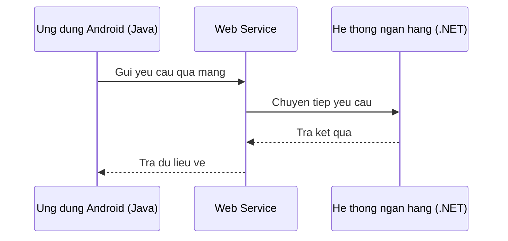
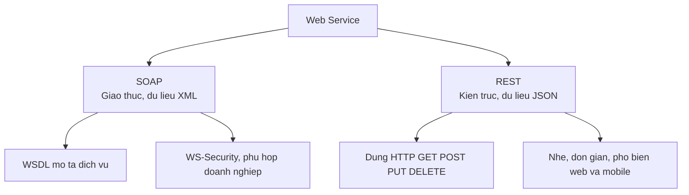

# Tìm hiểu về Web Service

Web Service là cách để hai ứng dụng khác nhau, dù viết bằng ngôn ngữ hay chạy trên nền tảng nào, vẫn trao đổi dữ liệu được với nhau qua mạng. Đây là kiến thức nền tảng trước khi đi sâu vào xây dựng API, vì hầu hết hệ thống ngày nay đều giao tiếp theo kiểu này. Bài này giới thiệu khái niệm tổng quan cùng hai kiểu phổ biến là SOAP và REST; phần chi tiết nằm bên dưới.

## Web Service là gì?

**Web Service** (dịch vụ web) là một hệ thống phần mềm được thiết kế để hỗ trợ giao tiếp giữa các máy tính qua mạng internet hoặc mạng nội bộ. Hai ứng dụng khác nhau, viết bằng các ngôn ngữ lập trình khác nhau, chạy trên các nền tảng khác nhau, vẫn có thể trao đổi dữ liệu với nhau thông qua Web Service.

Ví dụ thực tế: Ứng dụng di động Android (Java/Kotlin) gọi dịch vụ thanh toán của một ngân hàng (C#/.NET) — hai hệ thống hoàn toàn khác nhau nhưng vẫn giao tiếp được nhờ Web Service.

### Đặc điểm chính

- **Platform-independent** (độc lập nền tảng): Không quan tâm hệ điều hành hay ngôn ngữ lập trình phía client hay server.
- **Loosely coupled** (kết nối lỏng lẻo): Client và server không phụ thuộc chặt vào cài đặt bên trong của nhau.
- **Interoperable** (khả năng tương tác): Tuân theo chuẩn mở, bất kỳ hệ thống nào cũng có thể gọi được.

Sơ đồ dưới đây minh họa cách hai hệ thống khác nền tảng trao đổi dữ liệu qua Web Service:



Client và server viết bằng ngôn ngữ khác nhau vẫn hiểu nhau nhờ tuân theo chuẩn chung của Web Service ở giữa.

:::note[Ghi nhớ nhanh]

- ⭐ **Web Service** — cho phép hai hệ thống khác ngôn ngữ/nền tảng trao đổi dữ liệu qua mạng nhờ tuân theo chuẩn chung (platform-independent, loosely coupled).
- ⭐ **SOAP vs REST** — `SOAP` là giao thức, dữ liệu `XML`, chặt chẽ, có `WS-Security`; `REST` là kiểu kiến trúc, dùng HTTP + `JSON`, nhẹ và đơn giản.
- **WSDL** — tài liệu XML mô tả giao diện của SOAP service (operation, kiểu dữ liệu, endpoint); khi dùng JAX-WS nó được sinh tự động.
- **UDDI** — registry để đăng ký và tìm kiếm Web Service, nhưng ngày nay ít được dùng.
- **Khi nào dùng SOAP** — hợp với doanh nghiệp/tài chính/ngân hàng cần bảo mật cao, giao dịch phân tán, hoặc tích hợp hệ thống legacy.

:::

---

## SOAP vs REST

Có hai kiến trúc Web Service phổ biến nhất: **SOAP** và **REST**.

Sơ đồ sau tóm tắt hai nhánh cùng đặc trưng của mỗi loại:



SOAP thiên về chuẩn chặt chẽ và bảo mật, còn REST thiên về sự đơn giản và nhẹ nhàng.

### SOAP (Simple Object Access Protocol — giao thức trao đổi dữ liệu dạng XML)

- Là một **giao thức** (protocol) có quy tắc nghiêm ngặt.
- Dữ liệu truyền đi theo định dạng **XML** (Extensible Markup Language — ngôn ngữ đánh dấu mở rộng).
- Có thể hoạt động trên nhiều giao thức truyền tải: HTTP, SMTP, TCP.
- Hỗ trợ **WS-Security** (chuẩn bảo mật cho Web Service), rất phù hợp với ứng dụng doanh nghiệp, tài chính, ngân hàng.
- Mô tả dịch vụ thông qua file **WSDL**.

Cấu trúc một SOAP message (thông điệp SOAP):

```xml
<soap:Envelope xmlns:soap="http://schemas.xmlsoap.org/soap/envelope/">
  <soap:Header>
    <!-- Thông tin xác thực, bảo mật (tùy chọn) -->
  </soap:Header>
  <soap:Body>
    <!-- Nội dung yêu cầu hoặc phản hồi chính -->
    <ns:getUser>
      <ns:userId>42</ns:userId>
    </ns:getUser>
  </soap:Body>
</soap:Envelope>
```

### REST (Representational State Transfer — kiểu kiến trúc truyền trạng thái đại diện)

- Là một **kiểu kiến trúc** (architectural style), không phải giao thức.
- Sử dụng các phương thức HTTP chuẩn: GET, POST, PUT, DELETE.
- Dữ liệu thường là **JSON** (JavaScript Object Notation) hoặc XML.
- Đơn giản, nhẹ, dễ tích hợp — phổ biến trong ứng dụng web và di động hiện đại.

### Bảng so sánh SOAP vs REST

| Tiêu chí | SOAP | REST |
|---|---|---|
| Loại | Giao thức | Kiến trúc |
| Định dạng dữ liệu | XML | JSON, XML, YAML... |
| Giao thức vận chuyển | HTTP, SMTP, TCP | HTTP/HTTPS |
| Bảo mật | WS-Security tích hợp | HTTPS, OAuth |
| Độ phức tạp | Cao | Thấp |
| Hiệu năng | Nặng hơn (XML verbose) | Nhẹ hơn (JSON nhỏ gọn) |
| Phù hợp với | Doanh nghiệp, tài chính, ngân hàng | Web, mobile, microservices |

---

## WSDL (Web Services Description Language)

**WSDL** (Web Services Description Language — ngôn ngữ mô tả dịch vụ web) là một tài liệu XML mô tả toàn bộ thông tin của một SOAP Web Service:

- Các **operation** (thao tác/phương thức) mà service cung cấp.
- **Kiểu dữ liệu** đầu vào và đầu ra của từng operation.
- **Địa chỉ endpoint** (điểm cuối — URL để gọi dịch vụ).

Ví dụ cấu trúc WSDL rút gọn:

```xml
<definitions name="UserService"
  targetNamespace="http://example.com/user"
  xmlns:wsdl="http://schemas.xmlsoap.org/wsdl/"
  xmlns:soap="http://schemas.xmlsoap.org/wsdl/soap/">

  <!-- Định nghĩa kiểu dữ liệu -->
  <types>
    <xs:schema>
      <xs:element name="getUserRequest">
        <xs:complexType>
          <xs:sequence>
            <xs:element name="userId" type="xs:int"/>
          </xs:sequence>
        </xs:complexType>
      </xs:element>
    </xs:schema>
  </types>

  <!-- Định nghĩa thông điệp -->
  <message name="getUserRequestMsg">
    <part name="parameters" element="tns:getUserRequest"/>
  </message>

  <!-- Định nghĩa cổng (port type) — liệt kê các operation -->
  <portType name="UserPortType">
    <operation name="getUser">
      <input message="tns:getUserRequestMsg"/>
      <output message="tns:getUserResponseMsg"/>
    </operation>
  </portType>

  <!-- Binding — cách thức kết nối (SOAP over HTTP) -->
  <binding name="UserBinding" type="tns:UserPortType">
    <soap:binding style="document" transport="http://schemas.xmlsoap.org/soap/http"/>
  </binding>

  <!-- Service — địa chỉ endpoint thực tế -->
  <service name="UserService">
    <port name="UserPort" binding="tns:UserBinding">
      <soap:address location="http://localhost:8080/user"/>
    </port>
  </service>
</definitions>
```

> Khi triển khai JAX-WS, file WSDL được tự động sinh ra — bạn không cần viết tay.

---

## UDDI (Universal Description, Discovery and Integration)

**UDDI** (Universal Description, Discovery and Integration — mô tả, khám phá và tích hợp toàn cầu) là một **registry** (kho đăng ký) dùng để công bố và tìm kiếm các Web Service.

Ý tưởng ban đầu: Doanh nghiệp đăng ký SOAP service của mình lên UDDI registry (giống như "danh bạ điện thoại" cho Web Service), các hệ thống khác tìm kiếm và kết nối.

Tuy nhiên, trong thực tế hiện nay UDDI ít được dùng. Các doanh nghiệp thường tự công bố WSDL qua URL trực tiếp hoặc cổng API riêng.

---

## Khi nào nên dùng SOAP?

- Ứng dụng **doanh nghiệp lớn** yêu cầu bảo mật cao (ngân hàng, bảo hiểm, chính phủ).
- Cần **giao dịch phân tán** (distributed transactions) với đảm bảo toàn vẹn dữ liệu.
- Phải tích hợp với các hệ thống **legacy** (cũ) đã dùng SOAP.
- Cần hợp đồng dịch vụ rõ ràng qua WSDL.

---

## Tóm tắt

| Khái niệm | Mô tả ngắn |
|---|---|
| Web Service | Dịch vụ cho phép các hệ thống khác nhau giao tiếp qua mạng |
| SOAP | Giao thức truyền dữ liệu XML, chặt chẽ, bảo mật cao |
| REST | Kiến trúc dùng HTTP + JSON, đơn giản, nhẹ |
| WSDL | Tài liệu XML mô tả giao diện của SOAP service |
| UDDI | Registry để đăng ký và tìm kiếm Web Service (ít dùng ngày nay) |
