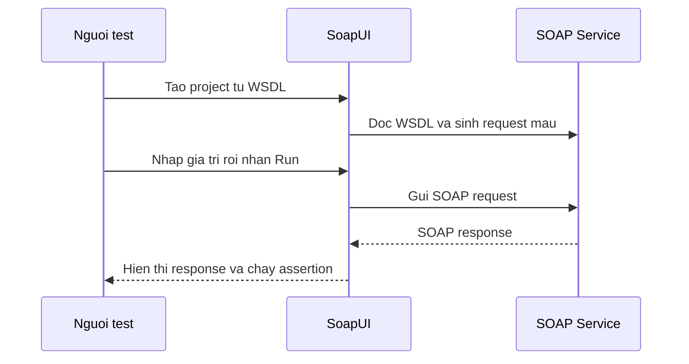

# Giới thiệu SOAP UI và thực hiện test Web Service

SoapUI là một công cụ miễn phí chuyên dùng để kiểm thử Web Service, giúp ta gửi request, xem response và viết các kịch bản test mà không cần code. Khi làm việc với SOAP, đây là công cụ quen thuộc để kiểm tra service hoạt động đúng hay chưa. Bài này hướng dẫn cài đặt, tạo project và chạy test từng bước; chi tiết nằm bên dưới.

## SOAP UI là gì?

**SOAP UI** (hay SoapUI) là một công cụ kiểm thử mã nguồn mở (open-source testing tool) chuyên dùng để test các Web Service, đặc biệt là SOAP và REST. Được phát triển bởi SmartBear Software, SoapUI cho phép:

- Gửi SOAP request và xem response trực tiếp.
- Kiểm tra WSDL và tự động sinh request mẫu.
- Viết **test case** (trường hợp kiểm thử) và **test suite** (bộ kiểm thử).
- Giả lập (**mock**) một SOAP service.
- Load testing (kiểm thử tải).

Có hai phiên bản:
- **SoapUI Open Source**: Miễn phí, đủ dùng cho hầu hết công việc.
- **ReadyAPI** (trước gọi là SoapUI Pro): Trả phí, thêm tính năng nâng cao.

Sơ đồ sau mô tả luồng kiểm thử một SOAP service bằng SoapUI:



SoapUI đóng vai trò client tự động sinh request từ WSDL, giúp bạn test mà không cần viết code.

---

## Cài đặt SoapUI

1. Truy cập trang chủ: `https://www.soapui.org/downloads/soapui/`
2. Tải bản **SoapUI Open Source** phù hợp với hệ điều hành (Windows/macOS/Linux).
3. Cài đặt theo hướng dẫn của trình cài.
4. Yêu cầu: Java 8 trở lên đã được cài sẵn.

---

## Chuẩn bị SOAP Service để test

Trước khi test, cần có một SOAP service đang chạy. Dùng lại ví dụ từ bài trước:

```java
package com.example.soap;

import jakarta.jws.WebMethod;
import jakarta.jws.WebParam;
import jakarta.jws.WebService;
import jakarta.xml.ws.Endpoint;

@WebService
public class CalculatorService {

    // Phép cộng
    @WebMethod
    public int add(
        @WebParam(name = "a") int a,
        @WebParam(name = "b") int b
    ) {
        return a + b;
    }

    // Phép trừ
    @WebMethod
    public int subtract(
        @WebParam(name = "a") int a,
        @WebParam(name = "b") int b
    ) {
        return a - b;
    }

    // Phép nhân
    @WebMethod
    public int multiply(
        @WebParam(name = "a") int a,
        @WebParam(name = "b") int b
    ) {
        return a * b;
    }

    public static void main(String[] args) {
        String address = "http://localhost:8080/ws/calculator";
        Endpoint.publish(address, new CalculatorService());
        System.out.println("Calculator Service đang chạy tại: " + address);
        System.out.println("WSDL: " + address + "?wsdl");
    }
}
```

Chạy `main()` và xác nhận service đang hoạt động bằng cách mở `http://localhost:8080/ws/calculator?wsdl` trên trình duyệt.

---

## Tạo Project trong SoapUI

### Bước 1 — Tạo project mới từ WSDL

1. Mở SoapUI.
2. Nhấn **File → New SOAP Project**.
3. Điền thông tin:
   - **Project Name**: `CalculatorServiceTest`
   - **Initial WSDL**: `http://localhost:8080/ws/calculator?wsdl`
   - Tích chọn **Create Requests**: SoapUI sẽ tự sinh request mẫu cho từng operation.
4. Nhấn **OK**.

SoapUI sẽ tự động:
- Đọc WSDL.
- Liệt kê tất cả operation (add, subtract, multiply).
- Sinh request XML mẫu cho từng operation.

---

## Gửi Request và xem Response

### Test phép cộng (add)

1. Trong cây bên trái, mở: `CalculatorServiceTest → CalculatorServicePortBinding → add → Request 1`.
2. SoapUI đã sinh sẵn XML request mẫu:

```xml
<soapenv:Envelope xmlns:soapenv="http://schemas.xmlsoap.org/soap/envelope/"
                  xmlns:ns="http://soap.example.com/">
  <soapenv:Header/>
  <soapenv:Body>
    <ns:add>
      <!-- Thay ? bằng giá trị thực -->
      <ns:a>10</ns:a>
      <ns:b>25</ns:b>
    </ns:add>
  </soapenv:Body>
</soapenv:Envelope>
```

3. Điền giá trị `a = 10`, `b = 25`.
4. Nhấn nút **Run** (mũi tên xanh).
5. Cửa sổ bên phải hiển thị SOAP Response:

```xml
<soap:Envelope xmlns:soap="http://schemas.xmlsoap.org/soap/envelope/">
  <soap:Body>
    <ns2:addResponse xmlns:ns2="http://soap.example.com/">
      <return>35</return>
    </ns2:addResponse>
  </soap:Body>
</soap:Envelope>
```

Kết quả: `10 + 25 = 35` — đúng.

---

## Tạo Test Suite và Test Case

**Test Suite** (bộ kiểm thử) là tập hợp nhiều **Test Case** (trường hợp kiểm thử). Mỗi Test Case chứa các **Test Step** (bước kiểm thử) kiểm tra một kịch bản cụ thể.

### Tạo Test Suite

1. Chuột phải vào project → **New TestSuite** → đặt tên `CalculatorTests`.

### Tạo Test Case cho phép cộng

1. Chuột phải `CalculatorTests` → **New TestCase** → đặt tên `TestAdd`.
2. Chuột phải `TestAdd → Test Steps` → **Add Step → SOAP Request**.
3. Chọn operation `add`, nhấn **OK**.
4. Điền request XML với `a = 5`, `b = 3`.

### Thêm Assertion (kiểm tra kết quả)

**Assertion** (xác nhận) là điều kiện kiểm tra — test sẽ thất bại nếu assertion không thỏa mãn.

1. Trong Test Step, nhấn tab **Assertions** ở dưới.
2. Nhấn **Add Assertion (+)**.
3. Chọn **Contains** → nhấn **OK**.
4. Điền giá trị cần có trong response: `<return>8</return>`.
5. Nhấn **Save**.

### Chạy Test Case

- Nhấn nút **Run** trên Test Case.
- Kết quả **PASS** (xanh): response chứa `<return>8</return>` — 5 + 3 = 8.
- Kết quả **FAIL** (đỏ): response không khớp với assertion.

---

## Mock Service — Giả lập SOAP Service

**Mock Service** (dịch vụ giả lập) cho phép tạo ra một SOAP service giả mà không cần server thực. Hữu ích khi team frontend/client cần phát triển trong khi backend chưa sẵn sàng.

1. Chuột phải vào WSDL binding → **Generate SOAP Mock Service**.
2. SoapUI tạo mock service với các response mặc định.
3. Chỉnh sửa response mẫu theo ý muốn.
4. Nhấn **Start** để khởi động mock server.

---

## Kiểm tra WSDL hợp lệ

SoapUI cũng hỗ trợ kiểm tra WSDL:

1. Chuột phải vào WSDL trong project → **Validate**.
2. SoapUI báo lỗi nếu WSDL không hợp lệ hoặc có vấn đề cấu trúc.

---

## Tóm tắt

| Tính năng | Mô tả |
|---|---|
| New SOAP Project | Tạo project từ WSDL, sinh request mẫu tự động |
| Request/Response viewer | Gửi SOAP request và xem XML response trực quan |
| Test Suite / Test Case | Tổ chức các kịch bản kiểm thử |
| Assertion | Xác nhận kết quả — PASS/FAIL tự động |
| Mock Service | Giả lập SOAP service khi backend chưa sẵn sàng |
| WSDL Validation | Kiểm tra tính hợp lệ của file WSDL |
