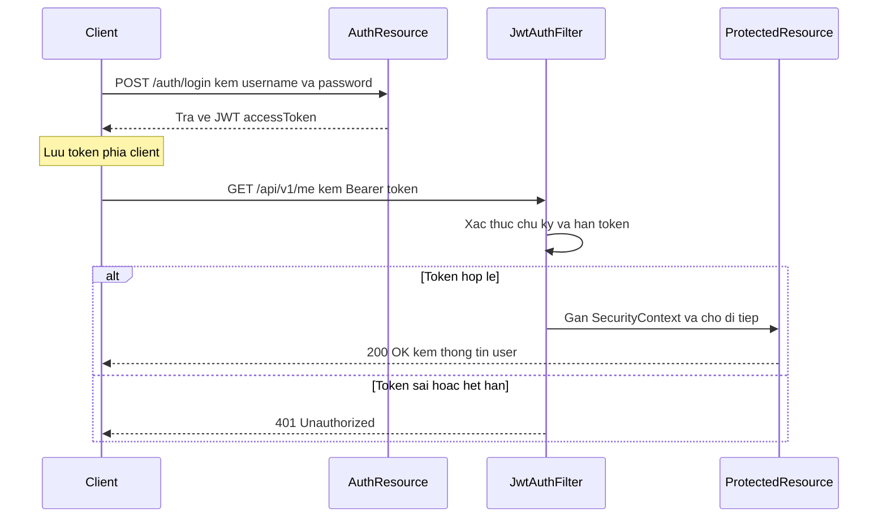

# REST Web service - JWT Token-based Authentication trong Jersey 2.x

JWT là cách xác thực bằng token: sau khi đăng nhập, client nhận một chuỗi token và đính kèm nó vào mỗi request để chứng minh danh tính, server không cần lưu session. Cách này gọn nhẹ và dễ mở rộng, rất hợp với REST API. Bài này hướng dẫn dựng luồng đăng nhập, filter xác thực và bảo vệ endpoint bằng JWT trong Jersey kèm ví dụ; chi tiết nằm bên dưới.

:::note[Ghi nhớ nhanh]

- ⭐ **Luồng JWT** — client `POST /auth/login` nhận token, rồi đính kèm `Authorization: Bearer <token>` cho mỗi request.
- ⭐ **`JwtAuthFilter` xác thực token mỗi request** — kiểm tra chữ ký & hạn, sai/hết hạn thì `abortWith` trả 401.
- **`AuthResource`** — xác thực user rồi tạo token qua `JwtUtils.generateToken(...)`, trả `AuthResponse`.
- **Gắn `SecurityContext`** — từ `Claims` dựng `UserPrincipal` để resource lấy thông tin user và kiểm tra role.
- **Stateless, khó revoke** — logout chỉ xóa token phía client; muốn thu hồi ngay cần blacklist `jti` (vd Redis).

:::

## Tổng quan luồng xác thực JWT

```
1. Client gửi POST /auth/login với username/password
2. Server xác thực, tạo JWT token
3. Client nhận token, lưu vào localStorage/cookie
4. Mọi request tiếp theo gửi kèm: Authorization: Bearer <token>
5. Server xác thực token (không cần database)
6. Nếu hợp lệ, cho phép truy cập
```

Sơ đồ tuần tự dưới đây minh họa toàn bộ luồng đăng nhập và gọi API được bảo vệ bằng JWT:



Sau khi đăng nhập lấy token, mỗi request chỉ cần đính kèm token; filter xác thực chữ ký mà không cần tra cứu database.

## AuthRequest và AuthResponse

```java
package com.example.rest.dto;

/**
 * AuthRequest — dữ liệu đăng nhập từ client
 */
public class AuthRequest {
    private String username;
    private String password;

    // Constructor mặc định cần cho Jackson
    public AuthRequest() {}

    public String getUsername() { return username; }
    public void setUsername(String username) { this.username = username; }
    public String getPassword() { return password; }
    public void setPassword(String password) { this.password = password; }
}
```

```java
package com.example.rest.dto;

/**
 * AuthResponse — phản hồi sau đăng nhập thành công
 * Chứa access token và thông tin token
 */
public class AuthResponse {
    private String accessToken;
    private String tokenType;    // Luôn là "Bearer"
    private long expiresIn;      // Số giây còn hiệu lực
    private String username;
    private String role;

    public AuthResponse(String accessToken, long expiresIn,
                        String username, String role) {
        this.accessToken = accessToken;
        this.tokenType = "Bearer";
        this.expiresIn = expiresIn;
        this.username = username;
        this.role = role;
    }

    // Getters
    public String getAccessToken() { return accessToken; }
    public String getTokenType() { return tokenType; }
    public long getExpiresIn() { return expiresIn; }
    public String getUsername() { return username; }
    public String getRole() { return role; }
}
```

## AuthResource — Endpoint đăng nhập

```java
package com.example.rest;

import com.example.rest.dto.*;
import com.example.rest.model.User;
import com.example.rest.security.JwtUtils;
import com.example.rest.service.UserService;
import jakarta.ws.rs.*;
import jakarta.ws.rs.core.*;

@Path("/auth")
@Produces(MediaType.APPLICATION_JSON)
@Consumes(MediaType.APPLICATION_JSON)
public class AuthResource {

    private final UserService userService = new UserService();

    /**
     * POST /api/auth/login
     * Đăng nhập và nhận JWT token
     */
    @POST
    @Path("/login")
    public Response login(AuthRequest request) {
        // Validate đầu vào
        if (request.getUsername() == null || request.getUsername().trim().isEmpty()) {
            return Response.status(Response.Status.BAD_REQUEST)
                           .entity("{\"error\": \"Username không được để trống\"}")
                           .build();
        }

        // Xác thực thông tin đăng nhập
        return userService.authenticate(request.getUsername(), request.getPassword())
            .map(user -> {
                // Tạo JWT token
                String token = JwtUtils.generateToken(
                    user.getId(), user.getUsername(), user.getRole()
                );

                AuthResponse response = new AuthResponse(
                    token,
                    86400L, // 24 giờ
                    user.getUsername(),
                    user.getRole()
                );

                return Response.ok(response).build();
            })
            .orElse(
                Response.status(Response.Status.UNAUTHORIZED)
                        .entity("{\"error\": \"Sai username hoặc password\"}")
                        .build()
            );
    }

    /**
     * POST /api/auth/logout
     * Đăng xuất — phía client xóa token
     * JWT là stateless, server không thể vô hiệu hóa token đơn lẻ
     * Giải pháp: dùng blacklist token trong Redis
     */
    @POST
    @Path("/logout")
    public Response logout() {
        // Trong ứng dụng stateless, chỉ cần thông báo client xóa token
        // Nếu cần revoke token ngay lập tức, lưu jti (JWT ID) vào blacklist
        return Response.ok("{\"message\": \"Đăng xuất thành công. Hãy xóa token phía client.\"}").build();
    }
}
```

## JWT Authentication Filter

```java
package com.example.rest.filter;

import com.example.rest.security.*;
import io.jsonwebtoken.Claims;
import jakarta.ws.rs.container.*;
import jakarta.ws.rs.ext.Provider;
import java.io.IOException;
import java.util.Optional;

/**
 * JwtAuthFilter — xác thực JWT token trong mọi request
 * Áp dụng cho endpoint có annotation @JwtAuth
 */
@Provider
@JwtAuth  // NameBinding annotation tùy chỉnh
public class JwtAuthFilter implements ContainerRequestFilter {

    @Override
    public void filter(ContainerRequestContext requestContext) throws IOException {
        String authHeader = requestContext.getHeaderString("Authorization");

        // Kiểm tra header tồn tại và đúng định dạng Bearer
        if (authHeader == null || !authHeader.startsWith("Bearer ")) {
            abortWithUnauthorized(requestContext, "Thiếu JWT token");
            return;
        }

        // Lấy token (bỏ prefix "Bearer ")
        String token = authHeader.substring("Bearer ".length()).trim();

        if (token.isEmpty()) {
            abortWithUnauthorized(requestContext, "Token rỗng");
            return;
        }

        // Xác thực token
        Optional<Claims> claimsOpt = JwtUtils.validateToken(token);
        if (!claimsOpt.isPresent()) {
            abortWithUnauthorized(requestContext, "Token không hợp lệ hoặc đã hết hạn");
            return;
        }

        // Token hợp lệ — gắn SecurityContext vào request
        Claims claims = claimsOpt.get();
        UserPrincipal principal = JwtUtils.extractUser(claims);
        boolean isSecure = requestContext.getSecurityContext().isSecure();
        requestContext.setSecurityContext(new CustomSecurityContext(principal, isSecure));
    }

    private void abortWithUnauthorized(ContainerRequestContext ctx, String message) {
        ctx.abortWith(
            jakarta.ws.rs.core.Response
                .status(jakarta.ws.rs.core.Response.Status.UNAUTHORIZED)
                .entity("{\"error\": \"" + message + "\"}")
                .type("application/json")
                .build()
        );
    }
}
```

## @JwtAuth Annotation

```java
package com.example.rest.filter;

import jakarta.ws.rs.NameBinding;
import java.lang.annotation.*;

@NameBinding
@Retention(RetentionPolicy.RUNTIME)
@Target({ElementType.TYPE, ElementType.METHOD})
public @interface JwtAuth {}
```

## Resource được bảo vệ bằng JWT

```java
package com.example.rest;

import com.example.rest.filter.JwtAuth;
import com.example.rest.security.UserPrincipal;
import jakarta.ws.rs.*;
import jakarta.ws.rs.core.*;

@Path("/api/v1")
@Produces(MediaType.APPLICATION_JSON)
public class ProtectedResource {

    /**
     * GET /api/v1/me — thông tin người dùng hiện tại
     * Bắt buộc phải có JWT token hợp lệ
     */
    @GET
    @Path("/me")
    @JwtAuth
    public Response getCurrentUser(@Context SecurityContext securityContext) {
        UserPrincipal user = (UserPrincipal) securityContext.getUserPrincipal();
        return Response.ok(String.format(
            "{\"id\": %d, \"username\": \"%s\", \"role\": \"%s\"}",
            user.getUserId(), user.getName(), user.getRole()
        )).build();
    }

    /**
     * GET /api/v1/admin/dashboard — chỉ ADMIN
     */
    @GET
    @Path("/admin/dashboard")
    @JwtAuth
    public Response adminDashboard(@Context SecurityContext securityContext) {
        if (!securityContext.isUserInRole("ADMIN")) {
            return Response.status(Response.Status.FORBIDDEN)
                           .entity("{\"error\": \"Không đủ quyền truy cập\"}")
                           .build();
        }
        return Response.ok("{\"stats\": {\"users\": 150, \"orders\": 420}}").build();
    }

    /**
     * Endpoint không cần JWT
     */
    @GET
    @Path("/health")
    public Response healthCheck() {
        return Response.ok("{\"status\": \"UP\"}").build();
    }
}
```

## Jersey Client với JWT

```java
package com.example.client;

import com.example.rest.dto.AuthRequest;
import com.example.rest.dto.AuthResponse;
import jakarta.ws.rs.client.*;
import jakarta.ws.rs.core.*;

public class JwtClientExample {

    private static final String BASE_URL = "http://localhost:8080/api";
    private Client client;
    private String token;

    public JwtClientExample() {
        this.client = ClientBuilder.newClient();
    }

    /**
     * Đăng nhập và lưu token
     */
    public boolean login(String username, String password) {
        AuthRequest request = new AuthRequest();
        request.setUsername(username);
        request.setPassword(password);

        Response response = client.target(BASE_URL)
            .path("/auth/login")
            .request(MediaType.APPLICATION_JSON)
            .post(Entity.json(request));

        if (response.getStatus() == 200) {
            AuthResponse authResponse = response.readEntity(AuthResponse.class);
            this.token = authResponse.getAccessToken();
            System.out.println("Đăng nhập thành công! Role: " + authResponse.getRole());
            return true;
        }

        System.out.println("Đăng nhập thất bại: " + response.getStatus());
        return false;
    }

    /**
     * Gọi API được bảo vệ
     */
    public String getMyProfile() {
        if (token == null) {
            throw new IllegalStateException("Chưa đăng nhập!");
        }

        Response response = client.target(BASE_URL)
            .path("/v1/me")
            .request(MediaType.APPLICATION_JSON)
            .header("Authorization", "Bearer " + token)
            .get();

        return response.readEntity(String.class);
    }

    public static void main(String[] args) {
        JwtClientExample demo = new JwtClientExample();

        if (demo.login("admin", "password123")) {
            System.out.println("Profile: " + demo.getMyProfile());
        }
    }
}
```

## Tóm tắt

JWT Authentication trong Jersey gồm: (1) endpoint đăng nhập tạo token từ thông tin user, (2) `JwtAuthFilter` xác thực token trong mỗi request, (3) gắn `SecurityContext` để resource method lấy thông tin user. JWT là stateless — server không lưu session, phù hợp để scale. Luôn đặt thời hạn token ngắn và dùng HTTPS.
