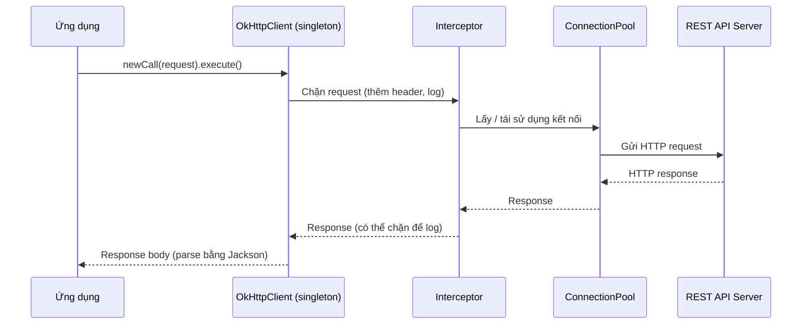

# Tạo ứng dụng Java RESTful Client với thư viện OkHttp

OkHttp là một thư viện HTTP client gọn nhẹ và hiệu năng cao, giúp ứng dụng Java gửi request đến REST API mà không phải viết nhiều code thủ công. Bài này hướng dẫn cách dùng OkHttp để gọi API CRUD, gọi bất đồng bộ bằng callback, và thêm interceptor để tự động chèn header. Phần chi tiết kèm ví dụ nằm bên dưới.

:::note[Ghi nhớ nhanh]

- ⭐ **OkHttp (của Square) nhanh, hỗ trợ HTTP/2 và connection pooling** — `OkHttpClient` phải là singleton để tận dụng pool.
- ⭐ **Luôn dùng try-with-resources với `Response`** — để đóng kết nối, tránh rò rỉ tài nguyên.
- **Gọi API** — `newCall(request).execute()` đồng bộ, `enqueue(Callback)` bất đồng bộ.
- **`Interceptor`** — chặn request/response tập trung: thêm `Authorization` header, logging, retry.
- **`HttpUrl.Builder`** — dựng URL kèm query param an toàn (tự encode); parse JSON bằng Jackson.

:::

## OkHttp là gì?

**OkHttp** (Open HTTP client) là thư viện HTTP client mã nguồn mở do Square phát triển, được sử dụng rộng rãi trong Android và Java. OkHttp nổi bật với hiệu năng cao, hỗ trợ HTTP/2, connection pooling (nhóm kết nối — tái sử dụng kết nối thay vì tạo mới), và API dễ dùng.

Sơ đồ sau mô tả luồng một lời gọi API qua OkHttp, bao gồm interceptor và connection pool:



Điểm mấu chốt: `OkHttpClient` là singleton nắm connection pool, còn interceptor xử lý request/response tập trung trước khi trả về cho ứng dụng.

## Cấu hình Maven

```xml
<dependency>
    <groupId>com.squareup.okhttp3</groupId>
    <artifactId>okhttp</artifactId>
    <version>4.12.0</version>
</dependency>

<!-- Jackson để parse JSON -->
<dependency>
    <groupId>com.fasterxml.jackson.core</groupId>
    <artifactId>jackson-databind</artifactId>
    <version>2.17.0</version>
</dependency>
```

## Model

```java
package com.example.model;

import com.fasterxml.jackson.annotation.JsonIgnoreProperties;

@JsonIgnoreProperties(ignoreUnknown = true)
public class Product {
    private int id;
    private String name;
    private double price;
    private String category;

    public Product() {}

    public Product(String name, double price, String category) {
        this.name = name;
        this.price = price;
        this.category = category;
    }

    // Getters và Setters
    public int getId() { return id; }
    public void setId(int id) { this.id = id; }
    public String getName() { return name; }
    public void setName(String name) { this.name = name; }
    public double getPrice() { return price; }
    public void setPrice(double price) { this.price = price; }
    public String getCategory() { return category; }
    public void setCategory(String category) { this.category = category; }

    @Override
    public String toString() {
        return String.format("Product{id=%d, name='%s', price=%.0f, category='%s'}",
                             id, name, price, category);
    }
}
```

## OkHttpProductClient

```java
package com.example.client;

import com.example.model.Product;
import com.fasterxml.jackson.databind.ObjectMapper;
import okhttp3.*;
import java.io.IOException;
import java.util.List;
import java.util.concurrent.TimeUnit;

public class OkHttpProductClient {

    private static final String BASE_URL = "http://localhost:8080/api/products";

    // MediaType — định nghĩa kiểu nội dung, tái sử dụng để tránh tạo lại nhiều lần
    private static final MediaType JSON = MediaType.get("application/json; charset=utf-8");

    // OkHttpClient nên là singleton — chứa thread pool và connection pool
    private final OkHttpClient httpClient;
    private final ObjectMapper objectMapper;

    public OkHttpProductClient() {
        this.httpClient = new OkHttpClient.Builder()
            .connectTimeout(10, TimeUnit.SECONDS)    // Timeout kết nối
            .readTimeout(30, TimeUnit.SECONDS)        // Timeout đọc response
            .writeTimeout(15, TimeUnit.SECONDS)       // Timeout ghi request body
            // ConnectionPool — cấu hình nhóm kết nối: tối đa 5 kết nối, idle 5 phút
            .connectionPool(new ConnectionPool(5, 5, TimeUnit.MINUTES))
            .build();

        this.objectMapper = new ObjectMapper();
    }

    /**
     * GET /api/products — Lấy tất cả sản phẩm
     */
    public List<Product> getAll() throws IOException {
        Request request = new Request.Builder()
            .url(BASE_URL)
            .addHeader("Accept", "application/json")
            .get()
            .build();

        // try-with-resources đảm bảo response được đóng sau khi dùng
        try (Response response = httpClient.newCall(request).execute()) {
            if (!response.isSuccessful()) {
                throw new IOException("Request thất bại: " + response.code());
            }

            // response.body() — đọc response body dạng String
            String body = response.body().string();
            // Deserialize JSON array thành List<Product>
            return objectMapper.readValue(body,
                objectMapper.getTypeFactory().constructCollectionType(List.class, Product.class));
        }
    }

    /**
     * GET /api/products/{id} — Lấy sản phẩm theo ID
     */
    public Product getById(int id) throws IOException {
        Request request = new Request.Builder()
            .url(BASE_URL + "/" + id)
            .get()
            .build();

        try (Response response = httpClient.newCall(request).execute()) {
            if (response.code() == 404) {
                System.out.println("Sản phẩm ID " + id + " không tồn tại");
                return null;
            }
            if (!response.isSuccessful()) {
                throw new IOException("Lỗi: " + response.code());
            }
            return objectMapper.readValue(response.body().string(), Product.class);
        }
    }

    /**
     * POST /api/products — Tạo sản phẩm mới
     * RequestBody.create() — tạo request body từ JSON string
     */
    public Product create(Product product) throws IOException {
        String json = objectMapper.writeValueAsString(product);
        RequestBody body = RequestBody.create(json, JSON);

        Request request = new Request.Builder()
            .url(BASE_URL)
            .post(body)  // Method POST với body
            .build();

        try (Response response = httpClient.newCall(request).execute()) {
            if (response.code() != 201) {
                throw new IOException("Tạo thất bại: " + response.code()
                                      + " " + response.body().string());
            }
            return objectMapper.readValue(response.body().string(), Product.class);
        }
    }

    /**
     * PUT /api/products/{id} — Cập nhật sản phẩm
     */
    public Product update(int id, Product product) throws IOException {
        String json = objectMapper.writeValueAsString(product);
        RequestBody body = RequestBody.create(json, JSON);

        Request request = new Request.Builder()
            .url(BASE_URL + "/" + id)
            .put(body)  // Method PUT
            .build();

        try (Response response = httpClient.newCall(request).execute()) {
            if (!response.isSuccessful()) {
                throw new IOException("Cập nhật thất bại: " + response.code());
            }
            return objectMapper.readValue(response.body().string(), Product.class);
        }
    }

    /**
     * DELETE /api/products/{id} — Xóa sản phẩm
     */
    public boolean delete(int id) throws IOException {
        Request request = new Request.Builder()
            .url(BASE_URL + "/" + id)
            .delete()  // Method DELETE (không có body)
            .build();

        try (Response response = httpClient.newCall(request).execute()) {
            return response.isSuccessful(); // true nếu 2xx
        }
    }

    /**
     * GET với query parameters
     * HttpUrl.Builder — xây dựng URL với query parameter an toàn (tự encode)
     */
    public List<Product> search(String keyword, String category, int page) throws IOException {
        HttpUrl url = HttpUrl.parse(BASE_URL).newBuilder()
            .addQueryParameter("keyword", keyword)
            .addQueryParameter("category", category)
            .addQueryParameter("page", String.valueOf(page))
            .addQueryParameter("size", "10")
            .build();

        Request request = new Request.Builder()
            .url(url)
            .build();

        try (Response response = httpClient.newCall(request).execute()) {
            if (!response.isSuccessful()) return List.of();
            return objectMapper.readValue(response.body().string(),
                objectMapper.getTypeFactory().constructCollectionType(List.class, Product.class));
        }
    }
}
```

## Gọi API bất đồng bộ với OkHttp

**Callback** (hàm gọi lại) là pattern OkHttp dùng cho async: đăng ký hàm xử lý, OkHttp tự gọi khi có kết quả.

```java
/**
 * Gọi API không đồng bộ với Callback
 * enqueue() — gửi request trong background thread, gọi callback khi xong
 */
public void getAllAsync(java.util.function.Consumer<List<Product>> onSuccess,
                        java.util.function.Consumer<Exception> onError) {
    Request request = new Request.Builder()
        .url(BASE_URL)
        .build();

    httpClient.newCall(request).enqueue(new Callback() {

        @Override
        public void onFailure(Call call, IOException e) {
            // Gọi trong OkHttp thread pool khi có lỗi mạng
            onError.accept(e);
        }

        @Override
        public void onResponse(Call call, Response response) throws IOException {
            // Gọi trong OkHttp thread pool khi nhận được response
            try (response) {
                if (!response.isSuccessful()) {
                    onError.accept(new IOException("Lỗi: " + response.code()));
                    return;
                }
                List<Product> products = objectMapper.readValue(
                    response.body().string(),
                    objectMapper.getTypeFactory().constructCollectionType(List.class, Product.class)
                );
                onSuccess.accept(products);
            }
        }
    });
}
```

## Interceptor trong OkHttp

**Interceptor** trong OkHttp tương tự Filter trong Jersey — chặn và xử lý request/response.

```java
// Tạo OkHttpClient với interceptor tự động thêm token
OkHttpClient authClient = new OkHttpClient.Builder()
    .addInterceptor(chain -> {
        // chain.request() — request gốc
        Request originalRequest = chain.request();

        // Tạo request mới với Authorization header
        Request authenticatedRequest = originalRequest.newBuilder()
            .header("Authorization", "Bearer " + getToken())
            .build();

        // chain.proceed() — tiếp tục với request đã chỉnh sửa
        return chain.proceed(authenticatedRequest);
    })
    // Logging interceptor để debug
    .addNetworkInterceptor(chain -> {
        Request request = chain.request();
        System.out.println("--> " + request.method() + " " + request.url());

        Response response = chain.proceed(request);
        System.out.println("<-- " + response.code() + " " + request.url());
        return response;
    })
    .build();
```

## Ví dụ sử dụng

```java
public class Main {
    public static void main(String[] args) throws IOException {
        OkHttpProductClient client = new OkHttpProductClient();

        // Lấy tất cả sản phẩm
        List<Product> products = client.getAll();
        products.forEach(System.out::println);

        // Tạo mới
        Product newProduct = new Product("Bàn phím cơ Filco", 3_500_000, "Keyboard");
        Product created = client.create(newProduct);
        System.out.println("Đã tạo: " + created);

        // Tìm kiếm
        List<Product> results = client.search("Dell", "Laptop", 1);
        System.out.println("Kết quả tìm kiếm: " + results.size() + " sản phẩm");

        // Xóa
        boolean deleted = client.delete(1);
        System.out.println("Xóa: " + (deleted ? "Thành công" : "Thất bại"));
    }
}
```

## Tóm tắt

OkHttp nổi bật với connection pooling, HTTP/2, và API fluent gọn gàng. `OkHttpClient` phải là singleton để tận dụng connection pool. Luôn dùng try-with-resources với `Response` để đóng kết nối. Interceptor trong OkHttp mạnh mẽ — dùng để thêm header xác thực, logging, retry tự động.
