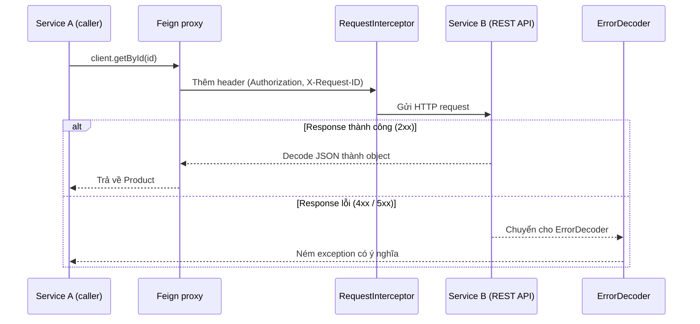

# Giới thiệu Feign - Tạo Java RESTful Client đơn giản

Feign là thư viện giúp tạo HTTP client bằng cách khai báo interface kèm annotation, rất phổ biến khi các microservice gọi nhau trong hệ sinh thái Spring Cloud. Bài này giới thiệu cách khai báo API với annotation Feign hoặc JAX-RS, tạo client instance, xử lý lỗi bằng ErrorDecoder, và tự động thêm header xác thực.

:::note[Ghi nhớ nhanh]

- ⭐ **Feign (OpenFeign) tạo client từ interface + annotation** — rất phổ biến để gọi giữa các microservice trong Spring Cloud.
- ⭐ **Hỗ trợ nhiều kiểu annotation** — annotation riêng của Feign (`@RequestLine`, `@Param`, `@Headers`) hoặc JAX-RS (`feign-jaxrs2`).
- **`Feign.builder()`** — cấu hình `encoder`/`decoder` (Jackson), logger, timeout rồi `.target(interface, baseUrl)`.
- **`ErrorDecoder`** — xử lý lỗi 4xx/5xx tập trung, ném exception có nghĩa (429 dùng `RetryableException`).
- **`RequestInterceptor`** — tự thêm header (vd `Authorization`, `X-Request-ID`) vào mọi request.

:::

## Feign là gì?

**Feign** (giả vờ) là thư viện HTTP client do Netflix phát triển, sau đó được chuyển sang OpenFeign. Giống Retrofit, Feign dùng interface + annotation để khai báo API, nhưng theo phong cách **JAX-RS hoặc Spring MVC** thay vì annotation riêng.

Feign đặc biệt phổ biến trong **Spring Cloud** để gọi API giữa các microservice, tích hợp sẵn với load balancing (cân bằng tải) và circuit breaker (ngắt mạch khi service lỗi).

Sơ đồ sau minh họa một microservice dùng Feign client để gọi microservice khác, kèm RequestInterceptor và ErrorDecoder:



Feign biến interface thành client thật; interceptor gắn header tự động, còn ErrorDecoder tập trung xử lý các mã lỗi.

## So sánh Feign với Retrofit

| Tiêu chí | Feign | Retrofit |
|---|---|---|
| Annotation | Feign hoặc JAX-RS | Retrofit riêng |
| Async | Có (RxJava, CompletableFuture) | Có (Callback, RxJava) |
| Spring tích hợp | Rất tốt (Spring Cloud) | Cần thêm cấu hình |
| Standalone | Có | Có |
| Cú pháp đơn giản | Cao | Cao |

## Cấu hình Maven

```xml
<dependencies>
    <!-- OpenFeign core -->
    <dependency>
        <groupId>io.github.openfeign</groupId>
        <artifactId>feign-core</artifactId>
        <version>13.2.1</version>
    </dependency>

    <!-- Jackson encoder/decoder -->
    <dependency>
        <groupId>io.github.openfeign</groupId>
        <artifactId>feign-jackson</artifactId>
        <version>13.2.1</version>
    </dependency>

    <!-- Hỗ trợ annotation JAX-RS (tùy chọn) -->
    <dependency>
        <groupId>io.github.openfeign</groupId>
        <artifactId>feign-jaxrs2</artifactId>
        <version>13.2.1</version>
    </dependency>

    <!-- SLF4J logger -->
    <dependency>
        <groupId>io.github.openfeign</groupId>
        <artifactId>feign-slf4j</artifactId>
        <version>13.2.1</version>
    </dependency>
</dependencies>
```

## Model

```java
package com.example.model;

import com.fasterxml.jackson.annotation.JsonIgnoreProperties;

@JsonIgnoreProperties(ignoreUnknown = true)
public class Product {
    private int id;
    private String name;
    private double price;

    public Product() {}
    public Product(String name, double price) {
        this.name = name;
        this.price = price;
    }

    public int getId() { return id; }
    public void setId(int id) { this.id = id; }
    public String getName() { return name; }
    public void setName(String name) { this.name = name; }
    public double getPrice() { return price; }
    public void setPrice(double price) { this.price = price; }

    @Override
    public String toString() {
        return "Product{id=" + id + ", name='" + name + "', price=" + price + "}";
    }
}
```

## Khai báo API Interface với Feign Annotation

```java
package com.example.api;

import com.example.model.Product;
import feign.*;
import java.util.List;

/**
 * ProductClient — interface Feign với annotation riêng của Feign
 *
 * @RequestLine — khai báo HTTP method và đường dẫn
 * @Param — tham số đường dẫn hoặc query
 * @Headers — khai báo HTTP header
 * @Body — request body (dạng template hoặc JSON)
 */
public interface ProductClient {

    // GET /products
    @RequestLine("GET /products")
    @Headers("Accept: application/json")
    List<Product> getAll();

    // GET /products?page=1&size=10
    @RequestLine("GET /products?page={page}&size={size}")
    List<Product> getPaged(@Param("page") int page, @Param("size") int size);

    // GET /products/{id}
    @RequestLine("GET /products/{id}")
    Product getById(@Param("id") int id);

    // POST /products
    @RequestLine("POST /products")
    @Headers("Content-Type: application/json")
    Product create(Product product);

    // PUT /products/{id}
    @RequestLine("PUT /products/{id}")
    @Headers("Content-Type: application/json")
    Product update(@Param("id") int id, Product product);

    // DELETE /products/{id}
    @RequestLine("DELETE /products/{id}")
    void delete(@Param("id") int id);
}
```

## Khai báo với JAX-RS Annotation

Nếu đã quen với JAX-RS, có thể dùng annotation của JAX-RS với `feign-jaxrs2`:

```java
package com.example.api;

import com.example.model.Product;
import jakarta.ws.rs.*;
import jakarta.ws.rs.core.MediaType;
import java.util.List;

/**
 * ProductJaxRsClient — interface Feign dùng annotation JAX-RS
 * Phù hợp khi muốn tái sử dụng interface đã có từ phía server
 */
@Path("/products")
@Produces(MediaType.APPLICATION_JSON)
@Consumes(MediaType.APPLICATION_JSON)
public interface ProductJaxRsClient {

    @GET
    List<Product> getAll();

    @GET
    @Path("/{id}")
    Product getById(@PathParam("id") int id);

    @POST
    Product create(Product product);

    @PUT
    @Path("/{id}")
    Product update(@PathParam("id") int id, Product product);

    @DELETE
    @Path("/{id}")
    void delete(@PathParam("id") int id);
}
```

## Tạo Feign Client Instance

```java
package com.example.client;

import com.example.api.ProductClient;
import com.example.model.Product;
import feign.*;
import feign.jackson.*;
import feign.slf4j.Slf4jLogger;
import java.util.List;

public class FeignClientExample {

    public static void main(String[] args) {

        // Feign.builder() — tạo Feign instance với các cấu hình
        ProductClient client = Feign.builder()
            // Encoder — chuyển đổi Java object → request body (JSON)
            .encoder(new JacksonEncoder())
            // Decoder — chuyển đổi response body → Java object (JSON)
            .decoder(new JacksonDecoder())
            // Cấu hình logging
            .logger(new Slf4jLogger(ProductClient.class))
            .logLevel(Logger.Level.FULL)  // NONE, BASIC, HEADERS, FULL
            // Cấu hình timeout (Options)
            .options(new Request.Options(
                5_000,  // Connect timeout (ms)
                java.util.concurrent.TimeUnit.MILLISECONDS,
                30_000, // Read timeout (ms)
                java.util.concurrent.TimeUnit.MILLISECONDS,
                true    // Follow redirects
            ))
            // Tạo implementation cho interface với base URL
            .target(ProductClient.class, "http://localhost:8080/api");

        // Lấy tất cả sản phẩm
        List<Product> products = client.getAll();
        System.out.println("Tổng số: " + products.size() + " sản phẩm");
        products.forEach(System.out::println);

        // Lấy theo ID
        Product product = client.getById(1);
        System.out.println("Sản phẩm 1: " + product);

        // Tạo mới
        Product newProduct = new Product("Chuột không dây Logitech", 650_000);
        Product created = client.create(newProduct);
        System.out.println("Đã tạo: " + created);
    }
}
```

## Xử lý lỗi với ErrorDecoder

**ErrorDecoder** (bộ giải mã lỗi) cho phép xử lý response lỗi (4xx, 5xx) tùy chỉnh.

```java
package com.example.client;

import feign.*;
import java.io.IOException;

/**
 * CustomErrorDecoder — xử lý response lỗi, ném exception có ý nghĩa
 */
public class CustomErrorDecoder implements feign.codec.ErrorDecoder {

    private final feign.codec.ErrorDecoder defaultDecoder = new Default();

    @Override
    public Exception decode(String methodKey, Response response) {
        switch (response.status()) {
            case 400:
                return new IllegalArgumentException("Dữ liệu không hợp lệ: "
                    + readBody(response));
            case 401:
                return new SecurityException("Chưa xác thực — hãy đăng nhập");
            case 403:
                return new SecurityException("Không có quyền truy cập tài nguyên");
            case 404:
                return new RuntimeException("Tài nguyên không tìm thấy: "
                    + response.request().url());
            case 429:
                // 429 Too Many Requests — vượt rate limit
                // RetryAfter cho phép Feign tự retry sau thời gian chờ
                return new RetryableException(
                    response.status(), "Vượt rate limit, thử lại sau",
                    response.request().httpMethod(), null, response.request()
                );
            default:
                return defaultDecoder.decode(methodKey, response);
        }
    }

    private String readBody(Response response) {
        try {
            return response.body() != null
                ? new String(response.body().asInputStream().readAllBytes())
                : "";
        } catch (IOException e) {
            return "";
        }
    }
}
```

```java
// Sử dụng ErrorDecoder
ProductClient client = Feign.builder()
    .encoder(new JacksonEncoder())
    .decoder(new JacksonDecoder())
    .errorDecoder(new CustomErrorDecoder())  // Thêm error decoder
    .target(ProductClient.class, "http://localhost:8080/api");

try {
    Product p = client.getById(999); // ID không tồn tại
} catch (RuntimeException e) {
    System.out.println("Lỗi: " + e.getMessage()); // "Tài nguyên không tìm thấy: ..."
}
```

## Thêm Authorization Header tự động

```java
// RequestInterceptor — tự động thêm header vào mọi request
ProductClient authClient = Feign.builder()
    .encoder(new JacksonEncoder())
    .decoder(new JacksonDecoder())
    .requestInterceptor(template -> {
        // template — đại diện cho request sắp gửi, có thể chỉnh sửa
        template.header("Authorization", "Bearer " + getToken());
        template.header("X-Request-ID", java.util.UUID.randomUUID().toString());
    })
    .target(ProductClient.class, "http://localhost:8080/api");
```

## Tóm tắt

Feign cực kỳ phù hợp với microservice architecture, đặc biệt trong Spring Cloud. Interface-based client giúp code sạch và dễ mock khi test. `ErrorDecoder` cho phép xử lý lỗi tập trung. `RequestInterceptor` dùng để thêm header xác thực tự động, tránh lặp code.
