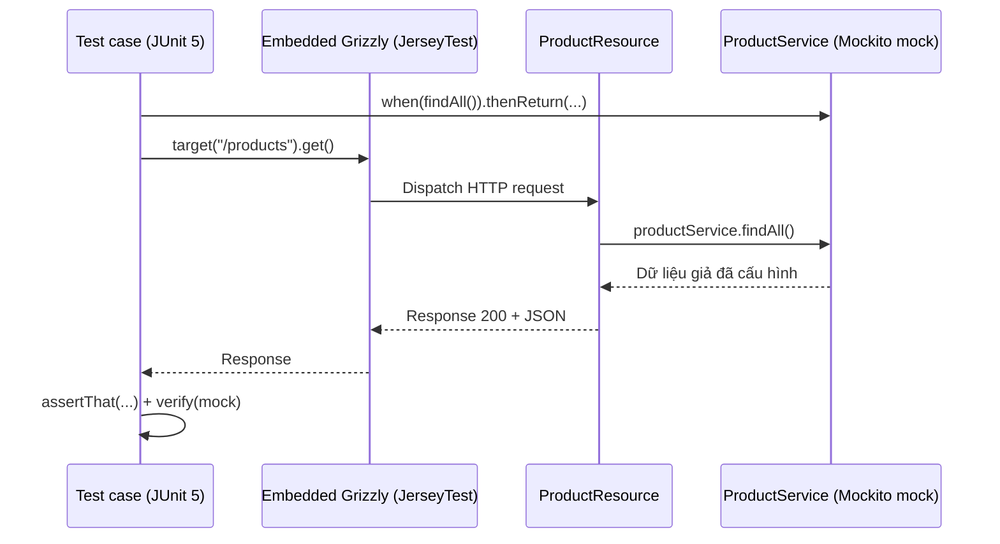

# Test Jersey REST API với JUnit

Viết test cho REST API giúp đảm bảo các endpoint hoạt động đúng trước khi đưa lên server thật. Bài này hướng dẫn dùng Jersey Test Framework để chạy server giả lập ngay trong JVM, kết hợp Mockito để mock service và AssertJ để viết assertion rõ ràng. Phần chi tiết kèm ví dụ test CRUD nằm bên dưới.

:::note[Ghi nhớ nhanh]

- ⭐ **Jersey Test Framework chạy embedded Grizzly ngay trong JVM** — test REST API không cần deploy; override `configure()`.
- ⭐ **Mock service layer bằng Mockito** — test chỉ kiểm tra HTTP behavior của resource (`when(...)`, `verify(...)`).
- **AssertJ cho assertion biểu cảm** — `assertThat(...)` dễ đọc hơn assert của JUnit.
- **Constructor injection** — resource nhận service qua constructor giúp dễ mock.
- **Mỗi test một hành vi** — đặt tên/`@DisplayName` mô tả rõ kỳ vọng; test service layer tách biệt khỏi HTTP.

:::

## Tổng quan

**JUnit** là framework kiểm thử phổ biến nhất trong Java. Để test REST API Jersey, ta có thể dùng:

1. **Jersey Test Framework** (khung kiểm thử Jersey): Khởi động server giả lập ngay trong test, không cần deploy thật.
2. **Unit test thuần**: Test business logic tách biệt khỏi HTTP layer.
3. **Mock test**: Dùng Mockito để giả lập dependency.

Sơ đồ sau minh họa cách một test case chạy qua embedded Grizzly server và mock service, không cần deploy thật:



Test kiểm tra hành vi HTTP của resource, còn service được mock nên logic nghiệp vụ không ảnh hưởng đến kết quả.

## Cấu hình Maven

```xml
<dependencies>
    <!-- Jersey Test Framework -->
    <dependency>
        <groupId>org.glassfish.jersey.test-framework</groupId>
        <artifactId>jersey-test-framework-core</artifactId>
        <version>2.40</version>
        <scope>test</scope>
    </dependency>

    <!-- Container test in-process (Grizzly) -->
    <dependency>
        <groupId>org.glassfish.jersey.test-framework.providers</groupId>
        <artifactId>jersey-test-framework-provider-grizzly2</artifactId>
        <version>2.40</version>
        <scope>test</scope>
    </dependency>

    <!-- JUnit 5 -->
    <dependency>
        <groupId>org.junit.jupiter</groupId>
        <artifactId>junit-jupiter</artifactId>
        <version>5.10.2</version>
        <scope>test</scope>
    </dependency>

    <!-- Mockito -->
    <dependency>
        <groupId>org.mockito</groupId>
        <artifactId>mockito-core</artifactId>
        <version>5.11.0</version>
        <scope>test</scope>
    </dependency>

    <!-- AssertJ — thư viện assertion biểu cảm hơn JUnit -->
    <dependency>
        <groupId>org.assertj</groupId>
        <artifactId>assertj-core</artifactId>
        <version>3.25.3</version>
        <scope>test</scope>
    </dependency>
</dependencies>
```

## Resource cần test

```java
package com.example.rest;

import com.example.rest.model.Product;
import com.example.rest.service.ProductService;
import jakarta.ws.rs.*;
import jakarta.ws.rs.core.*;
import java.util.List;

@Path("/products")
@Produces(MediaType.APPLICATION_JSON)
@Consumes(MediaType.APPLICATION_JSON)
public class ProductResource {

    private final ProductService productService;

    // Constructor injection — dễ mock trong test
    public ProductResource(ProductService productService) {
        this.productService = productService;
    }

    @GET
    public Response getAll() {
        return Response.ok(productService.findAll()).build();
    }

    @GET
    @Path("/{id}")
    public Response getById(@PathParam("id") int id) {
        return productService.findById(id)
            .map(p -> Response.ok(p).build())
            .orElse(Response.status(Response.Status.NOT_FOUND)
                            .entity("{\"error\": \"Không tìm thấy\"}")
                            .build());
    }

    @POST
    public Response create(Product product) {
        if (product.getName() == null || product.getName().trim().isEmpty()) {
            return Response.status(Response.Status.BAD_REQUEST)
                           .entity("{\"error\": \"Tên không được để trống\"}")
                           .build();
        }
        Product created = productService.create(product);
        return Response.status(Response.Status.CREATED).entity(created).build();
    }

    @DELETE
    @Path("/{id}")
    public Response delete(@PathParam("id") int id) {
        boolean deleted = productService.delete(id);
        return deleted
            ? Response.noContent().build()
            : Response.status(Response.Status.NOT_FOUND).build();
    }
}
```

## Unit Test với Jersey Test Framework

**JerseyTest** là class base cho phép khởi động embedded server (máy chủ nhúng) Grizzly ngay trong JVM.

```java
package com.example.rest;

import com.example.rest.model.Product;
import com.example.rest.service.ProductService;
import jakarta.ws.rs.client.Entity;
import jakarta.ws.rs.core.*;
import org.glassfish.jersey.server.ResourceConfig;
import org.glassfish.jersey.test.JerseyTest;
import org.junit.jupiter.api.*;
import org.mockito.Mockito;

import java.util.*;

import static org.assertj.core.api.Assertions.*;
import static org.mockito.Mockito.*;

/**
 * ProductResourceTest — Integration test cho ProductResource
 * Extends JerseyTest để sử dụng embedded Grizzly server
 */
class ProductResourceTest extends JerseyTest {

    private ProductService mockService;

    /**
     * configure() — định nghĩa ứng dụng Jersey cần test
     * Bắt buộc override khi extends JerseyTest
     */
    @Override
    protected Application configure() {
        // Tạo mock service
        mockService = Mockito.mock(ProductService.class);

        // Đăng ký resource với mock service
        return new ResourceConfig()
            .register(new ProductResource(mockService));
    }

    @Test
    @DisplayName("GET /products - Trả về danh sách sản phẩm với 200 OK")
    void testGetAll_shouldReturn200WithProductList() {
        // Arrange (Chuẩn bị dữ liệu)
        List<Product> products = Arrays.asList(
            new Product(1, "Laptop Dell", 35_000_000),
            new Product(2, "Chuột Logitech", 1_800_000)
        );
        when(mockService.findAll()).thenReturn(products);

        // Act (Thực thi)
        Response response = target("/products")
            .request(MediaType.APPLICATION_JSON)
            .get();

        // Assert (Kiểm tra kết quả)
        assertThat(response.getStatus()).isEqualTo(200);
        String body = response.readEntity(String.class);
        assertThat(body).contains("Laptop Dell");
        assertThat(body).contains("Chuột Logitech");

        // Verify mock được gọi đúng cách
        verify(mockService, times(1)).findAll();
    }

    @Test
    @DisplayName("GET /products/{id} - Trả về 404 khi không tìm thấy")
    void testGetById_whenNotFound_shouldReturn404() {
        // Arrange
        when(mockService.findById(999)).thenReturn(Optional.empty());

        // Act
        Response response = target("/products/999")
            .request(MediaType.APPLICATION_JSON)
            .get();

        // Assert
        assertThat(response.getStatus()).isEqualTo(404);
    }

    @Test
    @DisplayName("POST /products - Tạo thành công trả về 201")
    void testCreate_withValidProduct_shouldReturn201() {
        // Arrange
        Product input = new Product(0, "Bàn phím cơ", 2_500_000);
        Product created = new Product(10, "Bàn phím cơ", 2_500_000);
        when(mockService.create(any(Product.class))).thenReturn(created);

        // Act
        Response response = target("/products")
            .request(MediaType.APPLICATION_JSON)
            .post(Entity.json(input));

        // Assert
        assertThat(response.getStatus()).isEqualTo(201);
        Product result = response.readEntity(Product.class);
        assertThat(result.getId()).isEqualTo(10);
        assertThat(result.getName()).isEqualTo("Bàn phím cơ");
    }

    @Test
    @DisplayName("POST /products - Trả về 400 khi tên rỗng")
    void testCreate_withEmptyName_shouldReturn400() {
        // Arrange: product với tên rỗng
        Product invalidProduct = new Product(0, "", 1_000_000);

        // Act
        Response response = target("/products")
            .request(MediaType.APPLICATION_JSON)
            .post(Entity.json(invalidProduct));

        // Assert
        assertThat(response.getStatus()).isEqualTo(400);
        String body = response.readEntity(String.class);
        assertThat(body).contains("Tên không được để trống");

        // Service không được gọi khi validation thất bại
        verify(mockService, never()).create(any());
    }

    @Test
    @DisplayName("DELETE /products/{id} - Xóa thành công trả về 204")
    void testDelete_whenExists_shouldReturn204() {
        // Arrange
        when(mockService.delete(1)).thenReturn(true);

        // Act
        Response response = target("/products/1")
            .request()
            .delete();

        // Assert
        assertThat(response.getStatus()).isEqualTo(204);
    }
}
```

## Unit Test cho Service Layer

Test business logic tách biệt khỏi HTTP:

```java
package com.example.rest.service;

import com.example.rest.model.Product;
import org.junit.jupiter.api.*;
import java.util.*;

import static org.assertj.core.api.Assertions.*;

class ProductServiceTest {

    private ProductService service;

    @BeforeEach
    void setUp() {
        service = new ProductService();
    }

    @Test
    @DisplayName("findAll() - Trả về danh sách ban đầu không rỗng")
    void testFindAll_shouldReturnNonEmptyList() {
        List<Product> result = service.findAll();
        assertThat(result).isNotEmpty();
    }

    @Test
    @DisplayName("create() - Tạo sản phẩm và gán ID mới")
    void testCreate_shouldAssignNewId() {
        Product product = new Product(0, "Tai nghe Sony", 1_500_000);
        Product created = service.create(product);

        assertThat(created.getId()).isGreaterThan(0);
        assertThat(created.getName()).isEqualTo("Tai nghe Sony");
    }

    @Test
    @DisplayName("findById() - Trả về empty khi ID không tồn tại")
    void testFindById_whenNotExists_shouldReturnEmpty() {
        Optional<Product> result = service.findById(99999);
        assertThat(result).isEmpty();
    }

    @Test
    @DisplayName("delete() - Trả về false khi xóa ID không tồn tại")
    void testDelete_whenNotExists_shouldReturnFalse() {
        boolean result = service.delete(99999);
        assertThat(result).isFalse();
    }
}
```

## Test với Authentication

```java
@Test
@DisplayName("GET /secure/profile - Trả về 401 khi không có token")
void testSecureEndpoint_withoutToken_shouldReturn401() {
    Response response = target("/secure/profile")
        .request()
        .get();

    assertThat(response.getStatus()).isEqualTo(401);
}

@Test
@DisplayName("GET /secure/profile - Trả về 200 khi có token hợp lệ")
void testSecureEndpoint_withValidToken_shouldReturn200() {
    String validToken = JwtUtils.generateToken(1, "admin", "ADMIN");

    Response response = target("/secure/profile")
        .request()
        .header("Authorization", "Bearer " + validToken)
        .get();

    assertThat(response.getStatus()).isEqualTo(200);
}
```

## Tóm tắt

Jersey Test Framework cho phép test REST API không cần deploy, chạy trực tiếp trong JVM với embedded Grizzly. Kết hợp Mockito để mock service layer — test chỉ kiểm tra HTTP behavior của resource. JUnit 5 + AssertJ tạo ra test code rõ ràng, dễ đọc. Quy tắc: mỗi test một hành vi (behavior), đặt tên test mô tả rõ kỳ vọng.
