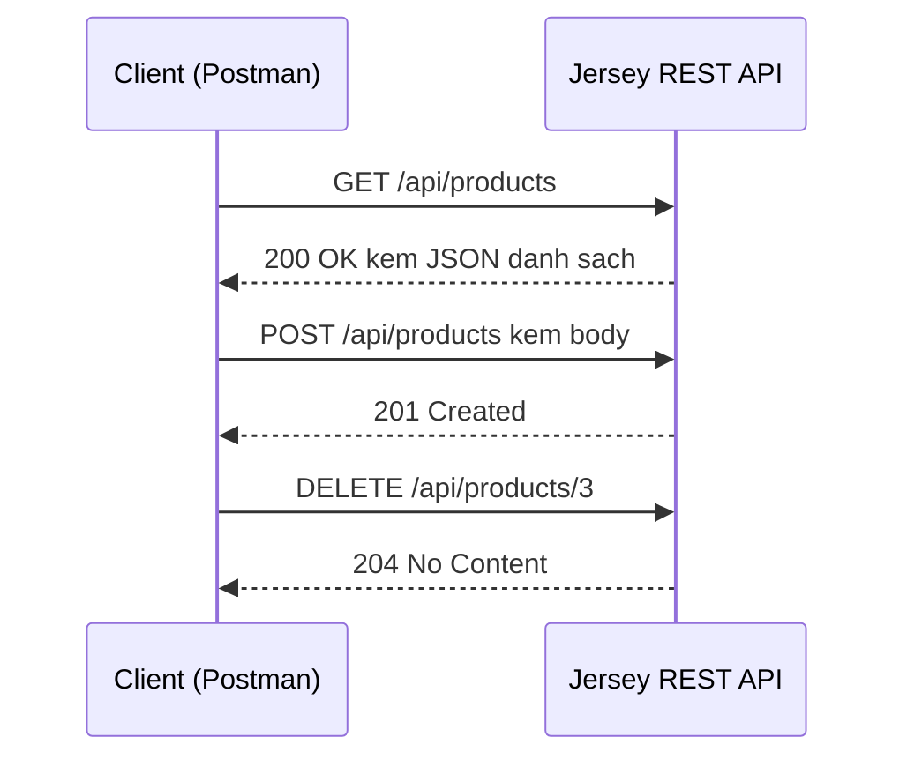

# Java Web Services - Jersey JAX-RS - REST và test với Postman

REST là kiểu kiến trúc phổ biến nhất hiện nay để xây dựng API, dựa trên các phương thức HTTP quen thuộc như GET, POST, PUT, DELETE. Trong Java, ta dùng đặc tả JAX-RS với thư viện Jersey để tạo REST API nhanh gọn bằng annotation, rồi dùng Postman để kiểm thử. Bài này hướng dẫn từ cấu hình đến viết resource đầu tiên kèm ví dụ; chi tiết nằm bên dưới.

:::note[Ghi nhớ nhanh]

- ⭐ **REST là phong cách kiến trúc dựa trên HTTP** — không phải giao thức; một RESTful service nên thỏa 6 ràng buộc (Client-Server, Stateless, Cacheable, Uniform Interface, Layered System, Code on Demand).
- ⭐ **`JAX-RS` là đặc tả, `Jersey` là bản triển khai tham chiếu** — khai báo REST API bằng annotation.
- **Annotation cốt lõi** — `@Path`, `@GET`/`@POST`/`@PUT`/`@DELETE`, `@Produces`, `@Consumes`, `@PathParam`, `@QueryParam`.
- **Cấu hình qua `web.xml`** — đăng ký `ServletContainer` và khai báo package chứa resource.
- **`Postman`** — công cụ GUI để gửi request và kiểm thử response trực quan.

:::

## REST là gì?

**REST** (Representational State Transfer — kiểu kiến trúc thiết kế API dựa trên HTTP) là một phong cách kiến trúc phần mềm dùng để xây dựng các dịch vụ web. REST không phải là một giao thức hay chuẩn, mà là một tập hợp các ràng buộc kiến trúc.

Một **RESTful Web Service** (dịch vụ web theo kiến trúc REST) cần đáp ứng 6 ràng buộc chính:

1. **Client-Server** (Tách biệt client và server): Client và server hoạt động độc lập với nhau.
2. **Stateless** (Phi trạng thái): Mỗi request phải chứa đầy đủ thông tin, server không lưu trạng thái client.
3. **Cacheable** (Có thể cache): Response có thể được cache để tăng hiệu năng.
4. **Uniform Interface** (Giao diện đồng nhất): Sử dụng các HTTP method chuẩn như `GET`, `POST`, `PUT`, `DELETE`.
5. **Layered System** (Hệ thống phân lớp): Client không cần biết nó đang giao tiếp trực tiếp với server hay qua proxy.
6. **Code on Demand** (Tùy chọn): Server có thể gửi mã thực thi về client (ví dụ JavaScript).

Sơ đồ dưới đây minh họa cách client trao đổi với REST API qua các HTTP method chuẩn:



Mỗi HTTP method thể hiện một hành động; server trả về status code cho biết kết quả.

## JAX-RS và Jersey là gì?

**JAX-RS** (Java API for RESTful Web Services — API Java để xây dựng dịch vụ web RESTful) là một đặc tả (specification) trong Java EE/Jakarta EE dùng để tạo REST API bằng annotation.

**Jersey** là implementation (triển khai cụ thể) tham chiếu của JAX-RS, do Oracle/Eclipse phát triển. Jersey cung cấp đầy đủ các tính năng của JAX-RS và nhiều extension hữu ích.

## Cấu hình Maven

Thêm dependency vào `pom.xml`:

```xml
<dependencies>
    <!-- Jersey JAX-RS Server -->
    <dependency>
        <groupId>org.glassfish.jersey.containers</groupId>
        <artifactId>jersey-container-servlet</artifactId>
        <version>2.40</version>
    </dependency>

    <!-- Jersey HK2 Dependency Injection -->
    <dependency>
        <groupId>org.glassfish.jersey.inject</groupId>
        <artifactId>jersey-hk2</artifactId>
        <version>2.40</version>
    </dependency>

    <!-- JSON support với Jackson -->
    <dependency>
        <groupId>org.glassfish.jersey.media</groupId>
        <artifactId>jersey-media-json-jackson</artifactId>
        <version>2.40</version>
    </dependency>
</dependencies>
```

## Cấu hình web.xml

```xml
<web-app>
    <servlet>
        <servlet-name>Jersey REST Service</servlet-name>
        <servlet-class>
            org.glassfish.jersey.servlet.ServletContainer
        </servlet-class>
        <init-param>
            <param-name>jersey.config.server.provider.packages</param-name>
            <param-value>com.example.rest</param-value>
        </init-param>
        <load-on-startup>1</load-on-startup>
    </servlet>
    <servlet-mapping>
        <servlet-name>Jersey REST Service</servlet-name>
        <url-pattern>/api/*</url-pattern>
    </servlet-mapping>
</web-app>
```

## Tạo Resource Class đầu tiên

**Resource Class** (lớp tài nguyên) là lớp Java đại diện cho một endpoint REST. Mỗi method trong class tương ứng với một hành động HTTP.

```java
package com.example.rest;

import jakarta.ws.rs.*;
import jakarta.ws.rs.core.MediaType;
import jakarta.ws.rs.core.Response;
import java.util.*;

@Path("/products")  // Đường dẫn cơ sở của resource
public class ProductResource {

    // Dữ liệu giả lập (in-memory)
    private static Map<Integer, String> products = new HashMap<>();

    static {
        products.put(1, "Laptop Dell XPS");
        products.put(2, "Chuột Logitech MX");
        products.put(3, "Bàn phím Keychron K2");
    }

    /**
     * GET /api/products
     * Lấy danh sách tất cả sản phẩm
     * @return JSON array các sản phẩm
     */
    @GET
    @Produces(MediaType.APPLICATION_JSON)  // Trả về JSON
    public Response getAllProducts() {
        return Response.ok(products).build();
    }

    /**
     * GET /api/products/{id}
     * Lấy thông tin một sản phẩm theo ID
     * @PathParam — lấy giá trị từ đường dẫn URL
     */
    @GET
    @Path("/{id}")
    @Produces(MediaType.APPLICATION_JSON)
    public Response getProduct(@PathParam("id") int id) {
        String product = products.get(id);
        if (product == null) {
            return Response.status(Response.Status.NOT_FOUND)
                           .entity("Không tìm thấy sản phẩm với ID: " + id)
                           .build();
        }
        return Response.ok(product).build();
    }

    /**
     * POST /api/products
     * Tạo mới sản phẩm
     * @Consumes — nhận dữ liệu dạng plain text
     */
    @POST
    @Consumes(MediaType.TEXT_PLAIN)
    @Produces(MediaType.APPLICATION_JSON)
    public Response createProduct(String productName) {
        int newId = products.size() + 1;
        products.put(newId, productName);
        return Response.status(Response.Status.CREATED)
                       .entity("Tạo sản phẩm thành công với ID: " + newId)
                       .build();
    }

    /**
     * DELETE /api/products/{id}
     * Xóa sản phẩm theo ID
     */
    @DELETE
    @Path("/{id}")
    public Response deleteProduct(@PathParam("id") int id) {
        if (!products.containsKey(id)) {
            return Response.status(Response.Status.NOT_FOUND).build();
        }
        products.remove(id);
        return Response.noContent().build();  // 204 No Content
    }
}
```

## Các Annotation quan trọng trong JAX-RS

| Annotation | Ý nghĩa |
|---|---|
| `@Path` | Định nghĩa đường dẫn URL cho resource hoặc method |
| `@GET`, `@POST`, `@PUT`, `@DELETE` | Tương ứng với HTTP method |
| `@Produces` | Định dạng dữ liệu trả về (JSON, XML, TEXT...) |
| `@Consumes` | Định dạng dữ liệu nhận vào |
| `@PathParam` | Lấy tham số từ đường dẫn URL |
| `@QueryParam` | Lấy tham số từ query string (`?key=value`) |
| `@HeaderParam` | Lấy giá trị từ HTTP header |

## Test với Postman

**Postman** là công cụ GUI cho phép gửi HTTP request và kiểm tra response một cách trực quan.

Các bước test:

1. Mở Postman, tạo request mới.
2. Chọn method `GET`, nhập URL `http://localhost:8080/api/products`.
3. Nhấn **Send** và xem response ở phần bên dưới.
4. Để test `POST`, chọn method `POST`, vào tab **Body**, chọn **raw** > **Text**, nhập tên sản phẩm.

Kết quả mong đợi khi gọi `GET /api/products`:

```json
{
    "1": "Laptop Dell XPS",
    "2": "Chuột Logitech MX",
    "3": "Bàn phím Keychron K2"
}
```

## Tóm tắt

REST là kiến trúc phổ biến nhất để xây dựng API hiện đại. JAX-RS với Jersey cung cấp cách tiếp cận khai báo thông qua annotation, giúp code gọn gàng và dễ đọc. Postman là công cụ không thể thiếu khi phát triển và kiểm thử REST API.
