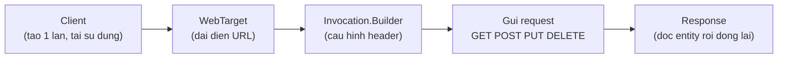

# Tạo ứng dụng Java RESTful Client với Jersey Client 2.x

Jersey Client cho phép ứng dụng Java đóng vai trò là bên gọi REST API, ví dụ gọi API bên thứ ba hay để các microservice giao tiếp với nhau. Bài này hướng dẫn dùng Jersey Client để thực hiện đầy đủ các thao tác CRUD, truyền query param và header, cùng cách xử lý lỗi khi gọi API.

:::note[Ghi nhớ nhanh]

- ⭐ **Jersey Client biến ứng dụng Java thành bên gọi REST API** — dùng khi gọi API bên thứ ba, giao tiếp microservice hay viết integration test.
- ⭐ **Bốn thành phần chính** — `Client` (tạo một lần, tái sử dụng), `WebTarget` (đại diện URL), `Invocation.Builder` (cấu hình & gửi), `Response` (kết quả).
- **Luôn đóng `Response`** — gọi `response.close()` để tránh rò rỉ tài nguyên.
- **Gửi body & đọc kết quả** — `Entity.entity(obj, JSON)` để gửi, `readEntity(...)` (kèm `GenericType` cho `List`) để đọc.
- **Query & header** — dùng `queryParam(...)` và `header(...)`; bắt `ProcessingException` cho lỗi mạng/timeout.

:::

## Jersey Client là gì?

**Jersey Client** là một module trong thư viện Jersey cho phép ứng dụng Java đóng vai trò là **HTTP client** (máy khách HTTP) — tức là gửi request đến REST API và nhận response, thay vì chỉ cung cấp API cho người khác gọi.

Khi nào cần dùng Jersey Client:
- Ứng dụng cần gọi đến REST API của bên thứ ba (Google API, payment gateway...)
- Microservice giao tiếp với nhau qua REST
- Viết integration test (kiểm thử tích hợp) cho REST API

Sơ đồ sau cho thấy chuỗi thành phần khi Jersey Client gửi một request:



`Client` khởi tạo một lần rồi tái sử dụng; luôn đóng `Response` cuối chuỗi để tránh rò rỉ tài nguyên.

## Cấu hình Maven

```xml
<dependencies>
    <!-- Jersey Client -->
    <dependency>
        <groupId>org.glassfish.jersey.core</groupId>
        <artifactId>jersey-client</artifactId>
        <version>2.40</version>
    </dependency>

    <!-- HK2 cho Dependency Injection -->
    <dependency>
        <groupId>org.glassfish.jersey.inject</groupId>
        <artifactId>jersey-hk2</artifactId>
        <version>2.40</version>
    </dependency>

    <!-- Hỗ trợ JSON với Jackson -->
    <dependency>
        <groupId>org.glassfish.jersey.media</groupId>
        <artifactId>jersey-media-json-jackson</artifactId>
        <version>2.40</version>
    </dependency>
</dependencies>
```

## Model class

```java
package com.example.client.model;

import com.fasterxml.jackson.annotation.JsonIgnoreProperties;

// @JsonIgnoreProperties(ignoreUnknown = true) — bỏ qua các field không có trong class
@JsonIgnoreProperties(ignoreUnknown = true)
public class Product {
    private int id;
    private String name;
    private double price;

    // Constructor mặc định bắt buộc cho Jackson deserialization
    public Product() {}

    public Product(int id, String name, double price) {
        this.id = id;
        this.name = name;
        this.price = price;
    }

    // Getters và Setters
    public int getId() { return id; }
    public void setId(int id) { this.id = id; }

    public String getName() { return name; }
    public void setName(String name) { this.name = name; }

    public double getPrice() { return price; }
    public void setPrice(double price) { this.price = price; }

    @Override
    public String toString() {
        return "Product{id=" + id + ", name='" + name + "', price=" + price + "}";
    }
}
```

## Tạo Jersey Client cơ bản

```java
package com.example.client;

import jakarta.ws.rs.client.*;
import jakarta.ws.rs.core.*;
import org.glassfish.jersey.client.ClientConfig;
import org.glassfish.jersey.jackson.JacksonFeature;

public class ProductClientExample {

    private static final String BASE_URL = "http://localhost:8080/api/products";

    public static void main(String[] args) {
        // Khởi tạo ClientConfig với Jackson để parse JSON
        ClientConfig config = new ClientConfig();
        config.register(JacksonFeature.class);

        // Client — đối tượng gốc, nên tái sử dụng (tốn kém để khởi tạo)
        Client client = ClientBuilder.newClient(config);

        demoGetAll(client);
        demoGetById(client, 1);
        demoCreate(client);
        demoUpdate(client, 1);
        demoDelete(client, 3);

        // Đóng client để giải phóng tài nguyên
        client.close();
    }

    /**
     * GET /api/products — Lấy danh sách tất cả sản phẩm
     * GenericType<List<Product>> — dùng để deserialize JSON array thành List
     */
    static void demoGetAll(Client client) {
        WebTarget target = client.target(BASE_URL);

        // Invocation.Builder — đối tượng dùng để thực sự gửi request
        Response response = target.request(MediaType.APPLICATION_JSON).get();

        if (response.getStatus() == 200) {
            // Đọc response body thành List<Product>
            java.util.List<Product> products =
                response.readEntity(new GenericType<java.util.List<Product>>() {});
            System.out.println("Danh sách sản phẩm:");
            products.forEach(System.out::println);
        }
        response.close();
    }

    /**
     * GET /api/products/{id} — Lấy sản phẩm theo ID
     */
    static void demoGetById(Client client, int id) {
        WebTarget target = client.target(BASE_URL).path(String.valueOf(id));
        Response response = target.request(MediaType.APPLICATION_JSON).get();

        if (response.getStatus() == 200) {
            Product product = response.readEntity(Product.class);
            System.out.println("Sản phẩm tìm thấy: " + product);
        } else if (response.getStatus() == 404) {
            System.out.println("Không tìm thấy sản phẩm ID: " + id);
        }
        response.close();
    }

    /**
     * POST /api/products — Tạo sản phẩm mới
     * Entity.json() — bọc object thành HTTP body dạng JSON
     */
    static void demoCreate(Client client) {
        Product newProduct = new Product(0, "Màn hình LG 27inch", 5_500_000);

        WebTarget target = client.target(BASE_URL);
        Response response = target
            .request(MediaType.APPLICATION_JSON)
            .post(Entity.entity(newProduct, MediaType.APPLICATION_JSON));

        System.out.println("Tạo sản phẩm - Status: " + response.getStatus());
        if (response.getStatus() == 201) {
            Product created = response.readEntity(Product.class);
            System.out.println("Sản phẩm vừa tạo: " + created);
        }
        response.close();
    }

    /**
     * PUT /api/products/{id} — Cập nhật sản phẩm
     */
    static void demoUpdate(Client client, int id) {
        Product updated = new Product(id, "Laptop Dell XPS 15 (Updated)", 35_000_000);

        WebTarget target = client.target(BASE_URL).path(String.valueOf(id));
        Response response = target
            .request(MediaType.APPLICATION_JSON)
            .put(Entity.entity(updated, MediaType.APPLICATION_JSON));

        System.out.println("Cập nhật sản phẩm " + id + " - Status: " + response.getStatus());
        response.close();
    }

    /**
     * DELETE /api/products/{id} — Xóa sản phẩm
     */
    static void demoDelete(Client client, int id) {
        WebTarget target = client.target(BASE_URL).path(String.valueOf(id));
        Response response = target.request().delete();

        System.out.println("Xóa sản phẩm " + id + " - Status: " + response.getStatus());
        response.close();
    }
}
```

## Sử dụng QueryParam và Header

```java
/**
 * Ví dụ gọi API với query parameter và custom header
 * QueryParam — tham số trên URL dạng ?key=value
 * Header — thông tin bổ sung trong HTTP request
 */
static void demoWithQueryAndHeader(Client client) {
    WebTarget target = client.target(BASE_URL)
        .queryParam("page", 1)          // Thêm ?page=1
        .queryParam("size", 10)         // Thêm &size=10
        .queryParam("sort", "name,asc"); // Thêm &sort=name,asc

    Response response = target
        .request(MediaType.APPLICATION_JSON)
        .header("X-API-Key", "my-secret-key")       // Custom header
        .header("Accept-Language", "vi-VN")          // Ngôn ngữ
        .get();

    System.out.println("Status: " + response.getStatus());
    response.close();
}
```

## Xử lý lỗi với Jersey Client

```java
static void demoErrorHandling(Client client) {
    try {
        WebTarget target = client.target(BASE_URL).path("/999");
        Response response = target.request(MediaType.APPLICATION_JSON).get();

        // Kiểm tra status code trước khi đọc body
        int status = response.getStatus();
        switch (status) {
            case 200:
                Product p = response.readEntity(Product.class);
                System.out.println("Thành công: " + p);
                break;
            case 404:
                System.out.println("Không tìm thấy tài nguyên.");
                break;
            case 500:
                System.out.println("Lỗi server nội bộ.");
                break;
            default:
                System.out.println("Lỗi không xác định: " + status);
        }
        response.close();
    } catch (jakarta.ws.rs.ProcessingException e) {
        // ProcessingException — lỗi kết nối mạng, timeout
        System.err.println("Không thể kết nối đến server: " + e.getMessage());
    }
}
```

## Tóm tắt

Jersey Client cung cấp API fluent (chuỗi method liên tiếp) để gọi REST API một cách rõ ràng. Các thành phần chính: `Client` (tạo một lần, tái sử dụng), `WebTarget` (đại diện URL), `Invocation.Builder` (cấu hình và gửi request), `Response` (kết quả trả về). Luôn đóng `Response` sau khi sử dụng để tránh rò rỉ tài nguyên.
