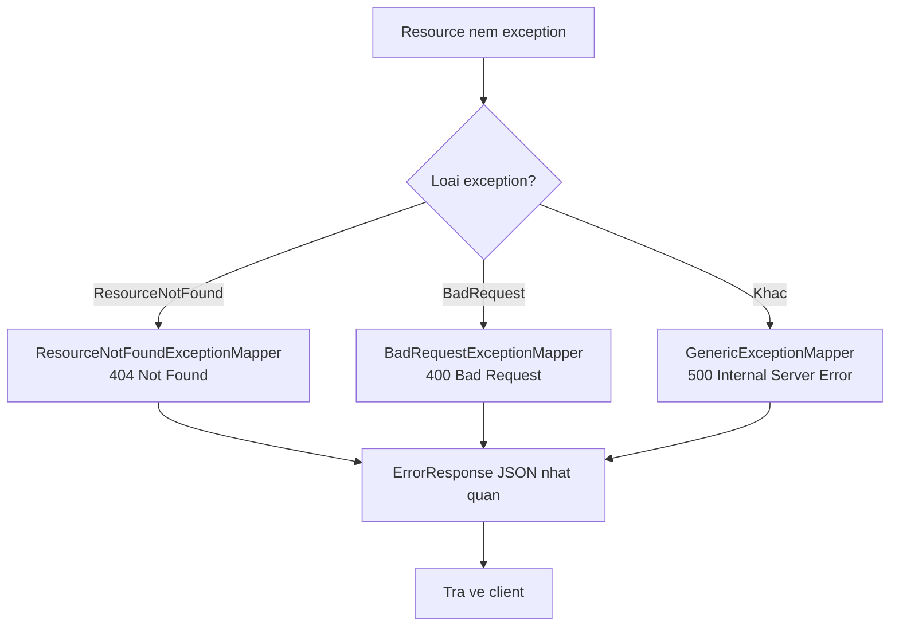

# REST Web service - HTTP Status Code và xử lý ngoại lệ với Jersey 2.x

Trả về đúng HTTP status code và xử lý lỗi gọn gàng là yếu tố quan trọng để REST API trở nên chuyên nghiệp và dễ dùng. Bài này giải thích ý nghĩa các nhóm status code thường gặp, rồi hướng dẫn dùng `ExceptionMapper` của Jersey để bắt exception và trả về `ErrorResponse` nhất quán cho client.

## HTTP Status Code là gì?

**HTTP Status Code** (mã trạng thái HTTP) là số 3 chữ số trong response cho biết kết quả của request. Chọn đúng status code là yếu tố quan trọng để thiết kế REST API chuyên nghiệp.

### Các nhóm Status Code

| Nhóm | Phạm vi | Ý nghĩa |
|---|---|---|
| 1xx | 100-199 | Informational — Đang xử lý |
| 2xx | 200-299 | Success — Thành công |
| 3xx | 300-399 | Redirection — Chuyển hướng |
| 4xx | 400-499 | Client Error — Lỗi từ phía client |
| 5xx | 500-599 | Server Error — Lỗi từ phía server |

### Các Status Code thường dùng trong REST API

| Code | Tên | Khi nào dùng |
|---|---|---|
| 200 | OK | Request thành công (GET, PUT) |
| 201 | Created | Tạo mới thành công (POST) |
| 204 | No Content | Xóa thành công, không có body trả về |
| 400 | Bad Request | Dữ liệu đầu vào không hợp lệ |
| 401 | Unauthorized | Chưa xác thực (chưa đăng nhập) |
| 403 | Forbidden | Không có quyền truy cập |
| 404 | Not Found | Tài nguyên không tồn tại |
| 409 | Conflict | Xung đột dữ liệu (email đã tồn tại) |
| 422 | Unprocessable Entity | Dữ liệu hợp lệ về cú pháp nhưng sai về nghĩa |
| 500 | Internal Server Error | Lỗi không xác định phía server |

## Custom Exception Classes

**Exception** (ngoại lệ) là sự kiện bất thường xảy ra khi chương trình thực thi. Trong REST API, ta cần ánh xạ exception sang HTTP response phù hợp.

```java
package com.example.rest.exception;

/**
 * ResourceNotFoundException — ném khi tài nguyên không tồn tại trong database
 */
public class ResourceNotFoundException extends RuntimeException {
    private final String resourceType;
    private final Object resourceId;

    public ResourceNotFoundException(String resourceType, Object resourceId) {
        super(resourceType + " không tìm thấy với ID: " + resourceId);
        this.resourceType = resourceType;
        this.resourceId = resourceId;
    }

    public String getResourceType() { return resourceType; }
    public Object getResourceId() { return resourceId; }
}
```

```java
package com.example.rest.exception;

/**
 * BadRequestException — ném khi dữ liệu đầu vào không hợp lệ
 */
public class BadRequestException extends RuntimeException {
    private final String field;

    public BadRequestException(String field, String message) {
        super("Trường '" + field + "': " + message);
        this.field = field;
    }

    public String getField() { return field; }
}
```

## ErrorResponse Model

```java
package com.example.rest.exception;

import java.time.LocalDateTime;
import java.time.format.DateTimeFormatter;

/**
 * ErrorResponse — cấu trúc JSON trả về khi có lỗi, giúp client xử lý lỗi dễ dàng
 */
public class ErrorResponse {
    private int status;
    private String error;
    private String message;
    private String timestamp;
    private String path;

    public ErrorResponse(int status, String error, String message, String path) {
        this.status = status;
        this.error = error;
        this.message = message;
        this.path = path;
        this.timestamp = LocalDateTime.now()
            .format(DateTimeFormatter.ofPattern("yyyy-MM-dd HH:mm:ss"));
    }

    // Getters (bắt buộc để Jackson serialize sang JSON)
    public int getStatus() { return status; }
    public String getError() { return error; }
    public String getMessage() { return message; }
    public String getTimestamp() { return timestamp; }
    public String getPath() { return path; }
}
```

## ExceptionMapper — Ánh xạ Exception sang HTTP Response

**ExceptionMapper** (bộ ánh xạ ngoại lệ) là interface của JAX-RS cho phép bắt exception cụ thể và chuyển thành Response tương ứng. Đây là cơ chế xử lý lỗi tập trung (centralized error handling).

Sơ đồ sau cho thấy cách exception được ánh xạ sang HTTP response nhất quán:



Mỗi loại exception có một mapper riêng, tất cả cùng đổ về một cấu trúc `ErrorResponse` thống nhất cho client.

```java
package com.example.rest.exception;

import jakarta.ws.rs.core.*;
import jakarta.ws.rs.ext.*;

/**
 * @Provider — đăng ký class này với Jersey để nó được tự động phát hiện
 */
@Provider
public class ResourceNotFoundExceptionMapper
        implements ExceptionMapper<ResourceNotFoundException> {

    @Context
    private UriInfo uriInfo; // UriInfo cung cấp thông tin về URL hiện tại

    @Override
    public Response toResponse(ResourceNotFoundException exception) {
        ErrorResponse error = new ErrorResponse(
            Response.Status.NOT_FOUND.getStatusCode(),
            "Not Found",
            exception.getMessage(),
            uriInfo.getPath()
        );

        return Response.status(Response.Status.NOT_FOUND)
                       .entity(error)
                       .type(MediaType.APPLICATION_JSON)
                       .build();
    }
}
```

```java
@Provider
public class BadRequestExceptionMapper
        implements ExceptionMapper<BadRequestException> {

    @Context
    private UriInfo uriInfo;

    @Override
    public Response toResponse(BadRequestException exception) {
        ErrorResponse error = new ErrorResponse(
            Response.Status.BAD_REQUEST.getStatusCode(),
            "Bad Request",
            exception.getMessage(),
            uriInfo.getPath()
        );

        return Response.status(Response.Status.BAD_REQUEST)
                       .entity(error)
                       .type(MediaType.APPLICATION_JSON)
                       .build();
    }
}
```

```java
/**
 * GenericExceptionMapper — bắt tất cả exception không được xử lý bởi mapper khác
 * Luôn trả về 500 Internal Server Error và che giấu chi tiết lỗi nội bộ
 */
@Provider
public class GenericExceptionMapper implements ExceptionMapper<Throwable> {

    @Context
    private UriInfo uriInfo;

    @Override
    public Response toResponse(Throwable exception) {
        // Log chi tiết lỗi phía server, nhưng KHÔNG trả về cho client
        System.err.println("Lỗi không xử lý được: " + exception.getMessage());

        ErrorResponse error = new ErrorResponse(
            Response.Status.INTERNAL_SERVER_ERROR.getStatusCode(),
            "Internal Server Error",
            "Đã xảy ra lỗi nội bộ. Vui lòng thử lại sau.",
            uriInfo.getPath()
        );

        return Response.status(Response.Status.INTERNAL_SERVER_ERROR)
                       .entity(error)
                       .type(MediaType.APPLICATION_JSON)
                       .build();
    }
}
```

## Resource sử dụng Exception

```java
package com.example.rest;

import com.example.rest.exception.*;
import jakarta.ws.rs.*;
import jakarta.ws.rs.core.*;
import java.util.*;

@Path("/users")
@Produces(MediaType.APPLICATION_JSON)
public class UserResource {

    private static Map<Integer, String> users = new HashMap<>();

    static {
        users.put(1, "Nguyễn Văn An");
        users.put(2, "Trần Thị Bình");
    }

    @GET
    @Path("/{id}")
    public Response getUser(@PathParam("id") int id) {
        // Ném exception thay vì kiểm tra điều kiện inline
        // ExceptionMapper sẽ tự động bắt và chuyển sang 404 response
        if (!users.containsKey(id)) {
            throw new ResourceNotFoundException("User", id);
        }
        return Response.ok(Map.of("id", id, "name", users.get(id))).build();
    }

    @POST
    @Consumes(MediaType.APPLICATION_JSON)
    public Response createUser(Map<String, String> body) {
        String name = body.get("name");

        // Validate đầu vào
        if (name == null || name.trim().isEmpty()) {
            throw new BadRequestException("name", "Tên không được để trống");
        }
        if (name.length() > 100) {
            throw new BadRequestException("name", "Tên không được vượt quá 100 ký tự");
        }

        int newId = users.size() + 1;
        users.put(newId, name.trim());

        return Response.status(Response.Status.CREATED)
                       .entity(Map.of("id", newId, "name", name.trim()))
                       .build();
    }
}
```

## Response khi có lỗi

Khi client gọi `GET /api/users/999`, response sẽ có dạng:

```json
{
    "status": 404,
    "error": "Not Found",
    "message": "User không tìm thấy với ID: 999",
    "timestamp": "2024-06-04 10:30:00",
    "path": "users/999"
}
```

## Tóm tắt

Xử lý lỗi tốt trong REST API cần: (1) ném exception có nghĩa rõ ràng trong business logic, (2) dùng `ExceptionMapper` để chuyển đổi tập trung, (3) trả về `ErrorResponse` nhất quán. Tuyệt đối không để lộ stack trace hoặc thông tin hệ thống nội bộ trong response lỗi.
