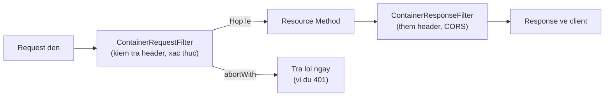

# REST Web service - Filter và Interceptor với Jersey 2.x (Phần 1)

Filter và Interceptor là hai cơ chế giúp bạn xử lý các tác vụ chung như ghi log, xác thực hay thêm header CORS mà không phải nhét code lặp lại vào từng endpoint. Phần 1 này tập trung vào Filter — thứ làm việc với metadata của request/response (headers, URI, status code). Bạn sẽ học cách viết request/response filter, thêm CORS, dùng `@NameBinding` để áp dụng filter có chọn lọc và sắp xếp thứ tự bằng `@Priority`.

:::note[Ghi nhớ nhanh]

- ⭐ **Filter xử lý metadata (headers, URI, status), không đụng body** — dùng `ContainerRequestFilter` và `ContainerResponseFilter`.
- ⭐ **Request filter có thể ngắt luồng bằng `abortWith()`** — ví dụ trả 401 khi thiếu token.
- **Filter vs Interceptor** — Filter làm việc trên metadata; Interceptor xử lý body (đọc/ghi).
- **`@NameBinding`** — tạo annotation tùy chỉnh (vd `@Authenticated`) để áp filter có chọn lọc thay vì toàn cục.
- **`@Priority`** — kiểm soát thứ tự nhiều filter (số nhỏ chạy trước).
- **CORS** — response filter thêm header `Access-Control-Allow-*` cho phép frontend khác domain gọi API.

:::

## Filter và Interceptor là gì?

Trong Jersey 2.x, **Filter** (bộ lọc) và **Interceptor** (bộ chặn) là hai cơ chế mạnh mẽ để xử lý cross-cutting concerns (các mối quan tâm xuyên suốt nhiều phần ứng dụng) như logging, xác thực, nén dữ liệu, mà không cần nhúng code vào từng resource.

Sơ đồ dưới đây minh họa vị trí của Filter trong luồng xử lý một request:



Request filter chạy trước resource và có thể ngắt luồng bằng `abortWith()`, còn response filter chỉnh sửa response trước khi gửi đi.

### Sự khác biệt giữa Filter và Interceptor

| Tiêu chí | Filter | Interceptor |
|---|---|---|
| Mục đích | Xử lý metadata của request/response (headers, URI, HTTP method) | Xử lý body của request/response (đọc/ghi nội dung) |
| Thời điểm | Trước/sau khi JAX-RS xử lý | Trong quá trình đọc/ghi message body |
| Interface | `ContainerRequestFilter`, `ContainerResponseFilter` | `ReaderInterceptor`, `WriterInterceptor` |
| Ví dụ | Authentication, logging headers, CORS | Nén gzip, mã hóa body, logging body |

## Request Filter (ContainerRequestFilter)

**ContainerRequestFilter** (bộ lọc request phía server) chặn HTTP request trước khi nó đến resource method.

### Logging Filter

```java
package com.example.rest.filter;

import jakarta.ws.rs.container.*;
import jakarta.ws.rs.ext.Provider;
import java.io.IOException;
import java.time.LocalDateTime;

/**
 * @Provider — đăng ký với Jersey runtime
 * ContainerRequestFilter — chặn và xử lý request đến
 */
@Provider
public class LoggingRequestFilter implements ContainerRequestFilter {

    @Override
    public void filter(ContainerRequestContext requestContext) throws IOException {
        // ContainerRequestContext — chứa toàn bộ thông tin request
        String method = requestContext.getMethod();
        String uri = requestContext.getUriInfo().getRequestUri().toString();
        String remoteAddr = requestContext.getHeaderString("X-Forwarded-For");

        System.out.println(String.format(
            "[%s] REQUEST  %s %s  from %s",
            LocalDateTime.now(), method, uri,
            remoteAddr != null ? remoteAddr : "unknown"
        ));
    }
}
```

### Response Filter (ContainerResponseFilter)

**ContainerResponseFilter** (bộ lọc response phía server) chặn HTTP response trước khi gửi về client.

```java
package com.example.rest.filter;

import jakarta.ws.rs.container.*;
import jakarta.ws.rs.ext.Provider;
import java.io.IOException;

/**
 * ContainerResponseFilter — chặn và chỉnh sửa response trước khi gửi về client
 * Dùng để thêm header, đổi status code, ghi log response...
 */
@Provider
public class LoggingResponseFilter implements ContainerResponseFilter {

    @Override
    public void filter(ContainerRequestContext requestContext,
                       ContainerResponseContext responseContext) throws IOException {

        String method = requestContext.getMethod();
        String uri = requestContext.getUriInfo().getRequestUri().toString();
        int status = responseContext.getStatus();
        String contentType = responseContext.getHeaderString("Content-Type");

        System.out.println(String.format(
            "RESPONSE %s %s  -> %d  Content-Type: %s",
            method, uri, status, contentType
        ));
    }
}
```

## CORS Filter

**CORS** (Cross-Origin Resource Sharing — Chia sẻ tài nguyên giữa các nguồn gốc khác nhau) là cơ chế cho phép trình duyệt gọi API từ domain khác. Không có CORS, browser sẽ chặn request từ `http://frontend.com` đến `http://api.com`.

```java
package com.example.rest.filter;

import jakarta.ws.rs.container.*;
import jakarta.ws.rs.ext.Provider;
import java.io.IOException;

/**
 * CorsFilter — thêm CORS headers vào mọi response
 * Bắt buộc khi frontend và backend chạy ở domain/port khác nhau
 */
@Provider
public class CorsFilter implements ContainerResponseFilter {

    @Override
    public void filter(ContainerRequestContext requestContext,
                       ContainerResponseContext responseContext) throws IOException {

        MultivaluedMap<String, Object> headers = responseContext.getHeaders();

        // Cho phép request từ mọi domain (* là wildcard)
        // Trong production, thay * bằng domain cụ thể: "https://myfrontend.com"
        headers.add("Access-Control-Allow-Origin", "*");

        // Các HTTP method được phép
        headers.add("Access-Control-Allow-Methods",
                    "GET, POST, PUT, DELETE, OPTIONS, HEAD");

        // Các header được phép gửi từ client
        headers.add("Access-Control-Allow-Headers",
                    "Content-Type, Authorization, X-Requested-With");

        // Cache preflight request trong 3600 giây (1 giờ)
        headers.add("Access-Control-Max-Age", "3600");
    }
}
```

## @NameBinding — Áp dụng Filter có chọn lọc

Mặc định, filter được áp dụng cho **tất cả** endpoint. Dùng `@NameBinding` (ràng buộc theo tên) để chỉ áp dụng filter cho endpoint được đánh dấu.

### Bước 1: Tạo annotation tùy chỉnh

```java
package com.example.rest.filter;

import jakarta.ws.rs.NameBinding;
import java.lang.annotation.*;

/**
 * @Authenticated — annotation tùy chỉnh để đánh dấu endpoint cần xác thực
 * @NameBinding — khai báo đây là annotation dùng để liên kết filter với resource
 */
@NameBinding
@Retention(RetentionPolicy.RUNTIME)
@Target({ElementType.TYPE, ElementType.METHOD})
public @interface Authenticated {}
```

### Bước 2: Đánh dấu filter với annotation

```java
package com.example.rest.filter;

import jakarta.ws.rs.container.*;
import jakarta.ws.rs.ext.Provider;
import java.io.IOException;

/**
 * @Authenticated trên filter — chỉ áp dụng cho resource/method có cùng annotation
 */
@Provider
@Authenticated
public class AuthenticationFilter implements ContainerRequestFilter {

    @Override
    public void filter(ContainerRequestContext requestContext) throws IOException {
        String authHeader = requestContext.getHeaderString("Authorization");

        // Kiểm tra có Authorization header không
        if (authHeader == null || authHeader.isEmpty()) {
            // abortWith — dừng xử lý và trả về response ngay lập tức
            requestContext.abortWith(
                jakarta.ws.rs.core.Response
                    .status(jakarta.ws.rs.core.Response.Status.UNAUTHORIZED)
                    .entity("{\"error\": \"Thiếu Authorization header\"}")
                    .type("application/json")
                    .build()
            );
            return;
        }

        // Kiểm tra định dạng "Bearer <token>"
        if (!authHeader.startsWith("Bearer ")) {
            requestContext.abortWith(
                jakarta.ws.rs.core.Response
                    .status(jakarta.ws.rs.core.Response.Status.UNAUTHORIZED)
                    .entity("{\"error\": \"Authorization header không đúng định dạng\"}")
                    .type("application/json")
                    .build()
            );
        }
    }
}
```

### Bước 3: Đánh dấu resource cần bảo vệ

```java
package com.example.rest;

import com.example.rest.filter.Authenticated;
import jakarta.ws.rs.*;
import jakarta.ws.rs.core.*;

@Path("/orders")
@Produces(MediaType.APPLICATION_JSON)
public class OrderResource {

    /**
     * Endpoint này KHÔNG cần xác thực (công khai)
     */
    @GET
    @Path("/public")
    public Response getPublicInfo() {
        return Response.ok("{\"message\": \"Thông tin công khai\"}").build();
    }

    /**
     * @Authenticated — endpoint này bắt buộc phải có token hợp lệ
     * AuthenticationFilter sẽ chạy trước khi vào method này
     */
    @GET
    @Authenticated
    public Response getMyOrders() {
        return Response.ok("{\"orders\": []}").build();
    }

    /**
     * Áp dụng @Authenticated cho toàn bộ class cũng được
     */
    @POST
    @Authenticated
    @Consumes(MediaType.APPLICATION_JSON)
    public Response createOrder(String body) {
        return Response.status(Response.Status.CREATED)
                       .entity("{\"message\": \"Đặt hàng thành công\"}")
                       .build();
    }
}
```

## Thứ tự thực thi Filter

Khi có nhiều filter, dùng `@Priority` để kiểm soát thứ tự:

```java
import jakarta.annotation.Priority;
import jakarta.ws.rs.Priorities;

// Priorities.AUTHENTICATION = 1000 (thấp hơn số, chạy trước)
@Provider
@Priority(Priorities.AUTHENTICATION)  // Chạy đầu tiên
public class AuthFilter implements ContainerRequestFilter { ... }

@Provider
@Priority(Priorities.AUTHORIZATION)   // Chạy sau authentication
public class AuthorizationFilter implements ContainerRequestFilter { ... }

@Provider
@Priority(Priorities.USER)            // Chạy cuối (business logic filter)
public class LoggingFilter implements ContainerRequestFilter { ... }
```

## Tóm tắt

Filter trong Jersey hoạt động ở tầng metadata: request filter kiểm tra headers và có thể ngắt luồng xử lý bằng `abortWith()`, response filter thêm headers vào response. `@NameBinding` cho phép áp dụng filter có chọn lọc thay vì áp dụng toàn cục.
