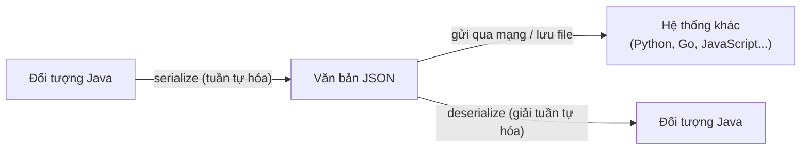

# Giới thiệu JSON

**JSON** (JavaScript Object Notation — định dạng dữ liệu dạng văn bản nhẹ, dễ đọc) là một tiêu chuẩn trao đổi dữ liệu phổ biến nhất hiện nay. Mặc dù tên gọi xuất phát từ JavaScript, JSON hoàn toàn độc lập với ngôn ngữ lập trình và được hỗ trợ rộng rãi bởi Java, Python, Go, C#, và hầu hết mọi nền tảng.

Sơ đồ dưới đây minh họa vai trò của JSON như một định dạng trung gian giúp các hệ thống viết bằng ngôn ngữ khác nhau trao đổi dữ liệu với nhau:



Nhìn sơ đồ: dữ liệu trong bộ nhớ được chuyển thành văn bản JSON để truyền đi, và bất kỳ nền tảng nào cũng có thể đọc ngược văn bản đó về cấu trúc dữ liệu của mình.

---

## 1. Tại sao dùng JSON?

- **Nhẹ và ngắn gọn**: kích thước nhỏ hơn XML đáng kể.
- **Dễ đọc bởi con người**: cú pháp rõ ràng, trực quan.
- **Dễ phân tích bởi máy**: nhiều thư viện hỗ trợ sẵn.
- **Phổ biến trong REST API**: hầu hết API hiện đại trả về JSON.

---

## 2. Cấu trúc JSON

JSON chỉ có hai kiểu cấu trúc chính:

| Kiểu | Mô tả | Ký hiệu |
|------|-------|---------|
| **Object** (đối tượng) | Tập hợp các cặp key-value | `{ }` |
| **Array** (mảng) | Danh sách các giá trị theo thứ tự | `[ ]` |

### Các kiểu giá trị hợp lệ trong JSON

- `string` (chuỗi) — phải dùng dấu nháy kép `""`
- `number` (số) — nguyên hoặc thực
- `boolean` — `true` hoặc `false`
- `null` — giá trị rỗng
- `object` — đối tượng lồng nhau
- `array` — mảng lồng nhau

### Ví dụ JSON mô tả một người dùng

```json
{
  "id": 1,
  "hoTen": "Nguyễn Văn An",
  "email": "an.nguyen@example.com",
  "tuoi": 28,
  "daKichHoat": true,
  "diaChi": {
    "thanhPho": "Hà Nội",
    "quocGia": "Việt Nam"
  },
  "soThich": ["lập trình", "đọc sách", "chạy bộ"]
}
```

---

## 3. Quy tắc cú pháp JSON

- **Key** (khóa) luôn là chuỗi trong dấu nháy kép.
- **Value** (giá trị) là một trong các kiểu hợp lệ ở trên.
- Các cặp key-value ngăn cách nhau bằng dấu phẩy `,`.
- **Không cho phép** comment (`//` hay `/* */`) trong JSON chuẩn.
- **Không cho phép** dấu phẩy thừa ở cuối (trailing comma).

---

## 4. JSON trong Java

Java **không có** hỗ trợ JSON sẵn trong thư viện chuẩn (`java.lang`, `java.util`). Chúng ta cần dùng thư viện bên thứ ba. Hai lựa chọn phổ biến nhất là:

| Thư viện | Nhà phát triển | Đặc điểm nổi bật |
|----------|---------------|-----------------|
| **Gson** | Google | Đơn giản, dễ học |
| **Jackson** | FasterXML | Hiệu năng cao, nhiều tính năng |

### Ví dụ: đọc JSON thủ công với `org.json`

Nếu chỉ cần đọc một đoạn JSON đơn giản mà không muốn tạo lớp Java tương ứng, có thể dùng thư viện `org.json`:

```xml
<!-- Maven dependency -->
<dependency>
    <groupId>org.json</groupId>
    <artifactId>json</artifactId>
    <version>20231013</version>
</dependency>
```

```java
import org.json.JSONObject;
import org.json.JSONArray;

public class DocJsonDonGian {
    public static void main(String[] args) {
        String jsonChuoi = "{\"id\": 1, \"hoTen\": \"Nguyễn Văn An\", \"soThich\": [\"lập trình\", \"đọc sách\"]}";

        // Phân tích chuỗi JSON thành JSONObject
        JSONObject obj = new JSONObject(jsonChuoi);

        int id = obj.getInt("id");                 // Lấy giá trị kiểu int
        String hoTen = obj.getString("hoTen");     // Lấy giá trị kiểu String
        JSONArray soThich = obj.getJSONArray("soThich"); // Lấy mảng JSON

        System.out.println("ID: " + id);
        System.out.println("Họ tên: " + hoTen);
        System.out.println("Sở thích đầu tiên: " + soThich.getString(0));
    }
}
```

Kết quả:

```
ID: 1
Họ tên: Nguyễn Văn An
Sở thích đầu tiên: lập trình
```

---

## 5. So sánh JSON và XML

**XML** (eXtensible Markup Language — ngôn ngữ đánh dấu mở rộng) từng là chuẩn trao đổi dữ liệu chủ yếu trước khi JSON phổ biến.

```xml
<!-- XML: dài dòng hơn -->
<nguoiDung>
    <id>1</id>
    <hoTen>Nguyễn Văn An</hoTen>
    <tuoi>28</tuoi>
</nguoiDung>
```

```json
// JSON: ngắn gọn hơn
{
  "id": 1,
  "hoTen": "Nguyễn Văn An",
  "tuoi": 28
}
```

JSON thường được ưu tiên cho REST API vì nhỏ gọn và dễ xử lý hơn. XML vẫn được dùng trong các hệ thống doanh nghiệp cũ hoặc các giao thức như SOAP.

---

## 6. Tổng kết

JSON là định dạng trao đổi dữ liệu nền tảng trong phát triển phần mềm hiện đại. Trong các bài tiếp theo, chúng ta sẽ học cách làm việc với JSON trong Java bằng thư viện **Gson** (Google) và **Jackson** (FasterXML) — hai thư viện mạnh mẽ nhất trong hệ sinh thái Java.
