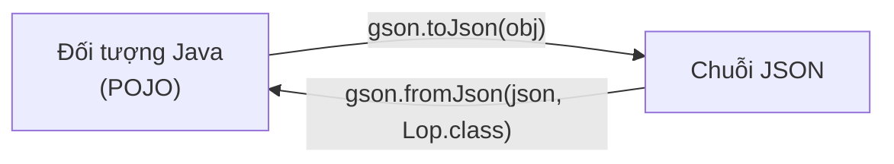

# Hướng dẫn sử dụng thư viện Gson

**Gson** là thư viện Java mã nguồn mở do Google phát triển, giúp chuyển đổi đối tượng Java sang chuỗi JSON (**serialization** — tuần tự hóa) và ngược lại (**deserialization** — giải tuần tự hóa) một cách đơn giản và nhanh chóng.

Sơ đồ sau tóm tắt hai chiều chuyển đổi chính mà Gson thực hiện, xoay quanh đối tượng `Gson`:



Chiều `toJson` biến đối tượng thành chuỗi JSON để lưu hoặc gửi đi; chiều `fromJson` dựng lại đối tượng Java từ chuỗi JSON nhận được.

:::note[Ghi nhớ nhanh]

- ⭐ **`Gson` chuyển đổi hai chiều** — `gson.toJson(obj)` (Java → JSON) và `gson.fromJson(json, Lop.class)` (JSON → Java).
- **POJO cần constructor không tham số** để Gson có thể tạo đối tượng khi deserialize.
- ⭐ **Với `List` generic dùng `TypeToken`** — để vượt qua type erasure và giữ thông tin kiểu phần tử tại runtime.
- **Mặc định bỏ qua trường null** — bật `serializeNulls()` nếu muốn giữ lại.
- **`GsonBuilder().setPrettyPrinting()`** — để in JSON có định dạng đẹp.

:::

---

## 1. Thêm Gson vào dự án

### Maven

```xml
<dependency>
    <groupId>com.google.code.gson</groupId>
    <artifactId>gson</artifactId>
    <version>2.10.1</version>
</dependency>
```

### Gradle

```groovy
implementation 'com.google.code.gson:gson:2.10.1'
```

---

## 2. Chuẩn bị lớp Java (POJO)

**POJO** (Plain Old Java Object — đối tượng Java thuần túy) là lớp Java đơn giản chỉ chứa thuộc tính và getter/setter, không kế thừa framework đặc biệt nào.

```java
public class NguoiDung {
    private int id;
    private String hoTen;
    private String email;
    private int tuoi;

    // Constructor không tham số — bắt buộc để Gson có thể tạo đối tượng
    public NguoiDung() {}

    public NguoiDung(int id, String hoTen, String email, int tuoi) {
        this.id = id;
        this.hoTen = hoTen;
        this.email = email;
        this.tuoi = tuoi;
    }

    // Getters và setters
    public int getId() { return id; }
    public void setId(int id) { this.id = id; }

    public String getHoTen() { return hoTen; }
    public void setHoTen(String hoTen) { this.hoTen = hoTen; }

    public String getEmail() { return email; }
    public void setEmail(String email) { this.email = email; }

    public int getTuoi() { return tuoi; }
    public void setTuoi(int tuoi) { this.tuoi = tuoi; }

    @Override
    public String toString() {
        return "NguoiDung{id=" + id + ", hoTen='" + hoTen + "', email='" + email + "', tuoi=" + tuoi + "}";
    }
}
```

---

## 3. Serialization — Chuyển đối tượng Java sang JSON

```java
import com.google.gson.Gson;
import com.google.gson.GsonBuilder;

public class VíDuSerialization {
    public static void main(String[] args) {
        NguoiDung nguoiDung = new NguoiDung(1, "Trần Thị Bích", "bich.tran@example.com", 25);

        // Tạo instance Gson
        Gson gson = new Gson();

        // Chuyển đối tượng Java → chuỗi JSON
        String json = gson.toJson(nguoiDung);
        System.out.println("JSON (compact): " + json);

        // Tạo Gson với định dạng đẹp (pretty print)
        Gson gsonDep = new GsonBuilder().setPrettyPrinting().create();
        String jsonDep = gsonDep.toJson(nguoiDung);
        System.out.println("JSON (pretty):\n" + jsonDep);
    }
}
```

Kết quả:

```
JSON (compact): {"id":1,"hoTen":"Trần Thị Bích","email":"bich.tran@example.com","tuoi":25}
JSON (pretty):
{
  "id": 1,
  "hoTen": "Trần Thị Bích",
  "email": "bich.tran@example.com",
  "tuoi": 25
}
```

---

## 4. Deserialization — Chuyển chuỗi JSON sang đối tượng Java

```java
public class VíDuDeserialization {
    public static void main(String[] args) {
        String json = "{\"id\":2,\"hoTen\":\"Lê Văn Cường\",\"email\":\"cuong.le@example.com\",\"tuoi\":30}";

        Gson gson = new Gson();

        // Chuyển chuỗi JSON → đối tượng Java
        NguoiDung nguoiDung = gson.fromJson(json, NguoiDung.class);

        System.out.println("Họ tên: " + nguoiDung.getHoTen());
        System.out.println("Email: " + nguoiDung.getEmail());
        System.out.println("Tuổi: " + nguoiDung.getTuoi());
    }
}
```

Kết quả:

```
Họ tên: Lê Văn Cường
Email: cuong.le@example.com
Tuổi: 30
```

---

## 5. Làm việc với List và mảng

```java
import com.google.gson.Gson;
import com.google.gson.reflect.TypeToken;
import java.lang.reflect.Type;
import java.util.Arrays;
import java.util.List;

public class VíDuDanhSach {
    public static void main(String[] args) {
        Gson gson = new Gson();

        // Danh sách → JSON
        List`<NguoiDung>` danhSach = Arrays.asList(
            new NguoiDung(1, "An", "an@example.com", 22),
            new NguoiDung(2, "Bình", "binh@example.com", 27)
        );
        String json = gson.toJson(danhSach);
        System.out.println("JSON danh sách:\n" + json);

        // JSON → Danh sách
        // TypeToken dùng để truyền thông tin kiểu generic (List<NguoiDung>) vào Gson
        Type loaiDanhSach = new TypeToken`<List<NguoiDung>>`(){}.getType();
        List`<NguoiDung>` danhSachPhucHoi = gson.fromJson(json, loaiDanhSach);
        danhSachPhucHoi.forEach(nd -> System.out.println(nd.getHoTen()));
    }
}
```

> **Lưu ý**: `TypeToken` là lớp của Gson giúp lưu thông tin kiểu generic tại runtime. Do **type erasure** (xóa kiểu generic khi biên dịch) trong Java, Gson cần `TypeToken` để biết chính xác kiểu phần tử bên trong `List`.

---

## 6. Xử lý giá trị null

```java
public class VíDuNull {
    public static void main(String[] args) {
        NguoiDung nguoiDung = new NguoiDung(3, "Duy", null, 20); // email = null

        // Mặc định: Gson bỏ qua các trường null khi serialize
        Gson gsonMacDinh = new Gson();
        System.out.println(gsonMacDinh.toJson(nguoiDung));
        // {"id":3,"hoTen":"Duy","tuoi":20}  ← không có "email"

        // Cấu hình giữ lại trường null
        Gson gsonGiuNull = new GsonBuilder().serializeNulls().create();
        System.out.println(gsonGiuNull.toJson(nguoiDung));
        // {"id":3,"hoTen":"Duy","email":null,"tuoi":20}
    }
}
```

---

## 7. Tổng kết

| Tác vụ | Phương thức Gson |
|--------|-----------------|
| Đối tượng → JSON | `gson.toJson(obj)` |
| JSON → Đối tượng | `gson.fromJson(json, Lop.class)` |
| JSON → `List` generic | `gson.fromJson(json, new TypeToken<>(){}.getType())` |
| JSON đẹp (pretty) | `new GsonBuilder().setPrettyPrinting().create()` |
| Giữ lại trường null | `new GsonBuilder().serializeNulls().create()` |

Gson phù hợp cho các dự án vừa và nhỏ, ưu tiên sự đơn giản. Với dự án lớn cần hiệu năng cao hoặc cấu hình phức tạp, hãy xem xét **Jackson** ở bài sau.
