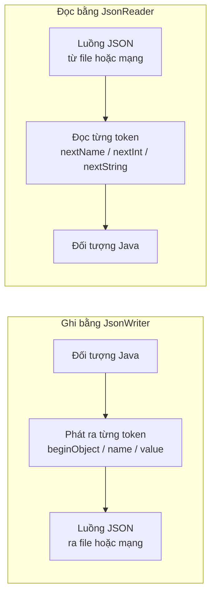
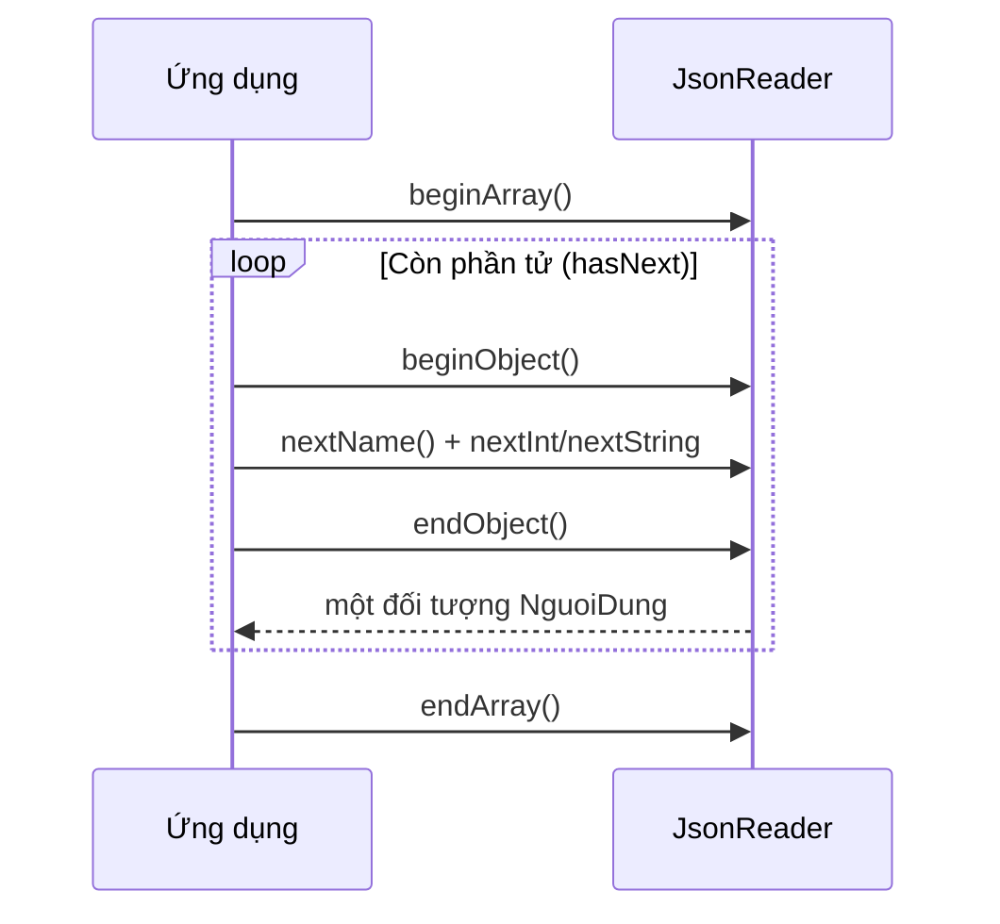

# Hướng dẫn Gson Streaming API để đọc và ghi JSON

**Gson Streaming API** là cơ chế xử lý JSON theo luồng (stream), cho phép đọc và ghi từng token JSON một mà không cần nạp toàn bộ tài liệu vào bộ nhớ. Phương pháp này đặc biệt hiệu quả khi xử lý file JSON lớn hoặc dữ liệu đến theo luồng liên tục.

Hai lớp chính của Streaming API:
- **`JsonReader`** — đọc JSON theo từng token
- **`JsonWriter`** — ghi JSON theo từng token

Sơ đồ dưới đây cho thấy hai luồng xử lý theo token: một chiều ghi đối tượng ra luồng JSON và một chiều đọc luồng JSON dựng lại đối tượng, tất cả đều không nạp toàn bộ tài liệu vào bộ nhớ:



Điểm mấu chốt: dữ liệu chảy qua từng token nhỏ nên bộ nhớ tiêu thụ gần như không đổi dù file JSON lớn tới đâu.

:::note[Ghi nhớ nhanh]

- ⭐ **Streaming API xử lý JSON theo từng token** — bộ nhớ tiêu thụ gần như không đổi dù file lớn tới đâu.
- **Hai lớp chính**: `JsonWriter` ghi token (`beginObject`, `name`, `value`) và `JsonReader` đọc token (`nextName`, `nextInt`, `nextString`).
- **Xử lý null và trường lạ** — dùng `peek()` kiểm tra token `NULL` trước khi đọc, `skipValue()` bỏ qua trường không cần.
- ⭐ **So với DOM (`Gson.fromJson()`)** — tốn ít bộ nhớ hơn nhưng code phải xử lý thủ công nên phức tạp hơn.
- **Phù hợp** — file JSON lớn (log, export), thiết bị IoT/embedded, network stream liên tục.

:::

---

## 1. Maven Dependency

```xml
<dependency>
    <groupId>com.google.code.gson</groupId>
    <artifactId>gson</artifactId>
    <version>2.10.1</version>
</dependency>
```

---

## 2. Ghi JSON với JsonWriter

**`JsonWriter`** là lớp ghi JSON theo luồng — mỗi lời gọi phương thức tương ứng với một token JSON được ghi ra.

```java
import com.google.gson.stream.JsonWriter;
import java.io.FileWriter;
import java.io.IOException;

public class VíDuGhiJson {
    public static void main(String[] args) throws IOException {
        // FileWriter mở file để ghi; JsonWriter bọc ngoài để ghi định dạng JSON
        try (JsonWriter writer = new JsonWriter(new FileWriter("nguoi-dung.json"))) {
            writer.setIndent("  "); // Thiết lập thụt đầu dòng 2 khoảng trắng (pretty print)

            writer.beginArray(); // Bắt đầu mảng JSON: [

            // Phần tử 1
            writer.beginObject();           // {
            writer.name("id").value(1);     // "id": 1
            writer.name("hoTen").value("Nguyễn An");
            writer.name("email").value("an@example.com");
            writer.name("tuoi").value(22);
            writer.name("daKichHoat").value(true);
            writer.endObject();             // }

            // Phần tử 2
            writer.beginObject();
            writer.name("id").value(2);
            writer.name("hoTen").value("Trần Bình");
            writer.name("email").value("binh@example.com");
            writer.name("tuoi").value(27);
            writer.name("daKichHoat").value(false);
            writer.endObject();

            writer.endArray(); // Kết thúc mảng JSON: ]
        }
        System.out.println("Đã ghi file nguoi-dung.json thành công!");
    }
}
```

File `nguoi-dung.json` sinh ra:

```json
[
  {
    "id": 1,
    "hoTen": "Nguyễn An",
    "email": "an@example.com",
    "tuoi": 22,
    "daKichHoat": true
  },
  {
    "id": 2,
    "hoTen": "Trần Bình",
    "email": "binh@example.com",
    "tuoi": 27,
    "daKichHoat": false
  }
]
```

---

## 3. Đọc JSON với JsonReader

**`JsonReader`** đọc JSON theo từng **token** (đơn vị nhỏ nhất). Các token có thể là: `BEGIN_ARRAY`, `END_ARRAY`, `BEGIN_OBJECT`, `END_OBJECT`, `NAME` (tên key), `STRING`, `NUMBER`, `BOOLEAN`, `NULL`.

Sơ đồ tuần tự sau minh họa vòng lặp đọc một mảng đối tượng: ứng dụng liên tục hỏi `JsonReader` token kế tiếp cho tới khi hết mảng:



Đọc sơ đồ: mỗi vòng lặp dựng lại một đối tượng từ các token bên trong `{ }`, và vòng lặp dừng khi `hasNext()` báo hết phần tử.

```java
import com.google.gson.stream.JsonReader;
import com.google.gson.stream.JsonToken;
import java.io.FileReader;
import java.io.IOException;
import java.util.ArrayList;
import java.util.List;

public class NguoiDung {
    public int id;
    public String hoTen;
    public String email;
    public int tuoi;
    public boolean daKichHoat;
}

public class VíDuDocJson {
    public static void main(String[] args) throws IOException {
        List`<NguoiDung>` danhSach = new ArrayList<>();

        try (JsonReader reader = new JsonReader(new FileReader("nguoi-dung.json"))) {
            reader.beginArray(); // Bắt đầu đọc mảng

            while (reader.hasNext()) { // Còn phần tử trong mảng
                NguoiDung nd = docMotNguoiDung(reader);
                danhSach.add(nd);
            }

            reader.endArray(); // Kết thúc mảng
        }

        danhSach.forEach(nd ->
            System.out.println(nd.id + " - " + nd.hoTen + " (" + nd.email + ")"));
    }

    private static NguoiDung docMotNguoiDung(JsonReader reader) throws IOException {
        NguoiDung nd = new NguoiDung();
        reader.beginObject(); // Bắt đầu đọc object {

        while (reader.hasNext()) {
            String tenTruong = reader.nextName(); // Đọc tên key

            switch (tenTruong) {
                case "id"         -> nd.id = reader.nextInt();
                case "hoTen"      -> nd.hoTen = reader.nextString();
                case "email"      -> nd.email = reader.nextString();
                case "tuoi"       -> nd.tuoi = reader.nextInt();
                case "daKichHoat" -> nd.daKichHoat = reader.nextBoolean();
                default           -> reader.skipValue(); // Bỏ qua trường không cần
            }
        }

        reader.endObject(); // Kết thúc object }
        return nd;
    }
}
```

Kết quả:

```
1 - Nguyễn An (an@example.com)
2 - Trần Bình (binh@example.com)
```

---

## 4. Xử lý giá trị null trong Streaming API

Khi đọc JSON có thể chứa `null`, cần kiểm tra token trước khi đọc giá trị:

```java
private static String docChuoiCoNull(JsonReader reader) throws IOException {
    // peek() xem trước token tiếp theo mà không tiêu thụ nó
    if (reader.peek() == JsonToken.NULL) {
        reader.nextNull(); // Phải tiêu thụ token null
        return null;
    }
    return reader.nextString();
}
```

---

## 5. So sánh Streaming API với DOM API

**DOM API** (Document Object Model — mô hình đối tượng tài liệu) là cách đọc toàn bộ JSON vào bộ nhớ dưới dạng cây đối tượng (dùng `Gson.fromJson()`).

| Tiêu chí | Streaming API (`JsonReader`/`JsonWriter`) | DOM API (`Gson.fromJson()`) |
|----------|------------------------------------------|-----------------------------|
| Bộ nhớ | Thấp — xử lý từng token | Cao — nạp toàn bộ vào RAM |
| Tốc độ | Nhanh với file lớn | Chậm hơn với file lớn |
| Độ phức tạp code | Cao — phải xử lý thủ công | Thấp — tự động ánh xạ |
| Phù hợp khi | File JSON lớn (vài MB trở lên) | File JSON nhỏ, cần đơn giản |

---

## 6. Tổng kết

Gson Streaming API phù hợp cho:
- Xử lý file JSON dung lượng lớn (log, export dữ liệu).
- Ứng dụng cần tiêu thụ ít bộ nhớ (IoT, embedded).
- Đọc/ghi JSON từ network stream liên tục.

Với dữ liệu nhỏ và cần code đơn giản hơn, hãy dùng `Gson.fromJson()` / `Gson.toJson()` thông thường.
