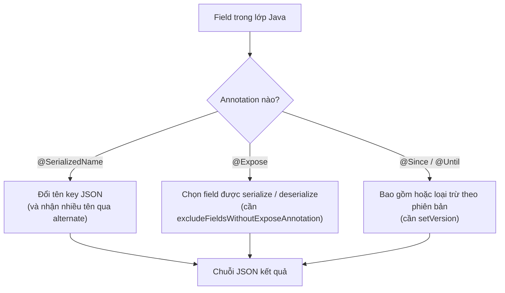

# Hướng dẫn sử dụng Gson Annotations

**Gson Annotations** (chú thích Gson) là các annotation (chú thích — siêu dữ liệu gắn lên class/field trong Java) do Gson cung cấp, giúp kiểm soát quá trình serialization và deserialization mà không cần viết code tùy chỉnh phức tạp.

Sơ đồ sau tóm tắt vai trò của bốn annotation chính, tất cả cùng tác động lên bước ánh xạ giữa field Java và key JSON:



Đọc sơ đồ: mỗi field đi qua các annotation để quyết định tên, có xuất hiện hay không, và thuộc phiên bản nào trước khi tạo ra chuỗi JSON cuối cùng.

:::note[Ghi nhớ nhanh]

- ⭐ **`@SerializedName`** — đổi tên key JSON, hỗ trợ `alternate` để chấp nhận nhiều tên khi đọc vào.
- ⭐ **`@Expose`** — kiểm soát field được serialize/deserialize, phải bật `excludeFieldsWithoutExposeAnnotation()` mới có hiệu lực.
- **`@Since` / `@Until`** — bao gồm hoặc loại trừ field theo phiên bản, cần dùng kèm `setVersion()`.
- **Lợi ích** — giảm code boilerplate và tách cấu hình ánh xạ JSON khỏi logic nghiệp vụ.

:::

---

## 1. Maven Dependency

```xml
<dependency>
    <groupId>com.google.code.gson</groupId>
    <artifactId>gson</artifactId>
    <version>2.10.1</version>
</dependency>
```

---

## 2. `@SerializedName` — Đổi tên trường JSON

Mặc định Gson dùng chính xác tên field Java làm key JSON. Dùng `@SerializedName` khi tên JSON và tên Java cần khác nhau (ví dụ: API trả về `first_name` nhưng Java dùng `tenDem`).

```java
import com.google.gson.annotations.SerializedName;

public class NguoiDung {
    @SerializedName("user_id")       // Key JSON sẽ là "user_id"
    private int id;

    @SerializedName("full_name")     // Key JSON sẽ là "full_name"
    private String hoTen;

    @SerializedName(value = "email_address",
                    alternate = {"email", "mail"}) // Chấp nhận nhiều tên khi đọc vào
    private String email;

    public NguoiDung(int id, String hoTen, String email) {
        this.id = id;
        this.hoTen = hoTen;
        this.email = email;
    }

    @Override
    public String toString() {
        return "NguoiDung{id=" + id + ", hoTen=" + hoTen + ", email=" + email + "}";
    }
}
```

```java
import com.google.gson.Gson;
import com.google.gson.GsonBuilder;

public class VíDuSerializedName {
    public static void main(String[] args) {
        Gson gson = new GsonBuilder().setPrettyPrinting().create();

        NguoiDung nd = new NguoiDung(1, "Phạm Thị Lan", "lan@example.com");

        // Serialize: field Java → key JSON theo @SerializedName
        String json = gson.toJson(nd);
        System.out.println("JSON:\n" + json);

        // Deserialize: tên alternate "email" cũng được chấp nhận
        String jsonNhap = "{\"user_id\": 2, \"full_name\": \"Hoàng Minh\", \"email\": \"minh@example.com\"}";
        NguoiDung ndPhucHoi = gson.fromJson(jsonNhap, NguoiDung.class);
        System.out.println("Đọc lại: " + ndPhucHoi);
    }
}
```

Kết quả:

```
JSON:
{
  "user_id": 1,
  "full_name": "Phạm Thị Lan",
  "email_address": "lan@example.com"
}
Đọc lại: NguoiDung{id=2, hoTen=Hoàng Minh, email=minh@example.com}
```

---

## 3. `@Expose` — Kiểm soát trường nào được xử lý

`@Expose` đánh dấu trường nào được phép serialize/deserialize. Phải dùng kết hợp với `GsonBuilder.excludeFieldsWithoutExposeAnnotation()` để kích hoạt.

```java
import com.google.gson.annotations.Expose;

public class TaiKhoan {
    @Expose                                    // Cho phép cả đọc và ghi
    private int id;

    @Expose                                    // Cho phép cả đọc và ghi
    private String tenDangNhap;

    @Expose(serialize = false)                 // Chỉ cho phép đọc vào (không ghi ra JSON)
    private String matKhau;

    @Expose(serialize = true, deserialize = false)  // Chỉ ghi ra, không đọc vào
    private String token;

    // Trường này không có @Expose → bị bỏ qua hoàn toàn khi dùng excludeFieldsWithoutExposeAnnotation
    private String duLieuNoiBo;

    public TaiKhoan(int id, String tenDangNhap, String matKhau, String token) {
        this.id = id;
        this.tenDangNhap = tenDangNhap;
        this.matKhau = matKhau;
        this.token = token;
        this.duLieuNoiBo = "bí mật nội bộ";
    }
}
```

```java
public class VíDuExpose {
    public static void main(String[] args) {
        // Bắt buộc dùng excludeFieldsWithoutExposeAnnotation() để @Expose có hiệu lực
        Gson gson = new GsonBuilder()
                .excludeFieldsWithoutExposeAnnotation()
                .setPrettyPrinting()
                .create();

        TaiKhoan tk = new TaiKhoan(1, "admin", "mat_khau_bi_mat", "abc123token");
        String json = gson.toJson(tk);
        System.out.println("JSON (serialize):\n" + json);
        // matKhau bị ẩn (serialize=false), duLieuNoiBo bị ẩn (không có @Expose)
    }
}
```

Kết quả:

```
JSON (serialize):
{
  "id": 1,
  "tenDangNhap": "admin",
  "token": "abc123token"
}
```

---

## 4. `@Since` và `@Until` — Kiểm soát phiên bản

`@Since` (từ phiên bản) và `@Until` (đến phiên bản) cho phép bao gồm hoặc loại trừ trường theo số phiên bản API.

```java
import com.google.gson.annotations.Since;
import com.google.gson.annotations.Until;

public class SanPham {
    private int id;
    private String ten;

    @Since(1.0)              // Tồn tại từ phiên bản 1.0 trở đi
    private double gia;

    @Since(2.0)              // Chỉ tồn tại từ phiên bản 2.0 trở đi
    private String moTa;

    @Until(2.0)              // Chỉ tồn tại đến trước phiên bản 2.0
    private String truongCu;

    public SanPham(int id, String ten, double gia, String moTa, String truongCu) {
        this.id = id;
        this.ten = ten;
        this.gia = gia;
        this.moTa = moTa;
        this.truongCu = truongCu;
    }
}
```

```java
public class VíDuPhienBan {
    public static void main(String[] args) {
        SanPham sp = new SanPham(1, "Laptop", 15000000, "Laptop cao cấp", "giá_trị_cũ");
        Gson gson;

        // Dùng với phiên bản 1.5: có gia, không có moTa, có truongCu
        gson = new GsonBuilder().setVersion(1.5).setPrettyPrinting().create();
        System.out.println("Phiên bản 1.5:\n" + gson.toJson(sp));

        // Dùng với phiên bản 2.0: có gia, có moTa, không có truongCu
        gson = new GsonBuilder().setVersion(2.0).setPrettyPrinting().create();
        System.out.println("Phiên bản 2.0:\n" + gson.toJson(sp));
    }
}
```

---

## 5. Tổng kết các Annotation Gson

| Annotation | Mục đích | Lưu ý |
|------------|---------|-------|
| `@SerializedName` | Đổi tên key JSON | Hỗ trợ `alternate` để nhận nhiều tên |
| `@Expose` | Kiểm soát serialize/deserialize từng trường | Cần bật `excludeFieldsWithoutExposeAnnotation()` |
| `@Since(version)` | Bao gồm trường từ phiên bản chỉ định | Cần dùng `setVersion()` |
| `@Until(version)` | Loại trừ trường từ phiên bản chỉ định | Cần dùng `setVersion()` |

Annotations giúp giảm code boilerplate (code lặp lại, nhàm chán) và tách biệt cấu hình ánh xạ JSON ra khỏi logic nghiệp vụ.
