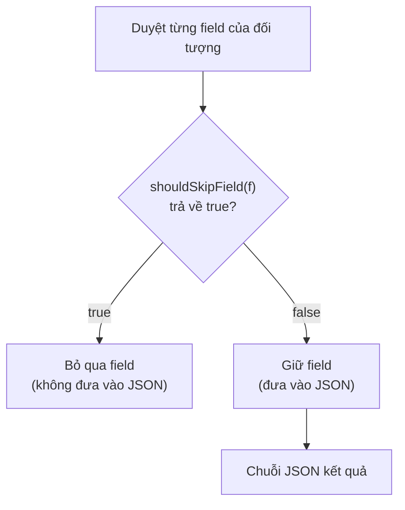

# Hướng dẫn sử dụng Gson ExclusionStrategy

**`ExclusionStrategy`** (chiến lược loại trừ) là interface trong Gson cho phép định nghĩa quy tắc linh hoạt để loại trừ các field hoặc class khỏi quá trình serialize/deserialize. Đây là giải pháp mạnh hơn `@Expose` khi cần logic loại trừ phức tạp hoặc không muốn sửa code lớp gốc.

Sơ đồ dưới đây cho thấy Gson hỏi `ExclusionStrategy` với từng field trước khi ghi ra JSON: field nào bị đánh dấu loại trừ sẽ không xuất hiện trong kết quả:



Đọc sơ đồ: quyết định giữ hay bỏ mỗi field do phương thức `shouldSkipField` (hoặc `shouldSkipClass` cho cả lớp) chi phối, cho phép áp dụng logic tùy ý theo tên, kiểu, hay annotation.

---

## 1. Maven Dependency

```xml
<dependency>
    <groupId>com.google.code.gson</groupId>
    <artifactId>gson</artifactId>
    <version>2.10.1</version>
</dependency>
```

---

## 2. Interface ExclusionStrategy

```java
public interface ExclusionStrategy {
    // Trả về true nếu muốn BỎ QUA field này
    boolean shouldSkipField(FieldAttributes f);

    // Trả về true nếu muốn BỎ QUA toàn bộ class này
    boolean shouldSkipClass(Class<?> clazz);
}
```

---

## 3. Loại trừ theo tên field

```java
import com.google.gson.*;

public class LoaiTruTheoTenTruong implements ExclusionStrategy {

    private final String[] tenTruongCanLoai;

    public LoaiTruTheoTenTruong(String... tenTruong) {
        this.tenTruongCanLoai = tenTruong;
    }

    @Override
    public boolean shouldSkipField(FieldAttributes f) {
        for (String ten : tenTruongCanLoai) {
            if (f.getName().equals(ten)) {
                return true; // Bỏ qua trường này
            }
        }
        return false;
    }

    @Override
    public boolean shouldSkipClass(Class<?> clazz) {
        return false; // Không loại trừ class nào
    }
}
```

```java
public class TaiKhoan {
    private int id;
    private String tenDangNhap;
    private String matKhau;      // Cần ẩn
    private String soTheDienThoai; // Cần ẩn
    private String email;

    public TaiKhoan(int id, String tenDangNhap, String matKhau, String soTheDienThoai, String email) {
        this.id = id;
        this.tenDangNhap = tenDangNhap;
        this.matKhau = matKhau;
        this.soTheDienThoai = soTheDienThoai;
        this.email = email;
    }
}

public class VíDuLoaiTruTheoTen {
    public static void main(String[] args) {
        Gson gson = new GsonBuilder()
                .addSerializationExclusionStrategy(
                    new LoaiTruTheoTenTruong("matKhau", "soTheDienThoai")
                )
                .setPrettyPrinting()
                .create();

        TaiKhoan tk = new TaiKhoan(1, "admin", "secret123", "0912345678", "admin@example.com");
        System.out.println(gson.toJson(tk));
    }
}
```

Kết quả:

```json
{
  "id": 1,
  "tenDangNhap": "admin",
  "email": "admin@example.com"
}
```

---

## 4. Loại trừ theo kiểu dữ liệu của field

```java
import com.google.gson.*;
import java.util.List;

public class LoaiTruKieuDuLieu implements ExclusionStrategy {

    @Override
    public boolean shouldSkipField(FieldAttributes f) {
        // Bỏ qua tất cả trường có kiểu List
        return f.getDeclaredType() == List.class ||
               List.class.isAssignableFrom(f.getDeclaredClass());
    }

    @Override
    public boolean shouldSkipClass(Class<?> clazz) {
        return false;
    }
}
```

---

## 5. Loại trừ theo annotation tùy chỉnh

Cách hay nhất để đánh dấu field cần loại trừ mà không phụ thuộc vào Gson là tạo annotation của riêng mình:

```java
import java.lang.annotation.ElementType;
import java.lang.annotation.Retention;
import java.lang.annotation.RetentionPolicy;
import java.lang.annotation.Target;

// Định nghĩa annotation @AnSerialization
@Retention(RetentionPolicy.RUNTIME)  // Annotation tồn tại lúc runtime
@Target(ElementType.FIELD)           // Chỉ áp dụng cho field
public @interface AnSerialization {
    String lyDo() default "Thông tin nhạy cảm";
}
```

```java
public class NguoiDung {
    private int id;
    private String hoTen;

    @AnSerialization(lyDo = "Thông tin cá nhân nhạy cảm")
    private String soCCCD;

    @AnSerialization
    private String ngaySinh;

    private String email;

    public NguoiDung(int id, String hoTen, String soCCCD, String ngaySinh, String email) {
        this.id = id;
        this.hoTen = hoTen;
        this.soCCCD = soCCCD;
        this.ngaySinh = ngaySinh;
        this.email = email;
    }
}
```

```java
public class LoaiTruTheoAnnotation implements ExclusionStrategy {

    @Override
    public boolean shouldSkipField(FieldAttributes f) {
        // Bỏ qua nếu field được đánh dấu @AnSerialization
        return f.getAnnotation(AnSerialization.class) != null;
    }

    @Override
    public boolean shouldSkipClass(Class<?> clazz) {
        return false;
    }
}

public class VíDuAnnotationTuyChinh {
    public static void main(String[] args) {
        Gson gson = new GsonBuilder()
                .addSerializationExclusionStrategy(new LoaiTruTheoAnnotation())
                .setPrettyPrinting()
                .create();

        NguoiDung nd = new NguoiDung(1, "Lê Thị Mai", "012345678901", "1995-03-15", "mai@example.com");
        System.out.println(gson.toJson(nd));
    }
}
```

Kết quả:

```json
{
  "id": 1,
  "hoTen": "Lê Thị Mai",
  "email": "mai@example.com"
}
```

---

## 6. Áp dụng cho serialize, deserialize, hoặc cả hai

```java
Gson gson = new GsonBuilder()
        // Chỉ áp dụng khi serialize (ghi ra JSON)
        .addSerializationExclusionStrategy(new LoaiTruTheoAnnotation())

        // Chỉ áp dụng khi deserialize (đọc vào Java)
        .addDeserializationExclusionStrategy(new LoaiTruTheoTenTruong("truongTamThoi"))

        // Áp dụng cho cả hai chiều
        // Dùng: setExclusionStrategies(strategy1, strategy2, ...)
        .create();
```

---

## 7. So sánh với `@Expose`

| Tiêu chí | `@Expose` | `ExclusionStrategy` |
|----------|-----------|---------------------|
| Cách dùng | Gắn annotation lên từng field | Viết lớp implement interface |
| Sửa class gốc | Có | Không bắt buộc |
| Logic phức tạp | Không | Có — xử lý theo điều kiện bất kỳ |
| Phù hợp | Class đơn giản | Class ngoài thư viện, logic loại trừ động |

---

## 8. Tổng kết

`ExclusionStrategy` là công cụ linh hoạt khi cần kiểm soát chi tiết những gì được đưa vào JSON mà không muốn (hoặc không thể) sửa class gốc. Đặc biệt hữu ích khi tích hợp với các thư viện bên thứ ba hoặc khi quy tắc loại trừ phụ thuộc vào điều kiện runtime.
