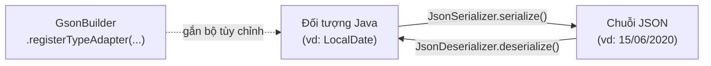

# Gson Custom Serialization và Deserialization

Đôi khi cơ chế mặc định của Gson không đáp ứng được yêu cầu: định dạng ngày tháng đặc biệt, kiểu dữ liệu phức tạp, hoặc cần xử lý JSON không chuẩn từ API bên ngoài. Lúc đó ta dùng **Custom Serializer** (bộ tuần tự hóa tùy chỉnh) và **Custom Deserializer** (bộ giải tuần tự hóa tùy chỉnh).

Sơ đồ sau minh họa cách hai bộ tùy chỉnh này được đăng ký qua `registerTypeAdapter` rồi xen vào đúng chiều chuyển đổi tương ứng:



Đọc sơ đồ: `JsonSerializer` kiểm soát chiều ghi ra JSON, `JsonDeserializer` kiểm soát chiều đọc vào Java, và cả hai chỉ có hiệu lực sau khi được đăng ký với `GsonBuilder`.

:::note[Ghi nhớ nhanh]

- ⭐ **`JsonSerializer<T>` (ghi ra JSON) và `JsonDeserializer<T>` (đọc vào Java)** — đăng ký qua `registerTypeAdapter()` mới có hiệu lực.
- **Hoạt động trên DOM** — thao tác với cây `JsonElement`, và Gson tự xử lý giá trị null.
- **Gộp gọn** — có thể implement cả hai interface trong một lớp để đăng ký một lần cho cả hai chiều.
- ⭐ **Khi nào dùng** — kiểu Gson không hỗ trợ sẵn (`LocalDate`...), JSON từ API không chuẩn, hoặc xử lý đa hình.

:::

---

## 1. Maven Dependency

```xml
<dependency>
    <groupId>com.google.code.gson</groupId>
    <artifactId>gson</artifactId>
    <version>2.10.1</version>
</dependency>
```

---

## 2. Custom Serializer — Tùy chỉnh ghi ra JSON

Implement interface `JsonSerializer<T>` để kiểm soát cách một đối tượng kiểu `T` được ghi ra JSON.

### Ví dụ: Định dạng ngày tháng theo chuẩn Việt Nam

```java
import com.google.gson.*;
import java.lang.reflect.Type;
import java.time.LocalDate;
import java.time.format.DateTimeFormatter;

// Custom Serializer cho LocalDate
public class LocalDateSerializer implements JsonSerializer`<LocalDate>` {

    private static final DateTimeFormatter DINH_DANG_VN = DateTimeFormatter.ofPattern("dd/MM/yyyy");

    @Override
    public JsonElement serialize(LocalDate src, Type typeOfSrc, JsonSerializationContext context) {
        // Chuyển LocalDate thành chuỗi dd/MM/yyyy rồi tạo JsonPrimitive (phần tử JSON đơn giản)
        return new JsonPrimitive(src.format(DINH_DANG_VN));
    }
}
```

```java
import java.time.LocalDate;

public class NhanVien {
    private int id;
    private String hoTen;
    private LocalDate ngayVaoLam;
    private double luong;

    public NhanVien(int id, String hoTen, LocalDate ngayVaoLam, double luong) {
        this.id = id;
        this.hoTen = hoTen;
        this.ngayVaoLam = ngayVaoLam;
        this.luong = luong;
    }
}

public class VíDuCustomSerializer {
    public static void main(String[] args) {
        // Đăng ký Custom Serializer với GsonBuilder
        Gson gson = new GsonBuilder()
                .registerTypeAdapter(LocalDate.class, new LocalDateSerializer())
                .setPrettyPrinting()
                .create();

        NhanVien nv = new NhanVien(1, "Võ Thành Đạt", LocalDate.of(2020, 6, 15), 18_000_000);
        System.out.println(gson.toJson(nv));
    }
}
```

Kết quả:

```json
{
  "id": 1,
  "hoTen": "Võ Thành Đạt",
  "ngayVaoLam": "15/06/2020",
  "luong": 1.8E7
}
```

---

## 3. Custom Deserializer — Tùy chỉnh đọc từ JSON

Implement interface `JsonDeserializer<T>` để kiểm soát cách chuỗi JSON được chuyển thành đối tượng kiểu `T`.

### Ví dụ: Đọc ngày tháng từ chuỗi dd/MM/yyyy

```java
import com.google.gson.*;
import java.lang.reflect.Type;
import java.time.LocalDate;
import java.time.format.DateTimeFormatter;

public class LocalDateDeserializer implements JsonDeserializer`<LocalDate>` {

    private static final DateTimeFormatter DINH_DANG_VN = DateTimeFormatter.ofPattern("dd/MM/yyyy");

    @Override
    public LocalDate deserialize(JsonElement json, Type typeOfT, JsonDeserializationContext context)
            throws JsonParseException {
        // json.getAsString() lấy giá trị chuỗi của JsonElement
        String chuoiNgay = json.getAsString();
        return LocalDate.parse(chuoiNgay, DINH_DANG_VN);
    }
}
```

```java
public class VíDuCustomDeserializer {
    public static void main(String[] args) {
        Gson gson = new GsonBuilder()
                .registerTypeAdapter(LocalDate.class, new LocalDateDeserializer())
                .create();

        String json = "{\"id\":2,\"hoTen\":\"Nguyễn Hải Yến\",\"ngayVaoLam\":\"20/08/2021\",\"luong\":22000000}";
        NhanVien nv = gson.fromJson(json, NhanVien.class);

        System.out.println("Họ tên: " + nv.getHoTen());
        System.out.println("Ngày vào làm: " + nv.getNgayVaoLam());
        System.out.println("Năm vào làm: " + nv.getNgayVaoLam().getYear());
    }
}
```

---

## 4. Kết hợp Serializer và Deserializer trong một lớp

Khi muốn gọn hơn, implement cả `JsonSerializer` và `JsonDeserializer` trong cùng một lớp:

```java
import com.google.gson.*;
import java.lang.reflect.Type;
import java.time.LocalDate;
import java.time.format.DateTimeFormatter;

public class LocalDateAdapter implements JsonSerializer`<LocalDate>`, JsonDeserializer`<LocalDate>` {

    private static final DateTimeFormatter DINH_DANG = DateTimeFormatter.ofPattern("dd/MM/yyyy");

    @Override
    public JsonElement serialize(LocalDate src, Type typeOfSrc, JsonSerializationContext context) {
        return new JsonPrimitive(src.format(DINH_DANG));
    }

    @Override
    public LocalDate deserialize(JsonElement json, Type typeOfT, JsonDeserializationContext context)
            throws JsonParseException {
        return LocalDate.parse(json.getAsString(), DINH_DANG);
    }
}

// Đăng ký một lần dùng được cả hai chiều
Gson gson = new GsonBuilder()
        .registerTypeAdapter(LocalDate.class, new LocalDateAdapter())
        .create();
```

---

## 5. Custom Deserializer cho cấu trúc JSON đặc biệt

Ví dụ: API trả về đối tượng hoặc thông báo lỗi trong cùng một trường:

```json
// Trường hợp thành công:
{"status": "ok", "data": {"id": 1, "ten": "Laptop"}}

// Trường hợp lỗi:
{"status": "error", "data": "Không tìm thấy sản phẩm"}
```

```java
import com.google.gson.*;
import java.lang.reflect.Type;

public class KetQuaDeserializer implements JsonDeserializer`<KetQua>` {

    @Override
    public KetQua deserialize(JsonElement json, Type typeOfT, JsonDeserializationContext context)
            throws JsonParseException {

        JsonObject obj = json.getAsJsonObject();
        String status = obj.get("status").getAsString();

        if ("ok".equals(status)) {
            JsonObject data = obj.getAsJsonObject("data");
            SanPham sp = context.deserialize(data, SanPham.class);
            return new KetQua(true, sp, null);
        } else {
            String loi = obj.get("data").getAsString();
            return new KetQua(false, null, loi);
        }
    }
}
```

---

## 6. Tổng kết

| Interface | Mục đích | Phương thức cần implement |
|-----------|---------|--------------------------|
| `JsonSerializer<T>` | Tùy chỉnh ghi đối tượng ra JSON | `serialize()` |
| `JsonDeserializer<T>` | Tùy chỉnh đọc JSON thành đối tượng | `deserialize()` |

**Khi nào dùng:**
- Kiểu dữ liệu Gson không hỗ trợ sẵn (`LocalDate`, `LocalDateTime`, `Money`...).
- Định dạng JSON từ API bên ngoài không theo quy chuẩn thông thường.
- Cần xử lý đa hình (polymorphism — một trường JSON có thể chứa nhiều kiểu khác nhau).

Để xử lý hiệu quả hơn cho các kiểu phức tạp, xem bài **Gson TypeAdapter** tiếp theo.
