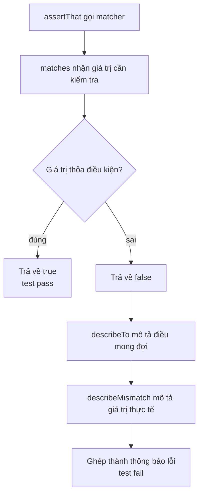

# JUnit — Custom Hamcrest Matchers

Hamcrest cho phép viết các câu lệnh assertion dễ đọc, nhưng đôi khi bạn cần kiểm tra những điều kiện đặc thù của nghiệp vụ. Custom Matcher giúp đóng gói logic kiểm tra phức tạp thành một matcher có tên rõ ràng, tái sử dụng được ở nhiều test thay vì lặp đi lặp lại. Bài này hướng dẫn ba cách tạo matcher tùy chỉnh (BaseMatcher, TypeSafeMatcher, FeatureMatcher) và cách tổ chức chúng gọn gàng.

:::note[Ghi nhớ nhanh]

- ⭐ **Custom matcher đóng gói logic kiểm tra đặc thù nghiệp vụ** — thành một matcher có tên rõ ràng, tái sử dụng được (vd `isValidOrder()`).
- **Ba cách tạo** — kế thừa `BaseMatcher`, `TypeSafeMatcher` (khuyên dùng, tự kiểm tra kiểu), hoặc `FeatureMatcher` (so khớp thuộc tính).
- **Phương thức cần implement** — `matches`/`matchesSafely` + `describeTo` (mô tả mong đợi) + `describeMismatch` (mô tả thực tế).
- **Tổ chức** — gom matcher vào package riêng, tạo factory method static gợi nhớ.

:::

## Tại sao cần Custom Matcher?

Hamcrest cung cấp nhiều matcher có sẵn, nhưng đôi khi bạn cần kiểm tra các điều kiện đặc thù của domain nghiệp vụ. **Custom Hamcrest Matcher** (matcher Hamcrest tùy chỉnh) cho phép bạn đóng gói logic kiểm tra phức tạp thành một matcher có tên gọi rõ ràng, tái sử dụng được ở nhiều test.

**Ví dụ vấn đề — không có custom matcher:**

```java
// Kiểm tra một Order hợp lệ — lặp đi lặp lại ở mọi test
assertThat(order.getId(), notNullValue());
assertThat(order.getStatus(), anyOf(is("PENDING"), is("CONFIRMED"), is("SHIPPED")));
assertThat(order.getTotalAmount(), greaterThan(BigDecimal.ZERO));
assertThat(order.getItems(), not(empty()));
// Nếu cần ở 10 test khác, phải copy paste 4 dòng trên
```

**Sau khi tạo custom matcher:**

```java
// Gọn gàng, rõ ràng, tái sử dụng được
assertThat(order, isValidOrder());
```

## Cách tạo Custom Matcher

### Cách 1: Kế thừa `BaseMatcher`

`BaseMatcher` là lớp trừu tượng cơ bản nhất, yêu cầu bạn implement hai phương thức:
- `matches(Object item)`: trả về `true` nếu đối tượng thỏa điều kiện.
- `describeTo(Description description)`: mô tả điều kiện mong đợi khi test fail.

Sơ đồ dưới mô tả luồng hoạt động của một custom matcher: vừa đánh giá giá trị, vừa dựng thông báo mô tả khi không khớp.



Đọc từ trên xuống: khi giá trị khớp, matcher dừng ngay ở nhánh `true`. Khi không khớp, hai phương thức `describeTo` và `describeMismatch` phối hợp để tạo ra thông báo lỗi dễ hiểu.

```java
import org.hamcrest.BaseMatcher;
import org.hamcrest.Description;
import org.hamcrest.Matcher;

// Matcher kiểm tra email hợp lệ
public class ValidEmailMatcher extends BaseMatcher<String> {

    private static final String EMAIL_REGEX = "^[\\w.-]+@[\\w.-]+\\.[a-zA-Z]{2,}$";

    @Override
    public boolean matches(Object item) {
        if (item == null) return false;
        return ((String) item).matches(EMAIL_REGEX);
    }

    @Override
    public void describeTo(Description description) {
        // Mô tả điều kiện mong đợi — xuất hiện trong thông báo lỗi
        description.appendText("một địa chỉ email hợp lệ (ví dụ: user@example.com)");
    }

    @Override
    public void describeMismatch(Object item, Description description) {
        // Mô tả lý do fail — tùy chọn, nhưng nên có
        description.appendText("nhận được ").appendValue(item)
                   .appendText(" không phải định dạng email hợp lệ");
    }

    // Factory method — quy ước Hamcrest
    public static Matcher<String> validEmail() {
        return new ValidEmailMatcher();
    }
}
```

```java
// Sử dụng
import static com.example.matchers.ValidEmailMatcher.validEmail;

public class UserTest {

    @Test
    public void testEmail_diaDiemHopLe_vuotQuaKiemTra() {
        assertThat("user@example.com", validEmail());
        assertThat("admin@company.org", validEmail());
    }

    @Test
    public void testEmail_diaDiemKhongHopLe_kiemTraThatBai() {
        assertThat("not-an-email", not(validEmail()));
        // Thông báo lỗi khi fail:
        // Expected: một địa chỉ email hợp lệ (ví dụ: user@example.com)
        //      but: nhận được "not-an-email" không phải định dạng email hợp lệ
    }
}
```

### Cách 2: Kế thừa `TypeSafeMatcher` (khuyên dùng)

`TypeSafeMatcher` tốt hơn `BaseMatcher` vì nó tự động kiểm tra kiểu — nếu đối tượng không đúng kiểu thì trả về `false` thay vì `ClassCastException`.

```java
import org.hamcrest.Description;
import org.hamcrest.TypeSafeMatcher;

// Matcher kiểm tra Order hợp lệ
public class ValidOrderMatcher extends TypeSafeMatcher<Order> {

    @Override
    protected boolean matchesSafely(Order order) {
        // matchesSafely chỉ được gọi khi item đúng kiểu Order
        return order.getId() != null
            && order.getTotalAmount().compareTo(BigDecimal.ZERO) > 0
            && !order.getItems().isEmpty()
            && isValidStatus(order.getStatus());
    }

    private boolean isValidStatus(String status) {
        return status != null && (
            status.equals("PENDING") ||
            status.equals("CONFIRMED") ||
            status.equals("SHIPPED") ||
            status.equals("DELIVERED")
        );
    }

    @Override
    public void describeTo(Description description) {
        description.appendText("một đơn hàng hợp lệ có id, tổng tiền > 0, ít nhất 1 sản phẩm và trạng thái hợp lệ");
    }

    @Override
    protected void describeMismatchSafely(Order order, Description description) {
        if (order.getId() == null) {
            description.appendText("id bị null");
        } else if (order.getTotalAmount().compareTo(BigDecimal.ZERO) <= 0) {
            description.appendText("tổng tiền <= 0: ").appendValue(order.getTotalAmount());
        } else if (order.getItems().isEmpty()) {
            description.appendText("danh sách sản phẩm trống");
        } else {
            description.appendText("trạng thái không hợp lệ: ").appendValue(order.getStatus());
        }
    }

    // Factory method với tên gợi nhớ
    public static TypeSafeMatcher<Order> isValidOrder() {
        return new ValidOrderMatcher();
    }
}
```

### Cách 3: Dùng `FeatureMatcher` — So khớp thuộc tính cụ thể

`FeatureMatcher` rất tiện khi bạn muốn áp dụng một matcher lên một thuộc tính của đối tượng:

```java
import org.hamcrest.FeatureMatcher;
import org.hamcrest.Matcher;
import static org.hamcrest.Matchers.*;

public class UserMatchers {

    // Matcher kiểm tra tên người dùng
    public static Matcher<User> hasName(Matcher<String> nameMatcher) {
        return new FeatureMatcher<User, String>(nameMatcher, "người dùng có tên", "tên") {
            @Override
            protected String featureValueOf(User user) {
                return user.getName(); // Trích xuất thuộc tính cần kiểm tra
            }
        };
    }

    // Matcher kiểm tra tuổi người dùng
    public static Matcher<User> hasAge(Matcher<Integer> ageMatcher) {
        return new FeatureMatcher<User, Integer>(ageMatcher, "người dùng có tuổi", "tuổi") {
            @Override
            protected Integer featureValueOf(User user) {
                return user.getAge();
            }
        };
    }
}
```

```java
// Sử dụng FeatureMatcher
import static com.example.matchers.UserMatchers.*;

public class UserRepositoryTest {

    @Test
    public void testFindUsers_tuKhoa_traVeDanhSachDung() {
        List<User> users = userRepo.findByNameContaining("Alice");

        assertThat(users, everyItem(hasName(containsString("Alice"))));
        assertThat(users, everyItem(hasAge(greaterThan(0))));
    }
}
```

## Tổ chức Custom Matchers

Nên đặt tất cả matcher trong một package riêng và tạo một lớp factory tập trung:

```java
package com.example.test.matchers;

public class AppMatchers {

    public static Matcher<String> validEmail() {
        return new ValidEmailMatcher();
    }

    public static Matcher<Order> isValidOrder() {
        return new ValidOrderMatcher();
    }

    public static Matcher<User> hasName(String name) {
        return UserMatchers.hasName(equalTo(name));
    }

    public static Matcher<User> isAdult() {
        return UserMatchers.hasAge(greaterThanOrEqualTo(18));
    }
}
```

```java
// Import gọn gàng trong test
import static com.example.test.matchers.AppMatchers.*;

public class IntegrationTest {

    @Test
    public void testFullFlow() {
        User user = createTestUser();
        Order order = orderService.createOrder(user.getId());

        assertThat(user, isAdult());
        assertThat(user.getEmail(), validEmail());
        assertThat(order, isValidOrder());
    }
}
```

## Thuật ngữ quan trọng

| Thuật ngữ | Giải thích |
|---|---|
| **Custom Matcher** | Matcher tự định nghĩa cho điều kiện đặc thù |
| **TypeSafeMatcher** | Matcher có kiểm tra kiểu an toàn, tránh `ClassCastException` |
| **FeatureMatcher** | Matcher áp dụng điều kiện lên một thuộc tính của đối tượng |
| **Factory method** | Phương thức static tạo và trả về instance, tên gợi nhớ rõ ý nghĩa |
| **Domain** | Lĩnh vực nghiệp vụ — ví dụ domain thương mại điện tử có Order, Product, ... |
| **ClassCastException** | Ngoại lệ xảy ra khi ép kiểu đối tượng sang kiểu không tương thích |
