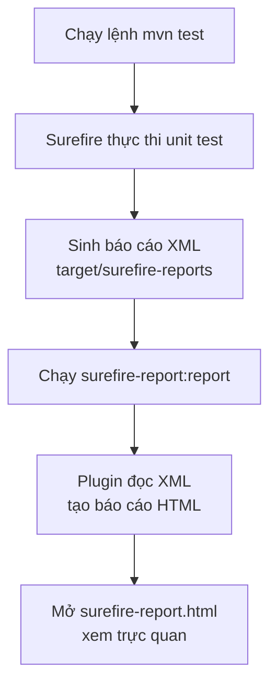

# JUnit — HTML Report với Surefire Maven plugin

Maven Surefire là plugin chịu trách nhiệm chạy unit test trong quá trình build và xuất ra báo cáo kết quả ở cả định dạng XML (cho CI/CD) lẫn HTML (xem trực quan trong trình duyệt). Bài này hướng dẫn cấu hình Surefire trong `pom.xml`, tạo và xem báo cáo HTML, các tùy chỉnh thường gặp (chọn test, chạy song song, retry, cấu hình JVM) và phân biệt với Failsafe dành cho integration test.

:::note[Ghi nhớ nhanh]

- ⭐ **`Maven Surefire` chạy unit test trong pha `test`** — sinh báo cáo XML (cho CI/CD) và HTML (xem trực quan).
- **Tạo HTML** — `mvn surefire-report:report`, xem tại `target/site/surefire-report.html`.
- **Tùy chỉnh** — `includes`/`excludes`, chạy song song (`parallel`, `threadCount`), `rerunFailingTestsCount`, `argLine`.
- **Integration test** — dùng `Maven Failsafe` (file hậu tố `IT`), chạy bằng `mvn verify`.
- **Bỏ qua test** — `-DskipTests` (không chạy) hoặc `-Dmaven.test.skip=true` (không cả biên dịch).

:::

## Maven Surefire Plugin là gì?

**Maven Surefire Plugin** là plugin tích hợp sẵn trong Maven, chịu trách nhiệm chạy các bài unit test trong giai đoạn `test` của vòng đời build. Plugin này hỗ trợ JUnit 4, JUnit 5 và TestNG.

**Surefire** còn tạo ra báo cáo test ở hai định dạng:
- **XML**: Để tích hợp với CI/CD (Jenkins, GitHub Actions, ...).
- **HTML**: Để xem kết quả trực quan trong trình duyệt.

Sơ đồ dưới mô tả luồng từ khi chạy test tới lúc có báo cáo HTML để xem:



Đọc sơ đồ: Surefire chạy test và sinh XML trước, sau đó plugin report đọc XML đó để dựng file HTML tổng hợp cho người dùng xem.

## Cấu hình cơ bản trong `pom.xml`

```xml
<build>
    <plugins>
        <plugin>
            <groupId>org.apache.maven.plugins</groupId>
            <artifactId>maven-surefire-plugin</artifactId>
            <version>3.1.2</version>
        </plugin>
    </plugins>
</build>
```

Nếu không khai báo, Maven vẫn dùng Surefire mặc định nhưng phiên bản cũ hơn.

## Chạy test và tạo báo cáo

```bash
# Chạy test, báo cáo tạo ở target/surefire-reports/
mvn test

# Chạy test và tạo báo cáo HTML ở target/site/surefire-report.html
mvn surefire-report:report

# Chạy test + tạo toàn bộ site (bao gồm HTML report)
mvn site
```

Sau khi chạy, mở file `target/site/surefire-report.html` trong trình duyệt để xem báo cáo.

## Cấu trúc thư mục báo cáo

```
target/
├── surefire-reports/
│   ├── TEST-com.example.CalculatorTest.xml   ← Báo cáo XML
│   ├── TEST-com.example.StringUtilsTest.xml
│   └── com.example.CalculatorTest.txt        ← Báo cáo text
└── site/
    └── surefire-report.html                   ← Báo cáo HTML tổng hợp
```

## Tùy chỉnh Surefire Plugin

### Chỉ định test nào chạy

```xml
<plugin>
    <groupId>org.apache.maven.plugins</groupId>
    <artifactId>maven-surefire-plugin</artifactId>
    <version>3.1.2</version>
    <configuration>
        <!-- Chỉ chạy các lớp test khớp với pattern -->
        <includes>
            <include>**/*Test.java</include>
            <include>**/*Tests.java</include>
            <include>**/Test*.java</include>
        </includes>

        <!-- Loại trừ một số test -->
        <excludes>
            <exclude>**/IntegrationTest.java</exclude>
            <exclude>**/*SlowTest.java</exclude>
        </excludes>
    </configuration>
</plugin>
```

### Chạy test song song

```xml
<configuration>
    <!-- Chạy nhiều test class song song -->
    <parallel>classes</parallel>
    <threadCount>4</threadCount>

    <!-- Hoặc chạy song song từng phương thức test trong cùng class -->
    <!-- <parallel>methods</parallel> -->

    <!-- Hoặc cả hai -->
    <!-- <parallel>classesAndMethods</parallel> -->
</configuration>
```

**Lưu ý**: Test song song chỉ an toàn khi các test không dùng chung trạng thái (stateless).

### Retry test thất bại

```xml
<configuration>
    <!-- Chạy lại test fail tối đa 2 lần -->
    <rerunFailingTestsCount>2</rerunFailingTestsCount>
</configuration>
```

### Cấu hình JVM cho test

```xml
<configuration>
    <!-- Tham số JVM khi chạy test -->
    <argLine>-Xmx512m -XX:MaxPermSize=256m</argLine>

    <!-- Biến môi trường -->
    <environmentVariables>
        <APP_ENV>test</APP_ENV>
        <DATABASE_URL>jdbc:h2:mem:testdb</DATABASE_URL>
    </environmentVariables>

    <!-- System properties -->
    <systemPropertyVariables>
        <log.level>WARN</log.level>
        <test.timeout>5000</test.timeout>
    </systemPropertyVariables>
</configuration>
```

### Bỏ qua test (chỉ build, không test)

```bash
# Bỏ qua việc chạy test khi build
mvn package -DskipTests

# Bỏ qua cả biên dịch lẫn chạy test
mvn package -Dmaven.test.skip=true
```

## Failsafe Plugin — Test tích hợp (Integration Test)

Surefire dành cho unit test. Với **integration test** (kiểm thử tích hợp), dùng **Maven Failsafe Plugin**:

```xml
<plugin>
    <groupId>org.apache.maven.plugins</groupId>
    <artifactId>maven-failsafe-plugin</artifactId>
    <version>3.1.2</version>
    <executions>
        <execution>
            <goals>
                <goal>integration-test</goal>
                <goal>verify</goal>
            </goals>
        </execution>
    </executions>
    <configuration>
        <!-- Failsafe tự nhận file có hậu tố IT -->
        <includes>
            <include>**/*IT.java</include>
            <include>**/*ITCase.java</include>
        </includes>
    </configuration>
</plugin>
```

```bash
# Chạy toàn bộ: unit test + integration test
mvn verify
```

## Xem báo cáo HTML

Nội dung của file `target/site/surefire-report.html` bao gồm:

| Mục | Nội dung |
|---|---|
| **Summary** (tổng quan) | Tổng số test, pass, fail, error, skip, tổng thời gian |
| **Package List** (danh sách package) | Kết quả theo từng package |
| **Test Cases** (các test case) | Chi tiết từng test: tên, thời gian, trạng thái, stack trace nếu fail |

## Ví dụ đầy đủ `pom.xml`

```xml
<project>
    <dependencies>
        <dependency>
            <groupId>org.junit.jupiter</groupId>
            <artifactId>junit-jupiter</artifactId>
            <version>5.10.0</version>
            <scope>test</scope>
        </dependency>
    </dependencies>

    <build>
        <plugins>
            <plugin>
                <groupId>org.apache.maven.plugins</groupId>
                <artifactId>maven-surefire-plugin</artifactId>
                <version>3.1.2</version>
                <configuration>
                    <rerunFailingTestsCount>1</rerunFailingTestsCount>
                    <parallel>classes</parallel>
                    <threadCount>2</threadCount>
                </configuration>
            </plugin>
        </plugins>
    </build>

    <reporting>
        <plugins>
            <plugin>
                <groupId>org.apache.maven.plugins</groupId>
                <artifactId>maven-surefire-report-plugin</artifactId>
                <version>3.1.2</version>
            </plugin>
        </plugins>
    </reporting>
</project>
```

## Thuật ngữ quan trọng

| Thuật ngữ | Giải thích |
|---|---|
| **Maven Surefire** | Plugin Maven để chạy unit test tự động |
| **Maven Failsafe** | Plugin Maven để chạy integration test |
| **XML report** | Báo cáo định dạng XML, dùng với CI/CD |
| **HTML report** | Báo cáo trực quan trong trình duyệt |
| **Thread** | Luồng thực thi — chạy song song nhiều thread giúp test nhanh hơn |
| **Stateless** | Không có trạng thái — mỗi lần gọi đều độc lập, an toàn khi chạy song song |
| **Stack trace** | Dấu vết ngăn xếp — chuỗi lời gọi phương thức dẫn đến nơi xảy ra lỗi |
