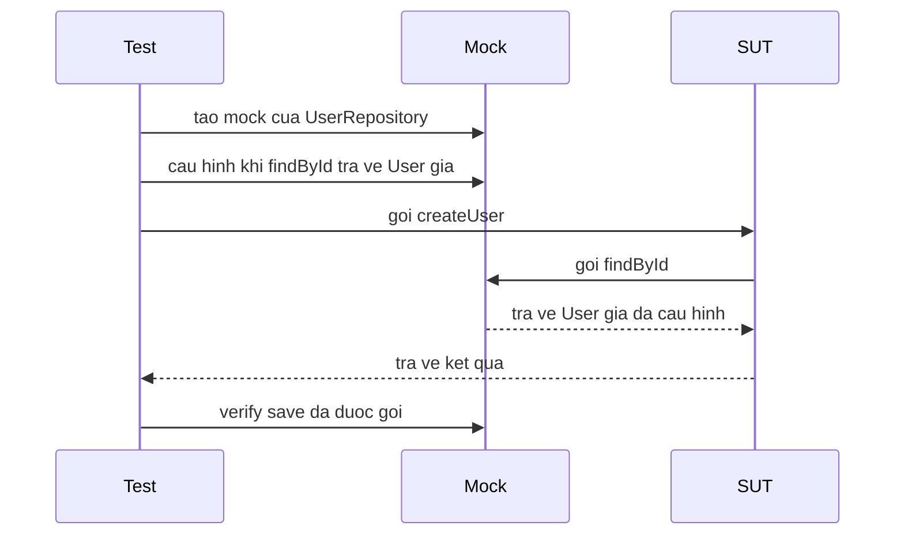

# Giới thiệu Mockito

Mockito là thư viện phổ biến nhất để tạo mock object (đối tượng giả) trong unit test Java. Mock giúp thay thế các phụ thuộc thật như database hay service bên ngoài, nhờ đó bạn kiểm thử logic nghiệp vụ một cách cô lập, nhanh và ổn định. Bài này giới thiệu các khái niệm cốt lõi của Mockito — mock, stub, verify, spy và argument matcher — kèm ví dụ đầy đủ dễ theo dõi.

## Mockito là gì?

**Mockito** là thư viện Java phổ biến nhất để tạo **mock object** (đối tượng giả lập) trong unit test. Mock object thay thế các dependency (phụ thuộc) thật sự như database, HTTP client, hay service bên ngoài, giúp bạn kiểm thử logic nghiệp vụ một cách cô lập và nhanh chóng.

**Tại sao cần mock?**

Giả sử bạn có lớp `OrderService` phụ thuộc vào `PaymentGateway` (cổng thanh toán). Khi test `OrderService`, bạn không muốn gọi thật sự đến cổng thanh toán vì:
- Chậm (gọi mạng).
- Tốn tiền (giao dịch thật).
- Không ổn định (mạng có thể gián đoạn).
- Khó tạo các tình huống đặc biệt (ví dụ: thanh toán thất bại).

Mockito giải quyết tất cả vấn đề này.

Sơ đồ dưới đây minh họa luồng tương tác điển hình khi dùng mock để cô lập dependency:



Đọc từ trên xuống theo dòng thời gian: Test tự tạo và cấu hình mock trước, sau đó SUT (đối tượng cần test) gọi mock trong lúc chạy, mock trả về dữ liệu giả thay cho dependency thật. Cuối cùng Test dùng `verify` để xác nhận các tương tác đã xảy ra.

## Cài đặt

```xml
<dependency>
    <groupId>org.mockito</groupId>
    <artifactId>mockito-core</artifactId>
    <version>5.5.0</version>
    <scope>test</scope>
</dependency>
```

Với JUnit 5, thêm mockito-junit-jupiter:

```xml
<dependency>
    <groupId>org.mockito</groupId>
    <artifactId>mockito-junit-jupiter</artifactId>
    <version>5.5.0</version>
    <scope>test</scope>
</dependency>
```

## Khái niệm cốt lõi

### Mock — Đối tượng giả lập hoàn toàn

**Mock** là đối tượng giả, tất cả phương thức trả về giá trị mặc định (`0`, `null`, `false`, danh sách rỗng) trừ khi bạn định nghĩa rõ hành vi.

```java
import org.mockito.Mockito;

// Tạo mock của một interface
UserRepository mockRepo = Mockito.mock(UserRepository.class);

// Mặc định — findById trả về null (chưa định nghĩa hành vi)
User user = mockRepo.findById(1L); // null
```

### Stub — Định nghĩa hành vi cho mock

**Stubbing** là hành động định nghĩa giá trị trả về khi một phương thức của mock được gọi:

```java
// Khi findById(1L) được gọi, trả về một User cụ thể
Mockito.when(mockRepo.findById(1L))
       .thenReturn(new User(1L, "Alice", "alice@example.com"));

// Khi findById(99L) được gọi, ném exception
Mockito.when(mockRepo.findById(99L))
       .thenThrow(new UserNotFoundException("Không tìm thấy user 99"));
```

### Verify — Xác nhận hành vi

**Verify** kiểm tra xem một phương thức của mock có được gọi hay không:

```java
// Xác nhận save() đã được gọi đúng 1 lần
Mockito.verify(mockRepo).save(any(User.class));

// Xác nhận delete() KHÔNG được gọi
Mockito.verify(mockRepo, Mockito.never()).delete(any());
```

## Ví dụ đầy đủ

```java
import org.junit.Test;
import org.mockito.Mockito;
import static org.mockito.Mockito.*;
import static org.junit.Assert.*;

// Lớp cần test
public class UserService {
    private final UserRepository userRepository;
    private final EmailService emailService;

    public UserService(UserRepository userRepository, EmailService emailService) {
        this.userRepository = userRepository;
        this.emailService = emailService;
    }

    public User createUser(String name, String email) {
        if (userRepository.existsByEmail(email)) {
            throw new DuplicateEmailException("Email đã tồn tại: " + email);
        }
        User newUser = new User(name, email);
        User saved = userRepository.save(newUser);
        emailService.sendWelcomeEmail(saved.getEmail());
        return saved;
    }
}
```

```java
public class UserServiceTest {

    @Test
    public void testCreateUser_emailMoi_taoThanhCongVaGuiEmail() {
        // Arrange — tạo mock
        UserRepository mockRepo = mock(UserRepository.class);
        EmailService mockEmail = mock(EmailService.class);

        // Stub — định nghĩa hành vi
        when(mockRepo.existsByEmail("alice@example.com")).thenReturn(false);
        when(mockRepo.save(any(User.class)))
            .thenReturn(new User(1L, "Alice", "alice@example.com"));

        UserService service = new UserService(mockRepo, mockEmail);

        // Act
        User result = service.createUser("Alice", "alice@example.com");

        // Assert
        assertNotNull(result);
        assertEquals("Alice", result.getName());

        // Verify — xác nhận hành vi
        verify(mockRepo).existsByEmail("alice@example.com");
        verify(mockRepo).save(any(User.class));
        verify(mockEmail).sendWelcomeEmail("alice@example.com");
    }

    @Test(expected = DuplicateEmailException.class)
    public void testCreateUser_emailDaTonTai_nemException() {
        // Arrange
        UserRepository mockRepo = mock(UserRepository.class);
        EmailService mockEmail = mock(EmailService.class);

        // Email đã tồn tại
        when(mockRepo.existsByEmail("alice@example.com")).thenReturn(true);

        UserService service = new UserService(mockRepo, mockEmail);

        // Act — mong đợi exception
        service.createUser("Alice", "alice@example.com");

        // Verify — email service KHÔNG được gọi khi có lỗi
        verify(mockEmail, never()).sendWelcomeEmail(anyString());
    }
}
```

## Các hàm `thenReturn` và `thenThrow`

```java
UserRepository mockRepo = mock(UserRepository.class);

// Trả về giá trị cố định
when(mockRepo.findById(1L)).thenReturn(Optional.of(new User("Alice")));

// Trả về nhiều giá trị lần lượt (lần 1, lần 2, ...)
when(mockRepo.count())
    .thenReturn(0L)   // Lần gọi đầu tiên
    .thenReturn(1L)   // Lần gọi thứ hai
    .thenReturn(2L);  // Lần gọi thứ ba trở đi

// Ném exception
when(mockRepo.findById(-1L))
    .thenThrow(new IllegalArgumentException("ID không hợp lệ"));

// Gọi phương thức thật (spy, xem bên dưới)
when(mockRepo.findById(1L)).thenCallRealMethod();
```

## Spy — Mock một phần

**Spy** (điệp viên) là mock của một đối tượng thật. Các phương thức không được stub sẽ gọi phương thức thật:

```java
List<String> realList = new ArrayList<>();
List<String> spyList = spy(realList);

// Phương thức thật được gọi
spyList.add("item1");
assertEquals(1, spyList.size()); // Gọi thật — size là 1

// Stub ghi đè phương thức thật
doReturn(100).when(spyList).size();
assertEquals(100, spyList.size()); // Trả về giá trị stub
```

## Argument Matchers — So khớp tham số

```java
// any() — chấp nhận bất kỳ giá trị nào
when(mockRepo.save(any(User.class))).thenReturn(savedUser);

// anyString(), anyInt(), anyLong(), ...
when(mockRepo.findByName(anyString())).thenReturn(Collections.emptyList());

// eq() — chính xác giá trị
when(mockRepo.findById(eq(1L))).thenReturn(Optional.of(user));

// ArgumentMatchers.argThat() — điều kiện tùy chỉnh
when(mockRepo.save(argThat(u -> u.getName().startsWith("A"))))
    .thenReturn(savedUser);
```

## Thuật ngữ quan trọng

| Thuật ngữ | Giải thích |
|---|---|
| **Mock** | Đối tượng giả lập hoàn toàn thay thế dependency thật |
| **Stub** | Định nghĩa hành vi cụ thể cho mock |
| **Spy** | Mock một phần — phương thức không stub vẫn gọi thật |
| **Verify** | Xác nhận phương thức đã được gọi với tham số đúng |
| **Dependency** | Thành phần mà lớp cần test phụ thuộc vào |
| **Isolation** | Cô lập — kiểm thử lớp mà không cần đến dependency thật |
| **Argument Matcher** | Bộ so khớp tham số, dùng khi không cần giá trị chính xác |
