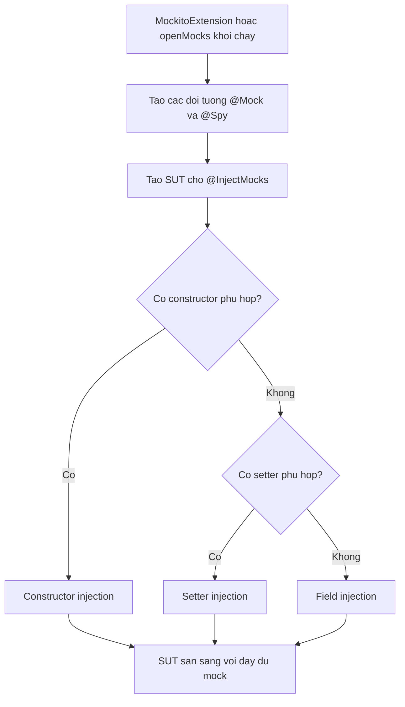

# Mockito — Annotations

Khi một test có nhiều mock, việc gọi `Mockito.mock(...)` cho từng dependency trở nên dài dòng. Mockito cung cấp các annotation giúp khai báo mock ngắn gọn và rõ ràng hơn nhiều. Bài này giới thiệu các annotation thường dùng — `@Mock`, `@Spy`, `@InjectMocks`, `@Captor` và `@MockBean` (Spring Boot) — cùng cách kích hoạt chúng trong JUnit 4 và JUnit 5.

## Tại sao dùng Annotation của Mockito?

Khi viết test có nhiều mock, việc gọi `Mockito.mock(SomeClass.class)` cho từng dependency trở nên dài dòng. Mockito cung cấp các **annotation** (chú thích) để khai báo mock ngắn gọn và rõ ràng hơn.

So sánh:

```java
// Không dùng annotation — dài dòng
public class UserServiceTest {
    @Test
    public void test() {
        UserRepository mockRepo = Mockito.mock(UserRepository.class);
        EmailService mockEmail = Mockito.mock(EmailService.class);
        AuditService mockAudit = Mockito.mock(AuditService.class);
        UserService service = new UserService(mockRepo, mockEmail, mockAudit);
        // ...
    }
}
```

```java
// Dùng annotation — gọn hơn nhiều
@ExtendWith(MockitoExtension.class)  // JUnit 5
public class UserServiceTest {

    @Mock
    private UserRepository mockRepo;

    @Mock
    private EmailService mockEmail;

    @Mock
    private AuditService mockAudit;

    @InjectMocks
    private UserService service; // Tự động inject 3 mock trên

    @Test
    public void test() {
        // service đã sẵn sàng với đầy đủ mock
    }
}
```

## Kích hoạt Annotation Mockito

### JUnit 4 — Dùng `@RunWith(MockitoJUnitRunner.class)`

```java
import org.junit.runner.RunWith;
import org.mockito.junit.MockitoJUnitRunner;

@RunWith(MockitoJUnitRunner.class)
public class UserServiceTest {
    // Annotation của Mockito hoạt động ở đây
}
```

Hoặc dùng `MockitoAnnotations.openMocks(this)` trong `@Before`:

```java
import org.junit.Before;
import org.mockito.MockitoAnnotations;

public class UserServiceTest {

    @Before
    public void setUp() {
        MockitoAnnotations.openMocks(this); // Khởi tạo tất cả @Mock, @Spy, ...
    }
}
```

### JUnit 5 — Dùng `@ExtendWith(MockitoExtension.class)`

```java
import org.junit.jupiter.api.extension.ExtendWith;
import org.mockito.junit.jupiter.MockitoExtension;

@ExtendWith(MockitoExtension.class)
class UserServiceTest {
    // Annotation của Mockito hoạt động ở đây
}
```

## Annotation `@Mock`

`@Mock` tạo một đối tượng mock đầy đủ. Tất cả phương thức trả về giá trị mặc định trừ khi được stub:

```java
@ExtendWith(MockitoExtension.class)
class OrderServiceTest {

    @Mock
    private ProductRepository productRepository;

    @Mock
    private PaymentGateway paymentGateway;

    @Test
    void testPlaceOrder() {
        // Stub hành vi của mock
        when(productRepository.findById(1L))
            .thenReturn(Optional.of(new Product(1L, "Laptop", 999.0)));
        when(paymentGateway.charge(any(), anyDouble()))
            .thenReturn(new PaymentResult(true, "TXN001"));

        // ... test tiếp theo
    }
}
```

## Annotation `@InjectMocks`

`@InjectMocks` tạo instance của lớp cần test và **tự động inject** tất cả các `@Mock` và `@Spy` vào đó. Mockito thử inject theo thứ tự:

1. **Constructor injection** (ưu tiên nhất): Tìm constructor phù hợp với các mock.
2. **Setter injection**: Tìm setter phù hợp.
3. **Field injection**: Inject trực tiếp vào field.

```java
@ExtendWith(MockitoExtension.class)
class NotificationServiceTest {

    @Mock
    private EmailSender emailSender;

    @Mock
    private SmsSender smsSender;

    @Mock
    private PushNotificationSender pushSender;

    @InjectMocks
    private NotificationService notificationService;
    // Mockito sẽ inject emailSender, smsSender, pushSender vào constructor/setter/field

    @Test
    void testSendAll_guiTatCaKenh_thanhCong() {
        when(emailSender.send(anyString())).thenReturn(true);
        when(smsSender.send(anyString())).thenReturn(true);
        when(pushSender.send(anyString())).thenReturn(true);

        boolean result = notificationService.sendToAll("Xin chào!", "user1");

        assertTrue(result);
        verify(emailSender).send("user1");
        verify(smsSender).send("user1");
        verify(pushSender).send("user1");
    }
}
```

Sơ đồ dưới đây tóm tắt luồng khởi tạo mock và thứ tự Mockito thử inject vào SUT khi gặp `@InjectMocks`:



Đọc sơ đồ theo hướng từ trên xuống: sau khi tạo tất cả mock, Mockito ưu tiên constructor injection, rồi mới đến setter và cuối cùng là field injection. Bất kể đi theo nhánh nào, kết quả là SUT được cung cấp đầy đủ mock trước khi test chạy.

## Annotation `@Spy`

`@Spy` tạo spy của một đối tượng thật — phương thức không stub sẽ gọi implementation thật:

```java
@ExtendWith(MockitoExtension.class)
class AuditServiceTest {

    @Spy
    private List<String> auditLog = new ArrayList<>();
    // auditLog là spy của ArrayList thật

    @InjectMocks
    private AuditService auditService;

    @Test
    void testLog_ghiThemEntry_tangKichThuoc() {
        auditService.log("Người dùng đăng nhập");

        // Phương thức thật của ArrayList được gọi
        assertEquals(1, auditLog.size()); // size() là thật
        assertEquals("Người dùng đăng nhập", auditLog.get(0));
    }

    @Test
    void testLog_stubbedSize_traVeGiaTriGia() {
        // Stub ghi đè phương thức thật
        doReturn(99).when(auditLog).size();

        assertEquals(99, auditLog.size()); // Trả về 99 dù thật ra là 0
    }
}
```

## Annotation `@Captor`

`@Captor` tạo `ArgumentCaptor` (bộ bắt tham số) để kiểm tra tham số được truyền vào mock:

```java
@ExtendWith(MockitoExtension.class)
class UserServiceTest {

    @Mock
    private UserRepository userRepository;

    @Captor
    private ArgumentCaptor<User> userCaptor;
    // Bắt đối tượng User được truyền vào save()

    @InjectMocks
    private UserService userService;

    @Test
    void testCreateUser_luuDungThongTin() {
        userService.createUser("Alice", "alice@example.com", 25);

        // Bắt đối tượng User được truyền vào save()
        verify(userRepository).save(userCaptor.capture());
        User savedUser = userCaptor.getValue();

        assertEquals("Alice", savedUser.getName());
        assertEquals("alice@example.com", savedUser.getEmail());
        assertEquals(25, savedUser.getAge());
        assertNotNull(savedUser.getCreatedAt());
    }
}
```

## Annotation `@MockBean` — Spring Boot Test

Nếu dùng Spring Boot, dùng `@MockBean` thay cho `@Mock` để mock bean trong Application Context:

```java
import org.springframework.boot.test.mock.mockito.MockBean;
import org.springframework.boot.test.context.SpringBootTest;

@SpringBootTest
class UserControllerTest {

    @MockBean
    private UserService userService; // Mock bean trong Spring context

    @Autowired
    private MockMvc mockMvc;

    @Test
    void testGetUser_idHopLe_traVe200() throws Exception {
        when(userService.findById(1L))
            .thenReturn(new UserResponse(1L, "Alice", "alice@example.com"));

        mockMvc.perform(get("/api/users/1"))
               .andExpect(status().isOk())
               .andExpect(jsonPath("$.name").value("Alice"));
    }
}
```

## Tổng hợp các Annotation

| Annotation | Mục đích |
|---|---|
| `@Mock` | Tạo đối tượng mock hoàn toàn |
| `@Spy` | Tạo spy — wrap đối tượng thật, stub một phần |
| `@InjectMocks` | Tạo SUT và inject mock/spy vào |
| `@Captor` | Tạo `ArgumentCaptor` để bắt tham số được truyền vào mock |
| `@MockBean` | Mock bean trong Spring Application Context |

## Thuật ngữ quan trọng

| Thuật ngữ | Giải thích |
|---|---|
| **ArgumentCaptor** | Đối tượng bắt và lưu tham số được truyền vào phương thức mock |
| **Injection** | Quá trình tự động cung cấp dependency cho đối tượng |
| **Application Context** | Container quản lý các bean (đối tượng) trong ứng dụng Spring |
| **Bean** | Đối tượng được quản lý bởi Spring Container |
| **MockBean** | Mock được đăng ký thay thế bean thật trong Spring Context |
