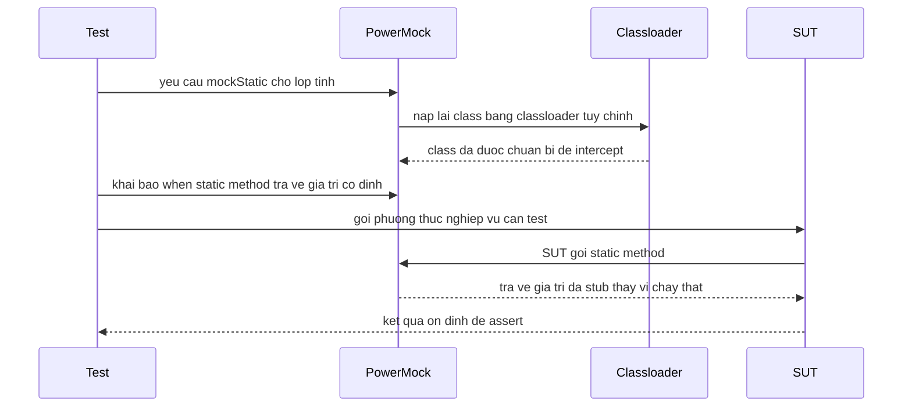

# Giới thiệu PowerMock

Mockito thông thường không thể mock được static method, constructor hay lớp final — đây chính là lúc PowerMock phát huy tác dụng. PowerMock là thư viện mở rộng giúp bạn test được những đoạn code "khó test", thường gặp trong các dự án legacy. Bài này giới thiệu PowerMock là gì, khi nào nên dùng và cách mock các thành phần đặc biệt đó.

## PowerMock là gì?

**PowerMock** là thư viện mở rộng Mockito (và EasyMock), cho phép mock các thành phần mà Mockito thông thường không thể mock:

- **Static method** (phương thức tĩnh): ví dụ `UUID.randomUUID()`, `System.currentTimeMillis()`.
- **Constructor** (hàm khởi tạo): mock việc tạo đối tượng bằng `new`.
- **Final class / Final method**: lớp hoặc phương thức được khai báo `final`.
- **Private method**: phương thức private.
- **Static initializer** (khối khởi tạo tĩnh): khối `static { ... }` trong lớp.

## Khi nào cần PowerMock?

**Thông thường, cần PowerMock khi:**
1. Code legacy (cũ) dùng nhiều static utility method.
2. Không thể sửa code production để thêm abstraction (giao diện trừu tượng).
3. Test các lớp dùng `new` để tạo dependency trực tiếp.

**Khuyến cáo**: PowerMock làm test phức tạp hơn và chậm hơn. Ưu tiên refactor code để inject dependency thay vì dùng PowerMock khi có thể.

## Cài đặt

```xml
<dependency>
    <groupId>org.powermock</groupId>
    <artifactId>powermock-module-junit4</artifactId>
    <version>2.0.9</version>
    <scope>test</scope>
</dependency>

<dependency>
    <groupId>org.powermock</groupId>
    <artifactId>powermock-api-mockito2</artifactId>
    <version>2.0.9</version>
    <scope>test</scope>
</dependency>
```

**Lưu ý**: PowerMock 2.x tương thích với Mockito 2.x và JUnit 4. PowerMock chưa hỗ trợ đầy đủ JUnit 5 — cần dùng rule để tích hợp.

## Cấu hình cơ bản

```java
import org.junit.runner.RunWith;
import org.powermock.core.classloader.annotations.PrepareForTest;
import org.powermock.modules.junit4.PowerMockRunner;

@RunWith(PowerMockRunner.class)                         // Sử dụng PowerMockRunner
@PrepareForTest({ UUIDUtils.class, System.class })     // Chuẩn bị lớp cần mock static
public class MyServiceTest {
    // ...
}
```

`@PrepareForTest` yêu cầu PowerMock load lại class bằng classloader tùy chỉnh để có thể mock static method.

Sơ đồ dưới đây minh họa cách Test, PowerMock và SUT (lớp đang được test) tương tác khi ta mock một static method:



Đọc sơ đồ theo chiều thời gian từ trên xuống: PowerMock chen giữa SUT và static method thật, nên khi SUT gọi static method nó nhận về giá trị đã stub. Nhờ vậy kết quả trở nên tất định (deterministic) và có thể kiểm tra bằng `assertEquals`.

## Mock Static Method

```java
import org.powermock.api.mockito.PowerMockito;
import static org.mockito.Mockito.*;

@RunWith(PowerMockRunner.class)
@PrepareForTest(UUIDUtils.class)
public class OrderServiceTest {

    @Test
    public void testCreateOrder_duocGanUUIDCoDinh() {
        // Mock static method UUID.randomUUID()
        PowerMockito.mockStatic(UUID.class);
        UUID fixedUUID = UUID.fromString("00000000-0000-0000-0000-000000000001");
        when(UUID.randomUUID()).thenReturn(fixedUUID);

        OrderService service = new OrderService();
        Order order = service.createOrder("Laptop", 999.0);

        // Kết quả có thể kiểm tra chính xác vì UUID đã được cố định
        assertEquals("00000000-0000-0000-0000-000000000001", order.getId().toString());
    }
}
```

```java
// Mock System.currentTimeMillis() để test code phụ thuộc vào thời gian
@RunWith(PowerMockRunner.class)
@PrepareForTest(System.class)
public class TimestampServiceTest {

    @Test
    public void testGetCurrentTimestamp_traVeThoiGianCoKhong() {
        PowerMockito.mockStatic(System.class);
        when(System.currentTimeMillis()).thenReturn(1700000000000L);

        TimestampService service = new TimestampService();
        long timestamp = service.getCurrentTimestamp();

        assertEquals(1700000000000L, timestamp);
    }
}
```

## Mock Constructor (hàm khởi tạo)

```java
@RunWith(PowerMockRunner.class)
@PrepareForTest(OrderService.class) // Lớp chứa lệnh "new"
public class OrderControllerTest {

    @Test
    public void testHandleOrder_dung_emailService_mock() throws Exception {
        // Mock constructor của EmailService
        EmailService mockEmailService = mock(EmailService.class);
        PowerMockito.whenNew(EmailService.class)
                    .withNoArguments()
                    .thenReturn(mockEmailService);

        // Khi OrderService gọi "new EmailService()", sẽ nhận mockEmailService
        OrderController controller = new OrderController();
        controller.handleOrder(new Order("Laptop"));

        // Xác nhận mockEmailService đã được gọi
        verify(mockEmailService).sendConfirmation(anyString());
    }

    @Test
    public void testHandleOrder_moiEmailServiceVoiTham() throws Exception {
        EmailService mockEmailService = mock(EmailService.class);

        // Mock constructor với tham số cụ thể
        PowerMockito.whenNew(EmailService.class)
                    .withArguments("smtp.example.com", 587)
                    .thenReturn(mockEmailService);

        OrderController controller = new OrderController();
        controller.handleOrder(new Order("Laptop"));

        verify(mockEmailService).sendConfirmation("Laptop");
    }
}
```

## Mock Final Class và Final Method

```java
// Lớp final không thể mock bằng Mockito thông thường
public final class SecurityManager {
    public boolean isAuthorized(String userId, String action) {
        // Logic bảo mật phức tạp
        return externalSecurityService.check(userId, action);
    }
}

@RunWith(PowerMockRunner.class)
@PrepareForTest(SecurityManager.class)
public class DocumentServiceTest {

    @Test
    public void testDeleteDocument_nguoiDungDuocPhep_xoaThanhCong() {
        // Mock lớp final
        SecurityManager mockSecurity = PowerMockito.mock(SecurityManager.class);
        when(mockSecurity.isAuthorized("admin", "DELETE")).thenReturn(true);

        DocumentService service = new DocumentService(mockSecurity);
        boolean result = service.deleteDocument("admin", 1L);

        assertTrue(result);
        verify(mockSecurity).isAuthorized("admin", "DELETE");
    }
}
```

## Verify Static Method

```java
@RunWith(PowerMockRunner.class)
@PrepareForTest(Logger.class)
public class AuditServiceTest {

    @Test
    public void testLogAction_goiStaticLogDung() {
        PowerMockito.mockStatic(Logger.class);

        auditService.logUserAction("user1", "LOGIN");

        // Xác nhận static method đã được gọi
        PowerMockito.verifyStatic(Logger.class, times(1));
        Logger.info(contains("user1"));
        Logger.info(contains("LOGIN"));
    }
}
```

## Spy trên Static Method

```java
@RunWith(PowerMockRunner.class)
@PrepareForTest(MathUtils.class)
public class CalculationServiceTest {

    @Test
    public void testSpyStaticMethod() {
        // Spy — các static method không được stub vẫn gọi thật
        PowerMockito.spy(MathUtils.class);

        // Chỉ stub một phương thức cụ thể
        when(MathUtils.random()).thenReturn(0.5);

        // MathUtils.add() vẫn chạy thật
        assertEquals(5, MathUtils.add(2, 3));

        // MathUtils.random() trả về giá trị stub
        assertEquals(0.5, MathUtils.random(), 0.001);
    }
}
```

## PowerMock vs Mockito — Khi nào dùng cái nào?

| Tình huống | Giải pháp |
|---|---|
| Interface hoặc class thông thường | **Mockito** — đơn giản, nhanh hơn |
| Final class/method | **PowerMock** hoặc dùng Mockito `mockFinal` (Java 17+) |
| Static method | **PowerMock** hoặc refactor sang dependency injection |
| Constructor | **PowerMock** hoặc dùng factory pattern |
| Code mới | **Refactor** để dễ test, tránh cần PowerMock |

## Thuật ngữ quan trọng

| Thuật ngữ | Giải thích |
|---|---|
| **Static method** | Phương thức thuộc lớp, không cần tạo đối tượng để gọi |
| **Constructor** | Hàm khởi tạo — được gọi khi tạo đối tượng bằng `new` |
| **Final class** | Lớp không thể kế thừa, được đánh dấu từ khóa `final` |
| **Classloader** | Bộ nạp class — PowerMock dùng classloader tùy chỉnh để intercept |
| **PrepareForTest** | Annotation yêu cầu PowerMock chuẩn bị lớp để mock |
| **Legacy code** | Code cũ, khó test, thường thiếu abstraction |
