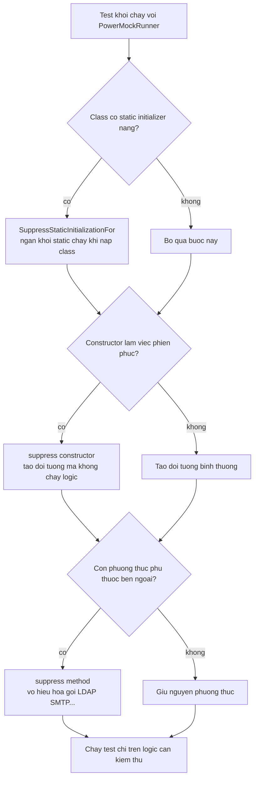

# PowerMockito — Suppressing Unwanted Behavior (Triệt tiêu hành vi không mong muốn)

Đôi khi một lớp có constructor, static initializer hay phương thức private làm những việc "phiền phức" như kết nối database hay đọc file, khiến việc test trở nên khó khăn. PowerMockito cho phép triệt tiêu (suppress) những hành vi đó để bạn chỉ tập trung test phần logic cần thiết. Bài này hướng dẫn cách suppress constructor, static block, method và dùng `Whitebox` để truy cập thành phần private.

:::note[Ghi nhớ nhanh]

- ⭐ **Suppression vô hiệu hóa hành vi phiền phức khi test** — constructor, static initializer, method hoặc field làm việc nặng (DB, file, mạng).
- **`@SuppressStaticInitializationFor("...")`** — ngăn khối `static { }` chạy khi nạp class.
- **`suppress(constructor(...))` và `suppress(method(...))`** — triệt tiêu constructor/phương thức không mong muốn.
- ⭐ **`Whitebox` truy cập thành phần private** — `setInternalState`, `getInternalState`, `invokeMethod`.

:::

## Suppression là gì?

**Suppressing** (triệt tiêu) trong PowerMockito là kỹ thuật vô hiệu hóa hoặc thay thế các hành vi cụ thể mà bạn không muốn xảy ra khi chạy test:

- **Suppress constructor**: Ngăn constructor ném exception hoặc thực thi logic phức tạp.
- **Suppress method**: Làm cho phương thức không thực thi gì (void) hoặc trả về giá trị mặc định.
- **Suppress static initializer**: Ngăn khối `static { ... }` chạy khi load class.
- **Suppress field**: Ngăn khởi tạo field.

**Khi nào cần suppression?**
- Class có **static initializer** kết nối database, đọc file — không muốn chạy trong test.
- **Constructor** cha gọi logic phức tạp khi kế thừa.
- Phương thức helper private cần triệt tiêu để cô lập logic cần test.

Sơ đồ sau mô tả luồng PowerMock lần lượt chặn và triệt tiêu các hành vi không mong muốn trước khi test thật sự chạy:



Đọc sơ đồ từ trên xuống: mỗi nhánh quyết định tương ứng một loại hành vi phiền phức; PowerMock loại bỏ nó trước khi tới bước cuối cùng. Kết quả là test chỉ còn tập trung vào phần logic nghiệp vụ cần kiểm thử.

## Thiết lập

```java
import org.junit.runner.RunWith;
import org.powermock.core.classloader.annotations.PrepareForTest;
import org.powermock.core.classloader.annotations.SuppressStaticInitializationFor;
import org.powermock.modules.junit4.PowerMockRunner;

@RunWith(PowerMockRunner.class)
@PrepareForTest(TargetClass.class)
public class SuppressionTest {
    // ...
}
```

## 1. Suppress Static Initializer

Lớp có khối `static { ... }` chạy khi được load:

```java
public class DatabaseConfig {
    private static Connection connection;

    static {
        // Khối static initializer — chạy một lần khi class được load
        // Trong test, không muốn kết nối database thật
        connection = DriverManager.getConnection("jdbc:mysql://production-server/db");
        System.out.println("Đã kết nối database production!");
    }

    public static Connection getConnection() {
        return connection;
    }
}
```

```java
import org.powermock.core.classloader.annotations.SuppressStaticInitializationFor;

@RunWith(PowerMockRunner.class)
@SuppressStaticInitializationFor("com.example.DatabaseConfig")
// Annotation này ngăn static initializer của DatabaseConfig chạy
public class DatabaseConfigTest {

    @Test
    public void testGetConnection_tiepCanBangMock_khongKetNoiThat() {
        // DatabaseConfig được load nhưng static block KHÔNG chạy
        // connection sẽ là null — có thể mock hoặc inject riêng
        assertNull(DatabaseConfig.getConnection());
    }
}
```

## 2. Suppress Constructor

Ngăn constructor thực thi logic không mong muốn:

```java
public class LegacyService {
    private final Connection db;

    public LegacyService() {
        // Constructor kết nối database ngay — không thể dùng trong test
        this.db = Database.createConnection();
        this.db.initialize();
    }

    public String processData(String input) {
        return db.query("SELECT * FROM data WHERE input = '" + input + "'");
    }
}
```

```java
import org.powermock.api.mockito.PowerMockito;
import static org.powermock.api.support.membermodification.MemberMatcher.*;
import static org.powermock.api.support.membermodification.MemberModifier.*;

@RunWith(PowerMockRunner.class)
@PrepareForTest(LegacyService.class)
public class LegacyServiceTest {

    @Test
    public void testProcessData_suppressConstructor() throws Exception {
        // Triệt tiêu constructor mặc định — không kết nối database
        suppress(constructor(LegacyService.class));

        LegacyService service = new LegacyService();
        // service được tạo mà không gọi database

        // Mock trường private db
        Connection mockDb = mock(Connection.class);
        when(mockDb.query(anyString())).thenReturn("kết quả test");

        // Inject mock vào field private
        Whitebox.setInternalState(service, "db", mockDb);

        String result = service.processData("test input");
        assertEquals("kết quả test", result);
    }
}
```

## 3. Suppress Method — Triệt tiêu phương thức

```java
public class ReportService {

    public void generateReport(String reportId) {
        validatePermissions(); // Phương thức kiểm tra phức tạp — muốn skip trong test
        processData(reportId);
        sendEmail();           // Muốn skip gửi email thật
    }

    private void validatePermissions() {
        // Kết nối đến LDAP server để kiểm tra quyền
        LdapServer.check(getCurrentUser());
    }

    private void sendEmail() {
        SmtpServer.send("report@company.com", "Báo cáo đã tạo xong");
    }
}
```

```java
import static org.powermock.api.support.membermodification.MemberMatcher.*;
import static org.powermock.api.support.membermodification.MemberModifier.*;

@RunWith(PowerMockRunner.class)
@PrepareForTest(ReportService.class)
public class ReportServiceTest {

    @Test
    public void testGenerateReport_suppress_phuThuocBenNgoai() throws Exception {
        // Triệt tiêu phương thức private — không kết nối LDAP
        suppress(method(ReportService.class, "validatePermissions"));
        suppress(method(ReportService.class, "sendEmail"));

        ReportService service = new ReportService();
        // Không ném exception dù LDAP không có
        service.generateReport("REPORT_2024");

        // Chỉ kiểm tra logic processData đã chạy
        // (test phần logic nghiệp vụ, không test phần phụ thuộc)
    }
}
```

## 4. `Whitebox` — Truy cập thành phần private

`Whitebox` (hộp trắng) của PowerMock cho phép đọc/ghi trực tiếp vào field private và gọi phương thức private:

```java
import org.powermock.reflect.Whitebox;

public class BankAccount {
    private double balance = 0;
    private List<String> transactionHistory = new ArrayList<>();

    private void recordTransaction(String description) {
        transactionHistory.add(description);
    }
}
```

```java
@RunWith(PowerMockRunner.class)
@PrepareForTest(BankAccount.class)
public class BankAccountTest {

    @Test
    public void testRecordTransaction_ghiVaoLichSu() throws Exception {
        BankAccount account = new BankAccount();

        // Gọi phương thức private
        Whitebox.invokeMethod(account, "recordTransaction", "Nạp tiền: 1.000.000đ");

        // Đọc field private
        List<String> history = Whitebox.getInternalState(account, "transactionHistory");
        assertEquals(1, history.size());
        assertEquals("Nạp tiền: 1.000.000đ", history.get(0));
    }

    @Test
    public void testBalance_setFieldPrivate_docLaiDung() {
        BankAccount account = new BankAccount();

        // Set giá trị field private
        Whitebox.setInternalState(account, "balance", 5_000_000.0);

        // Đọc lại
        double balance = Whitebox.getInternalState(account, "balance");
        assertEquals(5_000_000.0, balance, 0.01);
    }
}
```

## 5. Ví dụ tổng hợp — Class khó test

```java
// Lớp legacy với nhiều vấn đề: static initializer + constructor phức tạp + static method
public class LegacyEmailProcessor {

    private static Properties config;

    static {
        // Static initializer đọc file config từ production server
        config = ConfigLoader.loadFromServer("https://config.production.com/email.properties");
    }

    public LegacyEmailProcessor() {
        // Constructor kết nối SMTP server
        SmtpConnection.establish(config.getProperty("smtp.host"));
    }

    public boolean sendEmail(String to, String subject, String body) {
        String sanitized = HtmlSanitizer.sanitize(body); // Static utility
        return SmtpConnection.send(to, subject, sanitized);
    }
}
```

```java
@RunWith(PowerMockRunner.class)
@PrepareForTest({ LegacyEmailProcessor.class, HtmlSanitizer.class })
@SuppressStaticInitializationFor("com.example.LegacyEmailProcessor")
public class LegacyEmailProcessorTest {

    @Test
    public void testSendEmail_vinhVienTrietTieu() throws Exception {
        // 1. Static initializer đã bị suppress bởi @SuppressStaticInitializationFor

        // 2. Suppress constructor
        suppress(constructor(LegacyEmailProcessor.class));

        // 3. Mock static HtmlSanitizer
        PowerMockito.mockStatic(HtmlSanitizer.class);
        when(HtmlSanitizer.sanitize("<script>alert(1)</script>Hello"))
            .thenReturn("Hello");

        // 4. Mock static SmtpConnection
        PowerMockito.mockStatic(SmtpConnection.class);
        when(SmtpConnection.send(anyString(), anyString(), anyString()))
            .thenReturn(true);

        // 5. Test logic nghiệp vụ
        LegacyEmailProcessor processor = new LegacyEmailProcessor();
        boolean result = processor.sendEmail(
            "user@example.com",
            "Xét nghiệm",
            "<script>alert(1)</script>Hello"
        );

        assertTrue(result);
        PowerMockito.verifyStatic(HtmlSanitizer.class);
        HtmlSanitizer.sanitize(anyString()); // Xác nhận sanitize được gọi
    }
}
```

## Thuật ngữ quan trọng

| Thuật ngữ | Giải thích |
|---|---|
| **Suppression** | Triệt tiêu — vô hiệu hóa một hành vi trong test |
| **Static initializer** | Khối `static { }` chạy một lần khi class được nạp vào JVM |
| **Whitebox** | Tiện ích PowerMock để truy cập thành phần private của class |
| **LDAP** | Lightweight Directory Access Protocol — giao thức quản lý người dùng trong doanh nghiệp |
| **SMTP** | Simple Mail Transfer Protocol — giao thức gửi email |
| **Legacy** | Code cũ, thường thiếu abstraction và khó kiểm thử |
