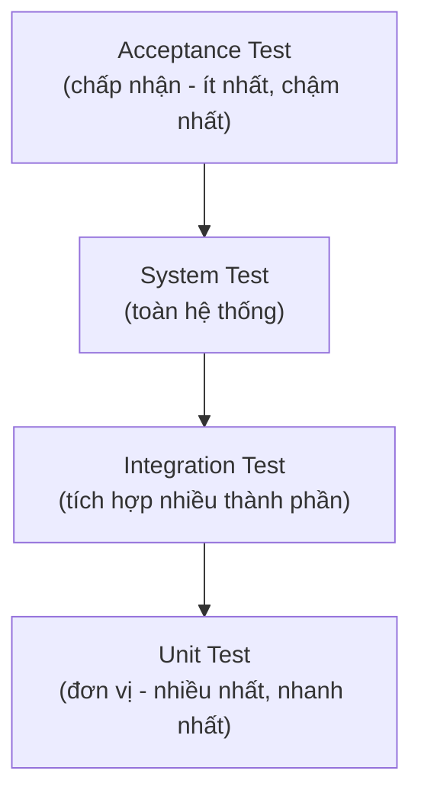
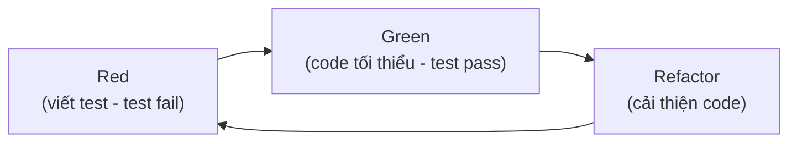

# Tìm hiểu về kiểm thử (Testing) trong phát triển phần mềm

Kiểm thử (testing) là quá trình kiểm tra xem phần mềm có chạy đúng như mong đợi hay không, giúp phát hiện lỗi sớm và yên tâm hơn mỗi khi sửa code. Bài này giới thiệu tổng quan về testing: tại sao cần kiểm thử, các cấp độ (unit, integration, system, acceptance), quy trình TDD và các công cụ phổ biến trong Java như JUnit và Mockito. Đây là phần nền tảng trước khi đi sâu vào từng công cụ ở các bài sau.

:::note[Ghi nhớ nhanh]

- ⭐ **Kiểm thử xác minh phần mềm chạy đúng mong đợi** — giúp phát hiện lỗi sớm, giảm chi phí sửa lỗi và tự tin khi thay đổi code.
- ⭐ **Bốn cấp độ theo kim tự tháp** — `Unit` (nhiều nhất, nhanh nhất) → `Integration` → `System` → `Acceptance`.
- **TDD gồm 3 bước lặp** — Red (viết test fail) → Green (code tối thiểu để pass) → Refactor.
- **Công cụ kiểm thử trong Java** — `JUnit`, `Mockito`, `PowerMock`, `AssertJ`, `Hamcrest`.

:::

## Kiểm thử phần mềm là gì?

**Testing** (kiểm thử phần mềm) là quá trình đánh giá và xác minh rằng một ứng dụng hoặc hệ thống phần mềm hoạt động đúng như mong đợi. Mục tiêu chính là phát hiện lỗi (bug), đảm bảo chất lượng và xác nhận phần mềm đáp ứng các yêu cầu đã đề ra.

## Tại sao cần kiểm thử?

- **Phát hiện lỗi sớm**: Chi phí sửa lỗi tăng theo cấp số nhân nếu phát hiện muộn (ở giai đoạn production so với lúc phát triển).
- **Đảm bảo chất lượng**: Phần mềm hoạt động đúng với các trường hợp bình thường và ngoại lệ.
- **Tự tin khi thay đổi code**: Khi có bộ kiểm thử đầy đủ, lập trình viên có thể refactor (tái cấu trúc code) hoặc thêm tính năng mà không lo làm hỏng chức năng cũ.
- **Tài liệu sống**: Các bài kiểm thử mô tả hành vi mong đợi của hệ thống, đóng vai trò như tài liệu kỹ thuật.

## Các cấp độ kiểm thử

Bốn cấp độ kiểm thử thường được sắp xếp theo mô hình kim tự tháp: càng xuống thấp thì số lượng test càng nhiều, chạy càng nhanh và rẻ; càng lên cao thì test càng ít, chậm và tốn kém hơn.



Đọc sơ đồ từ dưới lên: nền tảng là rất nhiều Unit Test nhanh và rẻ, phía trên là các lớp kiểm thử rộng hơn nhưng số lượng giảm dần.

### 1. Unit Test (Kiểm thử đơn vị)

**Unit Test** (kiểm thử đơn vị) kiểm tra từng đơn vị nhỏ nhất của code — thường là một phương thức (method) hoặc một lớp (class) — một cách độc lập.

```java
// Ví dụ: phương thức tính tổng cần được unit test
public class Calculator {
    public int add(int a, int b) {
        return a + b;
    }
}
```

### 2. Integration Test (Kiểm thử tích hợp)

**Integration Test** (kiểm thử tích hợp) kiểm tra sự kết hợp giữa nhiều thành phần, ví dụ: tầng service kết hợp với cơ sở dữ liệu, hoặc nhiều lớp cùng hoạt động với nhau.

### 3. System Test (Kiểm thử hệ thống)

**System Test** (kiểm thử hệ thống) kiểm tra toàn bộ hệ thống từ đầu đến cuối như một người dùng thực sự.

### 4. Acceptance Test (Kiểm thử chấp nhận)

**Acceptance Test** (kiểm thử chấp nhận) xác nhận phần mềm đáp ứng yêu cầu nghiệp vụ do khách hàng đề ra.

## Các loại kiểm thử phổ biến

| Loại kiểm thử | Mục đích |
|---|---|
| **Functional Testing** (kiểm thử chức năng) | Kiểm tra chức năng đúng theo yêu cầu |
| **Performance Testing** (kiểm thử hiệu năng) | Kiểm tra tốc độ và khả năng chịu tải |
| **Security Testing** (kiểm thử bảo mật) | Phát hiện lỗ hổng bảo mật |
| **Regression Testing** (kiểm thử hồi quy) | Đảm bảo thay đổi mới không phá vỡ chức năng cũ |

## Quy trình TDD (Test-Driven Development)

**TDD** (Test-Driven Development — phát triển hướng kiểm thử) là phương pháp viết test trước, rồi mới viết code triển khai:

1. **Red**: Viết test — test thất bại vì chưa có code triển khai.
2. **Green**: Viết code tối thiểu để test pass.
3. **Refactor**: Cải thiện code mà không làm test thất bại.

Vòng lặp TDD được lặp đi lặp lại cho từng chức năng nhỏ, minh họa như sau:



Đọc sơ đồ: mỗi lần thêm hành vi mới, ta quay lại bước Red để viết test tiếp theo, tạo thành một chu trình khép kín.

```java
// Bước 1 (Red): Viết test trước
@Test
public void testAdd_twoPositiveNumbers_returnsCorrectSum() {
    Calculator calc = new Calculator();
    assertEquals(5, calc.add(2, 3)); // Test thất bại vì Calculator chưa có
}

// Bước 2 (Green): Triển khai Calculator
public class Calculator {
    public int add(int a, int b) {
        return a + b; // Code tối thiểu để test pass
    }
}
```

## Công cụ kiểm thử trong Java

- **JUnit**: Framework kiểm thử đơn vị phổ biến nhất cho Java.
- **Mockito**: Thư viện tạo **mock object** (đối tượng giả) để cô lập các phụ thuộc.
- **PowerMock**: Mở rộng Mockito, hỗ trợ kiểm thử static method, constructor, ...
- **AssertJ**: Thư viện assertion (xác nhận kết quả) fluent API.
- **Hamcrest**: Thư viện matcher (bộ so khớp) linh hoạt cho assertions.

## Thuật ngữ cần nhớ

| Thuật ngữ | Giải thích |
|---|---|
| **Test case** | Một trường hợp kiểm thử cụ thể với đầu vào và đầu ra mong đợi |
| **Test suite** | Tập hợp nhiều test case |
| **Assertion** | Lệnh kiểm tra kết quả thực tế so với kết quả mong đợi |
| **Mock** | Đối tượng giả lập, thay thế dependency thật trong test |
| **Stub** | Đối tượng trả về dữ liệu cố định cho mục đích test |
| **Coverage** | Tỷ lệ phần trăm code được kiểm thử |
| **Bug** | Lỗi trong phần mềm |
| **Regression** | Lỗi xuất hiện lại sau khi đã được sửa |
