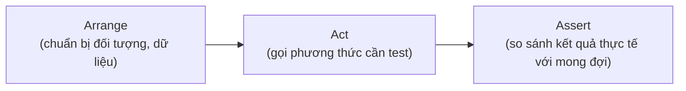
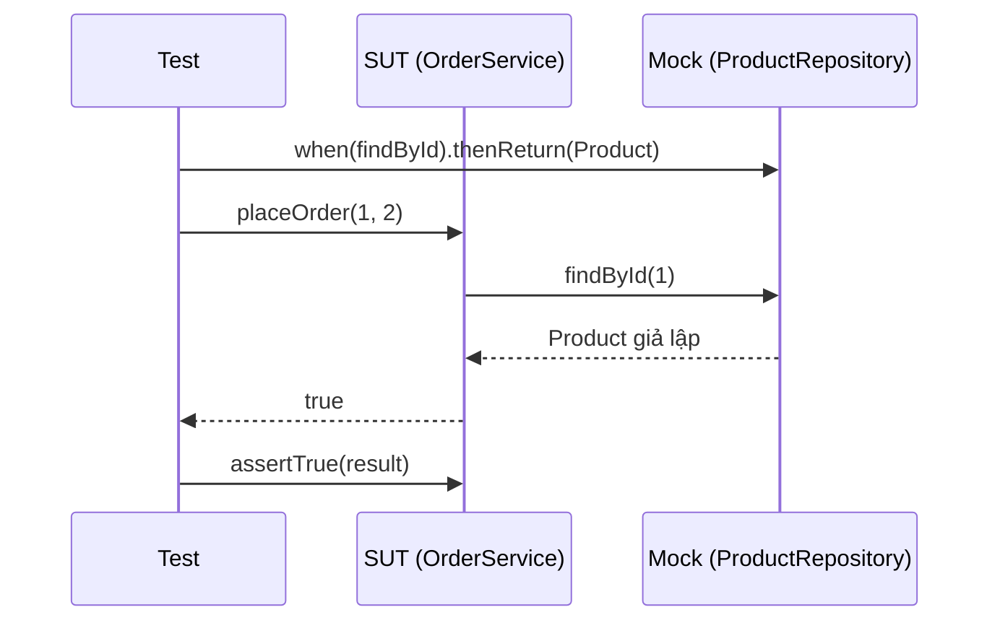

# Unit Testing trong phát triển phần mềm hiện đại

Unit Test là cách kiểm thử từng đơn vị code nhỏ nhất (một phương thức hoặc một lớp) một cách độc lập, giúp phát hiện lỗi sớm và yên tâm khi sửa code. Đây là nền tảng quan trọng của phát triển phần mềm hiện đại và quy trình CI/CD. Bài này giới thiệu các khái niệm cốt lõi như nguyên tắc FIRST, mô hình AAA, cách đặt tên test và vai trò của mock/stub.

:::note[Ghi nhớ nhanh]

- ⭐ **Unit test kiểm thử đơn vị nhỏ nhất** — một method hoặc class trong điều kiện cô lập, loại bỏ mọi phụ thuộc bên ngoài.
- ⭐ **Nguyên tắc FIRST** — Fast, Independent, Repeatable, Self-validating, Timely.
- **Mô hình AAA** — Arrange (chuẩn bị) → Act (thực thi) → Assert (xác nhận).
- **Đặt tên test** — theo mẫu `<tênPhươngThức>_<điềuKiện>_<kếtQuảMongĐợi>`.
- **Cô lập dependency** — dùng `Mock`/`Stub`; lớp đang được test gọi là `SUT`.

:::

## Unit Test là gì?

**Unit Test** (kiểm thử đơn vị) là loại kiểm thử tập trung vào một đơn vị code nhỏ nhất — thường là một phương thức (method) hoặc một lớp (class) — trong điều kiện cô lập. "Cô lập" có nghĩa là loại bỏ mọi phụ thuộc bên ngoài như cơ sở dữ liệu, mạng, hay các service khác.

## Đặc điểm của một Unit Test tốt

Nguyên tắc **FIRST** mô tả đặc điểm của một unit test chất lượng:

- **F — Fast** (nhanh): Chạy trong mili giây, không phụ thuộc vào I/O chậm.
- **I — Independent** (độc lập): Mỗi test không ảnh hưởng đến test khác.
- **R — Repeatable** (lặp lại được): Kết quả giống nhau mỗi lần chạy.
- **S — Self-validating** (tự xác nhận): Pass hoặc Fail rõ ràng, không cần xem log thủ công.
- **T — Timely** (kịp thời): Viết cùng lúc hoặc trước khi viết code production.

## Cấu trúc một Unit Test — Mô hình AAA

**AAA** (Arrange — Act — Assert) là mô hình tổ chức code trong một bài test:

- **Arrange** (chuẩn bị): Khởi tạo đối tượng, dữ liệu đầu vào.
- **Act** (thực thi): Gọi phương thức cần kiểm thử.
- **Assert** (xác nhận): Kiểm tra kết quả thực tế so với mong đợi.

Ba bước này luôn diễn ra tuần tự trong mỗi bài test, minh họa như sau:



Đọc sơ đồ: đầu vào được chuẩn bị ở Arrange, phương thức được gọi ở Act, và kết quả được kiểm chứng ở Assert.

```java
import org.junit.Test;
import static org.junit.Assert.assertEquals;

public class BankAccountTest {

    @Test
    public void testDeposit_soTienHopLe_tangSoDu() {
        // Arrange (chuẩn bị)
        BankAccount account = new BankAccount(1000);

        // Act (thực thi)
        account.deposit(500);

        // Assert (xác nhận)
        assertEquals(1500, account.getBalance());
    }

    @Test
    public void testWithdraw_soTienHopLe_giamSoDu() {
        // Arrange
        BankAccount account = new BankAccount(1000);

        // Act
        account.withdraw(300);

        // Assert
        assertEquals(700, account.getBalance());
    }

    @Test(expected = IllegalArgumentException.class)
    public void testWithdraw_soTienVuotQuaSoDu_nemException() {
        // Arrange
        BankAccount account = new BankAccount(100);

        // Act — mong đợi exception được ném ra
        account.withdraw(500);
    }
}
```

```java
// Lớp BankAccount được kiểm thử
public class BankAccount {
    private int balance;

    public BankAccount(int initialBalance) {
        this.balance = initialBalance;
    }

    public void deposit(int amount) {
        if (amount <= 0) throw new IllegalArgumentException("Số tiền phải dương");
        this.balance += amount;
    }

    public void withdraw(int amount) {
        if (amount > balance) throw new IllegalArgumentException("Số dư không đủ");
        this.balance -= amount;
    }

    public int getBalance() {
        return balance;
    }
}
```

## Đặt tên cho Test

Tên phương thức test nên mô tả rõ **điều kiện** và **kết quả mong đợi**. Mẫu phổ biến:

```
<tênPhươngThức>_<điềuKiện>_<kếtQuảMongĐợi>
```

```java
// Tốt — tên rõ ràng, dễ hiểu
@Test
public void testAdd_haiSoDuong_traVeTong()

@Test
public void testDivide_chiaSoChoZero_nemArithmeticException()

// Không tốt — quá chung chung
@Test
public void testAdd()

@Test
public void test1()
```

## Mock và Stub trong Unit Test

Khi lớp cần test phụ thuộc vào các thành phần bên ngoài (database, API, ...), ta dùng **Mock** (đối tượng giả lập) hoặc **Stub** (đối tượng trả về dữ liệu cố định) để cô lập. Sơ đồ dưới đây cho thấy test điều khiển mock thay vì gọi dependency thật:



Đọc sơ đồ: test cấu hình sẵn hành vi của mock, sau đó SUT gọi mock (không phải database thật) và trả kết quả để test xác nhận.

```java
// Ví dụ dùng Mockito để mock dependency
import org.mockito.Mockito;

public class OrderServiceTest {

    @Test
    public void testPlaceOrder_sanPhamConHang_datHangThanhCong() {
        // Arrange — tạo mock cho dependency
        ProductRepository mockRepo = Mockito.mock(ProductRepository.class);
        Mockito.when(mockRepo.findById(1L)).thenReturn(new Product(1L, "Laptop", 10));

        OrderService service = new OrderService(mockRepo);

        // Act
        boolean result = service.placeOrder(1L, 2);

        // Assert
        assertTrue(result);
    }
}
```

## Lợi ích thực tiễn của Unit Test

1. **Phát hiện lỗi sớm**: Lỗi được tìm thấy ngay khi viết code, không phải sau khi deploy.
2. **Refactoring an toàn**: Có thể tái cấu trúc code với sự tự tin vì test sẽ báo nếu có gì sai.
3. **Tài liệu kỹ thuật**: Bộ test mô tả hành vi của class/method rõ hơn bất kỳ comment nào.
4. **Giảm chi phí debug**: Khi test fail, phạm vi lỗi đã được khoanh vùng nhỏ.
5. **Hỗ trợ CI/CD**: **CI/CD** (Continuous Integration/Continuous Deployment — tích hợp liên tục/triển khai liên tục) chạy toàn bộ test tự động sau mỗi lần commit code.

## Thuật ngữ quan trọng

| Thuật ngữ | Giải thích |
|---|---|
| **SUT** (System Under Test) | Lớp hoặc phương thức đang được kiểm thử |
| **Dependency** | Thành phần mà SUT phụ thuộc vào |
| **Mock object** | Đối tượng giả lập thay thế dependency thật |
| **Test double** | Thuật ngữ chung cho mock, stub, spy, fake |
| **Code coverage** | Tỷ lệ dòng code được thực thi bởi test |
| **Regression** | Lỗi cũ xuất hiện lại sau thay đổi code |
