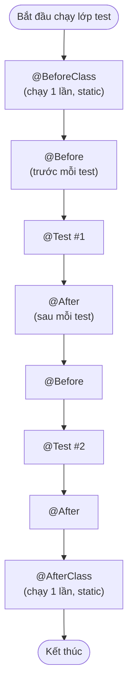

# Giới thiệu JUnit

JUnit là framework kiểm thử đơn vị phổ biến nhất trong thế giới Java, dùng để viết và chạy các bài test tự động. Hầu như mọi dự án Java đều dựa vào JUnit để đảm bảo code hoạt động đúng. Bài này giới thiệu tổng quan về JUnit, cách cài đặt, viết bài test đầu tiên và so sánh hai phiên bản JUnit 4 với JUnit 5.

## JUnit là gì?

**JUnit** là framework kiểm thử đơn vị (unit testing framework) phổ biến nhất cho ngôn ngữ Java. JUnit cung cấp các annotation, assertion và công cụ để viết và chạy các bài kiểm thử tự động. Hiện tại có hai phiên bản chính được dùng rộng rãi:

- **JUnit 4**: Phiên bản cũ hơn, vẫn còn dùng nhiều trong các dự án legacy.
- **JUnit 5** (còn gọi là **JUnit Jupiter**): Phiên bản hiện đại, hỗ trợ Java 8+, kiến trúc module hóa.

## Cài đặt JUnit

### JUnit 4 với Maven

Thêm dependency vào file `pom.xml`:

```xml
<dependency>
    <groupId>junit</groupId>
    <artifactId>junit</artifactId>
    <version>4.13.2</version>
    <scope>test</scope>
</dependency>
```

### JUnit 5 với Maven

```xml
<dependency>
    <groupId>org.junit.jupiter</groupId>
    <artifactId>junit-jupiter</artifactId>
    <version>5.10.0</version>
    <scope>test</scope>
</dependency>
```

`<scope>test</scope>` đảm bảo thư viện chỉ được dùng trong quá trình test, không đưa vào bản build production.

## Bài test đầu tiên với JUnit 4

```java
import org.junit.Test;
import org.junit.Before;
import org.junit.After;
import static org.junit.Assert.*;

public class StringUtilsTest {

    private StringUtils utils;

    @Before
    public void setUp() {
        // Chạy trước mỗi @Test — khởi tạo đối tượng cần dùng
        utils = new StringUtils();
    }

    @After
    public void tearDown() {
        // Chạy sau mỗi @Test — dọn dẹp tài nguyên nếu cần
        utils = null;
    }

    @Test
    public void testReverse_chuoiHopLe_traVeChuoiDaoNguoc() {
        String result = utils.reverse("hello");
        assertEquals("olleh", result);
    }

    @Test
    public void testReverse_chuoiRong_traVeChuoiRong() {
        String result = utils.reverse("");
        assertEquals("", result);
    }

    @Test
    public void testReverse_chuoiNull_traVeNull() {
        String result = utils.reverse(null);
        assertNull(result);
    }
}
```

```java
// Lớp được kiểm thử
public class StringUtils {
    public String reverse(String input) {
        if (input == null) return null;
        return new StringBuilder(input).reverse().toString();
    }
}
```

Các annotation `@Before` và `@After` tạo nên vòng đời của một lớp test JUnit. Sơ đồ dưới đây minh họa thứ tự thực thi khi lớp có nhiều `@Test`:



Đọc sơ đồ: `@BeforeClass` và `@AfterClass` chỉ chạy một lần bao ngoài, còn `@Before`/`@After` lặp lại quanh từng `@Test`.

## Bài test đầu tiên với JUnit 5

```java
import org.junit.jupiter.api.Test;
import org.junit.jupiter.api.BeforeEach;
import org.junit.jupiter.api.AfterEach;
import static org.junit.jupiter.api.Assertions.*;

public class StringUtilsTest {

    private StringUtils utils;

    @BeforeEach
    void setUp() {
        utils = new StringUtils();
    }

    @AfterEach
    void tearDown() {
        utils = null;
    }

    @Test
    void reverse_chuoiHopLe_traVeChuoiDaoNguoc() {
        String result = utils.reverse("hello");
        assertEquals("olleh", result);
    }

    @Test
    void reverse_chuoiNull_traVeNull() {
        assertNull(utils.reverse(null));
    }

    @Test
    void reverse_chuoiMotKyTu_traVeChinhNo() {
        assertEquals("a", utils.reverse("a"));
    }
}
```

## So sánh JUnit 4 và JUnit 5

| Tính năng | JUnit 4 | JUnit 5 |
|---|---|---|
| Annotation test | `@Test` (từ `org.junit`) | `@Test` (từ `org.junit.jupiter.api`) |
| Khởi tạo trước mỗi test | `@Before` | `@BeforeEach` |
| Dọn dẹp sau mỗi test | `@After` | `@AfterEach` |
| Chạy một lần trước tất cả | `@BeforeClass` | `@BeforeAll` |
| Chạy một lần sau tất cả | `@AfterClass` | `@AfterAll` |
| Bỏ qua test | `@Ignore` | `@Disabled` |
| Assertion | `org.junit.Assert.*` | `org.junit.jupiter.api.Assertions.*` |
| Yêu cầu Java | Java 5+ | Java 8+ |

## Cấu trúc thư mục chuẩn với Maven

```
project/
├── src/
│   ├── main/
│   │   └── java/
│   │       └── com/example/
│   │           └── StringUtils.java       ← Code production
│   └── test/
│       └── java/
│           └── com/example/
│               └── StringUtilsTest.java   ← Code test
└── pom.xml
```

Quy ước đặt tên: lớp test đặt cùng package với lớp cần test, thêm hậu tố `Test`.

## Chạy test

```bash
# Chạy toàn bộ test với Maven
mvn test

# Chạy một lớp test cụ thể
mvn test -Dtest=StringUtilsTest

# Chạy một phương thức test cụ thể
mvn test -Dtest=StringUtilsTest#testReverse_chuoiHopLe_traVeChuoiDaoNguoc
```

## Kết quả chạy test

Khi test chạy xong, Maven in ra báo cáo:

```
Tests run: 3, Failures: 0, Errors: 0, Skipped: 0
```

- **Failures**: Test thất bại do assertion sai (ví dụ: `assertEquals` không khớp).
- **Errors**: Test gặp ngoại lệ không mong đợi (ví dụ: `NullPointerException`).
- **Skipped**: Test bị bỏ qua (được đánh dấu `@Ignore` hoặc `@Disabled`).

## Thuật ngữ quan trọng

| Thuật ngữ | Giải thích |
|---|---|
| **Framework** | Bộ khung/thư viện cung cấp cấu trúc cho ứng dụng |
| **Annotation** | Siêu dữ liệu gắn vào code Java bằng ký hiệu `@` |
| **Assertion** | Lệnh kiểm tra điều kiện, ném exception nếu điều kiện sai |
| **Test runner** | Chương trình chịu trách nhiệm tìm và chạy các test |
| **Green bar** | Thuật ngữ chỉ trạng thái tất cả test đều pass |
| **Red bar** | Thuật ngữ chỉ trạng thái có ít nhất một test fail |
