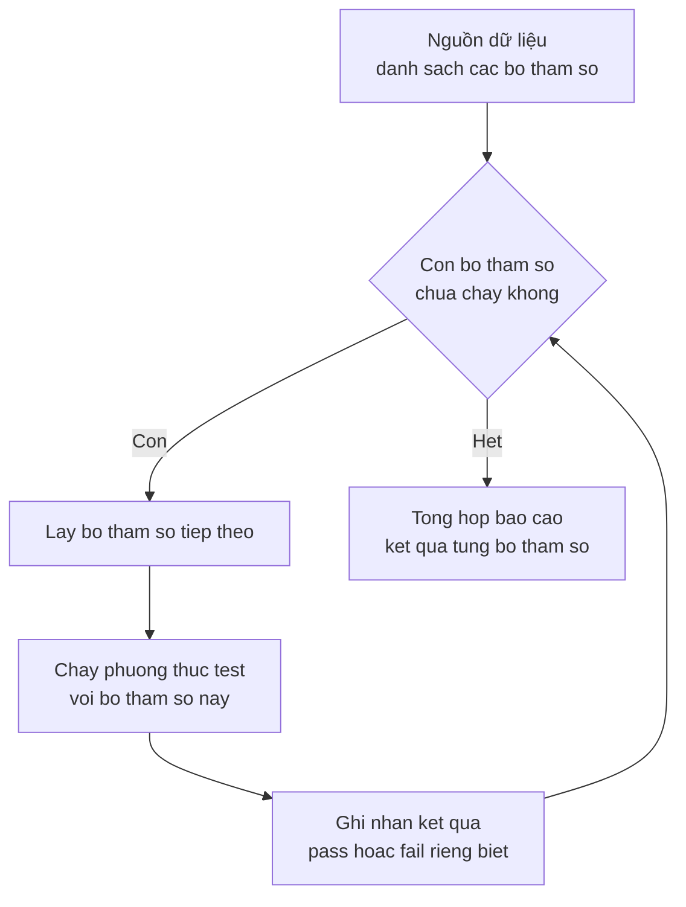

# JUnit — Parameterized Test

Parameterized Test giúp bạn chạy cùng một bài test với nhiều bộ dữ liệu đầu vào khác nhau, thay vì phải viết đi viết lại nhiều phương thức gần giống nhau. Cách làm này giảm code trùng lặp và giúp dễ dàng bổ sung trường hợp kiểm thử mới. Bài này hướng dẫn viết parameterized test trong JUnit 4 và các nguồn dữ liệu phong phú của JUnit 5 như `@ValueSource`, `@CsvSource`, `@MethodSource`, `@EnumSource`.

:::note[Ghi nhớ nhanh]

- ⭐ **Parameterized test chạy cùng một test với nhiều bộ dữ liệu** — giảm code trùng lặp, dễ thêm trường hợp mới.
- **JUnit 4** — `@RunWith(Parameterized.class)` + `@Parameters` trả về `Collection<Object[]>` + constructor nhận tham số.
- **JUnit 5** — `@ParameterizedTest` với `@ValueSource`, `@CsvSource`, `@CsvFileSource`, `@MethodSource`, `@EnumSource`.
- **`@MethodSource`** — dùng phương thức `static` trả về `Stream<Arguments>`.

:::

## Parameterized Test là gì?

**Parameterized Test** (kiểm thử tham số hóa) cho phép chạy cùng một bài test với nhiều bộ dữ liệu đầu vào khác nhau. Thay vì viết nhiều phương thức test gần giống nhau, bạn chỉ viết một phương thức và cung cấp nhiều bộ tham số.

**Lợi ích:**
- Giảm code trùng lặp.
- Dễ dàng thêm trường hợp kiểm thử mới.
- Báo cáo rõ ràng: JUnit hiển thị kết quả từng bộ tham số riêng biệt.

Sơ đồ dưới đây minh họa cách một phương thức test được chạy lặp lại qua từng bộ tham số:



Đọc sơ đồ: mỗi bộ tham số chạy lại đúng một lần phương thức test, kết quả từng bộ được ghi nhận riêng. Chỉ khi hết dữ liệu, JUnit mới tổng hợp báo cáo cuối cùng.

## Parameterized Test trong JUnit 4

### Thiết lập cơ bản

```java
import org.junit.Test;
import org.junit.runner.RunWith;
import org.junit.runners.Parameterized;
import org.junit.runners.Parameterized.Parameters;
import static org.junit.Assert.*;

@RunWith(Parameterized.class)
public class PrimeNumberTest {

    // 1. Khai báo các tham số như field của lớp
    private int number;
    private boolean expectedResult;

    // 2. Constructor nhận tham số
    public PrimeNumberTest(int number, boolean expectedResult) {
        this.number = number;
        this.expectedResult = expectedResult;
    }

    // 3. Phương thức static cung cấp dữ liệu — phải trả về Collection<Object[]>
    @Parameters
    public static Collection<Object[]> data() {
        return Arrays.asList(new Object[][] {
            { 2,  true  },   // 2 là số nguyên tố
            { 3,  true  },   // 3 là số nguyên tố
            { 4,  false },   // 4 không là số nguyên tố
            { 5,  true  },   // 5 là số nguyên tố
            { 10, false },   // 10 không là số nguyên tố
            { 13, true  }    // 13 là số nguyên tố
        });
    }

    // 4. Phương thức test — dùng các field thay vì giá trị cứng
    @Test
    public void testIsPrime() {
        assertEquals(expectedResult, PrimeChecker.isPrime(number));
    }
}
```

```java
// Lớp được kiểm thử
public class PrimeChecker {
    public static boolean isPrime(int n) {
        if (n < 2) return false;
        for (int i = 2; i * i <= n; i++) {
            if (n % i == 0) return false;
        }
        return true;
    }
}
```

### Đặt tên cho từng test case

```java
@Parameters(name = "{index}: isPrime({0}) = {1}")
public static Collection<Object[]> data() {
    return Arrays.asList(new Object[][] {
        { 2, true  },
        { 4, false },
        { 7, true  }
    });
}
// Tên hiển thị: "[0]: isPrime(2) = true", "[1]: isPrime(4) = false", ...
```

### Ví dụ: Test phép tính với nhiều cặp số

```java
@RunWith(Parameterized.class)
public class CalculatorAddTest {

    @Parameters(name = "{0} + {1} = {2}")
    public static Collection<Object[]> data() {
        return Arrays.asList(new Object[][] {
            { 1,   2,   3   },
            { -5,  5,   0   },
            { 100, 200, 300 },
            { -3, -7,   -10 }
        });
    }

    private int a, b, expected;

    public CalculatorAddTest(int a, int b, int expected) {
        this.a = a;
        this.b = b;
        this.expected = expected;
    }

    @Test
    public void testAdd() {
        Calculator calc = new Calculator();
        assertEquals(expected, calc.add(a, b));
    }
}
```

## Parameterized Test trong JUnit 5

JUnit 5 cung cấp `@ParameterizedTest` với nhiều nguồn dữ liệu linh hoạt hơn.

### `@ValueSource` — Mảng giá trị đơn giản

```java
import org.junit.jupiter.params.ParameterizedTest;
import org.junit.jupiter.params.provider.ValueSource;

class PrimeCheckerTest {

    @ParameterizedTest
    @ValueSource(ints = { 2, 3, 5, 7, 11, 13 })
    void testIsPrime_soNguyenTo_traVeTrue(int number) {
        assertTrue(PrimeChecker.isPrime(number));
    }

    @ParameterizedTest
    @ValueSource(strings = { "hello", "world", "java" })
    void testIsNotBlank_chuoiHopLe_traVeTrue(String text) {
        assertTrue(!text.isBlank());
    }
}
```

### `@CsvSource` — Nhiều tham số dạng CSV

```java
import org.junit.jupiter.params.provider.CsvSource;

class CalculatorTest {

    @ParameterizedTest(name = "{0} + {1} = {2}")
    @CsvSource({
        "1,   2,   3",
        "-5,  5,   0",
        "100, 200, 300"
    })
    void testAdd(int a, int b, int expected) {
        Calculator calc = new Calculator();
        assertEquals(expected, calc.add(a, b));
    }
}
```

### `@CsvFileSource` — Dữ liệu từ file CSV

```java
import org.junit.jupiter.params.provider.CsvFileSource;

class UserValidatorTest {

    @ParameterizedTest
    @CsvFileSource(resources = "/test-data/valid-emails.csv", numLinesToSkip = 1)
    void testValidEmail_emailHopLe_traVeTrue(String email) {
        assertTrue(UserValidator.isValidEmail(email));
    }
}
```

File `src/test/resources/test-data/valid-emails.csv`:
```
email
user@example.com
admin@company.org
test.user+tag@gmail.com
```

### `@MethodSource` — Dữ liệu từ phương thức

```java
import org.junit.jupiter.params.provider.MethodSource;
import java.util.stream.Stream;

class StringUtilsTest {

    @ParameterizedTest
    @MethodSource("provideStringsForIsBlank")
    void testIsBlank(String input, boolean expected) {
        assertEquals(expected, input == null || input.isBlank());
    }

    // Phương thức cung cấp dữ liệu — phải là static
    static Stream<Arguments> provideStringsForIsBlank() {
        return Stream.of(
            Arguments.of("",      true),
            Arguments.of("  ",    true),
            Arguments.of(null,    true),
            Arguments.of("hello", false)
        );
    }
}
```

### `@EnumSource` — Dữ liệu từ Enum

```java
import org.junit.jupiter.params.provider.EnumSource;

enum Day { MONDAY, TUESDAY, WEDNESDAY, THURSDAY, FRIDAY, SATURDAY, SUNDAY }

class WorkdayCheckerTest {

    @ParameterizedTest
    @EnumSource(value = Day.class, names = { "MONDAY", "TUESDAY", "WEDNESDAY", "THURSDAY", "FRIDAY" })
    void testIsWorkday_ngayLamViec_traVeTrue(Day day) {
        assertTrue(WorkdayChecker.isWorkday(day));
    }

    @ParameterizedTest
    @EnumSource(value = Day.class, names = { "SATURDAY", "SUNDAY" })
    void testIsWorkday_cuoiTuan_traVeFalse(Day day) {
        assertFalse(WorkdayChecker.isWorkday(day));
    }
}
```

## Thuật ngữ quan trọng

| Thuật ngữ | Giải thích |
|---|---|
| **Parameterized** | Có tham số — test được chạy lại với các giá trị tham số khác nhau |
| **Data provider** | Phương thức hoặc annotation cung cấp dữ liệu cho parameterized test |
| **CSV** | Comma-Separated Values — định dạng dữ liệu dùng dấu phẩy để phân cách |
| **Enum** | Kiểu liệt kê trong Java, tập hợp các hằng số có tên |
| **Stream** | Luồng dữ liệu trong Java 8+, dùng để xử lý dữ liệu theo chuỗi thao tác |
