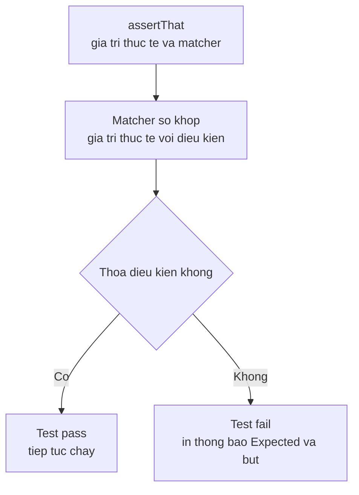

# JUnit — Hamcrest Matchers

Hamcrest là thư viện giúp bạn viết các câu kiểm tra (assertion) trong JUnit theo kiểu đọc tự nhiên gần như tiếng Anh, ví dụ `assertThat(name, startsWith("Alice"))`. Khi test fail, Hamcrest còn cho thông báo lỗi rõ ràng hơn nên dễ tìm ra nguyên nhân. Bài này giới thiệu cách dùng và các matcher phổ biến cho số, chuỗi, collection và map.

:::note[Ghi nhớ nhanh]

- ⭐ **`Hamcrest` cung cấp matcher viết assertion đọc như tiếng Anh** — cú pháp `assertThat(giá_trị_thực_tế, matcher)`.
- ⭐ **Thông báo lỗi rõ ràng** — khi fail hiện dạng "Expected... but...", dễ tìm nguyên nhân hơn `assertEquals`.
- **Matcher phổ biến** — `is`, `equalTo`, `not`, `containsString`, `hasSize`, `hasItem`, `hasKey`/`hasEntry`.
- **Kết hợp điều kiện** — `allOf` (AND) và `anyOf` (OR).
- **Cài đặt** — có sẵn trong JUnit 4; JUnit 5 cần thêm dependency `hamcrest`.

:::

## Hamcrest là gì?

**Hamcrest** là thư viện cung cấp các **matcher** (bộ so khớp) — các đối tượng dùng để mô tả điều kiện kiểm tra theo cú pháp tự nhiên, dễ đọc như tiếng Anh. Hamcrest được tích hợp sẵn trong JUnit 4 và có thể dùng với JUnit 5.

Sơ đồ dưới đây minh họa luồng đánh giá một câu `assertThat`:



Đọc sơ đồ: `assertThat` đưa giá trị thực tế cho matcher kiểm tra. Nếu khớp thì test qua; nếu không, Hamcrest sinh thông báo lỗi dạng "Expected ... but ..." giúp dễ tìm nguyên nhân.

**Tại sao dùng Hamcrest?**

So sánh cách viết truyền thống với Hamcrest:

```java
// Cách truyền thống — ít mô tả
assertTrue(list.size() > 0);
assertEquals(true, name.startsWith("Alice"));

// Dùng Hamcrest — đọc như câu tiếng Anh
assertThat(list, is(not(empty())));
assertThat(name, startsWith("Alice"));
```

Khi test fail, thông báo lỗi của Hamcrest cũng rõ ràng hơn:

```
// Thông báo từ assertEquals:
expected: <5> but was: <3>

// Thông báo từ Hamcrest:
Expected: a collection with size <5>
     but: collection size was <3>
```

## Cài đặt

Hamcrest đã được gói trong JUnit 4. Với JUnit 5, thêm dependency riêng:

```xml
<dependency>
    <groupId>org.hamcrest</groupId>
    <artifactId>hamcrest</artifactId>
    <version>2.2</version>
    <scope>test</scope>
</dependency>
```

## Cú pháp cơ bản

```java
import static org.hamcrest.MatcherAssert.assertThat;
import static org.hamcrest.Matchers.*;
```

Cú pháp: `assertThat(thực_tế, matcher)`
Hoặc: `assertThat("Thông báo khi fail", thực_tế, matcher)`

## Các Matcher phổ biến

### Matcher cơ bản

```java
// is() — bằng nhau (wrapper cho equalTo)
assertThat(42, is(42));
assertThat("hello", is("hello"));

// equalTo() — bằng nhau (dùng equals())
assertThat("test", equalTo("test"));

// not() — phủ định bất kỳ matcher nào
assertThat(10, not(20));
assertThat(list, not(empty()));

// nullValue() / notNullValue()
assertThat(null, nullValue());
assertThat("hello", notNullValue());

// instanceOf() — kiểm tra kiểu đối tượng
assertThat("hello", instanceOf(String.class));
assertThat(dog, instanceOf(Animal.class));

// sameInstance() — cùng tham chiếu bộ nhớ
String a = "hello";
assertThat(a, sameInstance(a));
```

### Matcher cho số

```java
// greaterThan, lessThan, greaterThanOrEqualTo, lessThanOrEqualTo
assertThat(10, greaterThan(5));
assertThat(3, lessThan(10));
assertThat(5, greaterThanOrEqualTo(5));
assertThat(4, lessThanOrEqualTo(5));

// closeTo() — số thực với sai số cho phép
assertThat(3.14159, closeTo(3.14, 0.01));

// between — khoảng giá trị (dùng allOf)
assertThat(7, allOf(greaterThan(5), lessThan(10)));
```

### Matcher cho String

```java
String text = "Hello World Java";

// containsString — chứa chuỗi con
assertThat(text, containsString("World"));

// startsWith / endsWith
assertThat(text, startsWith("Hello"));
assertThat(text, endsWith("Java"));

// equalToIgnoringCase — bằng nhau, bỏ qua hoa/thường
assertThat("HELLO", equalToIgnoringCase("hello"));

// matchesPattern — khớp với biểu thức chính quy (regex)
assertThat("user@example.com", matchesPattern(".*@.*\\..*"));

// blankString / emptyString
assertThat("  ", blankString());
assertThat("", emptyString());

// hasLength — kiểm tra độ dài
assertThat("hello", hasLength(5));
```

### Matcher cho Collection

```java
List<String> fruits = Arrays.asList("apple", "banana", "cherry");

// hasSize — kiểm tra kích thước
assertThat(fruits, hasSize(3));

// contains — chứa đúng thứ tự
assertThat(fruits, contains("apple", "banana", "cherry"));

// containsInAnyOrder — chứa tất cả, bất kể thứ tự
assertThat(fruits, containsInAnyOrder("cherry", "apple", "banana"));

// hasItem — chứa ít nhất một phần tử này
assertThat(fruits, hasItem("banana"));

// hasItems — chứa tất cả các phần tử này (không cần đủ)
assertThat(fruits, hasItems("apple", "cherry"));

// empty — danh sách rỗng
assertThat(new ArrayList<>(), empty());

// everyItem — mỗi phần tử đều thỏa điều kiện
assertThat(Arrays.asList(2, 4, 6), everyItem(greaterThan(0)));
```

### Matcher cho Map

```java
Map<String, Integer> scores = new HashMap<>();
scores.put("Alice", 95);
scores.put("Bob", 87);

// hasKey / hasValue
assertThat(scores, hasKey("Alice"));
assertThat(scores, hasValue(95));

// hasEntry — có đúng cặp key-value
assertThat(scores, hasEntry("Alice", 95));

// aMapWithSize — kiểm tra kích thước
assertThat(scores, aMapWithSize(2));
```

### Matcher kết hợp — allOf, anyOf

```java
String email = "user@example.com";

// allOf — TẤT CẢ điều kiện phải thỏa (AND)
assertThat(email, allOf(
    containsString("@"),
    containsString("."),
    not(blankString())
));

// anyOf — ÍT NHẤT MỘT điều kiện thỏa (OR)
assertThat("cat", anyOf(
    equalTo("cat"),
    equalTo("dog"),
    equalTo("bird")
));
```

## Ví dụ thực tế

```java
import org.junit.Test;
import static org.hamcrest.MatcherAssert.assertThat;
import static org.hamcrest.Matchers.*;

public class OrderServiceTest {

    @Test
    public void testGetOrders_nguoiDungHopLe_traVeDanhSachDon() {
        List<Order> orders = orderService.getOrdersByUser(1L);

        assertThat("Phải có đơn hàng", orders, not(empty()));
        assertThat("Số đơn hàng", orders, hasSize(greaterThan(0)));
        assertThat("Tất cả đơn là của user 1", orders,
            everyItem(hasProperty("userId", equalTo(1L))));
    }

    @Test
    public void testGetOrder_idHopLe_traVeThongTinDayDu() {
        Order order = orderService.getOrder(100L);

        assertThat(order, notNullValue());
        assertThat(order.getId(), is(100L));
        assertThat(order.getTotalAmount(), greaterThan(BigDecimal.ZERO));
        assertThat(order.getStatus(), anyOf(is("PENDING"), is("CONFIRMED"), is("SHIPPED")));
        assertThat(order.getItems(), not(empty()));
    }
}
```

## Thuật ngữ quan trọng

| Thuật ngữ | Giải thích |
|---|---|
| **Matcher** | Đối tượng mô tả điều kiện cần thỏa mãn |
| **assertThat** | Phương thức assertion nhận một matcher |
| **Fluent API** | Phong cách API cho phép nối chuỗi các lời gọi phương thức, dễ đọc |
| **Regex** | Regular Expression — biểu thức chính quy, mẫu tìm kiếm chuỗi |
| **Property** | Thuộc tính của đối tượng, thường truy cập qua getter |
