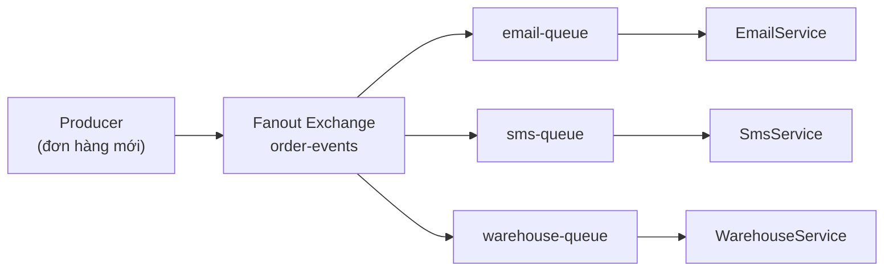

# Sử dụng Fanout Exchange trong RabbitMQ

Fanout Exchange là loại exchange trong RabbitMQ phát một bản sao tin nhắn tới tất cả các queue đã gắn vào nó, bỏ qua hoàn toàn routing key. Nó rất hữu ích khi một sự kiện cần được nhiều dịch vụ xử lý cùng lúc, ví dụ gửi email, SMS và cập nhật kho khi có đơn hàng mới. Bài này hướng dẫn cách thiết lập và dùng Fanout Exchange qua ví dụ thực tế.

## Fanout Exchange là gì?

**Fanout Exchange** (bộ định tuyến phát quảng bá — loại exchange gửi bản sao tin nhắn tới TẤT CẢ Queue đã bind vào nó, bỏ qua hoàn toàn routing key) hoạt động giống như một đài phát thanh: một lần phát, tất cả người nghe đều nhận được.

```
Producer --> [Fanout Exchange]
                ├── Queue A --> Consumer A
                ├── Queue B --> Consumer B
                └── Queue C --> Consumer C
    (Tất cả queue đều nhận bản sao tin nhắn)
```

Sơ đồ dưới đây minh họa một sự kiện đơn hàng được Fanout Exchange phát tới mọi Queue đã bind, mỗi dịch vụ xử lý một việc riêng:



Khác Direct/Topic, Fanout **bỏ qua routing key** — chỉ cần Queue đã bind vào Exchange là nhận được bản sao tin nhắn.

## Khi nào dùng Fanout Exchange?

- **Thông báo hệ thống**: Gửi cảnh báo cho tất cả dịch vụ cùng lúc.
- **Cache invalidation** (xóa cache — đồng bộ vô hiệu hóa cache trên nhiều server): Khi dữ liệu thay đổi, thông báo cho tất cả server xóa cache.
- **Live scoreboard** (bảng điểm trực tiếp): Cập nhật điểm số cho tất cả người dùng đang xem.
- **Event broadcasting** (phát sóng sự kiện): Một sự kiện cần được xử lý bởi nhiều hệ thống khác nhau.

## Ví dụ thực tế: Hệ thống thông báo đơn hàng

Khi có đơn hàng mới, cần thông báo đồng thời cho:
- Dịch vụ **Email**: Gửi email xác nhận cho khách hàng.
- Dịch vụ **SMS**: Gửi tin nhắn SMS cho khách hàng.
- Dịch vụ **Warehouse** (kho hàng): Chuẩn bị xuất kho.
- Dịch vụ **Analytics** (phân tích): Ghi nhận thống kê.

### Thiết lập Fanout Exchange

```java
import com.rabbitmq.client.*;

public class FanoutExchangeSetup {

    public static final String EXCHANGE_NAME = "order-events";

    public static void setup(Channel channel) throws Exception {
        // Khai báo Fanout Exchange — routing key sẽ bị BỎ QUA
        channel.exchangeDeclare(EXCHANGE_NAME, BuiltinExchangeType.FANOUT, true, false, null);
        System.out.println("Đã tạo Fanout Exchange: " + EXCHANGE_NAME);
    }
}
```

### Producer: Gửi sự kiện đơn hàng mới

```java
import com.rabbitmq.client.*;
import com.fasterxml.jackson.databind.ObjectMapper;
import java.util.Map;

public class OrderEventProducer {

    private static final ObjectMapper objectMapper = new ObjectMapper();

    public static void main(String[] args) throws Exception {
        ConnectionFactory factory = new ConnectionFactory();
        factory.setHost("localhost");

        try (Connection connection = factory.newConnection();
             Channel channel = connection.createChannel()) {

            FanoutExchangeSetup.setup(channel);

            // Tạo dữ liệu đơn hàng
            Map<String, Object> order = Map.of(
                "orderId", "ORD-2024-001",
                "customerId", "CUST-123",
                "customerEmail", "khachhang@example.com",
                "customerPhone", "0912345678",
                "totalAmount", 1_500_000,
                "items", java.util.List.of("Áo thun", "Quần jeans"),
                "createdAt", System.currentTimeMillis()
            );

            String orderJson = objectMapper.writeValueAsString(order);

            AMQP.BasicProperties props = new AMQP.BasicProperties.Builder()
                    .contentType("application/json")
                    .deliveryMode(2)
                    .build();

            // Gửi tới Fanout Exchange — routing key "" vì bị bỏ qua
            channel.basicPublish(FanoutExchangeSetup.EXCHANGE_NAME, "", props,
                    orderJson.getBytes("UTF-8"));

            System.out.println("[Producer] Đã phát sự kiện đơn hàng mới: " + order.get("orderId"));
            System.out.println("[Producer] Tin nhắn sẽ được gửi tới TẤT CẢ subscriber");
        }
    }
}
```

### Consumer 1: Dịch vụ Email

```java
import com.rabbitmq.client.*;

public class EmailNotificationService {

    public static void main(String[] args) throws Exception {
        ConnectionFactory factory = new ConnectionFactory();
        factory.setHost("localhost");

        Connection connection = factory.newConnection();
        Channel channel = connection.createChannel();

        FanoutExchangeSetup.setup(channel);

        // Tạo Queue TẠM THỜI (exclusive + autoDelete) dành riêng cho service này
        // Mỗi service tạo queue riêng và bind vào fanout exchange
        String queueName = channel.queueDeclare("email-notification-queue", true, false, false, null).getQueue();

        // Bind queue vào Fanout Exchange (routing key "" vì bị bỏ qua)
        channel.queueBind(queueName, FanoutExchangeSetup.EXCHANGE_NAME, "");

        System.out.println("[EmailService] Đang lắng nghe đơn hàng mới...");

        channel.basicConsume(queueName, true, (tag, delivery) -> {
            String orderJson = new String(delivery.getBody(), "UTF-8");
            System.out.println("[EmailService] Nhận đơn hàng: " + orderJson);
            // Giả lập gửi email
            System.out.println("[EmailService] Đã gửi email xác nhận đơn hàng!");
        }, tag -> {});
    }
}
```

### Consumer 2: Dịch vụ SMS

```java
import com.rabbitmq.client.*;

public class SmsNotificationService {

    public static void main(String[] args) throws Exception {
        ConnectionFactory factory = new ConnectionFactory();
        factory.setHost("localhost");

        Connection connection = factory.newConnection();
        Channel channel = connection.createChannel();

        FanoutExchangeSetup.setup(channel);

        // Mỗi service dùng queue riêng — cùng nhận từ một fanout exchange
        String queueName = "sms-notification-queue";
        channel.queueDeclare(queueName, true, false, false, null);
        channel.queueBind(queueName, FanoutExchangeSetup.EXCHANGE_NAME, "");

        System.out.println("[SmsService] Đang lắng nghe đơn hàng mới...");

        channel.basicConsume(queueName, true, (tag, delivery) -> {
            String orderJson = new String(delivery.getBody(), "UTF-8");
            System.out.println("[SmsService] Nhận đơn hàng: " + orderJson);
            System.out.println("[SmsService] Đã gửi SMS xác nhận!");
        }, tag -> {});
    }
}
```

### Consumer 3: Dịch vụ Kho hàng

```java
import com.rabbitmq.client.*;

public class WarehouseService {

    public static void main(String[] args) throws Exception {
        ConnectionFactory factory = new ConnectionFactory();
        factory.setHost("localhost");

        Connection connection = factory.newConnection();
        Channel channel = connection.createChannel();

        FanoutExchangeSetup.setup(channel);

        channel.queueDeclare("warehouse-queue", true, false, false, null);
        channel.queueBind("warehouse-queue", FanoutExchangeSetup.EXCHANGE_NAME, "");

        System.out.println("[WarehouseService] Đang chờ đơn hàng để chuẩn bị xuất kho...");

        channel.basicConsume("warehouse-queue", true, (tag, delivery) -> {
            String orderJson = new String(delivery.getBody(), "UTF-8");
            System.out.println("[WarehouseService] Nhận đơn: " + orderJson);
            System.out.println("[WarehouseService] Bắt đầu chuẩn bị hàng xuất kho!");
        }, tag -> {});
    }
}
```

## Luồng hoạt động khi chạy

```
1. Khởi động EmailService, SmsService, WarehouseService
   → Mỗi service tạo queue riêng và bind vào "order-events" fanout exchange

2. Producer gửi một tin nhắn đơn hàng

3. Fanout Exchange phát bản sao tin nhắn tới 3 queue:
   → email-notification-queue  → EmailService nhận và gửi email
   → sms-notification-queue    → SmsService nhận và gửi SMS
   → warehouse-queue           → WarehouseService chuẩn bị hàng

Kết quả: Tất cả 3 service đều nhận cùng một tin nhắn!
```

## So sánh Fanout với Direct Exchange

| Tiêu chí | Direct Exchange | Fanout Exchange |
|----------|----------------|----------------|
| Routing Key | Bắt buộc, so khớp chính xác | Bị bỏ qua |
| Số Queue nhận tin | Chỉ Queue có Binding Key khớp | Tất cả Queue đã bind |
| Trường hợp dùng | Định tuyến có chọn lọc | Phát quảng bá |
| Tốc độ | Nhanh | Nhanh nhất (không cần so khớp) |

## Tổng kết

Fanout Exchange là lựa chọn lý tưởng cho mô hình **Event-Driven Architecture** (kiến trúc hướng sự kiện — hệ thống phản ứng với sự kiện thay vì gọi trực tiếp) khi một sự kiện cần kích hoạt nhiều hành động độc lập nhau. Mỗi dịch vụ tự quản lý queue riêng và xử lý theo cách riêng mà không ảnh hưởng đến nhau.
