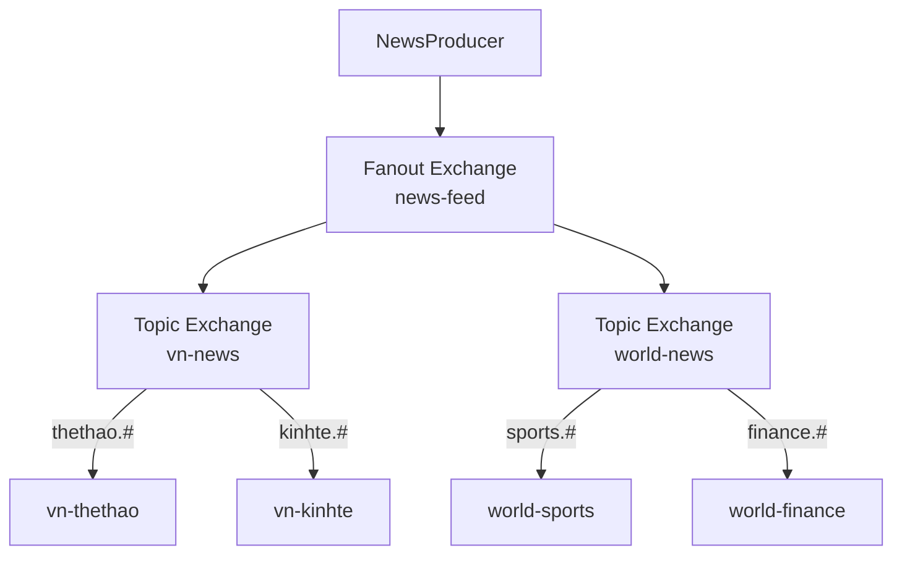

# Sử dụng binding Exchange to Exchange trong RabbitMQ

Exchange-to-Exchange Binding là tính năng nâng cao của RabbitMQ cho phép một exchange chuyển tiếp tin nhắn tới exchange khác thay vì gửi thẳng tới queue. Nhờ đó bạn xây dựng được chuỗi định tuyến phân cấp, mỗi exchange chỉ lo một tiêu chí lọc, giúp hệ thống dễ mở rộng và bảo trì hơn. Bài này hướng dẫn cách dùng qua ví dụ hệ thống tin tức đa cấp.

## Exchange-to-Exchange Binding là gì?

**Exchange-to-Exchange Binding** (liên kết Exchange-đến-Exchange — cơ chế cho phép một Exchange định tuyến tin nhắn tới Exchange khác thay vì trực tiếp tới Queue) là tính năng nâng cao của RabbitMQ cho phép tạo chuỗi xử lý tin nhắn phức tạp theo dạng phân cấp.

Thay vì cấu trúc truyền thống:
```
Producer --> Exchange --> Queue --> Consumer
```

Exchange-to-Exchange cho phép:
```
Producer --> Exchange A --> Exchange B --> Queue --> Consumer
                       `--> Exchange C --> Queue --> Consumer
```

Sơ đồ dưới đây minh họa chuỗi định tuyến phân cấp: một Fanout Exchange gốc chuyển tiếp tin nhắn sang các Topic Exchange theo vùng, rồi mới tới Queue:



Nhờ tách thành nhiều tầng, mỗi Exchange chỉ lo một tiêu chí lọc (vùng, rồi chuyên mục), giúp hệ thống dễ mở rộng mà không phải sửa Producer.

## Tại sao cần Exchange-to-Exchange?

Trong hệ thống lớn, một tin nhắn có thể cần qua nhiều giai đoạn lọc/phân phối:

1. **Phân cấp định tuyến**: Lọc theo khu vực, sau đó lọc theo loại sản phẩm.
2. **Tái sử dụng cấu hình**: Nhiều ứng dụng dùng chung một Exchange đầu vào.
3. **Tách biệt quan tâm** (Separation of Concerns): Mỗi Exchange chịu trách nhiệm một tiêu chí định tuyến.

## Ví dụ thực tế: Hệ thống tin tức đa cấp

### Cấu trúc hệ thống

```
NewsProducer --> [Fanout Exchange: "news-feed"]
                    ├── [Topic Exchange: "vn-news"]
                    │       ├── "thethao.#"  --> Queue "vn-thethao"  --> Consumer
                    │       └── "kinhte.#"   --> Queue "vn-kinhte"   --> Consumer
                    └── [Topic Exchange: "world-news"]
                            ├── "sports.#"   --> Queue "world-sports" --> Consumer
                            └── "finance.#"  --> Queue "world-finance"--> Consumer
```

### Thiết lập hệ thống Exchange phân cấp

```java
import com.rabbitmq.client.*;

public class ExchangeToExchangeSetup {

    // Exchange cấp 1: Nhận mọi tin tức và phát đến các Exchange theo vùng
    public static final String ROOT_EXCHANGE = "news-feed";

    // Exchange cấp 2: Theo vùng địa lý
    public static final String VN_EXCHANGE    = "vn-news";
    public static final String WORLD_EXCHANGE = "world-news";

    // Queue cuối cùng
    public static final String VN_SPORTS_QUEUE    = "vn-thethao";
    public static final String VN_ECONOMY_QUEUE   = "vn-kinhte";
    public static final String WORLD_SPORTS_QUEUE = "world-sports";
    public static final String WORLD_FINANCE_QUEUE = "world-finance";

    public static void setup(Channel channel) throws Exception {
        // Khai báo Exchange cấp 1 (Fanout)
        channel.exchangeDeclare(ROOT_EXCHANGE, BuiltinExchangeType.FANOUT, true, false, null);

        // Khai báo Exchange cấp 2 (Topic)
        channel.exchangeDeclare(VN_EXCHANGE,    BuiltinExchangeType.TOPIC, true, false, null);
        channel.exchangeDeclare(WORLD_EXCHANGE, BuiltinExchangeType.TOPIC, true, false, null);

        // Khai báo Queue
        channel.queueDeclare(VN_SPORTS_QUEUE,    true, false, false, null);
        channel.queueDeclare(VN_ECONOMY_QUEUE,   true, false, false, null);
        channel.queueDeclare(WORLD_SPORTS_QUEUE, true, false, false, null);
        channel.queueDeclare(WORLD_FINANCE_QUEUE, true, false, false, null);

        // ==== Binding Exchange-to-Exchange ====
        // Dùng exchangeBind(destination, source, routingKey)
        // ROOT_EXCHANGE (fanout) --> VN_EXCHANGE (fanout bỏ qua routing key)
        channel.exchangeBind(VN_EXCHANGE,    ROOT_EXCHANGE, "");
        channel.exchangeBind(WORLD_EXCHANGE, ROOT_EXCHANGE, "");

        // ==== Binding Queue vào Exchange cấp 2 ====
        channel.queueBind(VN_SPORTS_QUEUE,    VN_EXCHANGE,    "thethao.#");
        channel.queueBind(VN_ECONOMY_QUEUE,   VN_EXCHANGE,    "kinhte.#");
        channel.queueBind(WORLD_SPORTS_QUEUE, WORLD_EXCHANGE, "sports.#");
        channel.queueBind(WORLD_FINANCE_QUEUE, WORLD_EXCHANGE, "finance.#");

        System.out.println("Hệ thống Exchange phân cấp đã được thiết lập.");
    }
}
```

### Producer: Gửi tin tức

```java
import com.rabbitmq.client.*;

public class NewsProducer {

    public static void main(String[] args) throws Exception {
        ConnectionFactory factory = new ConnectionFactory();
        factory.setHost("localhost");

        try (Connection connection = factory.newConnection();
             Channel channel = connection.createChannel()) {

            ExchangeToExchangeSetup.setup(channel);

            // Gửi các tin với routing key khác nhau
            // ROOT_EXCHANGE là fanout → phát đến VN_EXCHANGE và WORLD_EXCHANGE
            // VN_EXCHANGE và WORLD_EXCHANGE là topic → lọc theo routing key

            publishNews(channel, "thethao.bongda.v-league", "V-League 2024: Hà Nội FC thắng 3-0");
            publishNews(channel, "kinhte.chungkhoan",       "VN-Index tăng mạnh 15 điểm");
            publishNews(channel, "sports.football.premier", "Premier League: Man City vs Arsenal");
            publishNews(channel, "finance.crypto",          "Bitcoin reaches new all-time high");
            publishNews(channel, "thethao.tennis",          "Giải tennis quốc tế tại Hà Nội");
            publishNews(channel, "chinhtri.quocte",         "Tin chính trị quốc tế"); // không khớp queue nào
        }
    }

    private static void publishNews(Channel channel, String routingKey, String headline)
            throws Exception {
        AMQP.BasicProperties props = new AMQP.BasicProperties.Builder()
                .contentType("text/plain")
                .deliveryMode(2)
                .build();

        // Gửi tới ROOT_EXCHANGE với routing key
        // ROOT_EXCHANGE là fanout → chuyển tiếp tới VN_EXCHANGE và WORLD_EXCHANGE
        // Các Exchange cấp 2 dùng routing key để lọc tiếp
        channel.basicPublish(ExchangeToExchangeSetup.ROOT_EXCHANGE, routingKey, props,
                headline.getBytes("UTF-8"));

        System.out.printf("[Producer] key='%s' | '%s'%n", routingKey, headline);
    }
}
```

### Consumer: Đọc tin theo chuyên mục

```java
import com.rabbitmq.client.*;

public class NewsConsumer {

    public static void main(String[] args) throws Exception {
        if (args.length == 0) {
            System.err.println("Dùng: NewsConsumer <vn-thethao|vn-kinhte|world-sports|world-finance>");
            return;
        }

        String queueName = args[0];
        ConnectionFactory factory = new ConnectionFactory();
        factory.setHost("localhost");

        Connection connection = factory.newConnection();
        Channel channel = connection.createChannel();
        ExchangeToExchangeSetup.setup(channel);

        System.out.println("[Reader:" + queueName + "] Đang đọc tin tức...");

        channel.basicConsume(queueName, true, (tag, delivery) -> {
            String routingKey = delivery.getEnvelope().getRoutingKey();
            String headline   = new String(delivery.getBody(), "UTF-8");
            System.out.printf("[Reader:%s] key='%s' | '%s'%n", queueName, routingKey, headline);
        }, tag -> {});
    }
}
```

## Phân tích luồng tin nhắn

```
"thethao.bongda.v-league" →
    ROOT_EXCHANGE (fanout) → VN_EXCHANGE + WORLD_EXCHANGE
    VN_EXCHANGE:    "thethao.#" khớp → vn-thethao ✓
    WORLD_EXCHANGE: "sports.#" không khớp, "finance.#" không khớp

"sports.football.premier" →
    ROOT_EXCHANGE (fanout) → VN_EXCHANGE + WORLD_EXCHANGE
    VN_EXCHANGE:    "thethao.#" không khớp, "kinhte.#" không khớp
    WORLD_EXCHANGE: "sports.#" khớp → world-sports ✓
```

## Xóa Exchange-to-Exchange Binding

```java
// Gỡ binding Exchange-to-Exchange
channel.exchangeUnbind(
    VN_EXCHANGE,    // destination exchange
    ROOT_EXCHANGE,  // source exchange
    ""              // routing key
);
```

## Khi nào dùng Exchange-to-Exchange?

| Tình huống | Giải pháp |
|-----------|----------|
| Nhiều ứng dụng dùng chung một điểm nhận tin | Exchange cấp 1 (fanout) → nhiều Exchange cấp 2 |
| Định tuyến theo nhiều tiêu chí phân cấp | Chain nhiều Topic Exchange |
| Thêm bộ lọc mà không thay đổi code Producer | Thêm Exchange trung gian |
| Mở rộng hệ thống mà không downtime | Bind thêm Exchange mới vào chain |

## Tổng kết

Exchange-to-Exchange Binding là tính năng mạnh mẽ giúp xây dựng hệ thống định tuyến tin nhắn phân cấp, linh hoạt. Thay vì một Exchange phức tạp xử lý mọi quy tắc, bạn có thể chia nhỏ thành nhiều Exchange chuyên biệt theo nguyên tắc **Single Responsibility** (mỗi thứ chỉ làm một việc), dễ bảo trì và mở rộng hơn.
