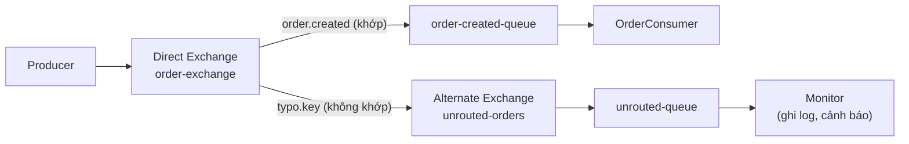

# Sử dụng Alternate Exchange trong RabbitMQ

Alternate Exchange là cơ chế dự phòng trong RabbitMQ, dùng để hứng những tin nhắn không khớp với bất kỳ binding nào của exchange chính. Thay vì để tin nhắn bị mất âm thầm khi gõ sai routing key hay thiếu binding, chúng được chuyển sang exchange thay thế để ghi log và xử lý. Bài này hướng dẫn cách thiết lập Alternate Exchange qua ví dụ hệ thống đơn hàng có fallback.

## Alternate Exchange là gì?

**Alternate Exchange** (Exchange thay thế — Exchange dự phòng nhận các tin nhắn không được định tuyến thành công bởi Exchange chính) là một cơ chế an toàn trong RabbitMQ. Khi một tin nhắn gửi tới Exchange chính nhưng **không khớp với bất kỳ binding nào**, thay vì bị mất âm thầm, tin nhắn sẽ được chuyển tiếp tới Alternate Exchange.

## Vấn đề không có Alternate Exchange

```
Producer --> [Direct Exchange] -- "order.created" --> Queue "order-queue" ✓
                               -- "typo.routingkey" --> ??? (TIN NHẮN MẤT!)
```

Khi routing key không khớp mà không có Alternate Exchange:
- Nếu tin nhắn là **mandatory** (bắt buộc giao): Producer nhận lại tin nhắn qua callback `ReturnListener`.
- Nếu không phải mandatory: Tin nhắn bị **silently dropped** (bị hủy âm thầm không có thông báo).

## Alternate Exchange giải quyết vấn đề

```
Producer --> [Direct Exchange "main-exchange"]
                -- "order.created" --> Queue "order-queue"    ✓
                -- "typo.key"      --> [Alternate Exchange "unrouted-exchange"]
                                            --> Queue "unrouted-queue"
                                                    --> Consumer (cảnh báo, ghi log)
```

Sơ đồ sau minh họa cơ chế dự phòng: tin nhắn khớp binding thì vào Queue bình thường, còn tin nhắn không khớp sẽ được chuyển sang Alternate Exchange thay vì bị mất:



Nhờ khai báo argument `alternate-exchange`, mọi tin nhắn không định tuyến được đều được gom về một chỗ để theo dõi, tránh mất tin nhắn âm thầm.

## Ví dụ thực tế: Hệ thống xử lý đơn hàng với fallback

### Thiết lập Alternate Exchange

```java
import com.rabbitmq.client.*;
import java.util.HashMap;
import java.util.Map;

public class AlternateExchangeSetup {

    public static final String MAIN_EXCHANGE      = "order-exchange";
    public static final String ALTERNATE_EXCHANGE = "unrouted-orders";
    public static final String UNROUTED_QUEUE     = "unrouted-queue";

    public static void setup(Channel channel) throws Exception {
        // Bước 1: Tạo Alternate Exchange (thường dùng Fanout để nhận mọi tin nhắn không định tuyến được)
        channel.exchangeDeclare(ALTERNATE_EXCHANGE, BuiltinExchangeType.FANOUT, true, false, null);

        // Bước 2: Tạo Queue để chứa tin nhắn không định tuyến được
        channel.queueDeclare(UNROUTED_QUEUE, true, false, false, null);
        channel.queueBind(UNROUTED_QUEUE, ALTERNATE_EXCHANGE, "");

        // Bước 3: Tạo Exchange chính VÀ liên kết với Alternate Exchange
        // Dùng argument "alternate-exchange" để chỉ định Exchange dự phòng
        Map<String, Object> mainExchangeArgs = new HashMap<>();
        mainExchangeArgs.put("alternate-exchange", ALTERNATE_EXCHANGE);

        channel.exchangeDeclare(MAIN_EXCHANGE, BuiltinExchangeType.DIRECT,
                true, false, mainExchangeArgs);

        // Bước 4: Tạo các Queue bình thường và bind vào Exchange chính
        channel.queueDeclare("order-created-queue", true, false, false, null);
        channel.queueDeclare("order-cancelled-queue", true, false, false, null);
        channel.queueDeclare("payment-queue", true, false, false, null);

        channel.queueBind("order-created-queue",   MAIN_EXCHANGE, "order.created");
        channel.queueBind("order-cancelled-queue", MAIN_EXCHANGE, "order.cancelled");
        channel.queueBind("payment-queue",         MAIN_EXCHANGE, "payment.processed");

        System.out.println("Alternate Exchange đã được thiết lập thành công.");
        System.out.println("Mọi tin nhắn không định tuyến được sẽ vào: " + UNROUTED_QUEUE);
    }
}
```

### Producer: Gửi tin nhắn (bao gồm cả routing key sai)

```java
import com.rabbitmq.client.*;

public class OrderProducer {

    public static void main(String[] args) throws Exception {
        ConnectionFactory factory = new ConnectionFactory();
        factory.setHost("localhost");

        try (Connection connection = factory.newConnection();
             Channel channel = connection.createChannel()) {

            AlternateExchangeSetup.setup(channel);

            // Tin nhắn hợp lệ — sẽ được định tuyến đúng
            sendMessage(channel, "order.created",   "Đơn hàng #001 được tạo");
            sendMessage(channel, "order.cancelled", "Đơn hàng #002 bị hủy");
            sendMessage(channel, "payment.processed", "Thanh toán #101 thành công");

            // Tin nhắn với routing key KHÔNG KHỚP — sẽ vào Alternate Exchange
            sendMessage(channel, "order.shipped",   "Đơn hàng #003 đã giao"); // chưa có binding này
            sendMessage(channel, "order.refunded",  "Hoàn tiền cho đơn #004"); // chưa có binding
            sendMessage(channel, "xyz.unknown.key", "Tin nhắn với routing key lạ");
        }
    }

    private static void sendMessage(Channel channel, String routingKey, String content)
            throws Exception {
        AMQP.BasicProperties props = new AMQP.BasicProperties.Builder()
                .contentType("text/plain")
                .deliveryMode(2)
                .build();

        channel.basicPublish(AlternateExchangeSetup.MAIN_EXCHANGE, routingKey, props,
                content.getBytes("UTF-8"));

        System.out.printf("[Producer] Gửi key='%s' | '%s'%n", routingKey, content);
    }
}
```

### Consumer bình thường: Xử lý đơn hàng

```java
import com.rabbitmq.client.*;

public class OrderConsumer {

    public static void main(String[] args) throws Exception {
        ConnectionFactory factory = new ConnectionFactory();
        factory.setHost("localhost");

        Connection connection = factory.newConnection();
        Channel channel = connection.createChannel();
        AlternateExchangeSetup.setup(channel);

        // Nhận tin nhắn từ queue order-created
        channel.basicConsume("order-created-queue", true, (tag, delivery) -> {
            String message = new String(delivery.getBody(), "UTF-8");
            System.out.println("[OrderConsumer] Xử lý đơn hàng mới: " + message);
        }, tag -> {});
    }
}
```

### Consumer đặc biệt: Theo dõi tin nhắn không định tuyến được

```java
import com.rabbitmq.client.*;

public class UnroutedMessageMonitor {

    public static void main(String[] args) throws Exception {
        ConnectionFactory factory = new ConnectionFactory();
        factory.setHost("localhost");

        Connection connection = factory.newConnection();
        Channel channel = connection.createChannel();
        AlternateExchangeSetup.setup(channel);

        System.out.println("[Monitor] Theo dõi tin nhắn không định tuyến được...");

        channel.basicConsume(AlternateExchangeSetup.UNROUTED_QUEUE, true, (tag, delivery) -> {
            String routingKey = delivery.getEnvelope().getRoutingKey();
            String content    = new String(delivery.getBody(), "UTF-8");
            String exchange   = delivery.getEnvelope().getExchange();

            // Ghi log cảnh báo — thông báo cho team dev về routing key chưa có binding
            System.out.printf("[CẢNH BÁO] Tin nhắn không định tuyến được!%n");
            System.out.printf("  Exchange gốc: %s%n", exchange);
            System.out.printf("  Routing Key: %s%n", routingKey);
            System.out.printf("  Nội dung: %s%n", content);
            System.out.println("  → Cần kiểm tra: Routing Key có đúng không? Binding đã được tạo chưa?");
            System.out.println("---");
        }, tag -> {});
    }
}
```

## Cấu hình Alternate Exchange qua Policy

Thay vì cấu hình trong code, bạn có thể cấu hình qua **Policy** (chính sách — quy tắc áp dụng tự động cho Exchange/Queue theo pattern) trong RabbitMQ:

```bash
# Áp dụng alternate-exchange cho tất cả exchange có tên bắt đầu bằng "main-"
rabbitmqctl set_policy AE "^main-" \
    '{"alternate-exchange": "unrouted-exchange"}' \
    --apply-to exchanges
```

## Alternate Exchange qua Management UI

1. Vào tab **Exchanges** > **Add a new exchange**.
2. Mở rộng **Arguments**.
3. Thêm argument: Key = `alternate-exchange`, Value = tên của Alternate Exchange.

## Khi nào cần Alternate Exchange?

| Tình huống | Lợi ích |
|-----------|--------|
| Hệ thống production quan trọng | Không mất tin nhắn do lỗi routing key |
| Phát triển và debug | Phát hiện routing key sai ngay lập tức |
| Migration (chuyển đổi hệ thống) | Bắt tin nhắn có routing key cũ chưa được cập nhật |
| Audit trail (nhật ký kiểm toán) | Ghi lại mọi tin nhắn không xử lý được |

## Tổng kết

Alternate Exchange là cơ chế phòng thủ quan trọng trong hệ thống production. Nó đảm bảo không có tin nhắn nào bị mất âm thầm do lỗi cấu hình routing, đồng thời cung cấp vị trí tập trung để monitor và xử lý các trường hợp bất thường.
