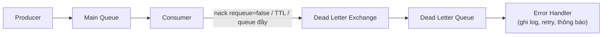

# Sử dụng Dead Letter Exchange trong RabbitMQ

Dead Letter Exchange (DLX) là cơ chế xử lý lỗi trong RabbitMQ, dùng để hứng những tin nhắn bị "chết" — tức bị consumer từ chối, hết hạn TTL hoặc queue đã đầy. Thay vì để chúng biến mất, DLX chuyển tin nhắn sang một queue riêng để ghi log, phân tích hoặc thử lại (retry). Bài này hướng dẫn cách thiết lập DLX và mẫu retry qua ví dụ xử lý thanh toán.

## Dead Letter Exchange là gì?

**Dead Letter Exchange - DLX** (Exchange thư chết — Exchange nhận các tin nhắn bị "chết" từ queue khác, tức là tin nhắn không thể xử lý thành công) là cơ chế xử lý lỗi quan trọng trong RabbitMQ. Tin nhắn trở thành **Dead Letter** (thư chết — tin nhắn không thể được xử lý và bị loại khỏi queue bình thường) khi xảy ra một trong các trường hợp:

1. **Bị từ chối** (rejected) bởi consumer với `requeue=false` (không đưa lại vào queue).
2. **Hết hạn** (expired) vì TTL (Time-To-Live — thời gian sống của tin nhắn) đã qua.
3. **Queue đầy** vì đã đạt giới hạn `x-max-length` (số lượng tin nhắn tối đa trong queue).

## Kiến trúc Dead Letter

```
Producer --> [Main Queue] --> Consumer (xử lý lỗi, basicNack/requeue=false)
                  |
                  |-- (tin nhắn chết)
                  ↓
         [Dead Letter Exchange]
                  |
                  ↓
         [Dead Letter Queue] --> Error Handler (ghi log, retry, thông báo)
```

Sơ đồ sau minh họa hành trình của một tin nhắn "chết": khi bị từ chối, hết TTL hoặc queue đầy, nó được chuyển sang DLX rồi vào Dead Letter Queue để xử lý riêng:



Nhờ DLX, tin nhắn lỗi không biến mất mà được gom về một Queue riêng; kết hợp với TTL còn có thể tự động thử lại (retry) sau một khoảng thời gian.

## Ví dụ thực tế: Hệ thống xử lý thanh toán với retry

### Thiết lập DLX

```java
import com.rabbitmq.client.*;
import java.util.HashMap;
import java.util.Map;

public class DeadLetterSetup {

    // Queue và Exchange chính
    public static final String MAIN_EXCHANGE = "payment-exchange";
    public static final String MAIN_QUEUE    = "payment-queue";

    // Dead Letter Exchange và Queue
    public static final String DLX_NAME      = "payment-dlx";
    public static final String DL_QUEUE_NAME = "payment-dead-letter";

    // Retry Exchange và Queue (để retry sau một khoảng thời gian)
    public static final String RETRY_EXCHANGE = "payment-retry-exchange";
    public static final String RETRY_QUEUE    = "payment-retry-queue";

    public static void setup(Channel channel) throws Exception {
        // --- Thiết lập Dead Letter Exchange ---
        channel.exchangeDeclare(DLX_NAME, BuiltinExchangeType.DIRECT, true, false, null);

        // Queue chứa tin nhắn chết để phân tích
        channel.queueDeclare(DL_QUEUE_NAME, true, false, false, null);
        channel.queueBind(DL_QUEUE_NAME, DLX_NAME, "payment.failed");

        // --- Thiết lập Main Exchange và Queue ---
        channel.exchangeDeclare(MAIN_EXCHANGE, BuiltinExchangeType.DIRECT, true, false, null);

        // Cấu hình Queue chính với DLX
        Map<String, Object> queueArgs = new HashMap<>();
        // Khi tin nhắn "chết", chuyển tới DLX này
        queueArgs.put("x-dead-letter-exchange", DLX_NAME);
        // Routing key sẽ dùng khi chuyển tới DLX (nếu không set, dùng routing key gốc)
        queueArgs.put("x-dead-letter-routing-key", "payment.failed");
        // TTL: Tin nhắn tự động "chết" sau 30 giây nếu chưa được xử lý
        queueArgs.put("x-message-ttl", 30_000);
        // Giới hạn tối đa 1000 tin nhắn trong queue
        queueArgs.put("x-max-length", 1000);

        channel.queueDeclare(MAIN_QUEUE, true, false, false, queueArgs);
        channel.queueBind(MAIN_QUEUE, MAIN_EXCHANGE, "payment.process");

        System.out.println("Dead Letter Exchange đã được thiết lập.");
    }
}
```

### Producer: Gửi yêu cầu thanh toán

```java
import com.rabbitmq.client.*;
import java.util.Map;

public class PaymentProducer {

    public static void main(String[] args) throws Exception {
        ConnectionFactory factory = new ConnectionFactory();
        factory.setHost("localhost");

        try (Connection connection = factory.newConnection();
             Channel channel = connection.createChannel()) {

            DeadLetterSetup.setup(channel);

            // Gửi các yêu cầu thanh toán (một số sẽ thất bại)
            String[] payments = {
                "PAY-001:500000",   // Thanh toán thành công
                "PAY-002:invalid",  // Sẽ thất bại — dữ liệu không hợp lệ
                "PAY-003:750000",   // Thanh toán thành công
                "PAY-004:-100",     // Sẽ thất bại — số tiền âm
                "PAY-005:1000000",  // Thanh toán thành công
            };

            for (String payment : payments) {
                AMQP.BasicProperties props = new AMQP.BasicProperties.Builder()
                        .contentType("text/plain")
                        .deliveryMode(2)
                        .headers(Map.of(
                            "attempt", 1,
                            "source", "checkout-service"
                        ))
                        .build();

                channel.basicPublish(DeadLetterSetup.MAIN_EXCHANGE, "payment.process",
                        props, payment.getBytes("UTF-8"));
                System.out.println("[Producer] Gửi: " + payment);
            }
        }
    }
}
```

### Consumer: Xử lý thanh toán với logic từ chối

```java
import com.rabbitmq.client.*;

public class PaymentConsumer {

    public static void main(String[] args) throws Exception {
        ConnectionFactory factory = new ConnectionFactory();
        factory.setHost("localhost");

        Connection connection = factory.newConnection();
        Channel channel = connection.createChannel();
        DeadLetterSetup.setup(channel);
        channel.basicQos(1);

        System.out.println("[PaymentConsumer] Đang xử lý thanh toán...");

        channel.basicConsume(DeadLetterSetup.MAIN_QUEUE, false, (tag, delivery) -> {
            String data    = new String(delivery.getBody(), "UTF-8");
            long deliveryTag = delivery.getEnvelope().getDeliveryTag();

            System.out.println("[PaymentConsumer] Nhận: " + data);

            try {
                // Parse dữ liệu thanh toán
                String[] parts  = data.split(":");
                String paymentId = parts[0];
                int amount       = Integer.parseInt(parts[1]);

                if (amount <= 0) {
                    throw new IllegalArgumentException("Số tiền phải lớn hơn 0");
                }

                // Giả lập xử lý thanh toán
                System.out.println("[PaymentConsumer] Thanh toán " + paymentId + " thành công: " + amount + " VND");

                // Xác nhận thành công — tin nhắn bị xóa khỏi queue
                channel.basicAck(deliveryTag, false);

            } catch (Exception e) {
                System.err.println("[PaymentConsumer] LỖI xử lý " + data + ": " + e.getMessage());

                // Từ chối tin nhắn với requeue=false
                // → Tin nhắn sẽ được chuyển tới Dead Letter Exchange
                channel.basicNack(deliveryTag, false, false);
            }
        }, tag -> {});
    }
}
```

### Dead Letter Consumer: Xử lý tin nhắn lỗi

```java
import com.rabbitmq.client.*;
import java.util.Map;
import java.util.List;

public class DeadLetterConsumer {

    public static void main(String[] args) throws Exception {
        ConnectionFactory factory = new ConnectionFactory();
        factory.setHost("localhost");

        Connection connection = factory.newConnection();
        Channel channel = connection.createChannel();
        DeadLetterSetup.setup(channel);

        System.out.println("[DLConsumer] Theo dõi tin nhắn lỗi...");

        channel.basicConsume(DeadLetterSetup.DL_QUEUE_NAME, true, (tag, delivery) -> {
            String data = new String(delivery.getBody(), "UTF-8");

            // RabbitMQ tự động thêm header "x-death" chứa lịch sử dead letter
            Map<String, Object> headers = delivery.getProperties().getHeaders();

            System.out.println("==== TIN NHẮN LỖI ====");
            System.out.println("Nội dung: " + data);
            System.out.println("Routing Key gốc: " + delivery.getEnvelope().getRoutingKey());

            // x-death: danh sách thông tin về mỗi lần tin nhắn bị "chết"
            if (headers != null && headers.containsKey("x-death")) {
                List<?> xDeathList = (List<?>) headers.get("x-death");
                System.out.println("Lịch sử dead letter:");
                for (Object xDeath : xDeathList) {
                    System.out.println("  " + xDeath);
                }
            }

            // Ở đây có thể: ghi vào database, gửi email thông báo, thêm vào retry queue...
            System.out.println("→ Đã ghi log lỗi vào hệ thống.");
            System.out.println("======================");
        }, tag -> {});
    }
}
```

## Retry Pattern với DLX và TTL

Kết hợp DLX với TTL để tự động retry sau một khoảng thời gian:

```java
// Tạo Retry Queue với TTL và DLX trỏ ngược về main exchange
Map<String, Object> retryArgs = new HashMap<>();
retryArgs.put("x-dead-letter-exchange", DeadLetterSetup.MAIN_EXCHANGE);    // Sau TTL, gửi lại về main
retryArgs.put("x-dead-letter-routing-key", "payment.process");
retryArgs.put("x-message-ttl", 60_000); // Chờ 60 giây rồi retry

channel.queueDeclare("payment-retry", true, false, false, retryArgs);
channel.queueBind("payment-retry", DeadLetterSetup.DLX_NAME, "payment.retry");
```

Luồng Retry:
```
Main Queue --> [Lỗi] --> DLX --> payment-retry (chờ 60s TTL)
                                       |
                            (sau 60s, tin nhắn "chết" do TTL)
                                       |
                                       ↓
                              Main Exchange --> Main Queue (retry lần 2)
```

## Tổng kết các trường hợp Dead Letter

| Nguyên nhân | Điều kiện |
|-------------|----------|
| Consumer từ chối | `basicNack(tag, false, false)` hoặc `basicReject(tag, false)` |
| Tin nhắn hết hạn TTL | Queue có `x-message-ttl` hoặc tin nhắn có `expiration` |
| Queue đầy | Queue có `x-max-length` bị vượt quá |

## Tổng kết

Dead Letter Exchange là công cụ thiết yếu trong production để đảm bảo không có tin nhắn nào bị mất và mọi lỗi đều được ghi lại. Kết hợp với Retry Pattern, bạn có thể xây dựng hệ thống xử lý tin nhắn có khả năng tự phục hồi, giảm thiểu can thiệp thủ công khi xảy ra lỗi tạm thời.
