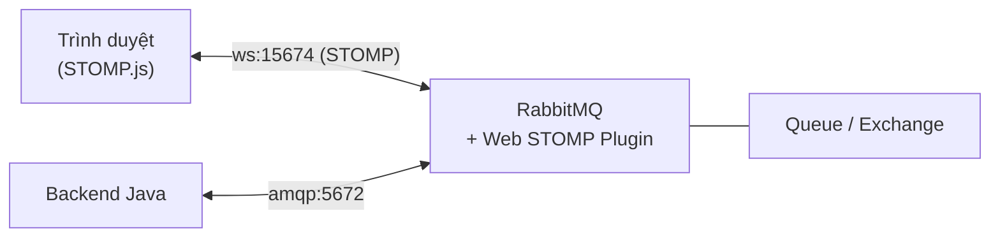

# Kết nối RabbitMQ sử dụng Web STOMP Plugin

Web STOMP Plugin là tiện ích cho phép ứng dụng web chạy trên trình duyệt kết nối trực tiếp với RabbitMQ qua WebSocket và giao thức STOMP, mà không cần backend làm trung gian. Nhờ đó frontend có thể nhận và gửi tin nhắn theo thời gian thực, rất hợp với chat, thông báo trực tiếp hay bảng giám sát. Bài này hướng dẫn cách bật plugin và kết nối từ cả Java lẫn JavaScript trên trình duyệt.

:::note[Ghi nhớ nhanh]

- ⭐ **`Web STOMP Plugin` cho ứng dụng web trong trình duyệt kết nối trực tiếp `RabbitMQ` qua `WebSocket` + giao thức `STOMP`** — không cần backend làm trung gian.
- **Bật bằng `rabbitmq-plugins enable rabbitmq_web_stomp`** — lắng nghe cổng `15674` (ws://) và `15673` (wss:// qua TLS).
- ⭐ **Kết nối được từ cả JavaScript (STOMP.js, phổ biến nhất) lẫn Java** (Spring `spring-messaging`/`spring-websocket`).
- **Ánh xạ STOMP destination sang RabbitMQ** — `/queue/<tên>`, `/exchange/<tên>/<routingKey>`, `/topic/<tên>`...
- **Hợp với ứng dụng real-time** — chat room, live notification, bảng giám sát; backend Java vẫn gửi/nhận qua AMQP trên cùng Queue.

:::

## Web STOMP Plugin là gì?

**Web STOMP Plugin** (tiện ích mở rộng WebSocket STOMP — cho phép ứng dụng web trong trình duyệt kết nối trực tiếp với RabbitMQ qua WebSocket và giao thức STOMP) là cầu nối giúp frontend JavaScript có thể nhận/gửi tin nhắn RabbitMQ theo thời gian thực mà không cần backend proxy.

**STOMP - Simple Text Oriented Messaging Protocol** (giao thức nhắn tin hướng văn bản đơn giản — giao thức nhắn tin nhẹ dựa trên text, dễ triển khai trên nhiều ngôn ngữ và môi trường) là giao thức tầng ứng dụng hoạt động trên nền **WebSocket** (giao thức truyền thông hai chiều thời gian thực giữa trình duyệt và server).

Sơ đồ dưới đây minh họa cách trình duyệt kết nối thẳng tới RabbitMQ qua WebSocket STOMP, trong khi backend Java vẫn gửi/nhận qua AMQP trên cùng một Queue:



Nhờ plugin, frontend nhận tin nhắn theo thời gian thực mà không cần backend làm trung gian; hai phía chỉ cần trỏ vào cùng Queue/Exchange trên broker.

## Kích hoạt Web STOMP Plugin

```bash
# Bật plugin Web STOMP
rabbitmq-plugins enable rabbitmq_web_stomp

# Kiểm tra plugin đã bật
rabbitmq-plugins list | grep stomp
```

Sau khi bật, RabbitMQ lắng nghe tại:
- **Port 15674**: WebSocket STOMP (ws://)
- **Port 15673**: WebSocket STOMP qua TLS (wss://)

## Sử dụng Web STOMP từ Java (Server-side STOMP)

Thêm dependency `spring-messaging` hoặc dùng thư viện STOMP client:

```xml
<dependencies>
    <!-- STOMP client cho Java -->
    <dependency>
        <groupId>org.springframework</groupId>
        <artifactId>spring-messaging</artifactId>
        <version>6.1.5</version>
    </dependency>
    <dependency>
        <groupId>org.springframework</groupId>
        <artifactId>spring-websocket</artifactId>
        <version>6.1.5</version>
    </dependency>
    <!-- Hoặc dùng thư viện nhẹ hơn -->
    <dependency>
        <groupId>com.rabbitmq</groupId>
        <artifactId>amqp-client</artifactId>
        <version>5.20.0</version>
    </dependency>
</dependencies>
```

### Kết nối STOMP qua WebSocket bằng Java

```java
import org.springframework.messaging.converter.StringMessageConverter;
import org.springframework.messaging.simp.stomp.*;
import org.springframework.web.socket.client.WebSocketClient;
import org.springframework.web.socket.client.standard.StandardWebSocketClient;
import org.springframework.web.socket.messaging.WebSocketStompClient;

import java.lang.reflect.Type;
import java.util.concurrent.CountDownLatch;
import java.util.concurrent.TimeUnit;

public class StompWebSocketClient {

    // URL kết nối WebSocket STOMP tới RabbitMQ
    private static final String STOMP_URL = "ws://localhost:15674/ws";

    public static void main(String[] args) throws Exception {
        // Tạo WebSocket client
        WebSocketClient webSocketClient = new StandardWebSocketClient();
        WebSocketStompClient stompClient = new WebSocketStompClient(webSocketClient);

        // Dùng StringMessageConverter để xử lý tin nhắn dạng text
        stompClient.setMessageConverter(new StringMessageConverter());

        CountDownLatch latch = new CountDownLatch(3); // Chờ nhận 3 tin nhắn

        // Kết nối tới RabbitMQ qua STOMP
        StompSessionHandler sessionHandler = new StompSessionHandlerAdapter() {

            @Override
            public void afterConnected(StompSession session, StompHeaders connectedHeaders) {
                System.out.println("[STOMP] Đã kết nối tới RabbitMQ!");

                // Subscribe (đăng ký nhận tin) từ queue
                // Trong STOMP với RabbitMQ: /queue/<tên-queue>
                session.subscribe("/queue/chat-room", new StompFrameHandler() {

                    @Override
                    public Type getPayloadType(StompHeaders headers) {
                        return String.class; // Kiểu dữ liệu của payload
                    }

                    @Override
                    public void handleFrame(StompHeaders headers, Object payload) {
                        System.out.println("[STOMP] Nhận tin nhắn: " + payload);
                        latch.countDown();
                    }
                });

                // Gửi tin nhắn sau khi kết nối
                // /exchange/<tên-exchange>/<routing-key>
                session.send("/exchange/amq.direct/chat.message", "Xin chào từ STOMP Client!");
                session.send("/queue/chat-room", "Tin nhắn trực tiếp vào queue");
            }

            @Override
            public void handleException(StompSession session, StompCommand command,
                    StompHeaders headers, byte[] payload, Throwable exception) {
                System.err.println("[STOMP] Lỗi: " + exception.getMessage());
            }

            @Override
            public void handleTransportError(StompSession session, Throwable exception) {
                System.err.println("[STOMP] Lỗi transport: " + exception.getMessage());
            }
        };

        // Thiết lập header xác thực
        StompHeaders connectHeaders = new StompHeaders();
        connectHeaders.setLogin("guest");
        connectHeaders.setPasscode("guest");
        connectHeaders.setHeartbeat(new long[]{10000, 10000}); // Heartbeat 10 giây

        stompClient.connectAsync(STOMP_URL, null, connectHeaders, sessionHandler);

        // Chờ nhận đủ tin nhắn
        boolean received = latch.await(10, TimeUnit.SECONDS);
        System.out.println("Đã nhận đủ tin nhắn: " + received);
    }
}
```

## Sử dụng Web STOMP từ JavaScript (Browser)

Đây là cách phổ biến nhất — kết nối trực tiếp từ trình duyệt:

```html
<!DOCTYPE html>
<html lang="vi">
<head>
    <meta charset="UTF-8">
    <title>RabbitMQ Web STOMP Demo</title>
    <!-- Thư viện STOMP.js và SockJS -->
    <script src="https://cdn.jsdelivr.net/npm/@stomp/stompjs@7/bundles/stomp.umd.js"></script>
</head>
<body>
    <h2>Chat Room - RabbitMQ Web STOMP</h2>
    <div id="messages" style="border:1px solid #ccc; height:200px; overflow-y:auto; padding:10px;"></div>
    <input id="messageInput" type="text" placeholder="Nhập tin nhắn..." style="width:300px">
    <button onclick="sendMessage()">Gửi</button>

    <script>
        const stompClient = new StompJs.Client({
            // Kết nối WebSocket tới RabbitMQ
            brokerURL: 'ws://localhost:15674/ws',

            connectHeaders: {
                login: 'guest',
                passcode: 'guest'
            },

            // Debug log
            debug: (str) => console.log('[STOMP Debug]', str),

            // Tự động kết nối lại sau 5 giây nếu mất kết nối
            reconnectDelay: 5000,

            onConnect: (frame) => {
                console.log('Đã kết nối tới RabbitMQ!', frame);

                // Subscribe nhận tin từ queue "chat-room"
                stompClient.subscribe('/queue/chat-room', (message) => {
                    const content = message.body;
                    const msgDiv = document.createElement('div');
                    msgDiv.textContent = content;
                    document.getElementById('messages').appendChild(msgDiv);
                });
            },

            onStompError: (frame) => {
                console.error('STOMP Error:', frame.headers['message']);
            }
        });

        // Kích hoạt kết nối
        stompClient.activate();

        function sendMessage() {
            const input = document.getElementById('messageInput');
            const message = input.value.trim();

            if (message && stompClient.connected) {
                // Gửi tới queue "chat-room" qua default exchange
                stompClient.publish({
                    destination: '/queue/chat-room',
                    body: message
                });
                input.value = '';
            }
        }
    </script>
</body>
</html>
```

## Ánh xạ STOMP Destination sang RabbitMQ

| STOMP Destination | RabbitMQ tương ứng |
|------------------|-------------------|
| `/queue/<tên>` | Queue có tên `<tên>` (qua default exchange) |
| `/exchange/<tên>/<routingKey>` | Exchange `<tên>` với routing key |
| `/topic/<tên>` | Topic exchange với routing key `<tên>` |
| `/amq/queue/<tên>` | Queue `<tên>` đã tồn tại sẵn |
| `/temp-queue/<tên>` | Queue tạm thời (server tự tạo) |

## Ví dụ Java gửi từ server tới browser

```java
import com.rabbitmq.client.*;

public class ServerToBrowserNotification {

    public static void main(String[] args) throws Exception {
        ConnectionFactory factory = new ConnectionFactory();
        factory.setHost("localhost");

        try (Connection connection = factory.newConnection();
             Channel channel = connection.createChannel()) {

            // Khai báo queue mà browser đang subscribe
            channel.queueDeclare("notifications", true, false, false, null);

            // Server gửi tin nhắn → Browser nhận qua WebSocket STOMP
            String notification = "{\"type\":\"alert\",\"message\":\"Hệ thống sẽ bảo trì lúc 22:00\"}";

            channel.basicPublish("", "notifications",
                    new AMQP.BasicProperties.Builder()
                            .contentType("application/json")
                            .deliveryMode(1) // Non-persistent cho notification
                            .build(),
                    notification.getBytes("UTF-8"));

            System.out.println("[Server] Đã gửi thông báo tới browser: " + notification);
        }
    }
}
```

## Cấu hình trong rabbitmq.conf

```ini
# Cấu hình Web STOMP
web_stomp.port = 15674
web_stomp.ssl.port = 15673
web_stomp.tcp_listen_options.backlog = 4096
```

## Tổng kết

Web STOMP Plugin là cầu nối lý tưởng cho các ứng dụng web cần thông báo thời gian thực (real-time). Ứng dụng phổ biến bao gồm: chat room, live notification, bảng điều khiển giám sát, cập nhật tiến trình tác vụ dài. Browser kết nối trực tiếp qua WebSocket mà không cần thêm infrastructure phức tạp.
