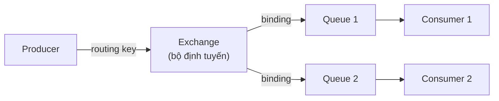
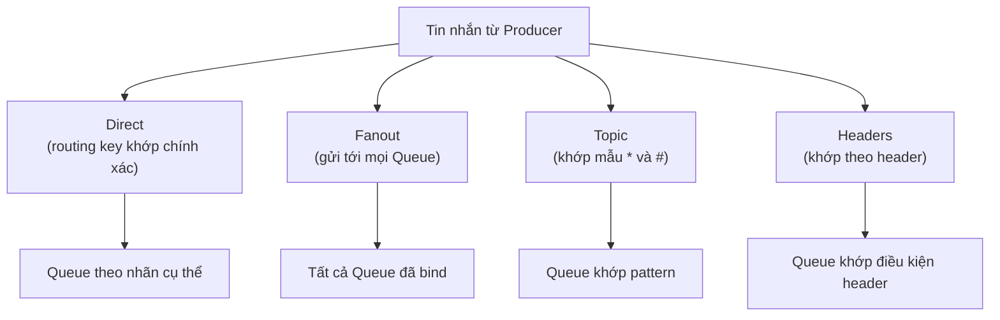

# Giới thiệu RabbitMQ

RabbitMQ là một message broker mã nguồn mở rất phổ biến, đóng vai trò trung gian nhận, lưu và chuyển tin nhắn giữa các ứng dụng trong hệ thống phân tán. Điểm mạnh của nó là cơ chế Exchange giúp định tuyến tin nhắn linh hoạt theo nhiều cách khác nhau. Bài này giới thiệu khái niệm tổng quan, kiến trúc và các loại Exchange của RabbitMQ; phần chi tiết nằm bên dưới.

:::note[Ghi nhớ nhanh]

- ⭐ **`RabbitMQ` là Message Broker viết bằng `Erlang`, triển khai giao thức `AMQP 0-9-1`** — rất phổ biến trong hệ thống phân tán.
- ⭐ **Điểm khác biệt với JMS là cơ chế `Exchange`** — tin nhắn luôn qua Exchange trước, chính Exchange (dựa vào routing key và binding) mới quyết định đưa vào Queue nào.
- **Bốn loại Exchange** — `Direct` (khớp chính xác), `Fanout` (gửi tới mọi Queue), `Topic` (khớp mẫu `*` và `#`), `Headers` (khớp theo header).
- **Thành phần chính** — `Producer`, `Exchange`, `Queue`, `Consumer`, `Binding`, `Routing Key`, `Virtual Host`, `Channel`.
- **Chạy với Java** — dùng thư viện `amqp-client`, kết nối qua cổng AMQP `5672` (mặc định `guest/guest`).

:::

## RabbitMQ là gì?

**RabbitMQ** (máy chủ hàng đợi tin nhắn mã nguồn mở phổ biến nhất thế giới) là một **Message Broker** (máy chủ trung gian nhận, lưu trữ và định tuyến tin nhắn) được viết bằng ngôn ngữ **Erlang**. RabbitMQ triển khai giao thức **AMQP 0-9-1** (Advanced Message Queuing Protocol — Giao thức hàng đợi tin nhắn nâng cao) và là lựa chọn hàng đầu trong các hệ thống phân tán hiện đại.

RabbitMQ được phát triển bởi **Pivotal** (nay là VMware) và hiện được sử dụng bởi hàng nghìn công ty trên toàn thế giới.

## So sánh RabbitMQ với ActiveMQ

| Tiêu chí | RabbitMQ | ActiveMQ |
|----------|----------|----------|
| Giao thức chính | AMQP | JMS (OpenWire) |
| Ngôn ngữ viết | Erlang | Java |
| Hiệu suất | Rất cao | Cao |
| Tính linh hoạt routing | Rất cao (Exchange types) | Trung bình |
| Hỗ trợ đa ngôn ngữ | Tốt (Python, Ruby, .NET...) | Chủ yếu Java |
| Giao diện quản lý | Web UI tích hợp sẵn | Web Console |
| Clustering | Tích hợp sẵn | Cần cấu hình thêm |

## Kiến trúc RabbitMQ

Điểm khác biệt lớn nhất của RabbitMQ so với JMS là cơ chế **Exchange** (bộ định tuyến — nhận tin nhắn từ Producer và quyết định gửi tới Queue nào dựa trên quy tắc):

```
Producer --> Exchange --> [Binding] --> Queue --> Consumer
```

Trực quan hơn, luồng tin nhắn đi qua các thành phần của RabbitMQ như sau:



Khác với JMS gửi thẳng vào Queue, ở RabbitMQ tin nhắn luôn qua **Exchange** trước; chính Exchange (dựa vào routing key và binding) mới quyết định tin nhắn được đưa vào Queue nào.

### Các thành phần chính

| Thành phần | Vai trò |
|-----------|---------|
| **Producer** | Bên sản xuất, gửi tin nhắn vào Exchange |
| **Exchange** | Bộ định tuyến, phân phối tin nhắn tới Queue theo quy tắc |
| **Queue** | Hàng đợi lưu trữ tin nhắn cho đến khi Consumer lấy |
| **Consumer** | Bên tiêu thụ, đăng ký và nhận tin nhắn từ Queue |
| **Binding** | Liên kết giữa Exchange và Queue, có thể kèm theo Routing Key |
| **Routing Key** | Khóa định tuyến — chuỗi nhãn Producer đính kèm vào tin nhắn để Exchange định tuyến |
| **Virtual Host (vhost)** | Không gian ảo cô lập, giống như namespace, mỗi vhost có Exchange/Queue riêng |
| **Channel** | Kênh giao tiếp ảo trong một Connection, giúp tái sử dụng kết nối TCP |

## Các loại Exchange trong RabbitMQ

**Exchange** là trái tim của RabbitMQ. Có 4 loại chính, mỗi loại định tuyến tin nhắn theo một cách riêng như sơ đồ tổng quan sau:



Bốn loại này sẽ được trình bày chi tiết trong các bài sau; ở đây chỉ cần nắm ý tưởng mỗi loại chọn Queue đích theo tiêu chí khác nhau.

### 1. Direct Exchange — Định tuyến trực tiếp

Tin nhắn được gửi tới Queue có **Routing Key** khớp chính xác với **Binding Key**.

```
Producer --> [Direct Exchange] --"order.created"--> Queue "DonHang"
                                --"user.signup" --> Queue "NguoiDung"
```

### 2. Fanout Exchange — Phát quảng bá

Tin nhắn được gửi tới **tất cả Queue** đã bind vào Exchange, bất kể Routing Key.

```
Producer --> [Fanout Exchange] --> Queue A (tất cả đều nhận)
                               --> Queue B
                               --> Queue C
```

### 3. Topic Exchange — Định tuyến theo mẫu

Sử dụng **wildcard** (ký tự đại diện) trong Routing Key:
- `*` khớp với **đúng một** từ.
- `#` khớp với **không hoặc nhiều** từ.

```
"order.#"  khớp với: "order.created", "order.paid", "order.shipped.vietnam"
"*.error"  khớp với: "payment.error", "order.error"
```

### 4. Headers Exchange — Định tuyến theo header

Không dùng Routing Key mà dùng **thuộc tính header** (tiêu đề) của tin nhắn để định tuyến.

## Tại sao chọn RabbitMQ?

1. **Hiệu suất cao**: Xử lý hàng triệu tin nhắn mỗi giây.
2. **Routing linh hoạt**: 4 loại Exchange cho phép định tuyến phức tạp.
3. **Độ tin cậy**: Hỗ trợ **persistence** (lưu trữ bền vững), **acknowledgment** (xác nhận), **transactions** (giao dịch).
4. **Clustering & High Availability**: Triển khai cụm máy chủ dễ dàng.
5. **Đa ngôn ngữ**: Client library cho Java, Python, Ruby, .NET, Go, PHP...
6. **Plugin phong phú**: Hỗ trợ STOMP, MQTT, WebSocket, OAuth 2.0...

## Ví dụ đơn giản với Java

```java
import com.rabbitmq.client.Channel;
import com.rabbitmq.client.Connection;
import com.rabbitmq.client.ConnectionFactory;

public class RabbitMQHelloWorld {

    private static final String QUEUE_NAME = "xin-chao";

    public static void main(String[] args) throws Exception {
        // Tạo ConnectionFactory để kết nối tới RabbitMQ server
        ConnectionFactory factory = new ConnectionFactory();
        factory.setHost("localhost"); // RabbitMQ chạy trên máy cục bộ
        factory.setPort(5672);        // Cổng AMQP mặc định
        factory.setUsername("guest");
        factory.setPassword("guest");

        // Tạo Connection và Channel
        try (Connection connection = factory.newConnection();
             Channel channel = connection.createChannel()) {

            // Khai báo Queue (tạo nếu chưa tồn tại)
            // durable=false: queue sẽ mất nếu broker restart
            channel.queueDeclare(QUEUE_NAME, false, false, false, null);

            // Gửi tin nhắn
            String message = "Xin chào RabbitMQ!";
            channel.basicPublish("", QUEUE_NAME, null, message.getBytes());
            System.out.println("Đã gửi: '" + message + "'");
        }
    }
}
```

## Dependency Maven

```xml
<dependency>
    <groupId>com.rabbitmq</groupId>
    <artifactId>amqp-client</artifactId>
    <version>5.20.0</version>
</dependency>
```

## Tổng kết

RabbitMQ là một Message Broker mạnh mẽ, linh hoạt và được cộng đồng hỗ trợ rộng rãi. Cơ chế Exchange độc đáo giúp định tuyến tin nhắn theo nhiều chiến lược khác nhau, phù hợp với đa dạng bài toán thực tế trong hệ thống phân tán.
