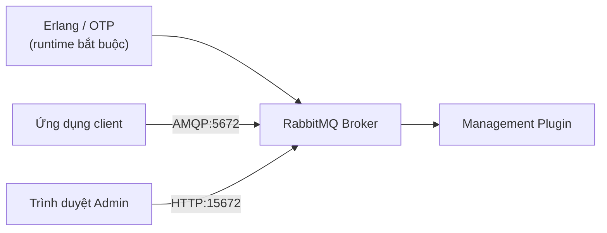

# Cài đặt RabbitMQ

Trước khi lập trình với RabbitMQ, bạn cần cài đặt và chạy được nó trên máy. Bài này hướng dẫn nhiều cách cài đặt khác nhau (Docker, Ubuntu, macOS, Windows) cùng cách kiểm tra trạng thái và quản lý cơ bản. Cách nhanh và gọn nhất cho người mới là dùng Docker; phần chi tiết từng cách nằm bên dưới.

:::note[Ghi nhớ nhanh]

- ⭐ **`RabbitMQ` viết bằng `Erlang` nên cần cài Erlang/OTP trước** (trừ khi dùng `Docker` đã đóng gói sẵn), phiên bản Erlang phải tương thích với RabbitMQ.
- ⭐ **`Docker` là cách nhanh và sạch nhất** — image `rabbitmq:3.13-management` có sẵn Management Plugin, khỏi lo phụ thuộc Erlang.
- **Hai cổng chính** — `5672` cho client AMQP và `15672` cho Management UI (web quản lý).
- **Quản trị bằng `rabbitmqctl`** — tạo user, cấp quyền, tạo/xóa `vhost` (không gian ảo cô lập), xem trạng thái queue/exchange.
- **Cấu hình Java nên bật auto-recovery** — `setAutomaticRecoveryEnabled(true)` để tự phục hồi khi mất kết nối.

:::

## Yêu cầu hệ thống

RabbitMQ được viết bằng **Erlang**, vì vậy cần cài Erlang/OTP trước. Phiên bản Erlang phải tương thích với phiên bản RabbitMQ.

| RabbitMQ | Erlang/OTP tương thích |
|----------|----------------------|
| 3.12.x | 25.x, 26.x |
| 3.13.x | 26.x, 27.x |

Sơ đồ dưới đây tóm tắt các thành phần sau khi cài đặt: RabbitMQ chạy trên nền Erlang và mở hai cổng chính cho client và cho giao diện quản lý:



Vì RabbitMQ viết bằng Erlang nên luôn cần cài Erlang trước (trừ khi dùng Docker đã đóng gói sẵn); cổng 5672 dành cho ứng dụng, còn 15672 dành cho giao diện quản lý web.

## Cách 1: Cài đặt bằng Docker (Khuyến nghị)

**Docker** là cách nhanh nhất và sạch nhất để chạy RabbitMQ mà không cần lo phụ thuộc Erlang:

```bash
# Chạy RabbitMQ với Management Plugin (giao diện quản lý web)
docker run -d \
  --name rabbitmq \
  -p 5672:5672 \
  -p 15672:15672 \
  -e RABBITMQ_DEFAULT_USER=admin \
  -e RABBITMQ_DEFAULT_PASS=admin123 \
  rabbitmq:3.13-management
```

Giải thích các tham số:
- `-d`: Chạy nền (**detached mode** — chế độ tách biệt).
- `--name rabbitmq`: Đặt tên container.
- `-p 5672:5672`: Cổng **AMQP** cho client kết nối.
- `-p 15672:15672`: Cổng **Management UI** (giao diện web quản lý).
- `-e RABBITMQ_DEFAULT_USER`: Biến môi trường thiết lập tài khoản mặc định.
- `rabbitmq:3.13-management`: Image có tích hợp sẵn Management Plugin.

Truy cập Management UI:

```
http://localhost:15672
Username: admin
Password: admin123
```

## Cách 2: Cài đặt trên Ubuntu/Debian

```bash
# Cài Erlang
sudo apt-get install -y erlang

# Thêm repository RabbitMQ
curl -s https://packagecloud.io/install/repositories/rabbitmq/rabbitmq-server/script.deb.sh | sudo bash

# Cài RabbitMQ
sudo apt-get install -y rabbitmq-server

# Khởi động service
sudo systemctl start rabbitmq-server
sudo systemctl enable rabbitmq-server  # Tự khởi động cùng hệ thống

# Bật Management Plugin
sudo rabbitmq-plugins enable rabbitmq_management

# Tạo user admin
sudo rabbitmqctl add_user admin admin123
sudo rabbitmqctl set_user_tags admin administrator
sudo rabbitmqctl set_permissions -p / admin ".*" ".*" ".*"
```

## Cách 3: Cài đặt trên macOS với Homebrew

```bash
# Cài Erlang (phụ thuộc)
brew install erlang

# Cài RabbitMQ
brew install rabbitmq

# Thêm vào PATH
export PATH=$PATH:/usr/local/sbin

# Khởi động RabbitMQ
brew services start rabbitmq

# Bật Management Plugin
rabbitmq-plugins enable rabbitmq_management
```

## Cách 4: Cài đặt trên Windows

### Bước 1: Cài Erlang

Tải và cài **Erlang/OTP** từ:
```
https://www.erlang.org/downloads
```

### Bước 2: Cài RabbitMQ

Tải **RabbitMQ installer** từ:
```
https://www.rabbitmq.com/download.html
```

Chạy file `.exe` và làm theo hướng dẫn cài đặt.

### Bước 3: Bật Management Plugin

Mở **RabbitMQ Command Prompt** (có trong Start Menu) và chạy:

```cmd
rabbitmq-plugins enable rabbitmq_management
```

### Bước 4: Khởi động/Dừng service

```cmd
# Khởi động
net start RabbitMQ

# Dừng
net stop RabbitMQ
```

## Kiểm tra trạng thái RabbitMQ

```bash
# Kiểm tra trạng thái service
sudo systemctl status rabbitmq-server

# Kiểm tra thông tin node
sudo rabbitmqctl status

# Liệt kê các queue hiện có
sudo rabbitmqctl list_queues

# Liệt kê các exchange
sudo rabbitmqctl list_exchanges

# Liệt kê các user
sudo rabbitmqctl list_users
```

## Quản lý Virtual Host

**Virtual Host (vhost)** (máy chủ ảo — không gian cô lập tương tự như namespace, các ứng dụng khác nhau dùng vhost riêng):

```bash
# Tạo vhost mới
sudo rabbitmqctl add_vhost my-app

# Cấp quyền cho user trên vhost
# Cú pháp: set_permissions [-p vhost] user conf write read
sudo rabbitmqctl set_permissions -p my-app admin ".*" ".*" ".*"

# Xóa vhost
sudo rabbitmqctl delete_vhost my-app
```

## Cấu hình kết nối trong Java

```java
import com.rabbitmq.client.ConnectionFactory;

public class RabbitMQConfig {

    public static ConnectionFactory createFactory() {
        ConnectionFactory factory = new ConnectionFactory();
        factory.setHost("localhost");
        factory.setPort(5672);           // Cổng AMQP mặc định
        factory.setUsername("admin");
        factory.setPassword("admin123");
        factory.setVirtualHost("/");     // Vhost mặc định là "/"

        // Cấu hình timeout (thời gian chờ kết nối tính bằng milliseconds)
        factory.setConnectionTimeout(10_000);   // 10 giây

        // Tự động phục hồi kết nối khi mất
        factory.setAutomaticRecoveryEnabled(true);
        factory.setNetworkRecoveryInterval(5_000); // Thử lại sau 5 giây

        return factory;
    }

    public static void main(String[] args) throws Exception {
        ConnectionFactory factory = createFactory();
        try (var connection = factory.newConnection();
             var channel = connection.createChannel()) {
            System.out.println("Kết nối RabbitMQ thành công!");
            System.out.println("Server version: " + connection.getServerProperties().get("version"));
        }
    }
}
```

## Cấu trúc file cấu hình rabbitmq.conf

File cấu hình chính của RabbitMQ (thường tại `/etc/rabbitmq/rabbitmq.conf`):

```ini
# Địa chỉ lắng nghe kết nối AMQP
listeners.tcp.default = 5672

# Kích thước tối đa của một tin nhắn (128 MB)
max_message_size = 134217728

# Kích thước bộ nhớ tối đa (70% RAM)
vm_memory_high_watermark.relative = 0.7

# Thư mục lưu trữ dữ liệu
mnesia_table_loading_retry_timeout = 30000
```

## Tổng kết

Sau khi cài đặt xong, RabbitMQ đã sẵn sàng để nhận kết nối từ các ứng dụng. Truy cập Management UI tại `http://localhost:15672` để xem tổng quan hệ thống. Bước tiếp theo là làm quen với Management Interface để theo dõi và quản lý hàng đợi tin nhắn.
