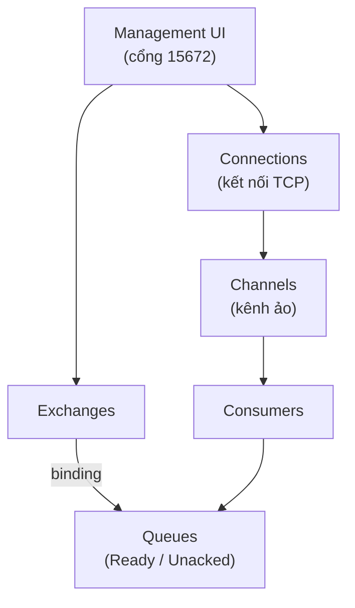

# Giới thiệu RabbitMQ Management Interface

Management Interface là giao diện web tích hợp sẵn của RabbitMQ, giúp bạn theo dõi và quản lý toàn bộ hệ thống ngay trên trình duyệt mà không cần gõ lệnh. Qua đây bạn có thể xem trạng thái queue, gửi nhận tin nhắn thử, quản lý user và theo dõi hiệu suất theo thời gian thực. Bài này giới thiệu cách bật và sử dụng từng tab của giao diện; phần chi tiết nằm bên dưới.

:::note[Ghi nhớ nhanh]

- ⭐ **Management Interface là plugin web tích hợp sẵn của `RabbitMQ`** — theo dõi và quản lý toàn hệ thống qua trình duyệt mà không cần gõ lệnh.
- **Bật bằng `rabbitmq-plugins enable rabbitmq_management`** rồi truy cập `http://localhost:15672` (mặc định `guest/guest`, chỉ đăng nhập từ localhost).
- **Các tab chính** — Overview, Connections, Channels, Exchanges, Queues (quan trọng nhất, xem `Ready`/`Unacked`) và Admin (user, vhost, policies).
- **Tab Queues cho phép test trực tiếp** — Publish, Get messages, Purge, Delete ngay trên UI.
- ⭐ **Có `REST API` để tự động hóa** — gọi qua `curl` hoặc Java `HttpClient` (lưu ý `%2F` là mã hóa URL của vhost mặc định `/`).

:::

## Management Interface là gì?

**RabbitMQ Management Interface** (giao diện quản lý RabbitMQ — ứng dụng web tích hợp sẵn cho phép theo dõi và quản lý toàn bộ RabbitMQ thông qua trình duyệt) là một **plugin** (tiện ích mở rộng) cung cấp giao diện đồ họa để:

- Theo dõi trạng thái Queue, Exchange, Connection.
- Gửi/nhận tin nhắn thủ công để kiểm tra.
- Quản lý user, vhost, permissions.
- Xem thống kê hiệu suất theo thời gian thực.

Sơ đồ sau minh họa các đối tượng mà Management Interface theo dõi, đúng theo thứ bậc từ kết nối tới tin nhắn:



Mỗi tab trong giao diện tương ứng với một lớp trong sơ đồ: một Connection chứa nhiều Channel, mỗi Channel gắn với Consumer, còn Exchange định tuyến tin nhắn vào các Queue.

## Kích hoạt Management Plugin

```bash
# Bật plugin
rabbitmq-plugins enable rabbitmq_management

# Kiểm tra plugin đang chạy
rabbitmq-plugins list | grep management
```

Sau khi bật, truy cập:
```
http://localhost:15672
```

Tài khoản mặc định:
- **Username**: `guest` (chỉ đăng nhập từ localhost)
- **Password**: `guest`

## Tổng quan giao diện

### Tab Overview — Tổng quan hệ thống

Trang chủ hiển thị:
- **Connections** (kết nối): Số kết nối TCP đang hoạt động.
- **Channels** (kênh): Số channel đang mở. Một connection có thể có nhiều channel.
- **Exchanges** (bộ định tuyến): Danh sách exchange đang tồn tại.
- **Queues** (hàng đợi): Số queue và tổng số tin nhắn đang chờ.
- **Consumers** (người tiêu thụ): Số consumer đang kết nối.

Biểu đồ **Message Rates** (tốc độ xử lý tin nhắn) hiển thị:
- **Publish rate**: Tốc độ gửi tin nhắn (tin/giây).
- **Deliver rate**: Tốc độ giao tin nhắn tới consumer.
- **Acknowledge rate**: Tốc độ consumer xác nhận đã nhận.

### Tab Connections — Kết nối

Liệt kê tất cả kết nối TCP đang mở, bao gồm:
- Địa chỉ IP và cổng của client.
- **Protocol** (giao thức): AMQP 0-9-1, AMQP 1.0, MQTT, STOMP.
- **State**: `running` hoặc `blocking` (bị chặn do quá tải).
- Số channel trên mỗi connection.
- Tốc độ gửi/nhận dữ liệu.

### Tab Channels — Kênh

**Channel** (kênh ảo — một luồng giao tiếp logic trong một TCP connection, giúp tái sử dụng kết nối vật lý):

Hiển thị:
- Channel thuộc connection nào.
- Số tin nhắn **unacknowledged** (chưa được xác nhận bởi consumer).
- **Prefetch count** (số lượng tin nhắn giao trước): Consumer sẽ nhận tối đa bao nhiêu tin nhắn cùng lúc.

### Tab Exchanges — Bộ định tuyến

Liệt kê tất cả Exchange. Các Exchange mặc định của RabbitMQ:

| Tên Exchange | Loại | Mô tả |
|-------------|------|-------|
| `(AMQP default)` | direct | Exchange mặc định, routing key = tên queue |
| `amq.direct` | direct | Direct exchange tiêu chuẩn |
| `amq.fanout` | fanout | Fanout exchange tiêu chuẩn |
| `amq.topic` | topic | Topic exchange tiêu chuẩn |
| `amq.headers` | headers | Headers exchange tiêu chuẩn |
| `amq.rabbitmq.trace` | topic | Dùng cho theo dõi tin nhắn |

### Tab Queues — Hàng đợi

Đây là tab quan trọng nhất, hiển thị:
- **Ready**: Số tin nhắn đang chờ consumer lấy.
- **Unacked**: Số tin nhắn đã giao cho consumer nhưng chưa được xác nhận.
- **Total**: Tổng số tin nhắn trong queue.

Khi click vào tên queue, bạn có thể:
- **Publish message**: Gửi tin nhắn trực tiếp vào queue để test.
- **Get messages**: Lấy tin nhắn từ queue và xem nội dung.
- **Purge**: Xóa toàn bộ tin nhắn trong queue.
- **Delete**: Xóa queue.

### Tab Admin — Quản trị

Quản lý:
- **Users** (người dùng): Tạo, xóa, phân quyền.
- **Virtual Hosts** (vhost — máy chủ ảo): Tạo không gian cô lập cho từng ứng dụng.
- **Feature Flags** (tính năng thử nghiệm): Bật/tắt các tính năng mới.
- **Policies** (chính sách): Áp dụng cấu hình tự động cho queue/exchange theo pattern.

## Tạo Queue thủ công qua Management UI

1. Vào tab **Queues** > **Add a new queue**.
2. Điền thông tin:
   - **Name**: Tên queue (ví dụ: `don-hang-queue`).
   - **Durability**: `Durable` (bền vững — queue tồn tại sau khi broker restart) hoặc `Transient`.
   - **Auto delete**: Tự xóa khi không còn consumer.
3. Click **Add queue**.

## Sử dụng HTTP API của Management Plugin

Management Plugin cũng cung cấp **REST API** (giao diện lập trình qua HTTP) để tự động hóa:

```bash
# Lấy danh sách tất cả queue
curl -u admin:admin123 http://localhost:15672/api/queues

# Lấy thông tin queue cụ thể
curl -u admin:admin123 http://localhost:15672/api/queues/%2F/don-hang-queue

# Gửi tin nhắn vào queue qua API
curl -u admin:admin123 \
  -H "Content-Type: application/json" \
  -X POST http://localhost:15672/api/exchanges/%2F/amq.default/publish \
  -d '{
    "properties": {},
    "routing_key": "don-hang-queue",
    "payload": "Đơn hàng test",
    "payload_encoding": "string"
  }'

# Lấy tin nhắn từ queue qua API
curl -u admin:admin123 \
  -H "Content-Type: application/json" \
  -X POST http://localhost:15672/api/queues/%2F/don-hang-queue/get \
  -d '{"count": 1, "ackmode": "ack_requeue_true", "encoding": "auto"}'
```

Lưu ý: `%2F` là mã hóa URL của ký tự `/` (vhost mặc định).

## Sử dụng Management API trong Java

```java
import java.net.URI;
import java.net.http.HttpClient;
import java.net.http.HttpRequest;
import java.net.http.HttpResponse;
import java.util.Base64;

public class RabbitMQManagementApi {

    private static final String BASE_URL = "http://localhost:15672/api";
    private static final String CREDENTIALS = Base64.getEncoder()
            .encodeToString("admin:admin123".getBytes());

    public static void main(String[] args) throws Exception {
        HttpClient client = HttpClient.newHttpClient();

        // Lấy danh sách queue
        HttpRequest request = HttpRequest.newBuilder()
                .uri(URI.create(BASE_URL + "/queues"))
                .header("Authorization", "Basic " + CREDENTIALS)
                .GET()
                .build();

        HttpResponse<String> response = client.send(request,
                HttpResponse.BodyHandlers.ofString());

        System.out.println("Status: " + response.statusCode());
        System.out.println("Queues: " + response.body());
    }
}
```

## Tổng kết

Management Interface là công cụ không thể thiếu khi làm việc với RabbitMQ. Nó giúp bạn:
- Theo dõi hiệu suất hệ thống trong thời gian thực.
- Debug vấn đề tin nhắn bị kẹt trong queue.
- Quản lý cấu hình mà không cần dừng server.
- Tích hợp tự động hóa qua REST API.
