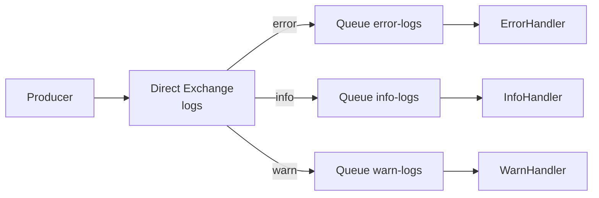

# Sử dụng Direct Exchange trong RabbitMQ

Direct Exchange là loại exchange đơn giản và hay dùng nhất trong RabbitMQ: nó chỉ chuyển tin nhắn tới những queue có khóa định tuyến khớp chính xác. Cách này rất phù hợp khi bạn muốn phân loại tin nhắn theo một nhãn cụ thể, ví dụ như định tuyến log theo cấp độ error, warning, info. Bài này giải thích nguyên lý và minh họa bằng một hệ thống xử lý log hoàn chỉnh.

:::note[Ghi nhớ nhanh]

- ⭐ **`Direct Exchange` định tuyến tin nhắn tới Queue có Binding Key khớp CHÍNH XÁC với Routing Key** — không có so khớp mẫu như Topic, nên dễ dự đoán và debug.
- **Ứng dụng điển hình** — phân loại tin nhắn theo một nhãn cụ thể, ví dụ định tuyến log theo cấp độ `error`, `warning`, `info`.
- ⭐ **`Default Exchange` là một Direct Exchange đặc biệt không tên** — khi dùng `basicPublish("", queueName, ...)`, routing key chính là tên queue.
- **Một Queue có thể bind nhiều Binding Key** — ví dụ queue `critical-logs` nhận cả `error` lẫn `warning`.
- **Thiết lập bằng `exchangeDeclare` + `queueDeclare` + `queueBind`** — khai báo là idempotent, gọi được từ cả producer lẫn consumer.

:::

## Direct Exchange là gì?

**Direct Exchange** (bộ định tuyến trực tiếp — loại exchange định tuyến tin nhắn tới Queue có binding key khớp CHÍNH XÁC với routing key của tin nhắn) là loại Exchange đơn giản và hay dùng nhất trong RabbitMQ.

Nguyên tắc hoạt động:
- Producer đính kèm một **Routing Key** (khóa định tuyến — chuỗi nhãn xác định đích đến của tin nhắn) khi gửi tin.
- Exchange so sánh Routing Key với **Binding Key** (khóa liên kết — chuỗi được khai báo khi bind Queue vào Exchange).
- Tin nhắn chỉ được giao tới Queue có Binding Key **khớp chính xác**.

```
Producer --> [Direct Exchange "logs"] --"error"--> Queue "error-logs"
                                      --"info" --> Queue "info-logs"
                                      --"warn" --> Queue "warn-logs"
```

Sơ đồ sau minh họa cách Direct Exchange so khớp routing key với binding key để chọn đúng Queue:



Điểm cần nhớ: tin nhắn chỉ vào Queue có binding key trùng **khớp chính xác** với routing key — không có so khớp mẫu như Topic.

## Default Exchange — Exchange mặc định

**Default Exchange** (exchange mặc định — exchange ẩn danh có sẵn, định tuyến dựa trên tên queue) là một Direct Exchange đặc biệt không có tên. Khi dùng `channel.basicPublish("", queueName, ...)`, `""` là tên của Default Exchange và routing key chính là tên queue.

## Ví dụ thực tế: Hệ thống Log theo cấp độ

### Cấu trúc hệ thống

```
LogProducer --> [Direct Exchange: "log-exchange"]
                        |-- "error"   --> Queue "error-queue"   --> ErrorHandler
                        |-- "warning" --> Queue "warning-queue" --> WarningHandler
                        |-- "info"    --> Queue "info-queue"    --> InfoHandler
```

### Thiết lập Exchange và Queue

```java
import com.rabbitmq.client.*;

public class DirectExchangeSetup {

    public static final String EXCHANGE_NAME = "log-exchange";
    public static final String QUEUE_ERROR   = "error-queue";
    public static final String QUEUE_WARNING = "warning-queue";
    public static final String QUEUE_INFO    = "info-queue";

    /**
     * Phương thức thiết lập Exchange, Queue và Binding.
     * Có thể gọi từ cả producer lẫn consumer — khai báo là idempotent (an toàn khi gọi nhiều lần).
     */
    public static void setupInfrastructure(Channel channel) throws Exception {
        // Khai báo Direct Exchange
        // exchangeDeclare(tên, loại, durable, autoDelete, arguments)
        channel.exchangeDeclare(EXCHANGE_NAME, BuiltinExchangeType.DIRECT, true, false, null);

        // Khai báo các Queue bền vững
        channel.queueDeclare(QUEUE_ERROR,   true, false, false, null);
        channel.queueDeclare(QUEUE_WARNING, true, false, false, null);
        channel.queueDeclare(QUEUE_INFO,    true, false, false, null);

        // Binding: liên kết Queue vào Exchange với Binding Key
        // queueBind(tên-queue, tên-exchange, binding-key)
        channel.queueBind(QUEUE_ERROR,   EXCHANGE_NAME, "error");
        channel.queueBind(QUEUE_WARNING, EXCHANGE_NAME, "warning");
        channel.queueBind(QUEUE_INFO,    EXCHANGE_NAME, "info");

        System.out.println("Đã thiết lập Exchange và Queue thành công.");
    }
}
```

### Producer: Gửi log theo cấp độ

```java
import com.rabbitmq.client.*;

public class LogProducer {

    public static void main(String[] args) throws Exception {
        ConnectionFactory factory = new ConnectionFactory();
        factory.setHost("localhost");

        try (Connection connection = factory.newConnection();
             Channel channel = connection.createChannel()) {

            // Thiết lập hạ tầng
            DirectExchangeSetup.setupInfrastructure(channel);

            // Mô phỏng gửi các log với cấp độ khác nhau
            sendLog(channel, "info",    "[INFO] Ứng dụng khởi động thành công");
            sendLog(channel, "info",    "[INFO] Người dùng alice@example.com đăng nhập");
            sendLog(channel, "warning", "[WARN] Kết nối database chậm: 2500ms");
            sendLog(channel, "error",   "[ERROR] Không thể kết nối tới payment service");
            sendLog(channel, "error",   "[ERROR] NullPointerException tại OrderService.java:45");
            sendLog(channel, "info",    "[INFO] Đơn hàng #1001 đã được tạo");
            sendLog(channel, "warning", "[WARN] Bộ nhớ RAM đạt 85%");
        }
    }

    private static void sendLog(Channel channel, String level, String message) throws Exception {
        AMQP.BasicProperties props = new AMQP.BasicProperties.Builder()
                .contentType("text/plain")
                .deliveryMode(2) // persistent
                .headers(java.util.Map.of("level", level, "timestamp", System.currentTimeMillis()))
                .build();

        // Gửi tới Direct Exchange với routing key = cấp độ log
        channel.basicPublish(DirectExchangeSetup.EXCHANGE_NAME, level, props,
                message.getBytes("UTF-8"));

        System.out.println("[Producer] Gửi [" + level.toUpperCase() + "]: " + message);
    }
}
```

### Consumer: Xử lý log theo cấp độ

```java
import com.rabbitmq.client.*;

public class LogConsumer {

    public static void main(String[] args) throws Exception {
        if (args.length == 0) {
            System.err.println("Cách dùng: LogConsumer <error|warning|info>");
            return;
        }

        String level = args[0]; // error, warning, hoặc info
        String queueName = level + "-queue";

        ConnectionFactory factory = new ConnectionFactory();
        factory.setHost("localhost");

        Connection connection = factory.newConnection();
        Channel channel = connection.createChannel();

        DirectExchangeSetup.setupInfrastructure(channel);
        channel.basicQos(1);

        System.out.println("[Consumer-" + level + "] Đang lắng nghe queue: " + queueName);

        DeliverCallback callback = (consumerTag, delivery) -> {
            String message = new String(delivery.getBody(), "UTF-8");
            System.out.println("[Consumer-" + level + "] Nhận: " + message);
            channel.basicAck(delivery.getEnvelope().getDeliveryTag(), false);
        };

        channel.basicConsume(queueName, false, callback, tag -> {});
    }
}
```

## Một Queue, nhiều Binding Key

Một Queue có thể bind vào Exchange với **nhiều Binding Key**:

```java
// Queue "critical-logs" nhận cả error VÀ warning
channel.queueDeclare("critical-logs", true, false, false, null);
channel.queueBind("critical-logs", "log-exchange", "error");
channel.queueBind("critical-logs", "log-exchange", "warning");
```

```
[Direct Exchange: "log-exchange"]
    "error"   --> Queue "error-queue"
    "error"   --> Queue "critical-logs"  (cùng routing key, hai queue đều nhận)
    "warning" --> Queue "warning-queue"
    "warning" --> Queue "critical-logs"
```

## Kiểm tra trong Management UI

Sau khi chạy setup, kiểm tra tại:
1. Tab **Exchanges** > `log-exchange` > xem **Bindings**.
2. Tab **Queues** > xem `error-queue`, `warning-queue`, `info-queue`.

## Tổng kết

Direct Exchange là loại Exchange đơn giản nhất, phù hợp khi bạn muốn định tuyến tin nhắn theo một nhãn cụ thể (như cấp độ log, loại sự kiện). Key được so khớp chính xác, nên rất dự đoán được và dễ debug.
