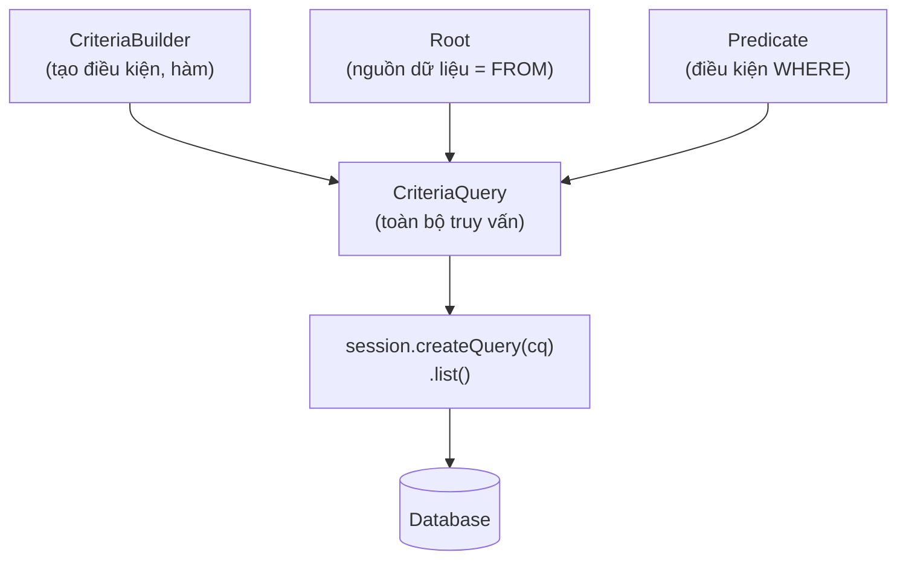

# Hibernate Criteria Query Language (HCQL)

Criteria API là cách viết câu truy vấn trong Hibernate bằng code Java thay vì chuỗi string, giúp phát hiện lỗi ngay khi biên dịch. Nó đặc biệt hữu ích khi bạn cần xây dựng truy vấn động với nhiều điều kiện tùy chọn, ví dụ như chức năng tìm kiếm nâng cao. Bài này hướng dẫn cách dùng CriteriaBuilder, Predicate, JOIN và các hàm tổng hợp để dựng truy vấn an toàn kiểu.

## Criteria API là gì?

**Criteria API** là một cách xây dựng câu truy vấn động (dynamic query) trong Hibernate theo kiểu **type-safe** (an toàn kiểu — lỗi được phát hiện tại compile-time thay vì runtime). Khác với HQL dùng chuỗi string, Criteria API dùng Java objects và method chaining.

**HCQL** (Hibernate Criteria Query Language) thường dùng để chỉ cách viết truy vấn bằng Criteria API trong Hibernate.

### Khi nào dùng Criteria API?

- Khi điều kiện truy vấn thay đổi theo runtime (tìm kiếm nâng cao với nhiều bộ lọc tùy chọn).
- Khi muốn type-safe: tránh lỗi chính tả trong tên field.
- Khi xây dựng query builder trong framework.

### Khi nào dùng HQL thay thế?

- Khi query đơn giản và cố định.
- Khi cần độ đọc code cao.

## Cấu trúc Criteria API

Ba thành phần chính:

- **`CriteriaBuilder`**: factory tạo ra các phần tử của query (điều kiện, hàm tổng hợp, sắp xếp...).
- **`CriteriaQuery`**: đại diện cho toàn bộ câu truy vấn.
- **`Root`**: điểm xuất phát của query, tương đương từ khóa `FROM` trong HQL.

Sơ đồ dưới đây cho thấy các thành phần này ghép lại thành một câu truy vấn hoàn chỉnh như thế nào:



`CriteriaBuilder` sinh ra các mảnh nhỏ (Root, Predicate, order...), tất cả được lắp vào `CriteriaQuery` rồi mới thực thi để truy vấn database.

```java
import jakarta.persistence.criteria.*;
import org.hibernate.Session;
import java.util.List;

public class CriteriaDemo {

    public static List<NhanVien> timTatCa(Session session) {
        // Bước 1: Lấy CriteriaBuilder từ session
        CriteriaBuilder cb = session.getCriteriaBuilder();

        // Bước 2: Tạo CriteriaQuery cho Entity NhanVien
        CriteriaQuery<NhanVien> cq = cb.createQuery(NhanVien.class);

        // Bước 3: Khai báo Root (nguồn dữ liệu)
        Root<NhanVien> root = cq.from(NhanVien.class);

        // Bước 4: Xây dựng query (không có điều kiện = lấy tất cả)
        cq.select(root);

        // Bước 5: Thực thi và lấy kết quả
        return session.createQuery(cq).list();
    }
}
```

## Các điều kiện (Predicate)

**`Predicate`** (vị từ điều kiện) là đại diện cho điều kiện WHERE trong Criteria API.

```java
import java.math.BigDecimal;

public class PredicateDemo {

    public static List<NhanVien> timKiem(Session session,
                                          String tenContains,
                                          BigDecimal luongToiThieu,
                                          Long phongBanId) {
        CriteriaBuilder cb = session.getCriteriaBuilder();
        CriteriaQuery<NhanVien> cq = cb.createQuery(NhanVien.class);
        Root<NhanVien> root = cq.from(NhanVien.class);

        // Danh sách điều kiện, chỉ thêm nếu có giá trị
        java.util.List<Predicate> predicates = new java.util.ArrayList<>();

        // Điều kiện tìm theo tên (LIKE, không phân biệt hoa thường)
        if (tenContains != null && !tenContains.isBlank()) {
            predicates.add(
                cb.like(cb.lower(root.get("hoTen")),
                        "%" + tenContains.toLowerCase() + "%")
            );
        }

        // Điều kiện lương tối thiểu
        if (luongToiThieu != null) {
            predicates.add(
                cb.greaterThanOrEqualTo(root.get("luong"), luongToiThieu)
            );
        }

        // Điều kiện phòng ban
        if (phongBanId != null) {
            // Truy cập field của entity liên quan (navigation)
            predicates.add(
                cb.equal(root.get("phongBan").get("id"), phongBanId)
            );
        }

        // Kết hợp các điều kiện bằng AND
        if (!predicates.isEmpty()) {
            cq.where(cb.and(predicates.toArray(new Predicate[0])));
        }

        // Sắp xếp theo hoTen tăng dần
        cq.orderBy(cb.asc(root.get("hoTen")));

        return session.createQuery(cq).list();
    }
}
```

## Các toán tử so sánh

```java
public class ToAnTuDemo {

    public static void viDuToAnTu(Session session) {
        CriteriaBuilder cb = session.getCriteriaBuilder();
        CriteriaQuery<NhanVien> cq = cb.createQuery(NhanVien.class);
        Root<NhanVien> root = cq.from(NhanVien.class);

        // Bằng (=)
        Predicate bangNhau = cb.equal(root.get("hoTen"), "Nguyen Van A");

        // Khác (!=)
        Predicate khacNhau = cb.notEqual(root.get("hoTen"), "Nguyen Van A");

        // Lớn hơn, nhỏ hơn, lớn hơn hoặc bằng, nhỏ hơn hoặc bằng
        Predicate lonHon = cb.greaterThan(root.get("luong"),
                new BigDecimal("10000000"));
        Predicate nhoHonHoacBang = cb.lessThanOrEqualTo(root.get("luong"),
                new BigDecimal("20000000"));

        // BETWEEN
        Predicate giuaKhoang = cb.between(root.get("luong"),
                new BigDecimal("10000000"),
                new BigDecimal("20000000"));

        // IS NULL / IS NOT NULL
        Predicate isNull = cb.isNull(root.get("email"));
        Predicate isNotNull = cb.isNotNull(root.get("email"));

        // IN - kiểm tra giá trị nằm trong danh sách
        Predicate inList = root.get("id").in(1L, 2L, 3L, 5L);

        // LIKE
        Predicate like = cb.like(root.get("hoTen"), "Nguyen%");

        // Kết hợp AND, OR, NOT
        Predicate andCondition = cb.and(lonHon, nhoHonHoacBang);
        Predicate orCondition = cb.or(bangNhau, inList);
        Predicate notCondition = cb.not(isNull);

        cq.where(andCondition);
        session.createQuery(cq).list().forEach(nv ->
            System.out.println(nv.getHoTen())
        );
    }
}
```

## JOIN trong Criteria API

```java
public class JoinDemo {

    public static List<NhanVien> joinVoiPhongBan(Session session, String tenPhongBan) {
        CriteriaBuilder cb = session.getCriteriaBuilder();
        CriteriaQuery<NhanVien> cq = cb.createQuery(NhanVien.class);
        Root<NhanVien> root = cq.from(NhanVien.class);

        // JOIN với entity PhongBan
        Join<NhanVien, PhongBan> joinPB = root.join("phongBan", JoinType.INNER);

        // Điều kiện trên bảng được JOIN
        cq.where(cb.equal(joinPB.get("tenPhongBan"), tenPhongBan));

        return session.createQuery(cq).list();
    }

    // Fetch Join - tải entity liên quan trong cùng một query
    public static List<NhanVien> fetchJoin(Session session) {
        CriteriaBuilder cb = session.getCriteriaBuilder();
        CriteriaQuery<NhanVien> cq = cb.createQuery(NhanVien.class);
        Root<NhanVien> root = cq.from(NhanVien.class);

        // Fetch join để tải sẵn phongBan, tránh N+1 query problem
        root.fetch("phongBan", JoinType.LEFT);

        cq.select(root).distinct(true);
        return session.createQuery(cq).list();
    }
}
```

## Aggregate Functions và GROUP BY

```java
public class AggregateDemo {

    public static void thongKeLuong(Session session) {
        CriteriaBuilder cb = session.getCriteriaBuilder();

        // Query trả về Object[] (dùng khi SELECT nhiều cột khác nhau)
        CriteriaQuery<Object[]> cq = cb.createQuery(Object[].class);
        Root<NhanVien> root = cq.from(NhanVien.class);
        Join<NhanVien, PhongBan> joinPB = root.join("phongBan", JoinType.INNER);

        // SELECT: tên phòng ban, số NV, lương TB
        cq.multiselect(
            joinPB.get("tenPhongBan"),
            cb.count(root),
            cb.avg(root.get("luong")),
            cb.max(root.get("luong"))
        );

        // GROUP BY tên phòng ban
        cq.groupBy(joinPB.get("tenPhongBan"));

        // HAVING: chỉ lấy phòng có > 3 nhân viên
        cq.having(cb.greaterThan(cb.count(root), 3L));

        List<Object[]> results = session.createQuery(cq).list();
        for (Object[] row : results) {
            System.out.printf("Phòng: %s | SL: %d | Lương TB: %.0f | Max: %.0f%n",
                row[0], row[1], row[2], row[3]);
        }
    }
}
```

## Metamodel - Type-safe tuyệt đối

**Metamodel** (siêu mô hình) là các class được tạo tự động tương ứng với mỗi Entity, cho phép tham chiếu đến field bằng code Java thay vì chuỗi string:

```java
// Thay vì dùng string dễ lỗi chính tả:
root.get("hoTen")         // Không được kiểm tra lúc compile

// Dùng Metamodel để type-safe:
// NhanVien_ là class metamodel tự sinh từ NhanVien
root.get(NhanVien_.hoTen) // Lỗi chính tả sẽ bị phát hiện khi compile
```

> Để tạo metamodel, thêm processor `hibernate-jpamodelgen` vào Maven `annotationProcessorPaths`.

## Tóm tắt

- Criteria API xây dựng query động bằng Java code, không dùng string.
- `CriteriaBuilder` tạo điều kiện, `CriteriaQuery` là câu truy vấn, `Root` là nguồn dữ liệu.
- Dùng `Predicate` để xây dựng danh sách điều kiện tùy chọn — rất phù hợp với chức năng tìm kiếm nâng cao.
- `Join` và `fetch()` xử lý quan hệ giữa các entity.
- Dùng **Metamodel** để đạt type-safe tuyệt đối, tránh lỗi chính tả tên field.
