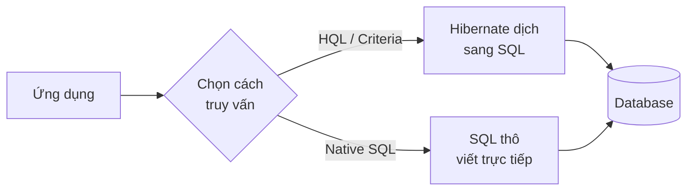

# Hibernate Native SQL Queries

Native SQL cho phép bạn viết thẳng câu SQL thô trong Hibernate, dùng khi cần các tính năng đặc thù của database hoặc tối ưu hiệu năng mà HQL không làm được. Đây là lựa chọn cho những truy vấn phức tạp như stored procedure, window function hay tìm kiếm toàn văn. Bài này hướng dẫn cách viết native query, ánh xạ kết quả vào DTO và lưu ý tránh SQL injection.

:::note[Ghi nhớ nhanh]

- ⭐ **Native SQL thực thi câu SQL thô** — dùng khi cần tính năng đặc thù database (JSON, full-text search, window function, stored procedure).
- **`createNativeQuery(sql, Entity.class)`** — ánh xạ kết quả về entity; hoặc trả về `Object[]`/kiểu nguyên thủy.
- **`@SqlResultSetMapping` + `@ConstructorResult`** — ánh xạ kết quả vào DTO không phải entity.
- **Luôn dùng named parameter; `executeUpdate()` cho INSERT/UPDATE/DELETE** — tránh SQL injection.
- **Native SQL làm code phụ thuộc vào database cụ thể** — hãy dùng có chọn lọc.

:::

## Native SQL là gì?

**Native SQL** (SQL thuần — câu truy vấn SQL viết trực tiếp theo cú pháp của database cụ thể) trong Hibernate cho phép bạn thực thi câu lệnh SQL thô (raw SQL) thay vì dùng HQL hay Criteria API.

### Khi nào dùng Native SQL?

- Khi cần dùng tính năng đặc thù của database mà HQL không hỗ trợ (ví dụ: hàm JSON của PostgreSQL, Full-Text Search của MySQL).
- Khi cần tối ưu hiệu năng với query phức tạp mà Hibernate sinh ra SQL không hiệu quả.
- Khi làm việc với **stored procedure** (thủ tục lưu trữ — chương trình SQL được lưu trong database).
- Khi cần dùng các hàm window function, CTE (Common Table Expression — biểu thức bảng chung).

Sơ đồ dưới đây so sánh đường đi của native SQL với HQL/Criteria: native SQL bỏ qua bước dịch của Hibernate:



Vì gửi thẳng SQL xuống database, native SQL tận dụng được tính năng đặc thù của database nhưng cũng khiến code phụ thuộc vào loại database đó.

## Native SQL cơ bản

### Trả về Entity

```java
import org.hibernate.Session;
import java.util.List;

public class NativeSQLDemo {

    public static List<NhanVien> layTatCa(Session session) {
        // createNativeQuery: tạo native SQL query
        // Tham số thứ 2: class Entity để Hibernate ánh xạ kết quả
        return session
            .createNativeQuery("SELECT * FROM nhan_vien", NhanVien.class)
            .list();
    }

    public static NhanVien timTheoId(Session session, Long id) {
        // Dùng named parameter để tránh SQL injection
        return session
            .createNativeQuery(
                "SELECT * FROM nhan_vien WHERE id = :id", NhanVien.class)
            .setParameter("id", id)
            .uniqueResult();
    }
}
```

### Trả về kiểu dữ liệu nguyên thủy

```java
public class NativeSQLBasic {

    public static void demoCacKieuTraVe(Session session) {

        // Trả về một giá trị đơn
        Long soLuong = session
            .createNativeQuery("SELECT COUNT(*) FROM nhan_vien", Long.class)
            .uniqueResult();
        System.out.println("Tổng số nhân viên: " + soLuong);

        // Trả về danh sách chuỗi
        List<String> emails = session
            .createNativeQuery("SELECT email FROM nhan_vien WHERE email IS NOT NULL",
                               String.class)
            .list();

        // Trả về Object[] khi SELECT nhiều cột
        List<Object[]> rows = session
            .createNativeQuery(
                "SELECT ho_ten, luong FROM nhan_vien ORDER BY luong DESC")
            .list();

        for (Object[] row : rows) {
            System.out.println("Tên: " + row[0] + " | Lương: " + row[1]);
        }
    }
}
```

## @SqlResultSetMapping - Ánh xạ kết quả tùy chỉnh

**`@SqlResultSetMapping`** cho phép định nghĩa cách ánh xạ kết quả native SQL sang class Java — bao gồm cả DTO không phải Entity:

```java
import jakarta.persistence.*;

// Định nghĩa DTO để nhận kết quả
public class ThongKeLuongDTO {
    private String tenPhongBan;
    private Long soNhanVien;
    private Double luongTrungBinh;

    // Constructor phải khớp với ColumnResult bên dưới
    public ThongKeLuongDTO(String tenPhongBan, Long soNhanVien, Double luongTrungBinh) {
        this.tenPhongBan = tenPhongBan;
        this.soNhanVien = soNhanVien;
        this.luongTrungBinh = luongTrungBinh;
    }

    public String getTenPhongBan() { return tenPhongBan; }
    public Long getSoNhanVien() { return soNhanVien; }
    public Double getLuongTrungBinh() { return luongTrungBinh; }
}
```

```java
// Định nghĩa mapping trên Entity class
@Entity
@SqlResultSetMapping(
    name = "ThongKeLuongMapping",
    classes = {
        @ConstructorResult(
            targetClass = ThongKeLuongDTO.class,
            columns = {
                @ColumnResult(name = "ten_phong_ban", type = String.class),
                @ColumnResult(name = "so_nhan_vien", type = Long.class),
                @ColumnResult(name = "luong_tb", type = Double.class)
            }
        )
    }
)
public class NhanVien {
    // ...
}
```

```java
// Sử dụng mapping
List<ThongKeLuongDTO> thongKe = session
    .createNativeQuery(
        "SELECT pb.ten_phong_ban, COUNT(nv.id) AS so_nhan_vien, " +
        "       AVG(nv.luong) AS luong_tb " +
        "FROM phong_ban pb " +
        "LEFT JOIN nhan_vien nv ON nv.phong_ban_id = pb.id " +
        "GROUP BY pb.ten_phong_ban " +
        "ORDER BY luong_tb DESC",
        "ThongKeLuongMapping")   // Tên mapping đã định nghĩa ở trên
    .list();

thongKe.forEach(dto ->
    System.out.printf("Phòng: %-20s | Số NV: %3d | Lương TB: %,.0f%n",
        dto.getTenPhongBan(), dto.getSoNhanVien(), dto.getLuongTrungBinh())
);
```

## Stored Procedure

```java
// Gọi stored procedure đã tạo sẵn trong database
// Giả sử database có procedure: CALL tang_luong_phong_ban(pb_id, phan_tram)
public class StoredProcedureDemo {

    public static void gọiStoredProcedure(Session session, Long pbId, Double phanTram) {
        // Cách 1: Dùng createNativeQuery
        session.beginTransaction();
        session
            .createNativeQuery("CALL tang_luong_phong_ban(:pbId, :phanTram)")
            .setParameter("pbId", pbId)
            .setParameter("phanTram", phanTram)
            .executeUpdate();
        session.getTransaction().commit();
        System.out.println("Đã tăng lương thành công");
    }

    public static List<NhanVien> gọiProcedureTrachVeKetQua(Session session, Long pbId) {
        // Cách 2: Dùng @NamedStoredProcedureQuery (định nghĩa trên Entity)
        return session
            .createNamedStoredProcedureQuery("layNhanVienTheoPhongBan")
            .setParameter("pbId", pbId)
            .getResultList();
    }
}
```

## INSERT, UPDATE, DELETE bằng Native SQL

```java
public class NativeMutationDemo {

    public static void viDuMutation(Session session) {
        session.beginTransaction();

        // INSERT thuần SQL
        int soHangInsert = session
            .createNativeQuery(
                "INSERT INTO nhan_vien (ho_ten, email, luong, phong_ban_id) " +
                "VALUES (:hoTen, :email, :luong, :pbId)")
            .setParameter("hoTen", "Tran Thi B")
            .setParameter("email", "thib@cty.com")
            .setParameter("luong", 12000000.0)
            .setParameter("pbId", 1L)
            .executeUpdate();

        // UPDATE hàng loạt với điều kiện phức tạp
        int soHangUpdate = session
            .createNativeQuery(
                "UPDATE nhan_vien " +
                "SET luong = luong * 1.15 " +
                "WHERE phong_ban_id IN " +
                "  (SELECT id FROM phong_ban WHERE ten_phong_ban LIKE 'Phòng IT%') " +
                "AND luong < 20000000")
            .executeUpdate();

        // DELETE với JOIN (chỉ một số database hỗ trợ)
        int soHangDelete = session
            .createNativeQuery(
                "DELETE FROM nhan_vien " +
                "WHERE id IN (SELECT id FROM tmp_nhan_vien_can_xoa)")
            .executeUpdate();

        session.getTransaction().commit();
        System.out.println("Insert: " + soHangInsert +
                           ", Update: " + soHangUpdate +
                           ", Delete: " + soHangDelete);
    }
}
```

## Sử dụng tính năng đặc thù MySQL/PostgreSQL

```java
public class DatabaseSpecificDemo {

    // MySQL: Full-Text Search (tìm kiếm toàn văn)
    public static List<NhanVien> fullTextSearch(Session session, String keyword) {
        return session
            .createNativeQuery(
                "SELECT * FROM nhan_vien " +
                "WHERE MATCH(ho_ten, email) AGAINST(:keyword IN BOOLEAN MODE)",
                NhanVien.class)
            .setParameter("keyword", keyword)
            .list();
    }

    // PostgreSQL: JSON query (truy vấn dữ liệu JSON)
    public static List<Object[]> queryJson(Session session) {
        return session
            .createNativeQuery(
                "SELECT id, meta_data->>'ten' AS ten_meta " +
                "FROM san_pham " +
                "WHERE meta_data->>'loai' = 'dien_tu'")
            .list();
    }

    // MySQL: Sử dụng Window Function (hàm cửa sổ)
    public static List<Object[]> xepHangLuong(Session session) {
        return session
            .createNativeQuery(
                "SELECT ho_ten, luong, " +
                "RANK() OVER (ORDER BY luong DESC) AS xep_hang " +
                "FROM nhan_vien")
            .list();
    }
}
```

## Tóm tắt

- **Native SQL** thực thi câu SQL thô, phù hợp khi cần tính năng đặc thù của database.
- Luôn dùng **named parameter** (`:tenParam`) thay vì nối chuỗi để tránh SQL injection.
- `@SqlResultSetMapping` và `@ConstructorResult` dùng để ánh xạ kết quả vào DTO.
- Dùng `executeUpdate()` cho INSERT, UPDATE, DELETE.
- Native SQL làm code phụ thuộc vào database cụ thể — hãy dùng có chọn lọc.
