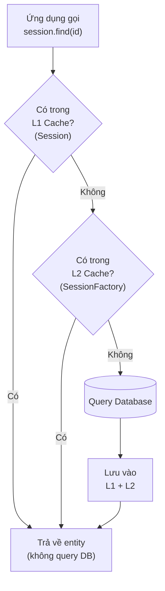

# Hibernate Cache

Cache là cơ chế lưu tạm dữ liệu vào bộ nhớ để Hibernate không phải truy vấn database nhiều lần cho cùng một dữ liệu, nhờ đó tăng hiệu năng đáng kể. Hibernate có hai cấp cache: L1 gắn với Session (tự động), và L2 chia sẻ giữa các session (cần cấu hình). Bài này hướng dẫn cách hoạt động, cách cấu hình L2 với Ehcache và cách đo hiệu quả của cache.

## Cache trong Hibernate là gì?

**Cache** (bộ nhớ đệm) trong Hibernate là cơ chế lưu tạm kết quả truy vấn hoặc entity vào bộ nhớ (RAM) để tránh truy vấn database nhiều lần cho cùng một dữ liệu. Điều này giúp tăng hiệu năng đáng kể.

Hibernate có hai cấp độ cache:
- **First-level Cache** (L1 Cache — cache cấp một): gắn với `Session`, tự động có, không thể tắt.
- **Second-level Cache** (L2 Cache — cache cấp hai): gắn với `SessionFactory`, chia sẻ giữa nhiều session, cần cấu hình.

Sơ đồ dưới đây mô tả thứ tự Hibernate tra cứu dữ liệu qua từng cấp cache trước khi phải chạm tới database:



Hibernate luôn tìm ở L1 trước, rồi mới tới L2; chỉ khi cả hai đều không có, nó mới thực sự truy vấn database rồi lưu lại kết quả cho lần sau.

## First-level Cache (L1 Cache)

L1 Cache là **persistence context** — vùng nhớ của mỗi `Session`. Mọi entity được load trong session đều được cache ở đây. Cùng một session, load cùng một ID hai lần → chỉ query database một lần:

```java
Session session = sessionFactory.openSession();

// Lần đầu: Hibernate truy vấn database → SELECT SQL được thực thi
NhanVien nv1 = session.find(NhanVien.class, 1L);

// Lần hai: CÙNG session → lấy từ L1 Cache, KHÔNG query database
NhanVien nv2 = session.find(NhanVien.class, 1L);

System.out.println(nv1 == nv2); // true - cùng một object trong memory

session.close();
// Sau khi đóng session: L1 Cache bị xóa

// Session mới → L1 Cache rỗng → phải query database lại
Session session2 = sessionFactory.openSession();
NhanVien nv3 = session2.find(NhanVien.class, 1L); // Query database lại
session2.close();
```

### Kiểm soát L1 Cache

```java
Session session = sessionFactory.openSession();

// evict(): xóa một entity khỏi L1 Cache
NhanVien nv = session.find(NhanVien.class, 1L);
session.evict(nv);
// Lần sau load lại sẽ phải query database

// clear(): xóa toàn bộ L1 Cache
session.clear();
// Dùng khi xử lý batch lớn để giải phóng memory
for (int i = 0; i < 1000; i++) {
    session.persist(new NhanVien("NV-" + i, "nv" + i + "@cty.com", 10000000.0));
    if (i % 50 == 0) {
        session.flush();   // Đẩy SQL xuống database
        session.clear();   // Xóa L1 Cache để tránh tràn bộ nhớ
    }
}

session.close();
```

## Second-level Cache (L2 Cache)

L2 Cache được chia sẻ giữa tất cả các `Session` trong cùng `SessionFactory`. Dữ liệu được cache ở L2 sẽ tồn tại xuyên suốt các session khác nhau.

### Cấu hình L2 Cache với Ehcache

**Ehcache** (Easy Java Caching) là thư viện cache phổ biến nhất cho Hibernate L2.

#### Thêm dependency

```xml
<!-- Ehcache provider cho Hibernate L2 Cache -->
<dependency>
    <groupId>org.hibernate.orm</groupId>
    <artifactId>hibernate-jcache</artifactId>
    <version>6.4.4.Final</version>
</dependency>
<dependency>
    <groupId>org.ehcache</groupId>
    <artifactId>ehcache</artifactId>
    <version>3.10.8</version>
    <classifier>jakarta</classifier>
</dependency>
```

#### Cấu hình trong hibernate.cfg.xml

```xml
<!-- Bật L2 Cache -->
<property name="hibernate.cache.use_second_level_cache">true</property>

<!-- Bật cache cho kết quả truy vấn HQL/Criteria -->
<property name="hibernate.cache.use_query_cache">true</property>

<!-- Chọn provider: JCache (JSR-107) với Ehcache -->
<property name="hibernate.cache.region.factory_class">
    jcache
</property>

<!-- File cấu hình Ehcache -->
<property name="hibernate.javax.cache.uri">
    classpath://ehcache.xml
</property>
```

#### File ehcache.xml

```xml
<config xmlns="http://www.ehcache.org/v3">

    <!-- Cache mặc định cho tất cả entity (nếu không có config riêng) -->
    <cache-template name="default">
        <expiry>
            <ttl unit="minutes">30</ttl>  <!-- Time to live: 30 phút -->
        </expiry>
        <resources>
            <heap unit="entries">1000</heap>  <!-- Tối đa 1000 entries trong RAM -->
            <offheap unit="MB">10</offheap>    <!-- 10MB off-heap memory -->
        </resources>
    </cache-template>

    <!-- Cache riêng cho NhanVien -->
    <cache alias="com.example.entity.NhanVien" uses-template="default">
        <expiry>
            <ttl unit="minutes">60</ttl>   <!-- Cache lâu hơn vì ít thay đổi -->
        </expiry>
        <resources>
            <heap unit="entries">500</heap>
        </resources>
    </cache>

</config>
```

### Đánh dấu Entity được cache

```java
import jakarta.persistence.*;
import org.hibernate.annotations.Cache;
import org.hibernate.annotations.CacheConcurrencyStrategy;

@Entity
@Table(name = "phong_ban")
// @Cache: đánh dấu entity này được lưu vào L2 Cache
// CacheConcurrencyStrategy.READ_WRITE: đọc/ghi, phù hợp cho dữ liệu thường xuyên thay đổi
@Cache(usage = CacheConcurrencyStrategy.READ_WRITE)
public class PhongBan {

    @Id
    @GeneratedValue(strategy = GenerationType.IDENTITY)
    private Long id;

    private String tenPhongBan;

    // Cache cho collection (danh sách nhân viên của phòng ban)
    @OneToMany(mappedBy = "phongBan")
    @Cache(usage = CacheConcurrencyStrategy.READ_WRITE)
    private List<NhanVien> danhSachNhanVien = new ArrayList<>();

    public PhongBan() {}
    public Long getId() { return id; }
    public String getTenPhongBan() { return tenPhongBan; }
    public void setTenPhongBan(String tenPhongBan) { this.tenPhongBan = tenPhongBan; }
}
```

### Các chiến lược CacheConcurrencyStrategy

| Chiến lược | Mô tả | Dùng khi nào |
|-----------|-------|-------------|
| `READ_ONLY` | Chỉ đọc, không bao giờ thay đổi | Dữ liệu tham chiếu cố định (danh mục, tỉnh thành) |
| `NONSTRICT_READ_WRITE` | Cập nhật không có lock nghiêm ngặt | Dữ liệu thỉnh thoảng thay đổi, chấp nhận stale data ngắn |
| `READ_WRITE` | Cập nhật có soft lock | Dữ liệu thường xuyên thay đổi, cần nhất quán |
| `TRANSACTIONAL` | Đảm bảo XA transaction | Cần nhất quán tuyệt đối (đòi hỏi JTA) |

## Query Cache - Cache kết quả truy vấn

**Query Cache** lưu kết quả của các câu query HQL/Criteria. Chỉ hữu ích khi cùng một query với cùng tham số được gọi nhiều lần:

```java
Session session = sessionFactory.openSession();

// Bật cache cho query cụ thể
List<PhongBan> danhSach = session
    .createQuery("FROM PhongBan ORDER BY tenPhongBan", PhongBan.class)
    .setCacheable(true)                    // Bật cache cho query này
    .setCacheRegion("phong-ban-cache")     // Region (vùng) cache riêng
    .list();

// Lần sau gọi cùng query: lấy từ cache, không query database
List<PhongBan> danhSach2 = session
    .createQuery("FROM PhongBan ORDER BY tenPhongBan", PhongBan.class)
    .setCacheable(true)
    .setCacheRegion("phong-ban-cache")
    .list();

session.close();
```

> **Lưu ý quan trọng**: Query Cache chỉ lưu danh sách ID, không lưu dữ liệu entity. Entity vẫn cần được cache riêng qua L2 Cache. Nếu không có L2 Cache cho entity, Query Cache sẽ gây ra N queries để load từng entity theo ID.

## Kiểm tra hiệu quả của Cache

```java
import org.hibernate.stat.Statistics;

SessionFactory sf = sessionFactory;

// Bật thống kê (statistics)
sf.getStatistics().setStatisticsEnabled(true);

// ... thực hiện các thao tác ...

Statistics stats = sf.getStatistics();
System.out.println("Số lần query database: " + stats.getQueryExecutionCount());
System.out.println("L2 Cache hit (lấy từ cache): " + stats.getSecondLevelCacheHitCount());
System.out.println("L2 Cache miss (không có trong cache): " + stats.getSecondLevelCacheMissCount());
System.out.println("L2 Cache put (lưu vào cache): " + stats.getSecondLevelCachePutCount());

// Hit rate: tỷ lệ cache hit
long hit = stats.getSecondLevelCacheHitCount();
long miss = stats.getSecondLevelCacheMissCount();
double hitRate = (double) hit / (hit + miss) * 100;
System.out.printf("Cache hit rate: %.1f%%%n", hitRate);
```

## Tóm tắt

| | L1 Cache | L2 Cache | Query Cache |
|--|----------|----------|-------------|
| **Phạm vi** | Session | SessionFactory | SessionFactory |
| **Tự động** | Có | Không (cần cấu hình) | Không (cần `.setCacheable(true)`) |
| **Chia sẻ** | Không | Có | Có |
| **Provider** | Hibernate tích hợp | Ehcache, Caffeine... | Hibernate tích hợp |

- L1 Cache tự động và luôn hoạt động — không cần làm gì.
- L2 Cache cần cấu hình provider (Ehcache), thêm dependency và đánh dấu `@Cache` trên entity.
- **Query Cache** chỉ hữu ích khi kết hợp với L2 Cache của entity.
- Dùng `Statistics` để đo **cache hit rate** và xác nhận cache đang hoạt động hiệu quả.
