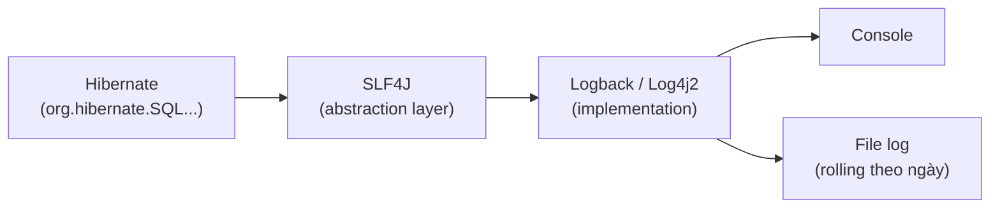

# Hibernate Logging

Khi làm việc với Hibernate, các câu SQL được sinh ra tự động nên rất khó biết chuyện gì đang chạy bên dưới. Logging giúp bạn nhìn thấy câu SQL thật, giá trị tham số và phát hiện các vấn đề hiệu năng như N+1 query. Bài này hướng dẫn cách bật log SQL và cấu hình chi tiết bằng Logback hoặc Log4j2.

:::note[Ghi nhớ nhanh]

- ⭐ **Bật `show_sql=true` và `format_sql=true`** — để xem SQL Hibernate sinh ra khi phát triển; nhớ tắt ở production.
- **Hibernate dùng SLF4J làm abstraction, Logback hoặc Log4j2 làm implementation** — kiểm soát log level theo từng package.
- **Logger `org.hibernate.SQL` = `DEBUG` (xem câu SQL); `org.hibernate.orm.jdbc.bind` = `TRACE` (xem giá trị tham số)**.
- **Nhiều câu SELECT lặp lại trong log = dấu hiệu N+1 query** — khắc phục bằng `JOIN FETCH`.

:::

## Tại sao cần cấu hình Logging?

**Logging** (ghi log) trong Hibernate rất quan trọng vì:
- Giúp theo dõi và debug các câu SQL được Hibernate sinh ra.
- Phát hiện vấn đề **N+1 query** (vấn đề query N+1 — tình trạng sinh ra quá nhiều câu SQL không cần thiết).
- Kiểm tra hiệu năng truy vấn.
- Theo dõi transaction và cache.

Hibernate sử dụng **SLF4J** (Simple Logging Facade for Java — giao diện logging đơn giản cho Java) là abstraction layer, và **Logback** hoặc **Log4j2** là implementation cụ thể.

Sơ đồ dưới đây minh họa đường đi của một dòng log từ Hibernate đến nơi hiển thị cuối cùng:



Hibernate chỉ gọi qua SLF4J, còn việc định dạng và đẩy log ra console hay file là do implementation (Logback/Log4j2) quyết định qua cấu hình.

## Cấu hình cơ bản trong hibernate.cfg.xml

```xml
<!-- Hiển thị câu SQL trên console (tiện cho development) -->
<property name="hibernate.show_sql">true</property>

<!-- Format SQL cho dễ đọc (thêm xuống dòng, thụt lề) -->
<property name="hibernate.format_sql">true</property>

<!-- Thêm comment vào SQL để biết query đến từ đâu -->
<property name="hibernate.use_sql_comments">true</property>

<!-- Bật thống kê: đo số query, cache hit/miss, ... -->
<property name="hibernate.generate_statistics">true</property>
```

Ví dụ output khi bật `show_sql` và `format_sql`:

```sql
/* load com.example.entity.NhanVien */
select
    nv1_0.id,
    nv1_0.ho_ten,
    nv1_0.email,
    nv1_0.luong,
    nv1_0.phong_ban_id
from
    nhan_vien nv1_0
where
    nv1_0.id=?
```

## Cấu hình với Logback

**Logback** là thư viện logging phổ biến nhất trong hệ sinh thái Java, thường đi kèm với Spring Boot.

### Dependency

```xml
<dependency>
    <groupId>ch.qos.logback</groupId>
    <artifactId>logback-classic</artifactId>
    <version>1.5.3</version>
</dependency>
```

### File logback.xml

Tạo `src/main/resources/logback.xml`:

```xml
<?xml version="1.0" encoding="UTF-8"?>
<configuration>

    <!-- Appender: nơi ghi log (console) -->
    <appender name="CONSOLE" class="ch.qos.logback.core.ConsoleAppender">
        <encoder>
            <!-- Pattern định dạng log: thời gian - level - tên logger - message -->
            <pattern>%d{HH:mm:ss.SSS} [%-5level] [%logger{36}] - %msg%n</pattern>
        </encoder>
    </appender>

    <!-- Appender ghi ra file -->
    <appender name="FILE" class="ch.qos.logback.core.rolling.RollingFileAppender">
        <file>logs/hibernate.log</file>
        <rollingPolicy class="ch.qos.logback.core.rolling.TimeBasedRollingPolicy">
            <!-- Tạo file mới mỗi ngày, giữ tối đa 30 ngày -->
            <fileNamePattern>logs/hibernate.%d{yyyy-MM-dd}.log</fileNamePattern>
            <maxHistory>30</maxHistory>
        </rollingPolicy>
        <encoder>
            <pattern>%d{yyyy-MM-dd HH:mm:ss} [%-5level] %logger{36} - %msg%n</pattern>
        </encoder>
    </appender>

    <!-- ===== Cấu hình Hibernate Logging ===== -->

    <!-- SQL statements: các câu SQL được thực thi -->
    <logger name="org.hibernate.SQL" level="DEBUG"/>

    <!-- SQL parameters: giá trị các tham số trong câu SQL -->
    <logger name="org.hibernate.orm.jdbc.bind" level="TRACE"/>

    <!-- SQL results: giá trị được đọc từ ResultSet (rất chi tiết) -->
    <!-- Chỉ bật khi cần debug sâu -->
    <!-- <logger name="org.hibernate.orm.jdbc.extract" level="TRACE"/> -->

    <!-- Hibernate internals: thông tin nội bộ của Hibernate -->
    <logger name="org.hibernate" level="WARN"/>

    <!-- Connection pool thông tin -->
    <logger name="com.zaxxer.hikari" level="INFO"/>

    <!-- Logger gốc: mọi log không được cấu hình riêng -->
    <root level="INFO">
        <appender-ref ref="CONSOLE"/>
        <appender-ref ref="FILE"/>
    </root>

</configuration>
```

## Cấu hình với Log4j2

**Log4j2** là thư viện logging hiệu năng cao của Apache.

```xml
<!-- Dependency -->
<dependency>
    <groupId>org.apache.logging.log4j</groupId>
    <artifactId>log4j-slf4j2-impl</artifactId>
    <version>2.23.1</version>
</dependency>
```

File `src/main/resources/log4j2.xml`:

```xml
<?xml version="1.0" encoding="UTF-8"?>
<Configuration status="WARN">
    <Appenders>
        <Console name="Console" target="SYSTEM_OUT">
            <PatternLayout pattern="%d{HH:mm:ss} %-5level %logger{36} - %msg%n"/>
        </Console>
    </Appenders>

    <Loggers>
        <!-- SQL statements -->
        <Logger name="org.hibernate.SQL" level="debug" additivity="false">
            <AppenderRef ref="Console"/>
        </Logger>

        <!-- Bind parameters (giá trị tham số) -->
        <Logger name="org.hibernate.orm.jdbc.bind" level="trace" additivity="false">
            <AppenderRef ref="Console"/>
        </Logger>

        <!-- Giảm noise từ các package nội bộ của Hibernate -->
        <Logger name="org.hibernate" level="warn"/>

        <Root level="info">
            <AppenderRef ref="Console"/>
        </Root>
    </Loggers>
</Configuration>
```

## Ví dụ output và cách đọc

Khi cấu hình đúng, bạn sẽ thấy output như sau:

```
14:25:33 DEBUG o.h.SQL - 
    select
        nv1_0.id,
        nv1_0.ho_ten,
        nv1_0.email,
        nv1_0.luong
    from
        nhan_vien nv1_0
    where
        nv1_0.phong_ban_id=?

14:25:33 TRACE o.h.o.j.bind - binding parameter (1:BIGINT) <- [2]
```

Dòng đầu là câu SQL, dòng cuối cho thấy tham số `?` thứ nhất (`1:BIGINT`) có giá trị là `2`.

## Ghi log tùy chỉnh trong ứng dụng

```java
import org.slf4j.Logger;
import org.slf4j.LoggerFactory;
import org.hibernate.Session;

public class NhanVienService {

    // Tạo logger cho class này
    private static final Logger log = LoggerFactory.getLogger(NhanVienService.class);

    public NhanVien timNhanVien(Session session, Long id) {
        log.debug("Bắt đầu tìm nhân viên ID: {}", id);

        NhanVien nv = session.find(NhanVien.class, id);

        if (nv != null) {
            log.info("Tìm thấy nhân viên: {} ({})", nv.getHoTen(), nv.getEmail());
        } else {
            log.warn("Không tìm thấy nhân viên với ID: {}", id);
        }

        return nv;
    }

    public void xoaNhanVien(Session session, Long id) {
        try {
            session.beginTransaction();
            NhanVien nv = session.find(NhanVien.class, id);
            if (nv == null) {
                log.warn("Nhân viên ID {} không tồn tại, bỏ qua xóa", id);
                session.getTransaction().rollback();
                return;
            }
            session.remove(nv);
            session.getTransaction().commit();
            log.info("Đã xóa nhân viên ID: {}", id);
        } catch (Exception e) {
            log.error("Lỗi khi xóa nhân viên ID: {}", id, e);
            session.getTransaction().rollback();
            throw e;
        }
    }
}
```

## Phát hiện N+1 Query Problem qua log

Khi thấy nhiều câu SELECT lặp đi lặp lại trong log, đó là dấu hiệu của **N+1 query problem**:

```
// LOG THẤY CÁC QUERY LẶP LẠI - ĐÂY LÀ N+1 PROBLEM!
DEBUG o.h.SQL - select * from phong_ban                   ← 1 query
DEBUG o.h.SQL - select * from nhan_vien where phong_ban_id=?  ← N query
DEBUG o.h.SQL - select * from nhan_vien where phong_ban_id=?
DEBUG o.h.SQL - select * from nhan_vien where phong_ban_id=?
... (N lần cho N phòng ban)
```

Cách khắc phục bằng `JOIN FETCH`:

```java
// TRƯỚC: gây N+1
List<PhongBan> danhSach = session
    .createQuery("FROM PhongBan", PhongBan.class)
    .list();
// Khi truy cập pb.getDanhSachNhanVien() → mỗi phòng ban sinh thêm 1 SELECT

// SAU: dùng JOIN FETCH, chỉ 1 query
List<PhongBan> danhSach = session
    .createQuery("FROM PhongBan pb JOIN FETCH pb.danhSachNhanVien", PhongBan.class)
    .distinct(true)
    .list();
```

## Tóm tắt

- Cài `show_sql=true` và `format_sql=true` để xem SQL trong quá trình phát triển.
- Dùng **Logback** hoặc **Log4j2** để kiểm soát chi tiết log level cho từng package Hibernate.
- Logger `org.hibernate.SQL` ở mức `DEBUG` để xem SQL; `org.hibernate.orm.jdbc.bind` ở mức `TRACE` để xem tham số.
- Theo dõi log để phát hiện **N+1 query problem** và xử lý bằng `JOIN FETCH`.
- Tắt `show_sql` ở môi trường production — dùng logging framework thay thế.
