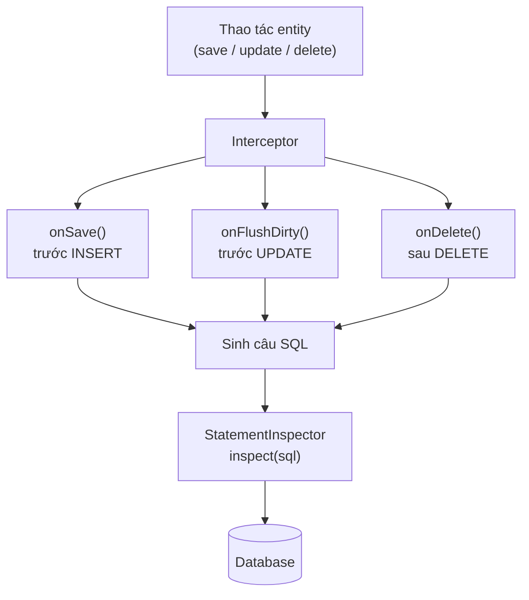

# Hibernate Interceptor và StatementInspector

Đôi khi bạn muốn xen vào quá trình Hibernate lưu, sửa, xóa dữ liệu để làm những việc chung như ghi log audit hay tự điền người tạo/ngày tạo, mà không phải sửa từng entity. Interceptor và StatementInspector chính là hai cơ chế giúp can thiệp vào lifecycle của entity và vào từng câu SQL. Bài này giới thiệu cách dùng hai công cụ này qua các ví dụ thực tế.

## Interceptor là gì?

**Interceptor** (bộ đánh chặn) trong Hibernate là cơ chế cho phép bạn can thiệp vào quá trình Hibernate xử lý entity. Bạn có thể thực thi logic tùy chỉnh tại các điểm quan trọng trong lifecycle của entity mà không cần sửa đổi entity class.

Các use case phổ biến:
- **Audit logging** (ghi log kiểm toán): tự động ghi lại ai tạo/sửa/xóa bản ghi và khi nào.
- **Soft delete** (xóa mềm): thay vì DELETE thật, đánh dấu `da_xoa = true`.
- **Encryption** (mã hóa): tự động mã hóa/giải mã dữ liệu nhạy cảm.
- **Tenant filtering** (lọc theo tenant): tự động thêm điều kiện lọc theo tenant trong multi-tenant system.

Sơ đồ dưới đây cho thấy hai điểm can thiệp: Interceptor xen vào lifecycle của entity, còn StatementInspector xen vào từng câu SQL trước khi xuống database:



Interceptor làm việc ở mức đối tượng (thay đổi field trước khi lưu), còn StatementInspector làm việc ở mức câu lệnh SQL (thêm filter, comment) ngay trước khi gửi xuống database.

## EmptyInterceptor - Lớp cơ sở

Hibernate cung cấp `EmptyInterceptor` (interceptor rỗng) với tất cả method đã được triển khai rỗng, bạn chỉ cần override method cần thiết:

```java
import org.hibernate.Interceptor;
import org.hibernate.type.Type;
import java.io.Serializable;
import java.time.LocalDateTime;

public class AuditInterceptor implements Interceptor {

    // ThreadLocal lưu tên user theo từng thread (luồng xử lý)
    // ThreadLocal: biến cục bộ theo thread, mỗi thread có giá trị riêng
    private static final ThreadLocal<String> currentUser = new ThreadLocal<>();

    public static void setCurrentUser(String username) {
        currentUser.set(username);
    }

    public static void clearCurrentUser() {
        currentUser.remove();
    }

    /**
     * Được gọi trước khi INSERT một entity.
     * Trả về true nếu state đã được sửa đổi, false nếu không.
     *
     * @param entity    Đối tượng entity sắp được lưu
     * @param id        Khóa chính của entity
     * @param state     Mảng giá trị các field của entity
     * @param propertyNames Tên các field tương ứng với state
     * @param types     Kiểu Hibernate của từng field
     */
    @Override
    public boolean onSave(Object entity, Object id,
                          Object[] state, String[] propertyNames, Type[] types) {
        if (entity instanceof Auditable) {
            String user = currentUser.get() != null ? currentUser.get() : "system";
            for (int i = 0; i < propertyNames.length; i++) {
                switch (propertyNames[i]) {
                    case "createdBy":
                        state[i] = user;
                        break;
                    case "createdAt":
                        state[i] = LocalDateTime.now();
                        break;
                    case "updatedBy":
                        state[i] = user;
                        break;
                    case "updatedAt":
                        state[i] = LocalDateTime.now();
                        break;
                }
            }
            return true;   // Báo Hibernate rằng state đã thay đổi
        }
        return false;
    }

    /**
     * Được gọi trước khi UPDATE một entity.
     * currentState: giá trị hiện tại, previousState: giá trị cũ trước khi thay đổi.
     */
    @Override
    public boolean onFlushDirty(Object entity, Object id,
                                 Object[] currentState, Object[] previousState,
                                 String[] propertyNames, Type[] types) {
        if (entity instanceof Auditable) {
            String user = currentUser.get() != null ? currentUser.get() : "system";
            for (int i = 0; i < propertyNames.length; i++) {
                if ("updatedBy".equals(propertyNames[i])) {
                    currentState[i] = user;
                } else if ("updatedAt".equals(propertyNames[i])) {
                    currentState[i] = LocalDateTime.now();
                }
            }
            return true;
        }
        return false;
    }

    /**
     * Được gọi sau khi DELETE một entity - dùng để ghi log.
     */
    @Override
    public void onDelete(Object entity, Object id,
                         Object[] state, String[] propertyNames, Type[] types) {
        if (entity instanceof NhanVien) {
            NhanVien nv = (NhanVien) entity;
            System.out.println("[AUDIT] Xóa nhân viên: " + nv.getHoTen()
                + " bởi: " + currentUser.get()
                + " lúc: " + LocalDateTime.now());
        }
    }
}
```

### Interface Auditable để đánh dấu Entity cần audit

```java
// Interface đánh dấu: entity nào implement interface này sẽ được audit tự động
public interface Auditable {}
```

```java
@Entity
@Table(name = "nhan_vien")
public class NhanVien implements Auditable {

    @Id
    @GeneratedValue(strategy = GenerationType.IDENTITY)
    private Long id;

    private String hoTen;
    private String email;
    private Double luong;

    // Các field audit - tự động được Interceptor điền
    @Column(name = "created_by", updatable = false)
    private String createdBy;

    @Column(name = "created_at", updatable = false)
    private LocalDateTime createdAt;

    @Column(name = "updated_by")
    private String updatedBy;

    @Column(name = "updated_at")
    private LocalDateTime updatedAt;

    public NhanVien() {}

    // Getters và setters
    public Long getId() { return id; }
    public String getHoTen() { return hoTen; }
    public void setHoTen(String hoTen) { this.hoTen = hoTen; }
    public String getEmail() { return email; }
    public void setEmail(String email) { this.email = email; }
    public Double getLuong() { return luong; }
    public void setLuong(Double luong) { this.luong = luong; }
    public String getCreatedBy() { return createdBy; }
    public LocalDateTime getCreatedAt() { return createdAt; }
    public String getUpdatedBy() { return updatedBy; }
    public LocalDateTime getUpdatedAt() { return updatedAt; }
}
```

## Đăng ký và sử dụng Interceptor

```java
public class InterceptorUsageDemo {

    public static void main(String[] args) {
        SessionFactory sf = new Configuration()
                .configure("hibernate.cfg.xml")
                .addAnnotatedClass(NhanVien.class)
                .buildSessionFactory();

        // Cài đặt user hiện tại (thường lấy từ security context)
        AuditInterceptor.setCurrentUser("admin@cty.com");

        // Cách 1: Đăng ký Interceptor cho một Session cụ thể
        Session session = sf.withOptions()
                .interceptor(new AuditInterceptor())
                .openSession();

        session.beginTransaction();

        NhanVien nv = new NhanVien();
        nv.setHoTen("Le Thi C");
        nv.setEmail("thic@cty.com");
        nv.setLuong(14000000.0);
        session.persist(nv);
        // createdBy, createdAt, updatedBy, updatedAt được tự động điền!

        session.getTransaction().commit();
        session.close();

        // Dọn dẹp sau khi dùng xong
        AuditInterceptor.clearCurrentUser();
        sf.close();
    }
}
```

### Cách 2: Đăng ký Interceptor cho toàn bộ SessionFactory

```xml
<!-- Trong hibernate.cfg.xml -->
<property name="hibernate.session_factory.interceptor">
    com.example.interceptor.AuditInterceptor
</property>
```

## StatementInspector - Kiểm tra câu SQL

**`StatementInspector`** (bộ kiểm tra câu lệnh) là interface đơn giản hơn Interceptor, chỉ tập trung vào việc can thiệp vào từng câu SQL trước khi gửi xuống database.

```java
import org.hibernate.resource.jdbc.spi.StatementInspector;

public class SqlAuditInspector implements StatementInspector {

    private static final org.slf4j.Logger log =
        org.slf4j.LoggerFactory.getLogger(SqlAuditInspector.class);

    /**
     * Được gọi với mỗi câu SQL trước khi thực thi.
     * Trả về câu SQL (có thể đã sửa đổi), hoặc null để dùng câu SQL gốc.
     *
     * @param sql Câu SQL gốc Hibernate chuẩn bị thực thi
     * @return Câu SQL sẽ thực thi (có thể là câu SQL gốc hoặc đã sửa đổi)
     */
    @Override
    public String inspect(String sql) {
        // Ghi log mọi câu SQL kèm thời gian (dùng cho phân tích hiệu năng)
        log.debug("[SQL] {}", sql.replaceAll("\\s+", " ").trim());

        // Ví dụ: tự động thêm comment vào câu SQL để tracking
        String tenUser = getCurrentUsername();
        return "/* user:" + tenUser + " */ " + sql;
    }

    private String getCurrentUsername() {
        // Lấy tên user từ security context của ứng dụng
        return "system";   // Simplified cho ví dụ
    }
}
```

### Đăng ký StatementInspector

```java
// Cách 1: Qua Configuration
SessionFactory sf = new Configuration()
        .configure("hibernate.cfg.xml")
        .addAnnotatedClass(NhanVien.class)
        .setProperty(
            "hibernate.session_factory.statement_inspector",
            "com.example.inspector.SqlAuditInspector")
        .buildSessionFactory();
```

```xml
<!-- Cách 2: Trong hibernate.cfg.xml -->
<property name="hibernate.session_factory.statement_inspector">
    com.example.inspector.SqlAuditInspector
</property>
```

## Multi-tenant SQL Filtering với StatementInspector

**Multi-tenancy** (kiến trúc nhiều tenant) là kiến trúc mà nhiều khách hàng (tenant) dùng chung một codebase nhưng dữ liệu được cô lập:

```java
public class MultiTenantSqlInspector implements StatementInspector {

    // ThreadLocal lưu tenant_id theo từng request
    private static final ThreadLocal<Long> currentTenantId = new ThreadLocal<>();

    public static void setTenantId(Long tenantId) {
        currentTenantId.set(tenantId);
    }

    public static void clearTenantId() {
        currentTenantId.remove();
    }

    @Override
    public String inspect(String sql) {
        Long tenantId = currentTenantId.get();
        if (tenantId == null) {
            return sql;   // Không có tenant filter, trả về SQL gốc
        }

        // Tự động thêm điều kiện tenant_id vào mọi câu SQL
        // Chú ý: đây là ví dụ đơn giản, cần parser SQL thực sự cho production
        if (sql.toUpperCase().contains("WHERE")) {
            return sql + " AND tenant_id = " + tenantId;
        } else if (sql.toUpperCase().startsWith("SELECT")
                && sql.toUpperCase().contains("FROM")) {
            return sql + " WHERE tenant_id = " + tenantId;
        }
        return sql;
    }
}
```

## So sánh Interceptor và StatementInspector

| | Interceptor | StatementInspector |
|--|-------------|-------------------|
| **Mức độ** | Entity lifecycle | SQL statement |
| **Khi nào chạy** | Trước/sau khi load, save, update, delete entity | Trước khi thực thi từng câu SQL |
| **Có thể sửa state** | Có (thay đổi field của entity) | Có (thay đổi câu SQL) |
| **Use case** | Audit field, soft delete, encryption | Thêm filter SQL, logging SQL |
| **Độ phức tạp** | Cao hơn (nhiều method) | Thấp (chỉ một method) |

## Tóm tắt

- **Interceptor** can thiệp vào lifecycle của entity: `onSave()` trước INSERT, `onFlushDirty()` trước UPDATE, `onDelete()` sau DELETE.
- Interceptor lý tưởng để implement **audit logging** tự động mà không cần sửa entity.
- **`StatementInspector`** can thiệp vào từng câu SQL, phù hợp để thêm filter hoặc comment.
- Cả hai đều dùng **`ThreadLocal`** để truyền context (user hiện tại, tenant ID) an toàn giữa các thread.
- Đăng ký Interceptor/Inspector qua `SessionFactory.withOptions().interceptor()` hoặc cấu hình trong `hibernate.cfg.xml`.
