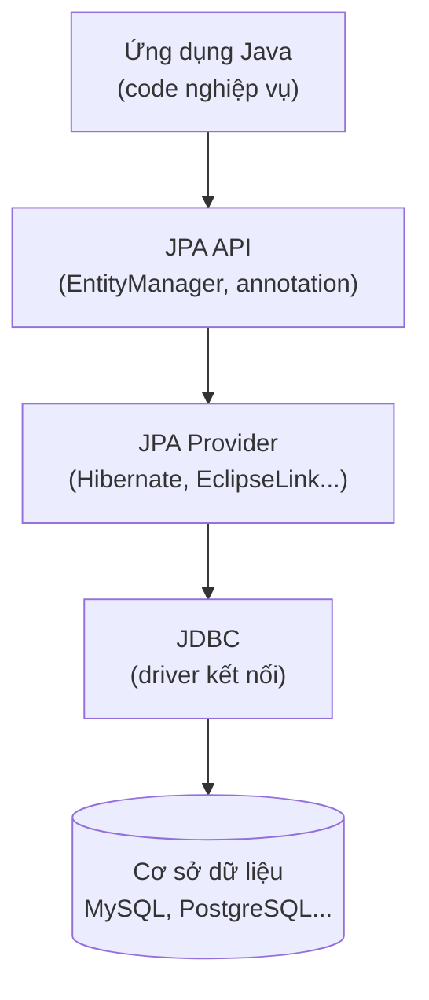

# Tổng quan về JPA - Java Persistence API

JPA là chuẩn của Java giúp lưu và đọc dữ liệu từ cơ sở dữ liệu theo kiểu hướng đối tượng, thay vì phải viết tay nhiều câu SQL như khi dùng JDBC. Nó ánh xạ các lớp Java thành bảng trong database, giúp code ngắn gọn và dễ bảo trì hơn nhiều. Bài này giới thiệu khái niệm tổng quan cùng các thành phần cốt lõi như Entity và EntityManager; phần chi tiết nằm bên dưới.

## JPA là gì?

**JPA** (Java Persistence API — giao diện lập trình ứng dụng để lưu trữ dữ liệu trong Java) là một đặc tả kỹ thuật (specification) của Java EE / Jakarta EE, định nghĩa cách ánh xạ các đối tượng Java sang cơ sở dữ liệu quan hệ thông qua kỹ thuật **ORM** (Object-Relational Mapping — kỹ thuật ánh xạ đối tượng Java với bảng trong cơ sở dữ liệu quan hệ).

JPA **không phải** là một thư viện cụ thể mà chỉ là một tập hợp các interface và annotation. Để sử dụng JPA, bạn cần một **provider** (nhà cung cấp triển khai), phổ biến nhất là Hibernate.

Sơ đồ dưới đây minh họa vị trí của JPA trong toàn bộ luồng truy cập dữ liệu, từ ứng dụng xuống tới database:



Ứng dụng chỉ làm việc với tầng JPA API chuẩn; provider bên dưới lo việc sinh SQL và giao tiếp database qua JDBC, nhờ đó có thể đổi provider mà ít ảnh hưởng tới code.

## Vì sao cần JPA?

Trước khi có JPA, lập trình viên Java phải dùng **JDBC** (Java Database Connectivity — giao diện kết nối cơ sở dữ liệu Java) với nhiều đoạn code lặp đi lặp lại để thực hiện các thao tác **CRUD** (Create, Read, Update, Delete — tạo, đọc, cập nhật, xóa):

```java
// Cách cũ với JDBC - rất nhiều boilerplate code
Connection conn = DriverManager.getConnection(url, user, password);
PreparedStatement stmt = conn.prepareStatement(
    "SELECT * FROM users WHERE id = ?"
);
stmt.setInt(1, userId);
ResultSet rs = stmt.executeQuery();
if (rs.next()) {
    User user = new User();
    user.setId(rs.getInt("id"));
    user.setName(rs.getString("name"));
    user.setEmail(rs.getString("email"));
}
```

Với JPA, code trở nên ngắn gọn và hướng đối tượng hơn:

```java
// Cách mới với JPA - sạch và đơn giản hơn nhiều
EntityManager em = emf.createEntityManager();
User user = em.find(User.class, userId);
```

## Các khái niệm cốt lõi của JPA

### Entity

**Entity** (thực thể) là một lớp Java đại diện cho một bảng trong cơ sở dữ liệu. Mỗi instance của entity tương ứng với một hàng trong bảng.

```java
import jakarta.persistence.*;

@Entity                          // Đánh dấu đây là một Entity
@Table(name = "users")           // Ánh xạ tới bảng "users" trong database
public class User {

    @Id                          // Đánh dấu đây là khóa chính (primary key)
    @GeneratedValue(strategy = GenerationType.IDENTITY)  // Tự động tăng ID
    private Long id;

    @Column(name = "full_name", nullable = false, length = 100)
    private String name;

    @Column(unique = true)
    private String email;

    // Constructor mặc định bắt buộc với JPA
    public User() {}

    // Getters và setters
    public Long getId() { return id; }
    public void setId(Long id) { this.id = id; }
    public String getName() { return name; }
    public void setName(String name) { this.name = name; }
    public String getEmail() { return email; }
    public void setEmail(String email) { this.email = email; }
}
```

### EntityManager

**EntityManager** (trình quản lý thực thể) là interface trung tâm trong JPA, cung cấp các phương thức để thực hiện thao tác với database như: `persist()`, `find()`, `merge()`, `remove()`.

### Persistence Context

**Persistence Context** (ngữ cảnh lưu trữ) là một vùng nhớ mà `EntityManager` quản lý, chứa tất cả các entity đang được theo dõi (tracked). Mọi thay đổi trên entity trong persistence context sẽ tự động được đồng bộ với database khi transaction kết thúc.

### EntityManagerFactory

**EntityManagerFactory** (nhà máy tạo EntityManager) là đối tượng được khởi tạo một lần cho cả ứng dụng, dùng để tạo ra các `EntityManager`.

```java
// Khởi tạo EntityManagerFactory từ persistence unit tên "myPU"
EntityManagerFactory emf = Persistence.createEntityManagerFactory("myPU");

// Tạo EntityManager từ factory
EntityManager em = emf.createEntityManager();

// Bắt đầu transaction (giao dịch)
em.getTransaction().begin();

// Tạo và lưu một User mới
User user = new User();
user.setName("Nguyen Van A");
user.setEmail("vana@example.com");
em.persist(user);   // Lưu vào database

// Commit transaction để xác nhận thay đổi
em.getTransaction().commit();

// Đóng EntityManager sau khi dùng xong
em.close();
emf.close();
```

## File cấu hình persistence.xml

JPA yêu cầu file `persistence.xml` đặt trong thư mục `META-INF/`:

```xml
<?xml version="1.0" encoding="UTF-8"?>
<persistence xmlns="https://jakarta.ee/xml/ns/persistence" version="3.0">
    <persistence-unit name="myPU" transaction-type="RESOURCE_LOCAL">
        <provider>org.hibernate.jpa.HibernatePersistenceProvider</provider>
        <class>com.example.entity.User</class>
        <properties>
            <property name="jakarta.persistence.jdbc.driver"
                      value="com.mysql.cj.jdbc.Driver"/>
            <property name="jakarta.persistence.jdbc.url"
                      value="jdbc:mysql://localhost:3306/mydb"/>
            <property name="jakarta.persistence.jdbc.user" value="root"/>
            <property name="jakarta.persistence.jdbc.password" value="secret"/>
            <property name="hibernate.hbm2ddl.auto" value="update"/>
            <property name="hibernate.show_sql" value="true"/>
        </properties>
    </persistence-unit>
</persistence>
```

## Các JPA Provider phổ biến

| Provider | Mô tả |
|----------|-------|
| **Hibernate** | Phổ biến nhất, cũng là nền tảng cho Spring Data JPA |
| **EclipseLink** | Triển khai tham chiếu chính thức của Jakarta EE |
| **OpenJPA** | Provider của Apache Foundation |

## Tóm tắt

- JPA là **đặc tả** (specification), không phải thư viện cụ thể.
- JPA giúp ánh xạ class Java với bảng database thông qua **annotation**.
- `EntityManager` là đối tượng trung tâm để thao tác với database.
- Cần một **provider** (thường là Hibernate) để JPA hoạt động.
- File `persistence.xml` chứa cấu hình kết nối database và các tham số JPA.
