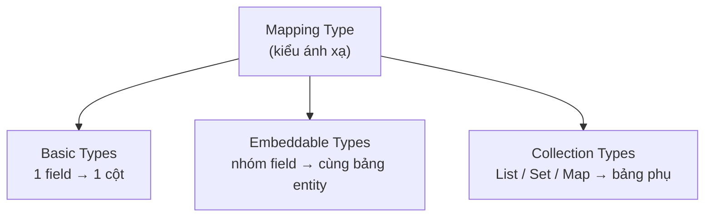

# Hibernate Mapping Type

Mapping type là cách Hibernate quyết định một kiểu dữ liệu Java sẽ được lưu thành kiểu nào trong database và ngược lại. Hiểu rõ phần này giúp bạn ánh xạ đúng các field cơ bản, nhúng nhóm field dùng chung, hay lưu cả collection như List, Set, Map. Bài này giới thiệu ba loại mapping type chính cùng các annotation thường dùng.

## Khái niệm Mapping Type

**Mapping Type** (kiểu ánh xạ) trong Hibernate xác định cách dữ liệu Java được chuyển đổi sang kiểu dữ liệu tương ứng trong database và ngược lại. Hibernate sử dụng **Type System** (hệ thống kiểu) để tự động thực hiện việc chuyển đổi này.

Có ba loại mapping type chính:

1. **Basic Types** (kiểu cơ bản): ánh xạ một field Java sang một cột database.
2. **Embeddable Types** (kiểu nhúng): ánh xạ một nhóm fields của một class phụ vào cùng bảng với entity chứa nó.
3. **Collection Types** (kiểu tập hợp): ánh xạ các collection (`List`, `Set`, `Map`).

Sơ đồ dưới đây phân loại ba nhóm mapping type theo cách chúng được lưu xuống database:



Basic type nằm ngay trong bảng của entity; embeddable cũng nằm chung bảng nhưng gom nhiều field; còn collection thường tách ra một bảng phụ riêng.

## Basic Types - Kiểu cơ bản

Hibernate tự động ánh xạ hầu hết các kiểu Java phổ biến:

| Kiểu Java | Kiểu SQL tương ứng |
|-----------|-------------------|
| `String` | `VARCHAR` |
| `int` / `Integer` | `INTEGER` |
| `long` / `Long` | `BIGINT` |
| `double` / `Double` | `DOUBLE` |
| `boolean` / `Boolean` | `BOOLEAN` / `BIT` |
| `java.util.Date` | `TIMESTAMP` |
| `java.time.LocalDate` | `DATE` |
| `java.time.LocalDateTime` | `TIMESTAMP` |
| `byte[]` | `BLOB` |
| `BigDecimal` | `NUMERIC` |

### Ví dụ Basic Types

```java
import jakarta.persistence.*;
import java.math.BigDecimal;
import java.time.LocalDate;
import java.time.LocalDateTime;

@Entity
@Table(name = "san_pham")
public class SanPham {

    @Id
    @GeneratedValue(strategy = GenerationType.IDENTITY)
    private Long id;

    // String → VARCHAR(255) mặc định
    private String ten;

    // BigDecimal → NUMERIC (chính xác hơn double cho tiền tệ)
    @Column(precision = 15, scale = 2)
    private BigDecimal gia;

    // int → INTEGER
    private int soLuong;

    // boolean → BOOLEAN
    private boolean conHang;

    // LocalDate → DATE (chỉ lưu ngày, không có giờ)
    private LocalDate ngaySanXuat;

    // LocalDateTime → TIMESTAMP (lưu cả ngày và giờ)
    private LocalDateTime thoiGianTao;

    // byte[] → BLOB (dùng cho file, ảnh nhỏ)
    @Lob   // @Lob đánh dấu Large Object
    private byte[] anhDaiDien;

    // Enum ánh xạ - mặc định lưu theo thứ tự số (ordinal)
    // Dùng @Enumerated(EnumType.STRING) để lưu theo tên chuỗi
    @Enumerated(EnumType.STRING)
    private TrangThai trangThai;

    public enum TrangThai {
        DANG_BAN, HET_HANG, NGUNG_BAN
    }

    // Constructor, getters, setters...
    public SanPham() {}
}
```

## @Basic Annotation

**`@Basic`** là annotation ngầm định (implicit) cho tất cả các field kiểu cơ bản. Bạn có thể dùng nó tường minh để cấu hình:

```java
@Entity
public class TaiLieu {

    @Id
    private Long id;

    // fetch = FetchType.LAZY: chỉ tải khi truy cập field này
    // optional = false: không cho phép null
    @Basic(fetch = FetchType.LAZY, optional = false)
    @Lob
    private byte[] noiDung;   // Tải lazy vì dữ liệu lớn

    @Basic(optional = false)
    private String tieuDe;
}
```

## @Column Annotation chi tiết

```java
@Entity
public class KhachHang {

    @Id
    @GeneratedValue(strategy = GenerationType.IDENTITY)
    private Long id;

    @Column(
        name = "ho_va_ten",      // Tên cột trong database
        nullable = false,         // NOT NULL
        length = 150,             // VARCHAR(150)
        unique = false,           // Không cần unique
        insertable = true,        // Cho phép INSERT
        updatable = true          // Cho phép UPDATE
    )
    private String hoVaTen;

    @Column(name = "so_dien_thoai", unique = true, length = 20)
    private String soDienThoai;

    // columnDefinition: định nghĩa SQL thủ công
    @Column(columnDefinition = "TEXT")
    private String ghiChu;

    // Cột chỉ đọc - không được cập nhật sau khi INSERT
    @Column(name = "ngay_tao", updatable = false)
    private LocalDateTime ngayTao;
}
```

## Embeddable Types - Kiểu nhúng

**`@Embeddable`** cho phép tái sử dụng một nhóm fields qua nhiều entity mà không cần tạo bảng riêng:

```java
import jakarta.persistence.Embeddable;

// Class này không phải là Entity, không có bảng riêng
@Embeddable
public class DiaChi {
    private String soNha;
    private String duong;
    private String quan;
    private String thanhPho;

    public DiaChi() {}

    public DiaChi(String soNha, String duong, String quan, String thanhPho) {
        this.soNha = soNha;
        this.duong = duong;
        this.quan = quan;
        this.thanhPho = thanhPho;
    }

    // Getters và setters
    public String getSoNha() { return soNha; }
    public void setSoNha(String soNha) { this.soNha = soNha; }
    public String getDuong() { return duong; }
    public void setDuong(String duong) { this.duong = duong; }
    public String getQuan() { return quan; }
    public void setQuan(String quan) { this.quan = quan; }
    public String getThanhPho() { return thanhPho; }
    public void setThanhPho(String thanhPho) { this.thanhPho = thanhPho; }
}
```

```java
@Entity
@Table(name = "cua_hang")
public class CuaHang {

    @Id
    @GeneratedValue(strategy = GenerationType.IDENTITY)
    private Long id;

    private String ten;

    // @Embedded: nhúng DiaChi vào bảng cua_hang
    // Các cột so_nha, duong, quan, thanh_pho sẽ nằm trong bảng cua_hang
    @Embedded
    private DiaChi diaChi;

    // Nếu cần đổi tên cột khi nhúng, dùng @AttributeOverrides
    @Embedded
    @AttributeOverrides({
        @AttributeOverride(name = "soNha",     column = @Column(name = "kho_so_nha")),
        @AttributeOverride(name = "duong",     column = @Column(name = "kho_duong")),
        @AttributeOverride(name = "quan",      column = @Column(name = "kho_quan")),
        @AttributeOverride(name = "thanhPho",  column = @Column(name = "kho_thanh_pho"))
    })
    private DiaChi diaChiKho;

    public CuaHang() {}

    // Getters và setters
    public Long getId() { return id; }
    public String getTen() { return ten; }
    public void setTen(String ten) { this.ten = ten; }
    public DiaChi getDiaChi() { return diaChi; }
    public void setDiaChi(DiaChi diaChi) { this.diaChi = diaChi; }
}
```

## Collection Types - Kiểu tập hợp

```java
import jakarta.persistence.*;
import java.util.*;

@Entity
public class BaiViet {

    @Id
    @GeneratedValue(strategy = GenerationType.IDENTITY)
    private Long id;

    private String tieuDe;

    // Lưu danh sách tags vào bảng phụ "bai_viet_tags"
    @ElementCollection   // Đánh dấu đây là collection của basic type
    @CollectionTable(
        name = "bai_viet_tags",             // Tên bảng phụ
        joinColumns = @JoinColumn(name = "bai_viet_id")  // Khóa ngoại
    )
    @Column(name = "tag")
    private List<String> tags = new ArrayList<>();

    // Lưu Map vào bảng phụ
    @ElementCollection
    @CollectionTable(name = "bai_viet_meta")
    @MapKeyColumn(name = "meta_key")
    @Column(name = "meta_value")
    private Map<String, String> metaData = new HashMap<>();

    public BaiViet() {}

    public Long getId() { return id; }
    public String getTieuDe() { return tieuDe; }
    public void setTieuDe(String tieuDe) { this.tieuDe = tieuDe; }
    public List<String> getTags() { return tags; }
    public void setTags(List<String> tags) { this.tags = tags; }
}
```

## Tóm tắt

- **Basic Types**: Hibernate tự động ánh xạ kiểu Java phổ biến sang kiểu SQL.
- Dùng `@Column` để tùy chỉnh tên cột, độ dài, nullable, v.v.
- `@Enumerated(EnumType.STRING)` để lưu enum theo tên chuỗi thay vì số thứ tự.
- **`@Embeddable`** và **`@Embedded`** dùng để tái sử dụng nhóm fields, không tạo bảng riêng.
- **`@ElementCollection`** dùng để ánh xạ collection của kiểu cơ bản vào bảng phụ.
