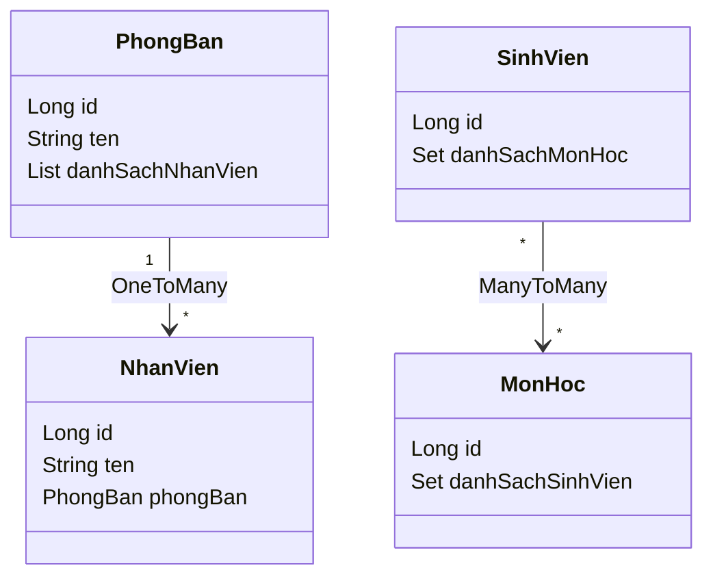

# Các Annotation của Hibernate

Annotation là các nhãn bắt đầu bằng `@` gắn lên class và field để báo cho Hibernate biết cách ánh xạ chúng sang database, thay cho file XML cấu hình rườm rà ngày xưa. Nắm được các annotation này là điều bắt buộc khi làm việc với Hibernate hiện đại. Bài này tổng hợp các nhóm annotation quan trọng: định nghĩa entity, khóa chính, ánh xạ cột, quan hệ và lifecycle.

## Tổng quan

**Annotation** trong Hibernate là các nhãn đặc biệt (bắt đầu bằng `@`) gắn vào class hoặc field Java để mô tả cách ánh xạ sang cơ sở dữ liệu. Chúng thay thế hoàn toàn cho file XML cấu hình truyền thống (`.hbm.xml`).

Hibernate sử dụng hai nguồn annotation:
- **Jakarta Persistence** (`jakarta.persistence.*`): annotation chuẩn JPA, dùng được với mọi provider.
- **Hibernate riêng** (`org.hibernate.annotations.*`): annotation mở rộng, chỉ dùng với Hibernate.

## Nhóm Annotation định nghĩa Entity

### @Entity và @Table

```java
import jakarta.persistence.*;

// @Entity: đánh dấu class này là một JPA Entity
@Entity
// @Table: tùy chỉnh tên bảng và các ràng buộc cấp bảng
@Table(
    name = "don_hang",
    schema = "sales",        // Schema của database (nếu có)
    uniqueConstraints = {
        // Ràng buộc unique tổ hợp nhiều cột
        @UniqueConstraint(
            name = "uk_ma_don_ngay",
            columnNames = {"ma_don_hang", "ngay_dat"}
        )
    },
    indexes = {
        // Tạo index cho cột để tăng tốc truy vấn
        @Index(name = "idx_ngay_dat", columnList = "ngay_dat")
    }
)
public class DonHang {
    // ...
}
```

## Nhóm Annotation cho khóa chính (Primary Key)

### @Id và @GeneratedValue

```java
@Entity
public class SanPham {

    // @Id: đánh dấu đây là khóa chính
    @Id
    // @GeneratedValue: chiến lược sinh khóa tự động
    @GeneratedValue(strategy = GenerationType.IDENTITY)
    private Long id;

    // ...
}
```

Các chiến lược `GenerationType`:

| Chiến lược | Mô tả | Database hỗ trợ |
|-----------|-------|-----------------|
| `IDENTITY` | Dùng AUTO_INCREMENT của database | MySQL, PostgreSQL |
| `SEQUENCE` | Dùng sequence object | PostgreSQL, Oracle |
| `TABLE` | Dùng bảng phụ để lưu counter | Mọi database |
| `AUTO` | Hibernate tự chọn phù hợp nhất | Mọi database |
| `UUID` | Sinh UUID tự động | Mọi database |

```java
// Dùng SEQUENCE với tên sequence tùy chỉnh
@Id
@GeneratedValue(strategy = GenerationType.SEQUENCE, generator = "sp_seq")
@SequenceGenerator(
    name = "sp_seq",
    sequenceName = "san_pham_seq",
    allocationSize = 50   // Lấy 50 giá trị một lần để giảm số lần gọi database
)
private Long id;

// Dùng UUID làm khóa chính
@Id
@GeneratedValue(strategy = GenerationType.UUID)
private String id;   // Hoặc java.util.UUID
```

## Nhóm Annotation ánh xạ cột

### @Column

```java
@Column(
    name = "ten_san_pham",    // Tên cột
    nullable = false,          // NOT NULL
    length = 200,              // VARCHAR(200)
    unique = false,
    insertable = true,
    updatable = true,
    columnDefinition = "VARCHAR(200) DEFAULT 'Chưa có tên'"
)
private String ten;
```

### @Transient

**`@Transient`** đánh dấu field **không** được ánh xạ vào database:

```java
@Entity
public class HoaDon {
    private Double donGia;
    private Integer soLuong;

    // Field này được tính từ donGia * soLuong, không cần lưu vào DB
    @Transient
    private Double thanhTien;

    public Double getThanhTien() {
        return donGia != null && soLuong != null ? donGia * soLuong : 0.0;
    }
}
```

### @Lob

**`@Lob`** (Large Object — đối tượng lớn) dùng cho dữ liệu kích thước lớn:

```java
@Entity
public class BaiViet {

    @Id
    @GeneratedValue(strategy = GenerationType.IDENTITY)
    private Long id;

    // CLOB (Character Large Object) - văn bản dài
    @Lob
    @Column(name = "noi_dung")
    private String noiDung;

    // BLOB (Binary Large Object) - dữ liệu nhị phân
    @Lob
    @Column(name = "anh_bia")
    private byte[] anhBia;
}
```

## Nhóm Annotation quan hệ (Relationship)

Sơ đồ lớp dưới đây minh họa hai kiểu quan hệ thường gặp: một-nhiều giữa `PhongBan` và `NhanVien`, và nhiều-nhiều giữa `SinhVien` và `MonHoc`:



Phía `NhanVien` giữ khóa ngoại `phongBan` (`@ManyToOne`), còn `PhongBan` ánh xạ ngược lại bằng `@OneToMany(mappedBy=...)`; quan hệ nhiều-nhiều cần thêm một bảng trung gian.

### @ManyToOne và @OneToMany

```java
// Bên "nhiều": NhanVien thuộc về một PhongBan
@Entity
public class NhanVien {

    @Id
    @GeneratedValue(strategy = GenerationType.IDENTITY)
    private Long id;

    private String ten;

    // @ManyToOne: nhiều NhanVien thuộc 1 PhongBan
    // FetchType.LAZY: chỉ tải PhongBan khi được truy cập (tốt hơn cho hiệu năng)
    @ManyToOne(fetch = FetchType.LAZY)
    @JoinColumn(name = "phong_ban_id")   // Tên cột khóa ngoại
    private PhongBan phongBan;

    // Getters & setters
    public Long getId() { return id; }
    public String getTen() { return ten; }
    public void setTen(String ten) { this.ten = ten; }
    public PhongBan getPhongBan() { return phongBan; }
    public void setPhongBan(PhongBan phongBan) { this.phongBan = phongBan; }
}

// Bên "một": PhongBan có nhiều NhanVien
@Entity
public class PhongBan {

    @Id
    @GeneratedValue(strategy = GenerationType.IDENTITY)
    private Long id;

    private String ten;

    // @OneToMany: một PhongBan có nhiều NhanVien
    // mappedBy: tên field phongBan trong class NhanVien (phía "sở hữu" quan hệ)
    // cascade = CascadeType.ALL: mọi thao tác trên PhongBan cũng áp dụng cho NhanVien
    @OneToMany(mappedBy = "phongBan", cascade = CascadeType.ALL, orphanRemoval = true)
    private List<NhanVien> danhSachNhanVien = new ArrayList<>();

    // Getters & setters
    public Long getId() { return id; }
    public String getTen() { return ten; }
    public void setTen(String ten) { this.ten = ten; }
    public List<NhanVien> getDanhSachNhanVien() { return danhSachNhanVien; }
}
```

### @ManyToMany

```java
@Entity
public class SinhVien {

    @Id
    @GeneratedValue(strategy = GenerationType.IDENTITY)
    private Long id;

    private String ten;

    // @ManyToMany: nhiều SinhVien đăng ký nhiều MonHoc
    @ManyToMany
    @JoinTable(
        name = "dang_ky",                  // Tên bảng trung gian
        joinColumns = @JoinColumn(name = "sinh_vien_id"),
        inverseJoinColumns = @JoinColumn(name = "mon_hoc_id")
    )
    private Set<MonHoc> danhSachMonHoc = new HashSet<>();

    public Long getId() { return id; }
    public String getTen() { return ten; }
    public void setTen(String ten) { this.ten = ten; }
    public Set<MonHoc> getDanhSachMonHoc() { return danhSachMonHoc; }
}

@Entity
public class MonHoc {

    @Id
    @GeneratedValue(strategy = GenerationType.IDENTITY)
    private Long id;

    private String tenMonHoc;

    @ManyToMany(mappedBy = "danhSachMonHoc")
    private Set<SinhVien> danhSachSinhVien = new HashSet<>();

    public Long getId() { return id; }
    public String getTenMonHoc() { return tenMonHoc; }
    public void setTenMonHoc(String tenMonHoc) { this.tenMonHoc = tenMonHoc; }
}
```

## Nhóm Annotation kiểm soát lifecycle

### @PrePersist, @PreUpdate, @PostLoad

```java
@Entity
public class TinTuc {

    @Id
    @GeneratedValue(strategy = GenerationType.IDENTITY)
    private Long id;

    private String tieuDe;

    @Column(updatable = false)
    private LocalDateTime ngayTao;

    private LocalDateTime ngayCapNhat;

    // Gọi tự động trước khi INSERT
    @PrePersist
    public void truocKhiLuu() {
        this.ngayTao = LocalDateTime.now();
        this.ngayCapNhat = LocalDateTime.now();
    }

    // Gọi tự động trước khi UPDATE
    @PreUpdate
    public void truocKhiCapNhat() {
        this.ngayCapNhat = LocalDateTime.now();
    }

    // Gọi tự động sau khi SELECT (load từ database)
    @PostLoad
    public void sauKhiDoc() {
        System.out.println("Đã tải tin tức: " + tieuDe);
    }

    public Long getId() { return id; }
    public String getTieuDe() { return tieuDe; }
    public void setTieuDe(String tieuDe) { this.tieuDe = tieuDe; }
    public LocalDateTime getNgayTao() { return ngayTao; }
    public LocalDateTime getNgayCapNhat() { return ngayCapNhat; }
}
```

## Tóm tắt các Annotation quan trọng

| Annotation | Mục đích |
|-----------|---------|
| `@Entity` | Đánh dấu class là JPA Entity |
| `@Table` | Tùy chỉnh tên bảng, index, unique constraint |
| `@Id` | Đánh dấu khóa chính |
| `@GeneratedValue` | Chiến lược tự sinh khóa chính |
| `@Column` | Tùy chỉnh ánh xạ cột |
| `@Transient` | Bỏ qua field, không ánh xạ vào DB |
| `@Lob` | Dữ liệu lớn (CLOB/BLOB) |
| `@ManyToOne` | Quan hệ nhiều-một |
| `@OneToMany` | Quan hệ một-nhiều |
| `@ManyToMany` | Quan hệ nhiều-nhiều |
| `@JoinColumn` | Tên cột khóa ngoại |
| `@JoinTable` | Bảng trung gian cho ManyToMany |
| `@PrePersist` | Hook trước khi INSERT |
| `@PreUpdate` | Hook trước khi UPDATE |
| `@PostLoad` | Hook sau khi SELECT |
