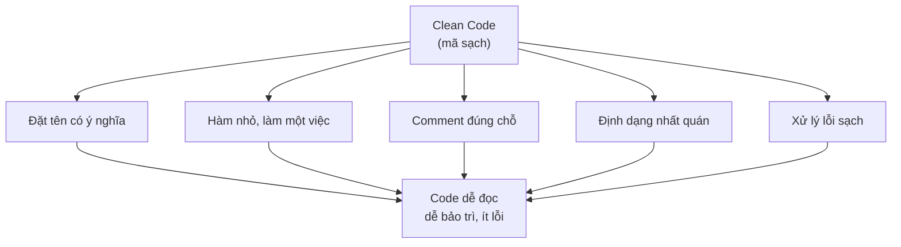

# Clean Code - Viết mã sạch trong Java

**Clean Code** (mã sạch) là tập hợp các thói quen và quy tắc giúp viết code dễ đọc, dễ hiểu, dễ bảo trì và ít lỗi. Khái niệm này được phổ biến bởi Robert C. Martin (hay còn gọi là "Uncle Bob") trong cuốn sách nổi tiếng cùng tên.

> "Clean code reads like well-written prose." — Robert C. Martin

Sơ đồ dưới đây tóm tắt 5 trụ cột của Clean Code trong bài này và mục tiêu chung mà chúng cùng hướng tới:



Mỗi nhánh là một thói quen độc lập, nhưng khi kết hợp lại, tất cả cùng phục vụ một đích duy nhất: code dễ đọc, dễ bảo trì và ít lỗi.

:::note[Ghi nhớ nhanh]

- ⭐ **`Clean Code` (Robert C. Martin)** — code dễ đọc, dễ hiểu, dễ bảo trì và ít lỗi; "reads like well-written prose".
- **5 trụ cột** — đặt tên có ý nghĩa, hàm nhỏ làm một việc, comment đúng chỗ, định dạng nhất quán, xử lý lỗi sạch.
- **Comment** — giải thích "tại sao" (why) chứ không phải "cái gì" (what), vì code đã tự nói lên "cái gì".
- **Xử lý lỗi** — dùng `Optional<T>` thay vì trả `null`; bắt ngoại lệ cụ thể và ghi log thay vì nuốt lỗi.
- ⭐ **`Boy Scout Rule`** — luôn để lại code sạch hơn so với khi bạn tìm thấy nó.

:::

---

## 1. Đặt tên có ý nghĩa (Meaningful Names)

Tên biến, hàm, lớp phải nói lên đúng mục đích của chúng. Tránh viết tắt khó hiểu hoặc tên chung chung như `data`, `temp`, `x`.

### Tên biến

```java
// XẤU - tên không nói lên ý nghĩa gì
int d; // số ngày?
List<Object> lst;

// TỐT - tên rõ ràng, tự giải thích
int elapsedTimeInDays;
List<User> activeUsers;
```

### Tên hàm

```java
// XẤU - không biết hàm làm gì
public void process(User u) { ... }

// TỐT - tên hàm là một động từ mô tả hành động
public void sendWelcomeEmail(User user) { ... }
public boolean isEligibleForDiscount(Order order) { ... }
```

### Tên lớp

```java
// XẤU - tên lớp mơ hồ
class Manager { ... }
class Processor { ... }

// TỐT - tên lớp là danh từ cụ thể
class OrderShipmentService { ... }
class InvoicePdfGenerator { ... }
```

---

## 2. Hàm nhỏ, làm một việc (Small Functions)

Mỗi hàm chỉ nên làm **một việc duy nhất** và làm tốt việc đó. Nếu hàm quá dài (trên 20-30 dòng), hãy tách nó ra thành các hàm nhỏ hơn.

```java
// XẤU - một hàm làm quá nhiều việc
public void processOrder(Order order) {
    // Kiểm tra tồn kho
    if (order.getItems().isEmpty()) {
        throw new IllegalArgumentException("Đơn hàng không có sản phẩm");
    }
    for (OrderItem item : order.getItems()) {
        if (item.getQuantity() > stockService.getStock(item.getProductId())) {
            throw new InsufficientStockException(item.getProductId());
        }
    }
    // Tính tổng tiền
    double total = 0;
    for (OrderItem item : order.getItems()) {
        total += item.getPrice() * item.getQuantity();
    }
    if (order.hasCoupon()) {
        total = total * (1 - couponService.getDiscount(order.getCouponCode()));
    }
    // Lưu vào database
    order.setTotal(total);
    order.setStatus(OrderStatus.CONFIRMED);
    orderRepository.save(order);
    // Gửi email
    emailService.sendOrderConfirmation(order);
}

// TỐT - tách thành các hàm nhỏ, mỗi hàm một nhiệm vụ
public void processOrder(Order order) {
    validateOrderItems(order);
    double total = calculateTotal(order);
    saveConfirmedOrder(order, total);
    notifyCustomer(order);
}

private void validateOrderItems(Order order) {
    if (order.getItems().isEmpty()) {
        throw new IllegalArgumentException("Đơn hàng không có sản phẩm");
    }
    order.getItems().forEach(this::checkStockAvailability);
}

private double calculateTotal(Order order) {
    double subtotal = order.getItems().stream()
        .mapToDouble(item -> item.getPrice() * item.getQuantity())
        .sum();
    return applyDiscount(subtotal, order);
}

private double applyDiscount(double amount, Order order) {
    if (!order.hasCoupon()) return amount;
    double discount = couponService.getDiscount(order.getCouponCode());
    return amount * (1 - discount);
}

private void saveConfirmedOrder(Order order, double total) {
    order.setTotal(total);
    order.setStatus(OrderStatus.CONFIRMED);
    orderRepository.save(order);
}

private void notifyCustomer(Order order) {
    emailService.sendOrderConfirmation(order);
}
```

---

## 3. Comment đúng chỗ (Good Comments)

Comment tốt giải thích **tại sao** (why), không phải **cái gì** (what) — vì bản thân code đã nói lên "cái gì" rồi. Tránh comment thừa, comment lỗi thời, hoặc comment thay cho việc đặt tên tốt.

```java
// XẤU - comment chỉ lặp lại những gì code đã nói
// Tăng biến đếm lên 1
count++;

// Lấy danh sách người dùng theo email
List<User> users = userRepository.findByEmail(email);

// XẤU - comment thay thế cho tên hàm/biến tốt
// Kiểm tra xem người dùng có đủ điều kiện nhận giảm giá không
if (user.getAge() > 60 && user.getTotalOrders() > 10) { ... }

// TỐT - đặt tên rõ thay vì comment
boolean isSeniorLoyalCustomer = user.getAge() > 60 && user.getTotalOrders() > 10;
if (isSeniorLoyalCustomer) { ... }

// TỐT - comment giải thích lý do nghiệp vụ quan trọng
// Theo quy định pháp lý, cần giữ lại bản ghi đơn hàng ít nhất 7 năm
// nên không được xóa hẳn mà chỉ đánh dấu là đã hủy.
order.setStatus(OrderStatus.CANCELLED);
orderRepository.save(order);

// TỐT - comment cảnh báo hệ quả không rõ ràng
// Cảnh báo: phương thức này không thread-safe (an toàn với đa luồng).
// Nếu gọi đồng thời từ nhiều luồng, hãy dùng SynchronizedCache thay thế.
public void updateCache(String key, Object value) { ... }
```

---

## 4. Định dạng nhất quán (Consistent Formatting)

Code được định dạng tốt giúp đọc nhanh hơn và giảm tranh cãi trong team.

```java
// XẤU - định dạng lộn xộn
public class orderService{
private OrderRepository orderRepository;
public Order createOrder(String customerId,List<OrderItem> items){
if(items==null||items.isEmpty()){throw new IllegalArgumentException("Items không được rỗng");}
Order order=new Order();order.setCustomerId(customerId);order.setItems(items);
return orderRepository.save(order);}}

// TỐT - định dạng nhất quán, dễ đọc
public class OrderService {

    private final OrderRepository orderRepository;

    public Order createOrder(String customerId, List<OrderItem> items) {
        if (items == null || items.isEmpty()) {
            throw new IllegalArgumentException("Items không được rỗng");
        }
        Order order = new Order();
        order.setCustomerId(customerId);
        order.setItems(items);
        return orderRepository.save(order);
    }
}
```

**Các quy tắc định dạng cơ bản trong Java:**
- Dùng 4 dấu cách cho mỗi cấp thụt lề (hoặc tab, nhưng phải nhất quán).
- Mở ngoặc nhọn `{` trên cùng dòng với câu lệnh.
- Mỗi câu lệnh trên một dòng riêng.
- Dùng công cụ tự động như **Checkstyle**, **Google Java Format**, hoặc tính năng format của IntelliJ IDEA.

---

## 5. Xử lý lỗi sạch (Clean Error Handling)

Xử lý lỗi không nên làm rối logic chính của chương trình.

```java
// XẤU - trả về null gây ra lỗi NullPointerException sau này
public User findUser(String email) {
    User user = userRepository.findByEmail(email);
    return user; // có thể là null
}

// Người gọi thường quên kiểm tra null:
User user = findUser("test@example.com");
String name = user.getName(); // NullPointerException nếu user == null!

// TỐT - dùng Optional<T> để thể hiện rõ rằng kết quả có thể không tồn tại
public Optional<User> findUser(String email) {
    return userRepository.findByEmail(email);
}

// Người gọi buộc phải xử lý trường hợp không tìm thấy:
findUser("test@example.com")
    .ifPresentOrElse(
        user -> System.out.println("Xin chào, " + user.getName()),
        () -> System.out.println("Không tìm thấy người dùng")
    );

// XẤU - bắt ngoại lệ chung chung và nuốt lỗi
try {
    processPayment(order);
} catch (Exception e) {
    // không làm gì cả!
}

// TỐT - bắt ngoại lệ cụ thể, ghi log đầy đủ, ném lại ngoại lệ nghiệp vụ
try {
    processPayment(order);
} catch (PaymentGatewayException e) {
    log.error("Thanh toán thất bại cho đơn hàng {}: {}", order.getId(), e.getMessage());
    throw new OrderProcessingException("Không thể xử lý thanh toán, vui lòng thử lại.", e);
}
```

---

## Tổng kết

| Nguyên tắc | Mấu chốt |
|---|---|
| Đặt tên có ý nghĩa | Tên phải tự giải thích, không cần comment |
| Hàm nhỏ | Mỗi hàm làm đúng một việc |
| Comment đúng chỗ | Giải thích "tại sao", không phải "cái gì" |
| Định dạng nhất quán | Dùng công cụ tự động, thống nhất cả team |
| Xử lý lỗi sạch | Không nuốt lỗi, dùng Optional thay null |

Clean code không phải là viết code "hoàn hảo" ngay từ đầu, mà là liên tục cải thiện code mỗi khi chạm vào nó — đây chính là tinh thần của **Boy Scout Rule** (quy tắc Hướng đạo sinh): *"Luôn để lại khu cắm trại sạch hơn khi bạn đến."*
