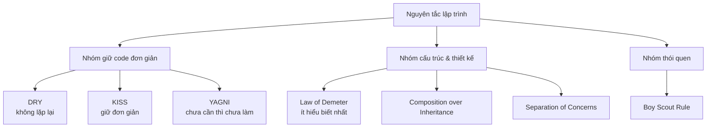

# Các nguyên tắc và định luật trong lập trình

Trong lập trình phần mềm, có nhiều nguyên tắc và định luật được đúc kết từ kinh nghiệm thực tế của các kỹ sư qua nhiều thập kỷ. Nắm vững những nguyên tắc này giúp bạn viết code dễ bảo trì, ít lỗi và linh hoạt hơn trước những thay đổi.

Có thể chia 7 nguyên tắc trong bài thành 3 nhóm theo mục đích, như sơ đồ dưới đây:



Nhóm bên trái giúp code gọn và dễ hiểu, nhóm giữa lo về cách các thành phần liên kết với nhau, còn Boy Scout Rule là thói quen cải thiện dần theo thời gian.

---

## 1. DRY — Don't Repeat Yourself (Đừng lặp lại bản thân)

Mỗi đoạn kiến thức hoặc logic chỉ nên tồn tại ở **một nơi duy nhất** trong hệ thống. Khi cần thay đổi, bạn chỉ sửa ở một chỗ thay vì săn lùng khắp nơi.

```java
// XẤU - logic tính thuế bị lặp ở nhiều chỗ
public double calculateOrderTotal(Order order) {
    double subtotal = order.getSubtotal();
    double tax = subtotal * 0.1; // 10% thuế
    return subtotal + tax;
}

public double calculateInvoiceTotal(Invoice invoice) {
    double subtotal = invoice.getSubtotal();
    double tax = subtotal * 0.1; // lặp lại logic 10% thuế
    return subtotal + tax;
}

// TỐT - tách logic tính thuế ra một nơi duy nhất
private static final double TAX_RATE = 0.1;

private double calculateTax(double subtotal) {
    return subtotal * TAX_RATE;
}

public double calculateOrderTotal(Order order) {
    return order.getSubtotal() + calculateTax(order.getSubtotal());
}

public double calculateInvoiceTotal(Invoice invoice) {
    return invoice.getSubtotal() + calculateTax(invoice.getSubtotal());
}
```

**Lưu ý:** DRY không có nghĩa là "không bao giờ viết code trông giống nhau". Hai đoạn code trông giống nhau nhưng phục vụ hai mục đích nghiệp vụ khác nhau thì **không** nên gộp lại, vì chúng thay đổi vì các lý do khác nhau.

---

## 2. KISS — Keep It Simple, Stupid (Giữ mọi thứ đơn giản)

Luôn chọn giải pháp đơn giản nhất có thể giải quyết được vấn đề. Phức tạp không cần thiết là kẻ thù của bảo trì.

```java
// XẤU - phức tạp hóa một việc đơn giản
public boolean isEven(int number) {
    return number % 2 == 0 ? Boolean.TRUE : Boolean.FALSE;
}

// TỐT - đơn giản và trực tiếp
public boolean isEven(int number) {
    return number % 2 == 0;
}

// XẤU - dùng stream phức tạp cho việc đơn giản
public String getFirstAdminEmail(List<User> users) {
    return users.stream()
        .filter(u -> u.getRoles().stream()
            .anyMatch(r -> r.getName().equalsIgnoreCase("ADMIN")))
        .findFirst()
        .map(User::getEmail)
        .orElse(null);
}

// TỐT - tách rõ ý định, dễ đọc hơn
public String getFirstAdminEmail(List<User> users) {
    for (User user : users) {
        if (user.isAdmin()) {
            return user.getEmail();
        }
    }
    return null;
}
```

---

## 3. YAGNI — You Aren't Gonna Need It (Bạn sẽ không cần nó đâu)

Đừng viết code cho những tính năng mà bạn **nghĩ** là sẽ cần trong tương lai nhưng hiện tại chưa có yêu cầu. Code thừa là gánh nặng bảo trì.

```java
// XẤU - thêm nhiều tính năng "phòng khi cần"
public class UserService {

    // Hiện tại chỉ cần lưu user, nhưng lập trình viên thêm các chức năng "dự phòng"
    public User createUser(String name, String email) { ... }
    public User createUserWithRole(String name, String email, String role) { ... }  // chưa cần
    public User createUserWithAvatar(String name, String email, String avatarUrl) { ... } // chưa cần
    public User createUserFull(...) { ... }  // chưa cần

    // Caching chưa được yêu cầu
    private Map<String, User> userCache = new HashMap<>();
    public User getUserFromCache(String email) { ... }  // chưa cần
}

// TỐT - chỉ implement những gì đang được yêu cầu
public class UserService {

    public User createUser(String name, String email) {
        validateEmail(email);
        User user = new User(name, email);
        return userRepository.save(user);
    }

    private void validateEmail(String email) {
        if (!email.contains("@")) {
            throw new IllegalArgumentException("Email không hợp lệ: " + email);
        }
    }
}
```

---

## 4. Law of Demeter — Định luật Demeter (Nguyên tắc ít hiểu biết nhất)

Còn được gọi là **Principle of Least Knowledge** (Nguyên tắc ít kiến thức nhất). Một đối tượng chỉ nên nói chuyện với "bạn bè trực tiếp" của nó, không nên "đi qua" một đối tượng để lấy đối tượng khác rồi gọi phương thức.

Quy tắc thực tế: **Không nên có quá một dấu chấm liên tiếp** (trừ Stream, Builder pattern).

```java
// XẤU - "chuỗi dấu chấm" — vi phạm Law of Demeter
public double getCustomerCityTaxRate(Order order) {
    // Order biết về Customer, Customer biết về Address, Address biết về City...
    return order.getCustomer().getAddress().getCity().getTaxRate();
}

// Vấn đề: nếu Address thay đổi cách lưu City, tất cả code dùng chuỗi này đều bị ảnh hưởng.

// TỐT - mỗi lớp ủy quyền cho lớp của mình
// Trong lớp Order:
public double getTaxRate() {
    return customer.getTaxRate();
}

// Trong lớp Customer:
public double getTaxRate() {
    return address.getCityTaxRate();
}

// Trong lớp Address:
public double getCityTaxRate() {
    return city.getTaxRate();
}

// Người gọi:
public double getCustomerCityTaxRate(Order order) {
    return order.getTaxRate(); // chỉ một dấu chấm
}
```

---

## 5. Boy Scout Rule — Quy tắc Hướng đạo sinh

> "Hãy để code sạch hơn so với khi bạn tìm thấy nó."

Mỗi khi bạn chỉnh sửa một file, hãy cải thiện một điều nhỏ — đổi tên biến mơ hồ, xóa comment thừa, tách hàm dài... Theo thời gian, cả codebase sẽ được cải thiện liên tục mà không cần refactor (tái cấu trúc) lớn.

```java
// Bạn đang sửa lỗi trong hàm này và phát hiện code xấu cũ

// TRƯỚC - code cũ bạn tìm thấy
public void processUsr(Object o, boolean f) {
    User u = (User) o;
    if (f == true) {
        // send email
        emailSvc.send(u.getEmail(), "Hi " + u.getFn() + " " + u.getLn());
    }
}

// SAU - bạn sửa lỗi VÀ cải thiện thêm (Boy Scout Rule)
public void notifyUserIfRequired(User user, boolean shouldNotify) {
    if (shouldNotify) {
        String fullName = user.getFirstName() + " " + user.getLastName();
        emailService.send(user.getEmail(), "Xin chào " + fullName);
    }
}
```

---

## 6. Composition over Inheritance — Ưu tiên kết hợp hơn kế thừa

**Inheritance** (kế thừa) tạo ra sự ràng buộc chặt chẽ giữa lớp cha và lớp con. **Composition** (kết hợp — bao gồm một đối tượng khác như một thuộc tính) linh hoạt hơn vì bạn có thể thay đổi hành vi lúc runtime và tránh được phân cấp kế thừa phức tạp.

```java
// XẤU - dùng kế thừa cho "hành vi"
class Animal {
    public void eat() { System.out.println("Đang ăn..."); }
}

class FlyingAnimal extends Animal {
    public void fly() { System.out.println("Đang bay..."); }
}

class SwimmingAnimal extends Animal {
    public void swim() { System.out.println("Đang bơi..."); }
}

// Vịt vừa bay vừa bơi — kế thừa bùng nổ!
// class Duck extends FlyingAnimal ??? hay extends SwimmingAnimal ???

// TỐT - dùng composition với interface
interface Flyable {
    void fly();
}

interface Swimmable {
    void swim();
}

class FlyBehavior implements Flyable {
    public void fly() { System.out.println("Đang bay bằng cánh..."); }
}

class SwimBehavior implements Swimmable {
    public void swim() { System.out.println("Đang bơi bằng chân..."); }
}

class Duck {
    private final Flyable flyBehavior;
    private final Swimmable swimBehavior;

    public Duck(Flyable flyBehavior, Swimmable swimBehavior) {
        this.flyBehavior = flyBehavior;
        this.swimBehavior = swimBehavior;
    }

    public void fly() { flyBehavior.fly(); }
    public void swim() { swimBehavior.swim(); }
}
```

---

## 7. Separation of Concerns — Phân tách mối quan tâm

Mỗi phần của hệ thống chỉ nên chịu trách nhiệm về **một khía cạnh** duy nhất. Đây là nền tảng cho kiến trúc theo lớp (layered architecture) trong ứng dụng Java thực tế.

```java
// XẤU - Controller làm luôn cả logic nghiệp vụ và truy cập database
@RestController
public class UserController {

    @Autowired
    private EntityManager em;

    @PostMapping("/users")
    public ResponseEntity<User> createUser(@RequestBody Map<String, String> body) {
        // Validate thủ công
        if (body.get("email") == null || !body.get("email").contains("@")) {
            return ResponseEntity.badRequest().build();
        }
        // Logic nghiệp vụ lẫn lộn với truy cập DB
        User user = new User();
        user.setEmail(body.get("email").toLowerCase().trim());
        user.setCreatedAt(LocalDateTime.now());
        em.persist(user);
        return ResponseEntity.ok(user);
    }
}

// TỐT - mỗi lớp một trách nhiệm rõ ràng
@RestController  // Chỉ xử lý HTTP: nhận request, trả response
public class UserController {
    private final UserService userService;

    @PostMapping("/users")
    public ResponseEntity<UserResponse> createUser(@Valid @RequestBody CreateUserRequest request) {
        User user = userService.createUser(request);
        return ResponseEntity.ok(UserResponse.from(user));
    }
}

@Service  // Chỉ chứa logic nghiệp vụ
public class UserService {
    private final UserRepository userRepository;

    public User createUser(CreateUserRequest request) {
        String normalizedEmail = request.getEmail().toLowerCase().trim();
        User user = new User(normalizedEmail, LocalDateTime.now());
        return userRepository.save(user);
    }
}

@Repository  // Chỉ truy cập database
public interface UserRepository extends JpaRepository<User, Long> {
    Optional<User> findByEmail(String email);
}
```

---

## Tổng kết

| Nguyên tắc | Câu hỏi để nhớ |
|---|---|
| DRY | "Logic này có bị lặp ở chỗ nào khác không?" |
| KISS | "Có cách nào đơn giản hơn không?" |
| YAGNI | "Có yêu cầu cụ thể nào cho tính năng này chưa?" |
| Law of Demeter | "Tôi có đang đi qua quá nhiều đối tượng không?" |
| Boy Scout Rule | "Tôi có thể cải thiện thêm gì khi đang ở đây?" |
| Composition over Inheritance | "Nên kết hợp (has-a) hay kế thừa (is-a)?" |
| Separation of Concerns | "Phần này có đang làm quá nhiều việc không?" |

Các nguyên tắc này không phải luật cứng nhắc — chúng là **kim chỉ nam**. Hãy hiểu tinh thần đằng sau mỗi nguyên tắc để áp dụng linh hoạt theo ngữ cảnh thực tế.
