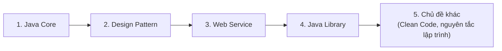

# Lộ trình Java theo gpcoder

Đây là lộ trình học **Java** được sắp xếp theo cấu trúc nội dung của tác giả **gpcoder**, đi từ **Java Core** → **Design Pattern** → **Web Service** → **Java Library** → các **chủ đề khác**.

Lộ trình này **độc lập** với lộ trình Java còn lại trên trang. Mỗi **thuật ngữ chuyên ngành** (technical term — từ ngữ kỹ thuật riêng của ngành) sẽ được giải thích ngay khi xuất hiện lần đầu.

Trình tự học được sắp xếp theo sơ đồ dưới đây, đi từ nền tảng đến các chủ đề nâng cao:

Bạn nên nắm vững Java Core trước, vì các nhóm sau đều dựa trên nền tảng này.

---

## Nội dung gồm những gì?

| # | Nhóm | Nội dung chính |
|---|------|----------------|
| 1 | **Java Core** | Basic Java, OOP, Exception, Multi-thread, I/O, Networking, Reflection, Collection, JDBC, Java 8 |
| 2 | **Design Pattern** | Creational, Structural, Behavioral (23 mẫu thiết kế GoF) |
| 3 | **Web Service** | SOAP (JAX-WS), REST (JAX-RS / Jersey), JWT, Swagger |
| 4 | **Java Library** | Report (POI), JSON (Gson/Jackson), Unit Test (JUnit/Mockito), Message Queue (JMS/RabbitMQ), JPA/Hibernate |
| 5 | **Chủ đề khác** | Clean Code, các nguyên tắc & định luật lập trình |

> **GoF** (Gang of Four — "Bộ tứ", nhóm 4 tác giả của cuốn sách kinh điển về Design Pattern năm 1994).

---

## Lưu ý về cách trình bày

- Những bài **trùng nội dung** với lộ trình Java còn lại sẽ chỉ ghi **tiêu đề** (nội dung sẽ được bổ sung sau).
- Những bài **mới** (đa luồng, design pattern, web service, thư viện, JPA...) được viết **đầy đủ**: giải thích khái niệm + code ví dụ + giải thích thuật ngữ.

Bắt đầu từ nhóm **Java Core**.
