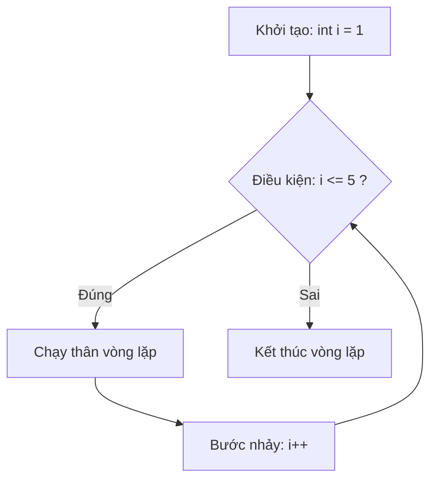

# Vòng lặp (Loops)

Vòng lặp là cấu trúc cho phép lặp lại một khối lệnh nhiều lần, giúp bạn không phải viết đi viết lại cùng một đoạn code. Đây là công cụ quan trọng để xử lý dữ liệu lặp đi lặp lại như duyệt mảng hay đếm số. Bài này giới thiệu bốn loại vòng lặp chính (for, while, do-while, for-each) cùng break và continue; phần chi tiết nằm bên dưới.

[](pathname:///img/java/vong-lap.webp)

---

:::note[Ghi nhớ nhanh]

- ⭐ **Bốn loại vòng lặp** — `for` (biết trước số lần), `while` (lặp theo điều kiện), `do-while` (chạy tối thiểu 1 lần), `for-each` (duyệt phần tử).
- **`break` và `continue`** — `break` thoát hẳn vòng lặp; `continue` bỏ qua phần còn lại của lần lặp hiện tại.
- **Vòng lặp vô hạn** — luôn đảm bảo điều kiện sẽ có lúc sai (nhớ cập nhật biến điều kiện).
- **Vòng lặp lồng nhau** — hữu ích cho bảng, ma trận; mỗi vòng ngoài chạy hết vòng trong một lượt.

:::

---

## Mục lục

- [Vì sao cần vòng lặp?](#vì-sao-cần-vòng-lặp)
- [Vòng lặp là gì?](#vòng-lặp-là-gì)
- [Vòng for](#vòng-for)
- [Vòng while](#vòng-while)
- [Vòng do-while](#vòng-do-while)
- [Vòng for-each](#vòng-for-each)
- [break và continue](#break-và-continue)
- [Vòng lặp lồng nhau](#vòng-lặp-lồng-nhau)
- [Lỗi thường gặp](#lỗi-thường-gặp)
- [Tóm tắt](#tóm-tắt)
- [Câu hỏi phỏng vấn](#câu-hỏi-phỏng-vấn)

---

## Vì sao cần vòng lặp?

**Vấn đề:** Nếu bạn muốn in 1000 dòng "Xin chào" hoặc xử lý từng phần tử trong một mảng 500 học sinh, cách viết thủ công là bất khả thi — và code không thể tự thích ứng khi kích thước dữ liệu thay đổi.

```java
// Cách cũ: viết tay từng dòng — không thể co giãn
System.out.println("Xin chao 1");
System.out.println("Xin chao 2");
System.out.println("Xin chao 3");
// ... viết đến 1000? Không tưởng!
```

**Giải pháp:** Vòng lặp cho phép lặp lại một khối lệnh nhiều lần với một điều kiện dừng rõ ràng — code ngắn gọn, tự thích ứng với mọi kích thước dữ liệu.

```java
// Với vòng lặp: chỉ 3 dòng, chạy bao nhiêu lần cũng được
for (int i = 1; i <= 1000; i++) {
    System.out.println("Xin chao " + i);
}
```

:::tip[Dùng thực tế]
- In danh sách điểm của tất cả học sinh trong lớp.
- Tính tổng các số trong một mảng dữ liệu lớn.
- Đọc từng dòng file log và kiểm tra lỗi.
- Thử lại kết nối mạng tối đa N lần khi gặp sự cố.
:::

---

## Vòng lặp là gì?

**Vòng lặp** (loop — cấu trúc cho phép lặp lại một khối lệnh nhiều lần) giúp bạn không phải viết đi viết lại cùng một đoạn code. Ví dụ: thay vì in "Xin chao" 100 lần bằng 100 dòng, bạn viết một vòng lặp chạy 100 lần.

Mỗi lần chạy lại gọi là một **lần lặp** (iteration). Java có bốn loại vòng lặp chính.

---

## Vòng for

`for` dùng khi bạn **biết trước số lần lặp**. Cấu trúc gồm ba phần: khởi tạo; điều kiện; bước nhảy.

```java
public class ViDuFor {
    public static void main(String[] args) {
        // for (khởi tạo ; điều kiện ; bước nhảy)
        for (int i = 1; i <= 5; i++) {
            System.out.println("Lan lap thu " + i);
        }
        // i bắt đầu = 1; chạy khi i <= 5; mỗi vòng i tăng 1
    }
}
```

Cách hoạt động từng bước:

1. Khởi tạo `int i = 1` (chỉ chạy một lần đầu).
2. Kiểm tra điều kiện `i <= 5`: nếu đúng thì chạy thân vòng, nếu sai thì dừng.
3. Sau mỗi vòng, chạy bước nhảy `i++`, rồi quay lại bước 2.

Sơ đồ luồng hoạt động của vòng for:



---

## Vòng while

`while` (trong khi) lặp **chừng nào điều kiện còn đúng**. Dùng khi không biết trước số lần lặp.

```java
public class ViDuWhile {
    public static void main(String[] args) {
        int dem = 1;

        // Lặp chừng nào dem còn <= 3
        while (dem <= 3) {
            System.out.println("Dem = " + dem);
            dem++; // PHẢI cập nhật, nếu không sẽ lặp vô hạn
        }
    }
}
```

Cảnh báo: bạn phải thay đổi biến điều kiện bên trong vòng (`dem++`), nếu không điều kiện luôn đúng và vòng lặp chạy mãi mãi (**vòng lặp vô hạn** — infinite loop).

---

## Vòng do-while

`do-while` giống `while` nhưng **chạy thân vòng ÍT NHẤT một lần** rồi mới kiểm tra điều kiện (vì điều kiện ở cuối).

```java
public class ViDuDoWhile {
    public static void main(String[] args) {
        int so = 10;

        do {
            // Khối này chạy ít nhất 1 lần, dù điều kiện sai
            System.out.println("Gia tri: " + so);
            so++;
        } while (so < 5); // sai ngay từ đầu (10 < 5 = false)
        // Kết quả: vẫn in "Gia tri: 10" đúng một lần
    }
}
```

Khác biệt cốt lõi: `while` kiểm tra **trước** (có thể chạy 0 lần); `do-while` kiểm tra **sau** (luôn chạy tối thiểu 1 lần).

---

## Vòng for-each

`for-each` (vòng lặp tăng cường) dùng để duyệt qua từng phần tử của mảng hoặc danh sách mà không cần quản lý chỉ số.

```java
public class ViDuForEach {
    public static void main(String[] args) {
        String[] mon = {"Toan", "Ly", "Hoa"};

        // Đọc là: "với mỗi m trong mảng mon"
        for (String m : mon) {
            System.out.println("Mon hoc: " + m);
        }
    }
}
```

`for-each` gọn và an toàn để **đọc** dữ liệu, nhưng không cho bạn chỉ số và không nên dùng khi cần sửa phần tử theo vị trí.

---

## break và continue

Hai từ khóa điều khiển luồng vòng lặp:

```java
public class ViDuBreakContinue {
    public static void main(String[] args) {
        // break: THOÁT hẳn khỏi vòng lặp ngay lập tức
        for (int i = 1; i <= 10; i++) {
            if (i == 5) {
                break; // gặp 5 thì dừng luôn
            }
            System.out.println("break demo: " + i); // in 1,2,3,4
        }

        // continue: BỎ QUA phần còn lại, sang vòng lặp tiếp theo
        for (int i = 1; i <= 5; i++) {
            if (i % 2 == 0) {
                continue; // bỏ qua số chẵn
            }
            System.out.println("continue demo: " + i); // in 1,3,5
        }
    }
}
```

- `break`: dừng toàn bộ vòng lặp, nhảy ra ngoài.
- `continue`: bỏ phần còn lại của lần lặp hiện tại, chuyển sang lần kế tiếp.

---

## Vòng lặp lồng nhau

Một vòng lặp có thể đặt bên trong vòng lặp khác. Hữu ích cho bảng, ma trận:

```java
public class ViDuLongNhau {
    public static void main(String[] args) {
        // In bảng cửu chương 2 và 3
        for (int bang = 2; bang <= 3; bang++) {        // vòng ngoài
            System.out.println("--- Bang " + bang + " ---");
            for (int i = 1; i <= 5; i++) {             // vòng trong
                System.out.println(bang + " x " + i + " = " + (bang * i));
            }
        }
    }
}
```

Với mỗi lần chạy vòng ngoài, toàn bộ vòng trong chạy hết một lượt.

---

## Lỗi thường gặp

- **Vòng lặp vô hạn**: quên cập nhật biến điều kiện trong `while`.
- **Lệch một đơn vị** (off-by-one): dùng `<=` thay vì `<` hay ngược lại, làm chạy thừa/thiếu một vòng.
- **Vượt chỉ số mảng** khi điều kiện `for` đặt sai (`i <= length` thay vì `i < length`).
- **Quên `{ }`** khiến chỉ câu lệnh đầu nằm trong vòng lặp.
- **Dùng `break` khi định dùng `continue`** (hoặc ngược lại).

---

## Tóm tắt

- **Vòng lặp** lặp lại một khối lệnh nhiều lần.
- `for` khi biết trước số lần; `while` khi lặp theo điều kiện; `do-while` chạy ít nhất một lần; `for-each` để duyệt phần tử.
- `break` thoát khỏi vòng lặp; `continue` bỏ qua phần còn lại của lần lặp hiện tại.
- Luôn đảm bảo điều kiện sẽ có lúc sai để tránh **vòng lặp vô hạn**.

---

## Câu hỏi phỏng vấn

Những câu thường gặp về chủ đề này. Tự trả lời trước, rồi bấm **Xem đáp án** để đối chiếu.

**1. Vòng lặp (loop) là gì và Java có những loại vòng lặp nào?**

<details className="qa">
<summary>Xem đáp án</summary>

**Vòng lặp** là cấu trúc điều khiển cho phép lặp lại một khối lệnh nhiều lần thay vì viết tay từng dòng lặp lại. Java có 4 loại chính:

- `for` — dùng khi biết trước số lần lặp, gồm 3 phần: khởi tạo, điều kiện, bước nhảy.
- `while` — lặp chừng nào điều kiện còn đúng, kiểm tra điều kiện **trước**.
- `do-while` — giống `while` nhưng kiểm tra điều kiện **sau**, nên luôn chạy thân vòng ít nhất 1 lần.
- `for-each` (enhanced for) — duyệt từng phần tử của mảng/collection mà không cần quản lý chỉ số.

</details>

**2. So sánh `for` và `while`. Khi nào nên dùng loại nào?**

<details className="qa">
<summary>Xem đáp án</summary>

| Tiêu chí | `for` | `while` |
|---|---|---|
| Số lần lặp | Biết trước (hoặc tính được) | Không biết trước, phụ thuộc điều kiện |
| Cấu trúc | Khởi tạo + điều kiện + bước nhảy gọn trong 1 dòng | Chỉ có điều kiện; khởi tạo/cập nhật viết rời |
| Ví dụ điển hình | Duyệt mảng theo chỉ số, đếm từ 1 đến n | Đọc dữ liệu tới khi hết, chờ nhập đúng |

Hai vòng lặp này có thể chuyển đổi qua lại về bản chất — khác biệt chủ yếu là **cách trình bày** giúp code dễ đọc theo đúng ý định. Dùng `for` khi số lần lặp rõ ràng ngay từ đầu; dùng `while` khi điều kiện dừng phụ thuộc trạng thái lúc chạy (ví dụ đọc file tới khi hết dòng).

</details>

**3. Phân biệt `while` và `do-while`. Cho một tình huống thực tế nên dùng `do-while`.**

<details className="qa">
<summary>Xem đáp án</summary>

- `while`: kiểm tra điều kiện **trước** khi chạy thân vòng → có thể chạy 0 lần nếu điều kiện sai ngay từ đầu.
- `do-while`: chạy thân vòng **trước**, kiểm tra điều kiện **sau** → luôn chạy tối thiểu 1 lần dù điều kiện sai ngay từ đầu.

Tình huống phù hợp: hiển thị menu và đọc lựa chọn của người dùng — luôn cần hiện menu ít nhất 1 lần trước khi biết người dùng có muốn thoát hay không:

```java
int luaChon;
do {
    System.out.println("1. Xem so du | 2. Nap tien | 0. Thoat");
    luaChon = docLuaChon(); // giả định hàm đọc input
} while (luaChon != 0);
```

</details>

**4. `for-each` hoạt động thế nào? Ưu điểm và hạn chế so với `for` truyền thống?**

<details className="qa">
<summary>Xem đáp án</summary>

`for-each` (`for (Kieu bien : mang)`) tự động duyệt qua từng phần tử mà không cần khai báo và quản lý chỉ số.

Ưu điểm:
- Code ngắn gọn, ít khả năng sai chỉ số (off-by-one, tràn mảng).
- Đọc dễ hiểu: "với mỗi phần tử trong tập hợp, làm việc X".

Hạn chế:
- Không có sẵn chỉ số của phần tử đang duyệt.
- Không thể sửa trực tiếp phần tử theo vị trí trong mảng nguyên thủy qua biến lặp (biến lặp chỉ là bản sao giá trị).
- Không duyệt ngược hay nhảy cách phần tử được.

→ Dùng `for-each` khi chỉ cần **đọc** tuần tự; dùng `for` khi cần chỉ số hoặc sửa phần tử theo vị trí.

</details>

**5. `break` và `continue` khác nhau thế nào?**

<details className="qa">
<summary>Xem đáp án</summary>

- `break`: thoát **hẳn** khỏi vòng lặp đang chạy, nhảy ra ngoài ngay lập tức, các lần lặp còn lại không chạy nữa.
- `continue`: bỏ qua phần **còn lại** của lần lặp hiện tại, nhảy thẳng tới bước kiểm tra/tăng biến để bắt đầu lần lặp kế tiếp.

```java
for (int i = 1; i <= 5; i++) {
    if (i == 3) break;     // dừng hẳn khi i = 3 -> in 1, 2
    System.out.println(i);
}
for (int i = 1; i <= 5; i++) {
    if (i == 3) continue;  // bỏ qua i = 3 -> in 1, 2, 4, 5
    System.out.println(i);
}
```

</details>

**6. Đoạn code sau in ra gì?**

```java
int tong = 0;
for (int i = 1; i <= 5; i++) {
    if (i % 2 == 0) {
        continue;
    }
    tong += i;
}
System.out.println("Tong: " + tong);
```

<details className="qa">
<summary>Xem đáp án</summary>

Kết quả: `Tong: 9`.

Vòng lặp chạy `i` từ 1 đến 5; `continue` bỏ qua các số chẵn (2 và 4), chỉ cộng các số lẻ vào `tong`: `1 + 3 + 5 = 9`.

</details>

**7. Đoạn code sau có bug gì? Sửa lại cho đúng.**

```java
int[] diem = {8, 9, 7};
for (int i = 0; i <= diem.length; i++) {
    System.out.println(diem[i]);
}
```

<details className="qa">
<summary>Xem đáp án</summary>

Đây là lỗi **lệch một đơn vị** (off-by-one): điều kiện dùng `i <= diem.length` (tức chạy tới `i = 3`) trong khi chỉ số hợp lệ của mảng chỉ chạy từ `0` đến `length - 1` (tức `0, 1, 2`). Khi `i = 3`, `diem[3]` không tồn tại → ném `ArrayIndexOutOfBoundsException` lúc chạy.

Sửa lại bằng cách đổi thành `i < diem.length`:

```java
for (int i = 0; i < diem.length; i++) {
    System.out.println(diem[i]);
}
```

Hoặc dùng `for-each` để tránh hoàn toàn lỗi chỉ số:

```java
for (int d : diem) {
    System.out.println(d);
}
```

</details>

**8. Đoạn code sau chạy có vấn đề gì?**

```java
int dem = 1;
while (dem <= 5) {
    System.out.println("Dem = " + dem);
}
```

<details className="qa">
<summary>Xem đáp án</summary>

Đây là **vòng lặp vô hạn** (infinite loop): thân vòng quên cập nhật biến `dem`, nên điều kiện luôn đúng mãi mãi, chương trình không bao giờ dừng và sẽ in `Dem = 1` liên tục cho tới khi bị dừng thủ công (hoặc hết tài nguyên).

Sửa lại bằng cách thêm bước cập nhật biến điều kiện trong thân vòng:

```java
int dem = 1;
while (dem <= 5) {
    System.out.println("Dem = " + dem);
    dem++;
}
```

</details>

**9. Trong vòng lặp lồng nhau, `break` ở vòng trong sẽ thoát khỏi vòng nào? Làm sao thoát cả hai vòng cùng lúc?**

<details className="qa">
<summary>Xem đáp án</summary>

`break` chỉ thoát khỏi vòng lặp **gần nhất** chứa nó — tức vòng trong; vòng ngoài vẫn tiếp tục chạy các lần lặp còn lại.

```java
for (int i = 1; i <= 3; i++) {
    for (int j = 1; j <= 3; j++) {
        if (j == 2) break; // chỉ thoát vòng j, vòng i vẫn tiếp tục
        System.out.println(i + "-" + j);
    }
}
```

Để thoát cả hai vòng cùng lúc, Java hỗ trợ **nhãn** (labeled break) — đặt tên trước vòng ngoài rồi `break` kèm tên nhãn:

```java
ngoai:
for (int i = 1; i <= 3; i++) {
    for (int j = 1; j <= 3; j++) {
        if (i == 2 && j == 2) break ngoai; // thoát hẳn cả 2 vòng
        System.out.println(i + "-" + j);
    }
}
```

</details>

**10. Bạn cần viết vòng lặp thử kết nối lại một dịch vụ tối đa 3 lần, dừng sớm nếu kết nối thành công. Nên dùng loại vòng lặp nào và thiết kế ra sao?**

<details className="qa">
<summary>Xem đáp án</summary>

Nên dùng `for` vì đã biết trước giới hạn số lần thử tối đa (3 lần), kết hợp `break` để dừng sớm ngay khi thành công:

```java
boolean thanhCong = false;
for (int lanThu = 1; lanThu <= 3; lanThu++) {
    thanhCong = ketNoi(); // giả định trả về true/false
    if (thanhCong) {
        System.out.println("Ket noi thanh cong o lan " + lanThu);
        break; // không cần thử tiếp
    }
    System.out.println("Lan " + lanThu + " that bai, thu lai...");
}
if (!thanhCong) {
    System.out.println("Khong the ket noi sau 3 lan thu");
}
```

Nếu số lần thử không cố định (ví dụ thử cho tới khi thành công hoặc hết thời gian timeout), `while` sẽ phù hợp hơn vì điều kiện dừng phụ thuộc trạng thái lúc chạy chứ không phải một con số cố định trước.

</details>
