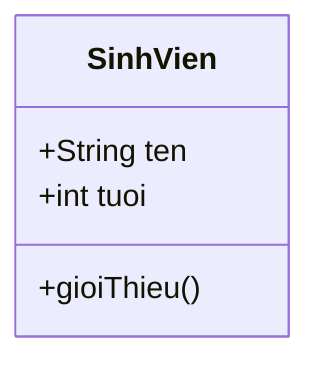
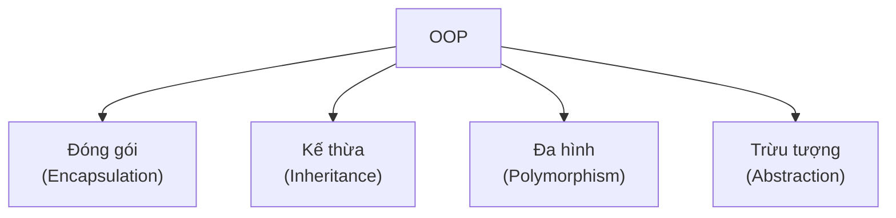

# Giới thiệu về OOP

OOP (Lập trình hướng đối tượng) là cách tổ chức chương trình xoay quanh các đối tượng mô phỏng sự vật trong đời thực. Hầu hết mọi chương trình Java thực tế đều xây dựng theo hướng này, nên hiểu OOP là bước nền tảng để viết ứng dụng thực thụ. Bài này giới thiệu khái niệm tổng quan về lớp, đối tượng và bốn trụ cột của OOP; phần chi tiết nằm bên dưới.

---

## Mục lục

- [OOP là gì?](#oop-là-gì)
- [Vì sao có OOP?](#vì-sao-có-oop)
- [Lớp và đối tượng](#lớp-và-đối-tượng)
- [Vì sao Java hướng đối tượng?](#vì-sao-java-hướng-đối-tượng)
- [Bốn trụ cột của OOP](#bốn-trụ-cột-của-oop)
- [Đóng gói (Encapsulation)](#đóng-gói-encapsulation)
- [Kế thừa (Inheritance)](#kế-thừa-inheritance)
- [Đa hình (Polymorphism)](#đa-hình-polymorphism)
- [Trừu tượng (Abstraction)](#trừu-tượng-abstraction)
- [Dẫn sang chủ đề tiếp theo](#dẫn-sang-chủ-đề-tiếp-theo)
- [Tóm tắt](#tóm-tắt)

---

## OOP là gì?

**OOP** (Object-Oriented Programming — Lập trình hướng đối tượng) là cách tổ chức chương trình xoay quanh các **đối tượng** (object — thực thể mô phỏng một sự vật trong đời thực, có dữ liệu và hành vi).

Thay vì chỉ viết một dãy lệnh tuần tự, OOP khuyến khích bạn mô hình hóa thế giới: một chiếc xe, một sinh viên, một tài khoản ngân hàng... mỗi thứ là một đối tượng có **thuộc tính** (dữ liệu) và **hành vi** (việc nó làm được).

---

## Vì sao có OOP?

**Vấn đề:** Lập trình thủ tục (procedural) khi chương trình lớn dần thì dữ liệu và hàm xử lý nằm rời rạc, biến toàn cục bị sửa khắp nơi rất khó kiểm soát, code khó tái sử dụng và mở rộng, mô hình hóa thực thể đời thực (người dùng, đơn hàng) trở nên lủng củng.

```java
// Procedural: dữ liệu "rời" khỏi hàm xử lý
String tenNguoiDung = "An";
double soDuTaiKhoan = 0;   // biến toàn cục, ai cũng sửa được

void napTien(double tien) {
    soDuTaiKhoan += tien;   // không kiểm soát: có thể nạp số âm
}

soDuTaiKhoan = -1000;       // sửa bừa ở bất kỳ đâu -> sai dữ liệu
```

**Giải pháp:** OOP gom **dữ liệu** và **hành vi** vào cùng một **đối tượng** (mô hình hóa thực thể), dựa trên 4 trụ cột: **đóng gói** (ẩn trạng thái, kiểm soát truy cập), **kế thừa** (tái sử dụng), **đa hình** (một interface nhiều hành vi), **trừu tượng** (ẩn chi tiết). Nhờ vậy code dễ bảo trì và mở rộng.

```java
// OOP: dữ liệu + hành vi gói chung, được kiểm soát
class TaiKhoan {
    private double soDu;            // đóng gói: bên ngoài không sửa trực tiếp

    public void napTien(double tien) {
        if (tien > 0) soDu += tien; // chỉ thay đổi qua hành vi có kiểm soát
    }

    public double xemSoDu() {
        return soDu;
    }
}
```

:::tip[Dùng thực tế]

- Mô hình hóa `User`, `Order` thành class — dữ liệu và hành vi đi cùng nhau, code phản ánh đúng nghiệp vụ.
- Đóng gói số dư, mật khẩu... ở `private` để dữ liệu không bị sửa bừa từ bên ngoài.
- Tái sử dụng qua kế thừa: `KhachVip extends KhachHang` nhận lại sẵn thuộc tính và hành vi của lớp cha.
- Đa hình xử lý nhiều loại đối tượng theo cùng một cách: duyệt danh sách `DongVat` rồi gọi `keu()` cho cả chó lẫn mèo.

:::

---

## Lớp và đối tượng

Để dễ hình dung:

- **Lớp** (class — bản thiết kế/khuôn mẫu mô tả một loại đối tượng) giống như bản vẽ một ngôi nhà.
- **Đối tượng** (object — một thực thể cụ thể được tạo ra từ lớp) giống như ngôi nhà thật xây theo bản vẽ. Từ một bản vẽ xây được nhiều ngôi nhà.

```java
// Lớp: bản thiết kế cho một "Sinh viên"
class SinhVien {
    // Thuộc tính (dữ liệu của đối tượng)
    String ten;
    int tuoi;

    // Hành vi (việc đối tượng làm được)
    void gioiThieu() {
        System.out.println("Toi la " + ten + ", " + tuoi + " tuoi.");
    }
}

public class ViDuOOP {
    public static void main(String[] args) {
        // Tạo một đối tượng cụ thể từ lớp SinhVien
        SinhVien sv = new SinhVien();
        sv.ten = "An";   // gán thuộc tính
        sv.tuoi = 20;
        sv.gioiThieu();  // gọi hành vi -> "Toi la An, 20 tuoi."
    }
}
```

`new SinhVien()` tạo ra một đối tượng thực sự trong bộ nhớ từ "bản vẽ" `SinhVien`.

Sơ đồ lớp `SinhVien` (bản thiết kế) với thuộc tính và hành vi:



---

## Vì sao Java hướng đối tượng?

Java được thiết kế hướng đối tượng từ gốc vì cách này mang lại nhiều lợi ích:

- **Dễ quản lý**: gom dữ liệu và hành vi liên quan vào cùng một chỗ.
- **Tái sử dụng**: viết một lớp dùng lại nhiều nơi, hoặc kế thừa để mở rộng.
- **Dễ bảo trì**: sửa một lớp ít ảnh hưởng phần còn lại nếu thiết kế tốt.
- **Mô phỏng thực tế**: code phản ánh đúng cách ta suy nghĩ về sự vật.

Hầu như mọi chương trình Java thực tế đều xây dựng quanh các lớp và đối tượng.

---

## Bốn trụ cột của OOP

OOP dựa trên bốn nguyên lý cốt lõi, thường gọi là **4 trụ cột**:

1. **Đóng gói** (Encapsulation)
2. **Kế thừa** (Inheritance)
3. **Đa hình** (Polymorphism)
4. **Trừu tượng** (Abstraction)

Dưới đây là giới thiệu ngắn gọn; bạn sẽ học chi tiết từng trụ cột ở chủ đề OOP tiếp theo.

Sơ đồ bốn trụ cột của OOP:



---

## Đóng gói (Encapsulation)

**Đóng gói** (encapsulation — giấu dữ liệu bên trong đối tượng, chỉ cho truy cập qua phương thức công khai) bảo vệ dữ liệu khỏi bị sửa bừa bãi.

```java
class TaiKhoan {
    // private: che giấu, bên ngoài không truy cập trực tiếp
    private double soDu;

    // Cho phép nạp tiền qua phương thức có kiểm soát
    public void napTien(double tien) {
        if (tien > 0) {            // kiểm tra hợp lệ
            soDu += tien;
        }
    }

    public double xemSoDu() {
        return soDu;
    }
}
```

Ví dụ đời thường: bạn rút tiền qua cây ATM (phương thức công khai), không thò tay trực tiếp vào két tiền của ngân hàng (dữ liệu riêng tư).

---

## Kế thừa (Inheritance)

**Kế thừa** (inheritance — một lớp con nhận lại thuộc tính và hành vi từ lớp cha) giúp tái sử dụng code.

```java
// Lớp cha
class DongVat {
    void an() {
        System.out.println("Dang an");
    }
}

// Lớp con kế thừa từ DongVat bằng từ khóa extends
class Cho extends DongVat {
    void sua() {
        System.out.println("Gau gau");
    }
}
// Đối tượng Cho dùng được cả an() (kế thừa) lẫn sua() (riêng)
```

Ví dụ: "Chó" là một loại "Động vật", nên nó tự động có khả năng "ăn" mà không cần viết lại.

---

## Đa hình (Polymorphism)

**Đa hình** (polymorphism — cùng một hành vi nhưng cho kết quả khác nhau tùy đối tượng) cho phép xử lý nhiều loại đối tượng theo cùng một cách.

```java
class DongVat {
    void keu() {
        System.out.println("Tieng keu chung");
    }
}

class Meo extends DongVat {
    @Override                 // ghi đè phương thức của lớp cha
    void keu() {
        System.out.println("Meo meo");
    }
}
// Cùng gọi keu() nhưng Meo kêu khác DongVat -> đa hình
```

Ví dụ: nút "phát âm thanh" như nhau, nhưng mèo kêu "meo meo" còn chó kêu "gâu gâu".

---

## Trừu tượng (Abstraction)

**Trừu tượng** (abstraction — chỉ phơi bày những gì cần thiết, ẩn đi chi tiết phức tạp bên trong) giúp người dùng tập trung vào "làm gì" thay vì "làm thế nào".

Ví dụ đời thường: khi lái xe, bạn chỉ cần đạp ga và phanh. Bạn không cần biết động cơ đốt cháy nhiên liệu ra sao. Phần phức tạp được "ẩn" đi, chỉ để lộ những nút điều khiển đơn giản.

Trong Java, trừu tượng được thực hiện qua **lớp trừu tượng** (abstract class) và **giao diện** (interface) — sẽ học ở chủ đề OOP.

---

## Dẫn sang chủ đề tiếp theo

Bạn vừa hoàn thành phần **kiến thức cơ bản** của Java: cú pháp, kiểu dữ liệu, biến, ép kiểu, chuỗi, toán tử, mảng, điều kiện và vòng lặp. Đây là nền tảng để viết những chương trình nhỏ.

Bước tiếp theo là đào sâu vào **Lập trình hướng đối tượng (OOP)** — nơi bạn học chi tiết về lớp, đối tượng, và bốn trụ cột vừa giới thiệu. Đây là phần cốt lõi giúp bạn xây dựng các ứng dụng Java thực thụ.

---

## Tóm tắt

- **OOP** tổ chức chương trình quanh các **đối tượng** có dữ liệu và hành vi.
- **Lớp** là bản thiết kế; **đối tượng** là thực thể cụ thể tạo từ lớp.
- Java hướng đối tượng để code dễ quản lý, tái sử dụng và bảo trì.
- Bốn trụ cột: **đóng gói**, **kế thừa**, **đa hình**, **trừu tượng**.
- Chủ đề tiếp theo sẽ trình bày chi tiết về OOP.
