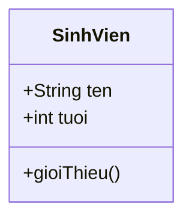
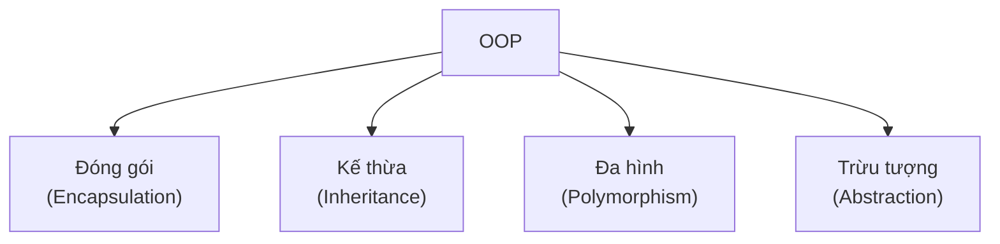

# Giới thiệu về OOP

OOP (Lập trình hướng đối tượng) là cách tổ chức chương trình xoay quanh các đối tượng mô phỏng sự vật trong đời thực. Hầu hết mọi chương trình Java thực tế đều xây dựng theo hướng này, nên hiểu OOP là bước nền tảng để viết ứng dụng thực thụ. Bài này giới thiệu khái niệm tổng quan về lớp, đối tượng và bốn trụ cột của OOP; phần chi tiết nằm bên dưới.

[](pathname:///img/java/gioi-thieu-oop.webp)

---

:::note[Ghi nhớ nhanh]

- ⭐ **OOP** — tổ chức chương trình quanh các **đối tượng** gói chung dữ liệu và hành vi.
- **Lớp vs đối tượng** — `class` là bản thiết kế; đối tượng là thực thể cụ thể tạo bằng `new`.
- ⭐ **Bốn trụ cột** — đóng gói, kế thừa, đa hình, trừu tượng.
- **Cú pháp cốt lõi** — đóng gói dùng `private`, kế thừa dùng `extends`, đa hình ghi đè bằng `@Override`.

:::

---

## Mục lục

- [OOP là gì?](#oop-là-gì)
- [Vì sao có OOP?](#vì-sao-có-oop)
- [Lớp và đối tượng](#lớp-và-đối-tượng)
- [Vì sao Java hướng đối tượng?](#vì-sao-java-hướng-đối-tượng)
- [Bốn trụ cột của OOP](#bốn-trụ-cột-của-oop)
- [Đóng gói (Encapsulation)](#đóng-gói-encapsulation)
- [Kế thừa (Inheritance)](#kế-thừa-inheritance)
- [Đa hình (Polymorphism)](#đa-hình-polymorphism)
- [Trừu tượng (Abstraction)](#trừu-tượng-abstraction)
- [Dẫn sang chủ đề tiếp theo](#dẫn-sang-chủ-đề-tiếp-theo)
- [Tóm tắt](#tóm-tắt)
- [Câu hỏi phỏng vấn](#câu-hỏi-phỏng-vấn)

---

## OOP là gì?

**OOP** (Object-Oriented Programming — Lập trình hướng đối tượng) là cách tổ chức chương trình xoay quanh các **đối tượng** (object — thực thể mô phỏng một sự vật trong đời thực, có dữ liệu và hành vi).

Thay vì chỉ viết một dãy lệnh tuần tự, OOP khuyến khích bạn mô hình hóa thế giới: một chiếc xe, một sinh viên, một tài khoản ngân hàng... mỗi thứ là một đối tượng có **thuộc tính** (dữ liệu) và **hành vi** (việc nó làm được).

---

## Vì sao có OOP?

**Vấn đề:** Lập trình thủ tục (procedural) khi chương trình lớn dần thì dữ liệu và hàm xử lý nằm rời rạc, biến toàn cục bị sửa khắp nơi rất khó kiểm soát, code khó tái sử dụng và mở rộng, mô hình hóa thực thể đời thực (người dùng, đơn hàng) trở nên lủng củng.

```java
// Procedural: dữ liệu "rời" khỏi hàm xử lý
String tenNguoiDung = "An";
double soDuTaiKhoan = 0;   // biến toàn cục, ai cũng sửa được

void napTien(double tien) {
    soDuTaiKhoan += tien;   // không kiểm soát: có thể nạp số âm
}

soDuTaiKhoan = -1000;       // sửa bừa ở bất kỳ đâu -> sai dữ liệu
```

**Giải pháp:** OOP gom **dữ liệu** và **hành vi** vào cùng một **đối tượng** (mô hình hóa thực thể), dựa trên 4 trụ cột: **đóng gói** (ẩn trạng thái, kiểm soát truy cập), **kế thừa** (tái sử dụng), **đa hình** (một interface nhiều hành vi), **trừu tượng** (ẩn chi tiết). Nhờ vậy code dễ bảo trì và mở rộng.

```java
// OOP: dữ liệu + hành vi gói chung, được kiểm soát
class TaiKhoan {
    private double soDu;            // đóng gói: bên ngoài không sửa trực tiếp

    public void napTien(double tien) {
        if (tien > 0) soDu += tien; // chỉ thay đổi qua hành vi có kiểm soát
    }

    public double xemSoDu() {
        return soDu;
    }
}
```

:::tip[Dùng thực tế]

- Mô hình hóa `User`, `Order` thành class — dữ liệu và hành vi đi cùng nhau, code phản ánh đúng nghiệp vụ.
- Đóng gói số dư, mật khẩu... ở `private` để dữ liệu không bị sửa bừa từ bên ngoài.
- Tái sử dụng qua kế thừa: `KhachVip extends KhachHang` nhận lại sẵn thuộc tính và hành vi của lớp cha.
- Đa hình xử lý nhiều loại đối tượng theo cùng một cách: duyệt danh sách `DongVat` rồi gọi `keu()` cho cả chó lẫn mèo.

:::

---

## Lớp và đối tượng

Để dễ hình dung:

- **Lớp** (class — bản thiết kế/khuôn mẫu mô tả một loại đối tượng) giống như bản vẽ một ngôi nhà.
- **Đối tượng** (object — một thực thể cụ thể được tạo ra từ lớp) giống như ngôi nhà thật xây theo bản vẽ. Từ một bản vẽ xây được nhiều ngôi nhà.

```java
// Lớp: bản thiết kế cho một "Sinh viên"
class SinhVien {
    // Thuộc tính (dữ liệu của đối tượng)
    String ten;
    int tuoi;

    // Hành vi (việc đối tượng làm được)
    void gioiThieu() {
        System.out.println("Toi la " + ten + ", " + tuoi + " tuoi.");
    }
}

public class ViDuOOP {
    public static void main(String[] args) {
        // Tạo một đối tượng cụ thể từ lớp SinhVien
        SinhVien sv = new SinhVien();
        sv.ten = "An";   // gán thuộc tính
        sv.tuoi = 20;
        sv.gioiThieu();  // gọi hành vi -> "Toi la An, 20 tuoi."
    }
}
```

`new SinhVien()` tạo ra một đối tượng thực sự trong bộ nhớ từ "bản vẽ" `SinhVien`.

Sơ đồ lớp `SinhVien` (bản thiết kế) với thuộc tính và hành vi:


```mermaid
classDiagram
    class SinhVien {
        +String ten
        +int tuoi
        +gioiThieu()
    }
```

---

## Vì sao Java hướng đối tượng?

Java được thiết kế hướng đối tượng từ gốc vì cách này mang lại nhiều lợi ích:

- **Dễ quản lý**: gom dữ liệu và hành vi liên quan vào cùng một chỗ.
- **Tái sử dụng**: viết một lớp dùng lại nhiều nơi, hoặc kế thừa để mở rộng.
- **Dễ bảo trì**: sửa một lớp ít ảnh hưởng phần còn lại nếu thiết kế tốt.
- **Mô phỏng thực tế**: code phản ánh đúng cách ta suy nghĩ về sự vật.

Hầu như mọi chương trình Java thực tế đều xây dựng quanh các lớp và đối tượng.

---

## Bốn trụ cột của OOP

OOP dựa trên bốn nguyên lý cốt lõi, thường gọi là **4 trụ cột**:

1. **Đóng gói** (Encapsulation)
2. **Kế thừa** (Inheritance)
3. **Đa hình** (Polymorphism)
4. **Trừu tượng** (Abstraction)

Dưới đây là giới thiệu ngắn gọn; bạn sẽ học chi tiết từng trụ cột ở chủ đề OOP tiếp theo.

Sơ đồ bốn trụ cột của OOP:


```mermaid
flowchart TD
    O["OOP"] --> E["Đóng gói<br/>(Encapsulation)"]
    O --> I["Kế thừa<br/>(Inheritance)"]
    O --> P["Đa hình<br/>(Polymorphism)"]
    O --> A["Trừu tượng<br/>(Abstraction)"]
```

---

## Đóng gói (Encapsulation)

**Đóng gói** (encapsulation — giấu dữ liệu bên trong đối tượng, chỉ cho truy cập qua phương thức công khai) bảo vệ dữ liệu khỏi bị sửa bừa bãi.

```java
class TaiKhoan {
    // private: che giấu, bên ngoài không truy cập trực tiếp
    private double soDu;

    // Cho phép nạp tiền qua phương thức có kiểm soát
    public void napTien(double tien) {
        if (tien > 0) {            // kiểm tra hợp lệ
            soDu += tien;
        }
    }

    public double xemSoDu() {
        return soDu;
    }
}
```

Ví dụ đời thường: bạn rút tiền qua cây ATM (phương thức công khai), không thò tay trực tiếp vào két tiền của ngân hàng (dữ liệu riêng tư).

---

## Kế thừa (Inheritance)

**Kế thừa** (inheritance — một lớp con nhận lại thuộc tính và hành vi từ lớp cha) giúp tái sử dụng code.

```java
// Lớp cha
class DongVat {
    void an() {
        System.out.println("Dang an");
    }
}

// Lớp con kế thừa từ DongVat bằng từ khóa extends
class Cho extends DongVat {
    void sua() {
        System.out.println("Gau gau");
    }
}
// Đối tượng Cho dùng được cả an() (kế thừa) lẫn sua() (riêng)
```

Ví dụ: "Chó" là một loại "Động vật", nên nó tự động có khả năng "ăn" mà không cần viết lại.

---

## Đa hình (Polymorphism)

**Đa hình** (polymorphism — cùng một hành vi nhưng cho kết quả khác nhau tùy đối tượng) cho phép xử lý nhiều loại đối tượng theo cùng một cách.

```java
class DongVat {
    void keu() {
        System.out.println("Tieng keu chung");
    }
}

class Meo extends DongVat {
    @Override                 // ghi đè phương thức của lớp cha
    void keu() {
        System.out.println("Meo meo");
    }
}
// Cùng gọi keu() nhưng Meo kêu khác DongVat -> đa hình
```

Ví dụ: nút "phát âm thanh" như nhau, nhưng mèo kêu "meo meo" còn chó kêu "gâu gâu".

---

## Trừu tượng (Abstraction)

**Trừu tượng** (abstraction — chỉ phơi bày những gì cần thiết, ẩn đi chi tiết phức tạp bên trong) giúp người dùng tập trung vào "làm gì" thay vì "làm thế nào".

Ví dụ đời thường: khi lái xe, bạn chỉ cần đạp ga và phanh. Bạn không cần biết động cơ đốt cháy nhiên liệu ra sao. Phần phức tạp được "ẩn" đi, chỉ để lộ những nút điều khiển đơn giản.

Trong Java, trừu tượng được thực hiện qua **lớp trừu tượng** (abstract class) và **giao diện** (interface) — sẽ học ở chủ đề OOP.

---

## Dẫn sang chủ đề tiếp theo

Bạn vừa hoàn thành phần **kiến thức cơ bản** của Java: cú pháp, kiểu dữ liệu, biến, ép kiểu, chuỗi, toán tử, mảng, điều kiện và vòng lặp. Đây là nền tảng để viết những chương trình nhỏ.

Bước tiếp theo là đào sâu vào **Lập trình hướng đối tượng (OOP)** — nơi bạn học chi tiết về lớp, đối tượng, và bốn trụ cột vừa giới thiệu. Đây là phần cốt lõi giúp bạn xây dựng các ứng dụng Java thực thụ.

---

## Tóm tắt

- **OOP** tổ chức chương trình quanh các **đối tượng** có dữ liệu và hành vi.
- **Lớp** là bản thiết kế; **đối tượng** là thực thể cụ thể tạo từ lớp.
- Java hướng đối tượng để code dễ quản lý, tái sử dụng và bảo trì.
- Bốn trụ cột: **đóng gói**, **kế thừa**, **đa hình**, **trừu tượng**.
- Chủ đề tiếp theo sẽ trình bày chi tiết về OOP.

---

## Câu hỏi phỏng vấn

Những câu thường gặp về chủ đề này. Tự trả lời trước, rồi bấm **Xem đáp án** để đối chiếu.

**1. OOP là gì? Nêu bốn trụ cột của OOP.**

<details className="qa">
<summary>Xem đáp án</summary>

**OOP** (Object-Oriented Programming — lập trình hướng đối tượng) là cách tổ chức chương trình xoay quanh các **đối tượng** (object), mỗi đối tượng gói chung **dữ liệu** (thuộc tính) và **hành vi** (phương thức) mô phỏng một thực thể trong đời thực.

Bốn trụ cột của OOP:

- **Đóng gói** (Encapsulation) — ẩn dữ liệu, kiểm soát truy cập qua phương thức.
- **Kế thừa** (Inheritance) — lớp con tái sử dụng thuộc tính/hành vi của lớp cha.
- **Đa hình** (Polymorphism) — cùng một hành động nhưng hành vi khác nhau tùy đối tượng.
- **Trừu tượng** (Abstraction) — chỉ phơi bày những gì cần thiết, ẩn chi tiết phức tạp.

</details>

**2. Phân biệt lớp (`class`) và đối tượng (object). Cho ví dụ.**

<details className="qa">
<summary>Xem đáp án</summary>

- **Lớp** (`class`) là **bản thiết kế/khuôn mẫu** mô tả một loại đối tượng: khai báo có những thuộc tính gì, làm được những hành vi gì, nhưng bản thân lớp không chiếm bộ nhớ cho dữ liệu thật.
- **Đối tượng** (object) là **thực thể cụ thể** được tạo ra từ lớp bằng từ khóa `new`, tồn tại thật trong bộ nhớ với giá trị riêng.

```java
class SinhVien {       // lớp: bản thiết kế
    String ten;
    int tuoi;
}

SinhVien sv1 = new SinhVien(); // đối tượng thứ nhất
sv1.ten = "An";
SinhVien sv2 = new SinhVien(); // đối tượng thứ hai, độc lập với sv1
sv2.ten = "Binh";
```

Từ một lớp `SinhVien` có thể tạo ra vô số đối tượng khác nhau, giống như từ một bản vẽ nhà có thể xây nhiều căn nhà.

</details>

**3. Vì sao OOP ra đời? So sánh với lập trình thủ tục (procedural).**

<details className="qa">
<summary>Xem đáp án</summary>

Lập trình thủ tục viết chương trình như một dãy hàm xử lý dữ liệu **rời rạc** — dữ liệu (thường là biến toàn cục) và hàm xử lý tách biệt nhau, ai cũng có thể sửa dữ liệu ở bất kỳ đâu, dẫn tới khó kiểm soát và khó mở rộng khi chương trình lớn dần.

| Tiêu chí | Thủ tục (procedural) | OOP |
|---|---|---|
| Tổ chức | Hàm xử lý dữ liệu rời rạc | Dữ liệu + hành vi gói chung trong đối tượng |
| Kiểm soát truy cập | Biến toàn cục, sửa tự do | Đóng gói, kiểm soát qua phương thức |
| Tái sử dụng | Sao chép hàm | Kế thừa, đa hình |
| Mô phỏng thực tế | Khó, phải tự quy ước | Tự nhiên hơn (đối tượng ánh xạ sự vật) |

OOP giải quyết vấn đề trên bằng cách gom dữ liệu và hành vi vào **đối tượng**, dựa trên 4 trụ cột giúp code dễ bảo trì, mở rộng và mô phỏng đúng nghiệp vụ hơn.

</details>

**4. Đóng gói (Encapsulation) là gì? Vì sao nên khai báo thuộc tính `private` thay vì để công khai?**

<details className="qa">
<summary>Xem đáp án</summary>

**Đóng gói** là việc giấu dữ liệu bên trong đối tượng (`private`), chỉ cho phép truy cập/thay đổi thông qua các phương thức công khai (`public`) đã được kiểm soát.

Nếu để thuộc tính `public`, bất kỳ đoạn code nào cũng có thể gán giá trị bừa bãi, phá vỡ tính hợp lệ của dữ liệu:

```java
class TaiKhoan {
    public double soDu; // KHÔNG kiểm soát được
}
tk.soDu = -1000; // gán âm tùy ý -> sai nghiệp vụ, không ai ngăn được
```

Với `private` cộng phương thức kiểm soát, mọi thay đổi đều phải đi qua logic kiểm tra:

```java
class TaiKhoan {
    private double soDu;
    public void napTien(double tien) {
        if (tien > 0) soDu += tien; // chỉ nạp được số dương
    }
}
```

Lợi ích: bảo vệ tính toàn vẹn dữ liệu, dễ thay đổi cách lưu trữ bên trong mà không ảnh hưởng code bên ngoài đang dùng lớp.

</details>

**5. Kế thừa (Inheritance) hoạt động thế nào trong Java? Cho ví dụ với `extends`.**

<details className="qa">
<summary>Xem đáp án</summary>

**Kế thừa** cho phép một lớp con (subclass) tự động nhận lại thuộc tính và phương thức của lớp cha (superclass) bằng từ khóa `extends`, giúp tái sử dụng code và mô hình hóa quan hệ "là một" (is-a).

```java
class DongVat {
    void an() {
        System.out.println("Dang an");
    }
}

class Cho extends DongVat { // Cho LA MOT DongVat
    void sua() {
        System.out.println("Gau gau");
    }
}

Cho c = new Cho();
c.an();  // kế thừa từ DongVat -> "Dang an"
c.sua(); // hành vi riêng -> "Gau gau"
```

Java chỉ hỗ trợ **đơn kế thừa** (một lớp chỉ `extends` được một lớp cha), khác với một số ngôn ngữ khác cho phép đa kế thừa từ nhiều class.

</details>

**6. Đa hình (Polymorphism) là gì? `@Override` liên quan thế nào?**

<details className="qa">
<summary>Xem đáp án</summary>

**Đa hình** là khả năng cùng một lời gọi phương thức nhưng cho ra hành vi khác nhau tùy loại đối tượng thực sự đứng sau tham chiếu.

`@Override` là **annotation** (chú thích) đánh dấu một phương thức trong lớp con đang **ghi đè** (override) phương thức cùng tên/cùng tham số của lớp cha — giúp trình biên dịch kiểm tra và báo lỗi nếu viết sai chữ ký, tránh gõ nhầm tạo ra một phương thức mới thay vì ghi đè.

```java
class DongVat {
    void keu() {
        System.out.println("Tieng keu chung");
    }
}
class Meo extends DongVat {
    @Override
    void keu() {
        System.out.println("Meo meo");
    }
}

DongVat dv = new Meo(); // tham chiếu kiểu cha, đối tượng thực là Meo
dv.keu(); // in "Meo meo" -> quyết định bởi đối tượng thực sự, không phải kiểu tham chiếu
```

</details>

**7. Trừu tượng (Abstraction) khác gì với đóng gói (Encapsulation)? Đây là hai khái niệm hay bị nhầm lẫn.**

<details className="qa">
<summary>Xem đáp án</summary>

Hai khái niệm dễ nhầm vì đều liên quan tới việc "ẩn" một thứ gì đó, nhưng ẩn ở mức độ khác nhau:

- **Đóng gói**: ẩn **dữ liệu** (trạng thái bên trong) khỏi bên ngoài, kiểm soát truy cập bằng `private`/`public`. Trả lời câu hỏi "ai được phép đụng vào dữ liệu này?".
- **Trừu tượng**: ẩn **độ phức tạp của cách thực hiện**, chỉ phơi bày "làm được gì" chứ không lộ "làm như thế nào". Trả lời câu hỏi "người dùng cần biết gì để sử dụng?".

Ví dụ: lái xe chỉ cần đạp ga/phanh (trừu tượng — ẩn cơ chế động cơ), còn số dư tài khoản chỉ đọc/sửa được qua phương thức `napTien()`/`xemSoDu()` chứ không truy cập biến trực tiếp (đóng gói — ẩn dữ liệu). Trong Java, trừu tượng thường được hiện thực bằng lớp trừu tượng (`abstract class`) và giao diện (`interface`).

</details>

**8. Đoạn code sau in ra gì? Vì sao?**

```java
class DongVat {
    void keu() {
        System.out.println("...");
    }
}
class Meo extends DongVat {
    @Override
    void keu() {
        System.out.println("Meo meo");
    }
}
class Cho extends DongVat {
    @Override
    void keu() {
        System.out.println("Gau gau");
    }
}

public class ViDu {
    public static void main(String[] args) {
        DongVat[] danhSach = { new Meo(), new Cho() };
        for (DongVat dv : danhSach) {
            dv.keu();
        }
    }
}
```

<details className="qa">
<summary>Xem đáp án</summary>

Kết quả in ra:

```
Meo meo
Gau gau
```

Dù mảng khai báo kiểu `DongVat[]`, mỗi phần tử thực chất là đối tượng `Meo` hoặc `Cho`. Nhờ **đa hình**, lời gọi `dv.keu()` chạy đúng phiên bản đã bị `@Override` ở lớp con tương ứng với đối tượng thực sự — chứ không chạy phiên bản của `DongVat`. Đây chính là giá trị cốt lõi của đa hình: xử lý nhiều loại đối tượng khác nhau bằng cùng một đoạn code (`for-each` cộng `dv.keu()`).

</details>

**9. Đoạn code sau có lỗi gì?**

```java
class TaiKhoan {
    private double soDu;
}

public class ViDu {
    public static void main(String[] args) {
        TaiKhoan tk = new TaiKhoan();
        tk.soDu = 5000;
    }
}
```

<details className="qa">
<summary>Xem đáp án</summary>

**Lỗi biên dịch**: `soDu` được khai báo `private` trong `TaiKhoan`, nghĩa là chỉ code **bên trong chính lớp `TaiKhoan`** mới truy cập được. Dòng `tk.soDu = 5000;` nằm ở lớp `ViDu` khác, nên trình biên dịch báo lỗi kiểu "soDu has private access in TaiKhoan".

Đây chính là mục đích của đóng gói — ngăn code bên ngoài sửa dữ liệu trực tiếp. Cách sửa đúng là bổ sung phương thức công khai để thao tác có kiểm soát:

```java
class TaiKhoan {
    private double soDu;
    public void napTien(double tien) {
        if (tien > 0) soDu += tien;
    }
}
// bên ngoài gọi: tk.napTien(5000);
```

</details>

**10. Thiết kế một lớp `TaiKhoanNganHang` áp dụng đóng gói: thuộc tính nào nên `private`, phương thức nào nên `public`?**

<details className="qa">
<summary>Xem đáp án</summary>

Nguyên tắc: thuộc tính lưu **trạng thái nội bộ** nên `private`; chỉ mở `public` các phương thức thể hiện **hành vi hợp lệ** mà đối tượng cho phép thực hiện.

```java
class TaiKhoanNganHang {
    private String chuTaiKhoan; // trạng thái nội bộ - không cho sửa trực tiếp
    private double soDu;        // trạng thái nội bộ - không cho sửa trực tiếp

    public TaiKhoanNganHang(String chuTaiKhoan) {
        this.chuTaiKhoan = chuTaiKhoan;
        this.soDu = 0;
    }

    public void napTien(double tien) {           // hành vi hợp lệ
        if (tien > 0) soDu += tien;
    }

    public boolean rutTien(double tien) {        // hành vi hợp lệ, có kiểm tra
        if (tien > 0 && tien <= soDu) {
            soDu -= tien;
            return true;
        }
        return false; // rút vượt số dư -> từ chối
    }

    public double xemSoDu() {                    // chỉ đọc, không cho ghi trực tiếp
        return soDu;
    }
}
```

Nhờ vậy, mọi thay đổi số dư đều đi qua `napTien`/`rutTien` với điều kiện kiểm tra, không thể gán số âm tùy tiện như khi để `soDu` là `public`.

</details>

**11. Khi nào nên dùng kế thừa (is-a), khi nào nên ưu tiên composition — "has-a" (gộp đối tượng làm thuộc tính) thay vì kế thừa?**

<details className="qa">
<summary>Xem đáp án</summary>

- Dùng **kế thừa** khi quan hệ thực sự là **"là một"** (is-a) và lớp con có thể dùng thay thế lớp cha ở mọi nơi: ví dụ `Cho extends DongVat` — một con Chó **là một** Động vật.
- Dùng **composition** (has-a — một lớp chứa đối tượng của lớp khác làm thuộc tính) khi quan hệ chỉ là **"có một"/"sử dụng"**: ví dụ một `Xe` **có một** `DongCo`, chứ `Xe` không phải là một `DongCo`.

```java
// Sai: kế thừa dùng cho quan hệ has-a
class Xe extends DongCo { }

// Đúng: composition
class Xe {
    private DongCo dongCo; // Xe "có một" DongCo
}
```

Kinh nghiệm phỏng vấn thường nhắc câu **"ưu tiên composition hơn kế thừa"** (favor composition over inheritance) vì kế thừa tạo ràng buộc chặt giữa lớp con và lớp cha (thay đổi lớp cha dễ ảnh hưởng dây chuyền tới mọi lớp con), trong khi composition linh hoạt hơn, dễ thay đổi hành vi bằng cách hoán đổi đối tượng thành phần.

</details>
